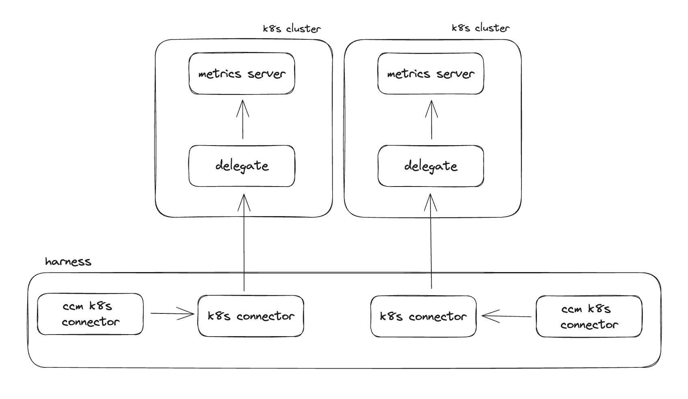
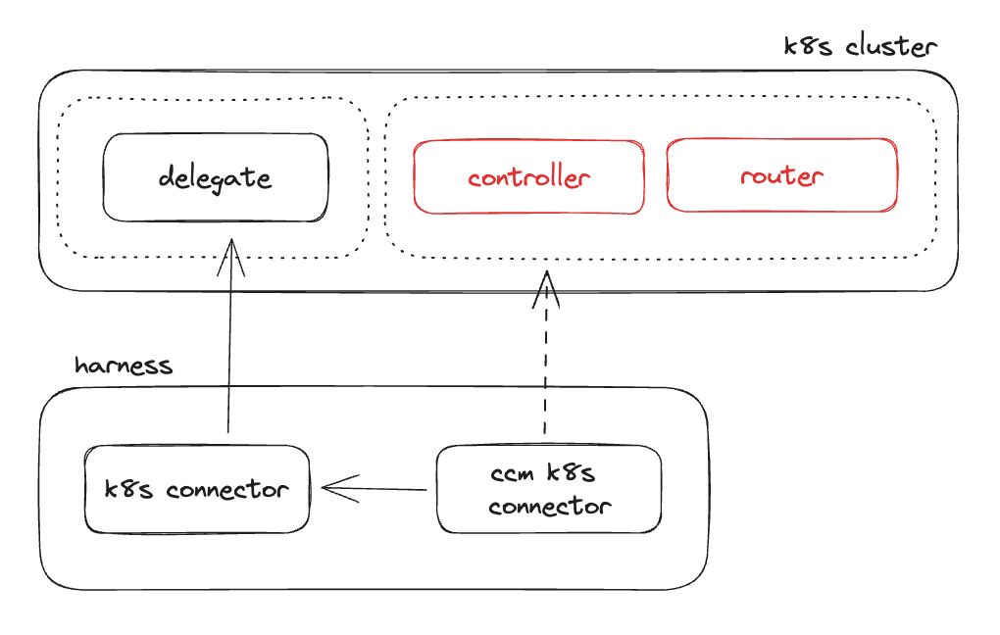

# Kubernetes

To ingest usage and cost data from a Kubernetes cluster, as well as allow access for auto stopping, we will need to deploy what is referred to as a "delegate" into some or all Kubernetes clusters. This will require the Kubernetes metrics server to be running in every cluster. Finally, for every cluster you want to enable CCM for, we will be creating two different connectors in Harness.

## Delegate Architecture

### Deployment

When enabling CCM for a cluster the first step is to deploy a delegate into the target cluster and give it a certain level of access (described later in this guide) depending on what you want to achieve with the Kubernetes connection. By deploying a delegate directly into the cluster you do not have to manage secrets, but simply control the access Harness has in your cluster by modifying the Kubernetes service account that is bound to the delegate deployment.

Gathering fine-grain metrics in the cluster is memory intensive.  In an effort to ensure we don't run out of memory and terminate the pod, the following sizing guidelines are recommended for the delegate:

| # Nodes in the Cluster | CPU (Cores) | MEM (Mi)  |
| -----------------------| ----------- | --------- |
|        `<= 100`        |      1      |    3814   |
|       `101 - 200`      |      2      |    7629   |
|       `201 - 300`      |      3      |   11444   |
|       `301 - 400`      |      4      |   15258   |
|       `401 - 500`      |      5      |   19073   |



#### Deployment Options

**Delegates deployed for CCM must be located at the account level in Harness**

There a several ways to deploy the delegate [documented here](https://developer.harness.io/docs/platform/delegates/install-delegates/overview/), but the recommended approach is to use Helm.

When using Helm to deploy the delegate, you can provide the value `ccm.visibility: true` to provision a ClusterRole and Binding that includes the necessary permissions for the delegate to use the metrics server to gather usage data on the cluster.

If you are not using this delegate to deploy or run builds in the cluster, or you want to prevent the delegate from being used for such activities, you need to be sure and set the value `k8sPermissionType: CLUSTER_VIEWER`. By default the delegate is deployed with `CLUSTER_ADMIN`. You can also set the environment variable `BLOCK_SHELL_TASK` to stop people from executing shell steps in pipelines on this delegate.

An example `values.yaml` for a helm chart deployment is as follows:
```
k8sPermissionType: CLUSTER_VIEWER
ccm:
  visibility: true
custom_envs:
  - name: BLOCK_SHELL_TASK
    value: "true"
```

When deploying a delegate, it is recommended that you name the delegate either the same as the cluster name or something very similar that makes it obvious what cluster the delegate is deployed into.

### Resource Constraints

- The delegate pod needs a minimum of 1 vCPU and 2G of memory.
  - For larger clusters, more resources are needed. Requirements TBD by engineering at this time.
- The delegate will need outbound internet access to `https://app.harness.io`

## Connectors

For every cluster that you are enabling CCM for you will need to create two different connectors. First a Kubernetes connector, and then a CCM Kubernetes connector that references the first connector.

### Kubernetes Connector

A Kubernetes connector tells Harness how it can access a given cluster. When you create a Kubernetes connector you have two options for authentication, using a delegate inside of the cluster or specifying the cluster URL and service account credentials. You will choose the option based on how you are deciding to connect to the cluster.

If choosing to deploy a delegate inside of the cluster, you will specify the delegate name that corresponds to the delegate that should be used to make connections for the cluster. [There is an in-depth guide here](https://developer.harness.io/docs/platform/connectors/cloud-providers/add-a-Kubernetes-cluster-connector/).

If choosing to use a cluster URL and credentials, you will specify the URL and Harness secrets that store the credentials, and then you can optionally give the name of a specific delegate or delegates that should be used to make the network calls. You should try and avoid specifying the delegate needed to make the network calls, as Harness will otherwise poll all the delegates and see which ones have network access.

For creating all your Kubernetes connectors it is recommended that you utilize [Terraform](https://registry.terraform.io/providers/harness/harness/latest/docs/resources/platform_connector_Kubernetes):

```terraform
# when using a delegate deployed into the cluster

resource "harness_platform_connector_Kubernetes" "inheritFromDelegate" {
  identifier  = "inheritFromDelegate"
  name        = "inheritFromDelegate"
  description = "description"
  tags        = ["foo:bar"]

  inherit_from_delegate {
    delegate_selectors = ["harness-delegate"]
  }
}
```

After the connector has been created you can view the connector in the UI and view its status, you can also manually trigger a connection test to verify everything is working as expected. 

### CCM Kubernetes Connector

Once you have a Kubernetes connector for the cluster you then need to create a CCM Kubernetes connector. These connectors simply point at a regular Kubernetes connector, and tell Harness to start collection usage data from the cluster.

For creating all your CCM Kubernetes connectors it is recommended that you utilize [Terraform](https://registry.terraform.io/providers/harness/harness/latest/docs/resources/platform_connector_Kubernetes_cloud_cost):

At a minimum you need to enable `VISIBILITY`. If you are planning to perform auto stopping in this cluster, you can also enable `OPTIMIZATION`.

```terraform
resource "harness_platform_connector_Kubernetes_cloud_cost" "inheritFromDelegateCCM" {
  identifier  = "inheritFromDelegateCCM"
  name        = "inheritFromDelegateCCM"
  description = "example"
  tags        = ["foo:bar"]

  features_enabled = ["VISIBILITY", "OPTIMIZATION"]
  connector_ref    = "inheritFromDelegate"
}
```

## Recommendations

Once you have the CCM Kubernetes connector up and running you should start to receive workload and node-pool recommendations after some time. If you do not see workload recommendations [check the labels](https://developer.harness.io/docs/cloud-cost-management/use-ccm-cost-optimization/ccm-recommendations/node-pool-recommendations/) on the nodes to make sure they are labeled properly.

## Enable Auto Stopping

If you want to perform auto stopping in a Kubernetes cluster you will need to deploy the Harness auto stopping controller and router into your cluster.

[There is a helm chart for deploying the controller and router here](https://github.com/rssnyder/charts/tree/main/charts/harness-ccm-autostopping).

Otherwise, to get the deployment manifest for both components navigate to CCM in the Harness UI, under `Setup`,  `Cloud Integration`, and view your current connectors under `Kubernetes Clusters`. Find your connector in the list and select the three dots on the right and select `Edit Cost Access Features`.

Click `continue` through the menus until you land on the `Enable auto stopping` page. At this point you will be directed to do the following:

- Create a `harness-auto stopping` namespace
- Create a Harness API token
  - The API token will need `CCM Admin` permissions
- Create a secret in the namespace with the API token

On the next page you are given a deployment yaml that encompasses the auto stopping controller, router, CRDs, and supporting infrastructure. This needs to be deployed directly into the cluster where you want to auto stop resources.

After the deployment has completed, check the pods in the `harness-auto stopping` namespace to be sure they all come up fully. At this point you should be able to create new Kubernetes auto stopping rules for the cluster.



## Service Account for CCM

If you do not want to install a delegate into the cluster but instead have another delegate running elsewhere that can connect to the cluster API, you can instead use a service account and master URL to connect to the cluster.

First, we create the service account:
```
apiVersion: v1
kind: ServiceAccount
metadata:
  name: harness
  namespace: default
```

Next, we create a `harness-ccm-visibility` `ClusterRole` with exactly the permissions neeeded for CCM k8s visibility:
```
apiVersion: rbac.authorization.k8s.io/v1
kind: ClusterRole
metadata:
  name: harness-ccm-visibility
rules:
  - apiGroups:
      - ""
    resources:
      - pods
      - nodes
      - nodes/proxy
      - events
      - namespaces
      - persistentvolumes
      - persistentvolumeclaims
    verbs:
      - get
      - list
      - watch
  - apiGroups:
      - apps
      - extensions
    resources:
      - statefulsets
      - deployments
      - daemonsets
      - replicasets
    verbs:
      - get
      - list
      - watch
  - apiGroups:
      - batch
    resources:
      - jobs
      - cronjobs
    verbs:
      - get
      - list
      - watch
  - apiGroups:
      - metrics.k8s.io
    resources:
      - pods
      - nodes
    verbs:
      - get
      - list
  - apiGroups:
      - storage.k8s.io
    resources:
      - storageclasses
    verbs:
      - get
      - list
      - watch
```

Grant that role to our service account:
```
apiVersion: rbac.authorization.k8s.io/v1
kind: ClusterRoleBinding
metadata:
  name: harness-ccm-visibility-roleBinding
roleRef:
  apiGroup: rbac.authorization.k8s.io
  kind: ClusterRole
  name: harness-ccm-visibility
subjects:
  - kind: ServiceAccount
    name: harness
    namespace: default
```

Finally we need to generate a token for the service account:
```
kind: Secret
metadata:
  name: harness
  namespace: default
  annotations:
    kubernetes.io/service-account.name: harness
type: kubernetes.io/service-account-token
```

Now we can extract the secret:
```
kubectl get secret harness -o jsonpath='{.data.token}' | base64 -d
```

The secret can be used along with the master URL of the cluster to create a Kubernetes connector without a delegate.

## Using a pre-existing Harness account

Scenario: You have an existing Harness account full of connectors and delegates, but you now want to leverage CCM for view cluster cost/metrics and getting recommendations.

The goal when setting up CCM for an existing Harness install should be to reuse as much existing infrastructure as possible. This will mean leverage existing delegates and connectors at the account level for use with CCM.

Recap: To enable CCM on a Kubernetes cluster, you need a Kubernetes connector at the account level. The service account for that connector needs to have either cluster admin, or a subset of permissions to allow it to gather metrics and deployment information on the cluster. Cluster admin is a built in role, and to view the specific subset of permissions needed there is an example cluster role here: https://github.com/harness/delegate-helm-chart/blob/main/harness-delegate-ng/templates/ccm/cost-access.yaml

When creating a Kubernetes connector you have two options: leverage a delegate deployed into that cluster (with some service account to give it access to the cluster) or specifying a Kubernetes API URL and service account credentials.

Step 1: Identify a list of all the clusters you need to onboard into Harness CCM.

Step 2: Investigate the existing Kubernetes connectors at the account level, try and tie these to any of the clusters we need to onboard. 

Step 2a: For each connector that already exists for a cluster, we need to verify it has the correct permissions needed for CCM. If verifying these is too much hassle, you can alternatively just enable CCM for them (step 2b) and see what happens. You will also need to verify that the Kubernetes metrics server is running in the cluster. 

Step 2b: Once you've identified the connectors for clusters you need to onboard, verified their cluster access (or not), you can create a CCM Kubernetes connector that points towards each of them. You can do this by hand or by going to "Setup>Clusters" under CCM and clicking the "Enable CCM" button on the connector.

Step 3: For any clusters on your list from step 1 that have no existing connector, follow the regular cluster onboarding procedure. 
