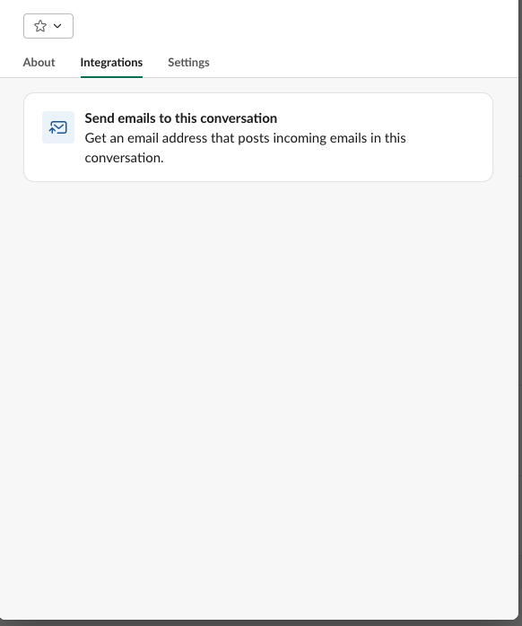
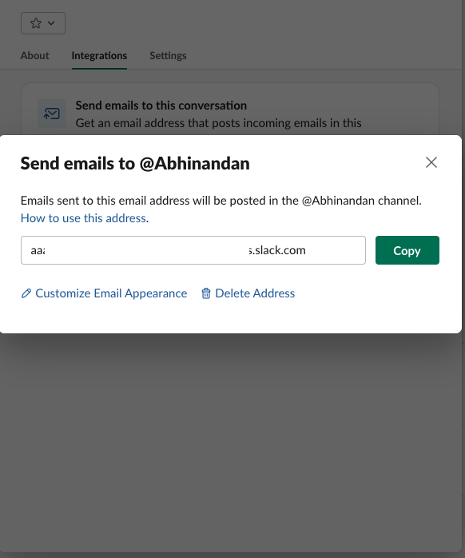
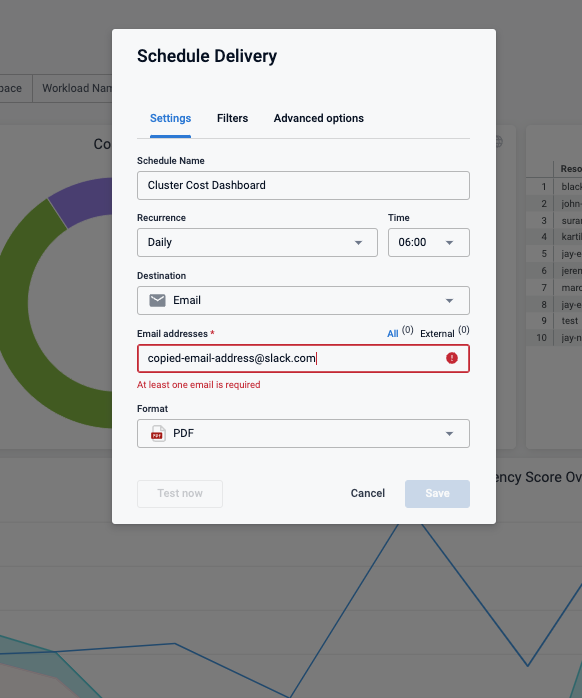

# Introduction

Harness Dashboards display key metrics and data related to your builds, deployments, security, and cloud costs. Dashboards let you track the health and performance of your deployments, monitor key metrics and KPIs, and quickly identify potential issues. You can customize the dashboards to show specific metrics and data relevant to your needs, and access them from a central location. The Harness Dashboards provide actionable insights into continuous delivery processes, so you can achieve faster and more efficient deployments.
More on this is detailed out here https://developer.harness.io/docs/platform/dashboards/dashboards-overview/

## Problem Statement

A Dashboard lets you schedule immediate or recurring delivery of dashboards. This topic describes how to schedule and share dashboards to particular slack user or channel.

## How to

Every slack user/channel has a unique email address which we can utilize at place of email address in the scheduling delivery reports for dashboards

Step 1 : Go to your slack channel and then Integration, select send emails to this conversation

Step 2 : Generate unique email address and copy it.

Use the copied email address in place of email address for sechusling slack channel/user alert for dashbaord

