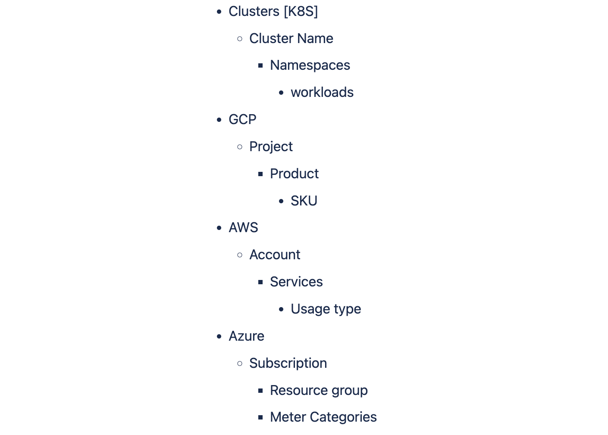

# FAQ

### Connectors

#### Are there any concerns/known issues using only k8 connectors, i.e. not using any cloud connectors? Their primary use case is internal showback and monitoring impacts of k8 infrastructure changes. This setup was working for them, but again looking to eliminate variables that could be causing inconsistencies.

If only the K8S connector is used without a Cloud connector, billing data will be calculated using the Public pricing API. Cloud connectors assist in accurately calculating costs based on the CUR REPORT shared by cloud providers.

#### Will First Gen kubernetes connectors will not work as-is for Next Gen ? In other words, new k8 connectors (and delegates) need installed and configured for NextGen CCM?

First Gen K8S connector will also work in NG CCM. But, we recommend creating NG connectors.

#### Do I need a delegate to get started connecting to GCP? 

No. You need the delegate only when connecting to a Kubernetes cluster - such as GKE

### Perspectives

#### Can the order of perspectives in the list be customized for alerting purposes?

The order of perspectives in the list is determined by their creation timestamp, with the earliest created perspective coming first. This order cannot be directly customized for alerting purposes.

#### What are the AWS cost types supported by Perspectives?

Perspectives supports Net amortized, Unblended, Amortized and Effective Cost.

#### Does Harness provide currency standardization?

Yes, Harness CCM offers the flexibility to view your cloud spending data in the currency of your preference. For further information, please refer this [document](https://developer.harness.io/docs/cloud-cost-management/use-ccm-cost-reporting/currency-preferences/).

#### How many Perspectives am I allowed to generate within an account?

You can create as many as 10,000 Perspectives in a single account.

#### How are costs presented in perspectives when there are expenses that are not linked to the chosen grouping criteria?

CCM displays `No` followed by the selected `<group by>` for costs that do not have any correlation with the specified `<group by>` criteria.
For instance, if a perspective encompasses rules for both AWS and GCP, and the grouping is based on GCP > SKU, any expenses unrelated to GCP SKUs will be displayed as "No SKUs."
For more information, go to [Create Perspectives](https://developer.harness.io/docs/cloud-cost-management/use-ccm-cost-reporting/ccm-perspectives/create-cost-perspectives#review-no-accountprojectetc).

### Recommendations

#### We have found that some AWS EC2 instances are still visible in recommendations list even they are stopped before 2-3 days ago. is it the usual behavior for stopped ec2s?

We display recommendations that are up to ~4 days old. Even if an instance is stopped within 4 days after generating the recommendation, we still show that recommendation.
Once a recommendation is generated, it is not updated at a later time. So regardless of the instance’s current state it will be visible for ~4

#### We have found that some AWS EC2 instances are still visible in recommendations list even they are stopped before 2-3 days ago. is it the usual behavior for stopped ec2s?

If the instance is in a stopped state it takes ~2-3 days for the recommendation to disappear, same is the behaviour for terminated instances too.

#### Do we support moving the recommendations from the Applied to Open recommendations section?

No. Currently, CCM supports only moving the recommendations from the **Open** to the **Applied** tab.

#### Are there any recommendations specific to GCP, other than the nodepool and workload recommendations for clusters in GCP?

Currently, CCM does not offer any GCP-specific recommendations. Our support is limited to the recommendations outlined in the [documentation](https://developer.harness.io/docs/category/recommendations).

#### Does CCM offer support for on-premises/Self Managed Platform (SMP) installations?

Yes. CCM supports the following features and functionalities in the SMP environment for AWS and Kubernetes:
- Connector setup 
- Perspectives
- Budgets
- Scheduled reports
- Cost categories
- Anomalies 
- Recommendations 
For more information, go to [CCM on Harness Self-Managed Enterprise Edition](https://developer.harness.io/docs/category/ccm-on-harness-self-managed-enterprise-edition).

### Governance

#### When adding Cloud Governance to a previously created cloud cost connector, do we need to add the cloud-governance IAM permissions to the same role we previously created via the cloudFormation template?

You can add permissions in the same role as given in the connector. Depending on the governance usecase, you can add more permissions for different resource types.
Then add GOVERNANCE in the features enabled in connector.

#### Do we have an API to validate asset governance rule?

Yes, [here](https://apidocs.harness.io/tag/Rule#operation/ValidateRule)

#### What is RDS resize down policy in asset governance?

RDS resize action refers to the process of modifying the compute and storage capacity of an Amazon RDS (Relational Database Service) DB instance. This can involve both increasing and decreasing the resources allocated to the instance.

#### Can I automate the resizing process?

While Amazon RDS offers some automation capabilities, the resizing process, particularly when decreasing storage, often requires manual intervention due to the complexity of data backup and restoration.

#### Does CCM show RDS resize recommendations?

Yes, we do show the recommendations but action cant be taken from CCM, RDS resize action is a manual operation in most cases where one is required to take a dump of DB (depends on DB flavour like Mysql/MariaDB/Postgres etc.), please refer [here](https://repost.aws/knowledge-center/rds-db-storage-size)

### Autostopping

#### If we configure an autostopping rule with multiple instances, but a single routing rule. does the proxy load balance between the instances?

Yes it does round robin load balancing. If health checks are configured it does this across healthy instances. If health check is not configured it assumes all instances are healthy.

#### We are using Istio as a service mesh, is it possible to autostop the services and turn on the services when services are getting connected through the mesh and not through the kubernetes ingress ?

AutoStopping hooks on to the istio Virtual services for detecting the traffic flow and routing. So, as long as you are using virtual services for routing external traffic it will work.

#### How can I troubleshoot the "Failed to ADD rule to ALB" error when creating an AutoStopping rule?
A2: To troubleshoot this error, ensure the following:

The associated Auto Scaling Group (ASG) is properly configured and associated with the intended ALB via a target group.
The correct ALB is selected as the load balancer when creating the AutoStopping rule.

### Dashboards

#### In dashboards, when creating a custom field can I filter the entire dashboard on it? 

Looker doesn’t support filtering on custom fields at a global level at this point, we would need to filter it per tile.

#### Can CCM operate independently from the Harness Platform? Or do we need to install CCM as a module on the harness platform and run it?
 
CCM (Cloud Cost Management) is a standalone product offered by Harness that can operate independently in the Harness Platform. It does not require installation as a module on the Harness Platform or any specific dependencies on the platform itself.
 
CCM provides organizations with the ability to monitor, optimize, and manage cloud costs across different cloud providers (such as AWS, Azure, GCP) in a centralized manner. It offers several advantages compared to other competing products.

### Anomalies

#### Do we have functionality to just alert on ANY anomoly found to a specific email? if so how?

we can set alerts for any perspective created [here](/docs/cloud-cost-management/use-ccm-cost-reporting/detect-cloud-cost-anomalies-with-ccm/#create-an-anomaly-alert-for-your-perspective), the alerts can be sent over a mail.

#### How are anomalies associated with specific perspectives and which notification channels are used for alerting?

Anomalies are linked to specific perspectives. When an anomaly is detected, it's checked against each perspective in the order they appear in the list. If the anomaly belongs to a perspective, notifications are sent to the corresponding email or Slack channels. If it doesn't match the first perspective, it's checked against the next one, and so on.

#### What happens when an anomaly is associated with multiple perspectives?

If an anomaly is tied to multiple perspectives (e.g., Advanced SSO and AnomalyAlerting), it's only alerted via the notification channel of the first matching perspective in the list. Subsequent perspectives are not checked once a match is found.

#### How frequently do you run anomaly detection jobs ?

Anomaly detection jobs are executed once per day.

#### Do we consider seasonal factors while detecting anomalies ?

Yes we do consider daily, weekly and monthly seasonalities while detecting anomalies.

#### Do we support daily alerts for anomalies ?

Yes we do support daily alerts for anomalies

#### We didn’t get the slack/email notifications for anomaly despite the fact that we have we have set up channels for them ?

Please reverify if the Slack and email channels have been properly configured for that specific perspective. If a particular anomaly is associated with multiple perspectives, we only send one notification to avoid redundancy. In this scenario, the notification is sent for the perspective that was created first among all the perspectives that share the same anomaly

#### How much time does it take for sending alerts to the customers for an anomaly ?

As soon as anomalies are detected at our end, we immediately send both slack as well as email notifications to our customers regarding it.

#### Do we support fetching anomalies on perspective made through labels ?

No, currently we do not have support for retrieving anomalies based on perspective labels.

#### Is there a way we can proactively feed data to anomaly detection for future events or holidays ?

No, as of now we don’t support feeding data for future events or holidays.

#### Anomaly drill down from the perspective screen does not seem to be filtering the anomaly list correctly ?

When you perform a drill-down from the perspective screen to view anomalies, we apply a time filter that specifically retrieves all anomalies of that particular day. This process ensures that the anomalies are accurately fetched, and the user is presented with all anomalies from that particular day, allowing them to take appropriate action.

#### I see an anomaly at the AWS usage type level. Why is it that I'm not observing the same anomaly at the AWS service or AWS account level?

We display anomalies at the most granular level of the hierarchy and intentionally exclude them from higher levels. This approach enables customers to precisely identify the root cause of the anomaly." The hierarchy level for clusters and different cloud providers are as follows  

#### I am seeing a large number of anomalies being detected which do not seem like anomalies to me ?

Before proceeding, please double-check whether you have configured a new connector specifically for that particular cloud service. If you have indeed set up a new connector, please be aware that our machine learning models may not yet have sufficient training data for accurately identifying anomalies. To obtain reliable anomaly results, we typically require a minimum of 14 days' worth of training data.

#### Why can't my CCM connector retrieve data from an old billing table?

CCM Connectors, by default, only collect data from billing tables that have had updates within the last 24 hours. If your table hasn't had any updated data within this period, we will skip the collection process.
