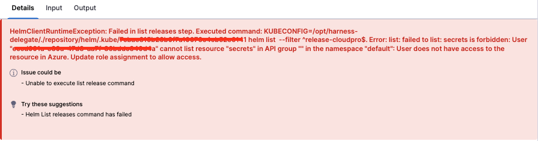

# Introduction

While deploying to AKS cluster we might sometime face permission issue like "Unable to execute list release command" despite following the docs here https://developer.harness.io/docs/platform/connectors/cloud-providers/add-a-microsoft-azure-connector/#aks-role-requirements 

## Problem Statement

we are not able to perform deployment to target cluster as it throws below error.

`"Error: query: failed to query with labels: secrets is forbidden: User "addd761x-f76d-89f7-ee6f-21fgec090a7a" cannot list resource "secrets" in API group "" in the namespace "default": User does not have access to the resource in Azure. Update role assignment to allow access."`



## Resolution

From the error it seems the user addd is trying to access secret resource (cluster) of which it does not have access.

We need to update the creds such that the tenent have access to this clusters resources or add the particular role to the AKS cluster that would authorise the access to resources. Adding the group which contained user ID in Cluster admin ClusterRoleBinding should solve the issue [In Cluster configurations].

To further verify if we a list permission which seems to be misssing, we will run the following commands? This will ensure that their creds are valid and have the required permissions?
 
1. AzCLI Login on Harness delegate using the creds with which they created the connector

   `az login --service-principal -u <app-id> -p <password-or-cert> --tenant <tenant>`
 
2. Now, get access credentials for a managed Kubernetes cluster.

   `az aks get-credentials --name MyManagedCluster --resource-group MyResourceGroup`
 
3. Next, convert the kubeconfig to spn format using kubelogin binary
  ```
  export KUBECONFIG=/path/to/kubeconfig
  kubelogin convert-kubeconfig -l spn
  export AAD_SERVICE_PRINCIPAL_CLIENT_ID=<spn client id>
  export AAD_SERVICE_PRINCIPAL_CLIENT_SECRET=<spn secret>
  ```
 
4. Now, verify that the creds are able to access fetch the secrets in default namespace
   
   `kubectl get secrets -n default`

 
> For all of the above steps delegate must have kubelogin and azcli installed


```
Note that you might have a confusion here becuase,  you already have created a Azure cloud provider connector with same credentials and it passes connectivity test. But the thing to note is In the connectivity test we validate the creds. It does not ensure that you are able to communicate with the Cluster as we do not ask for cluster info.

```
After running the commands if you see following error : 

`the error Error from server (Forbidden): secrets is forbidden: User "eccd991a-e39a-47d3-aa7f-36bddc340d4a" cannot list resource "secrets" in API group "" in the namespace "default": User does not have access to the resource in Azure. Update role assignment to allow access shows that User does not have access to the resource in Azure which needs to be provided.`
 
To do so can you please follow the below steps: 
 
1. Identify the user or service principal: Confirm the identity (user or service principal) associated with the “addd761x-f76d-89f7-ee6f-21fgec090a7a” user.

2. Determine the desired level of access: Decide what level of access you want to grant to the user. For example, you may want to provide read-only access or full control.

3. Grant appropriate role or permissions: In Azure, you can assign roles to users or service principals to control their access to resources. Here are the steps to assign a role:

	1. Open the Azure portal (portal.azure.com) and navigate to the desired resource or scope where the secrets are 	   located.
	2. Under the resource’s “Access control (IAM)” section, click on “Add role assignment” or “Add”.
	3. In the “Add role assignment” dialog, select the desired role that grants access to secrets, such as “Secrets 	   Reader” or a custom role with appropriate permissions.
	4. Specify the user or service principal “addd761x-f76d-89f7-ee6f-21fgec090a7” as the assignee.
	   Save the role assignment.
	5. Verify access: After the role assignment is saved, the user “addd761x-f76d-89f7-ee6f-21fgec090a7” should now    	   have the necessary permissions to list secrets in the “default” namespace.


