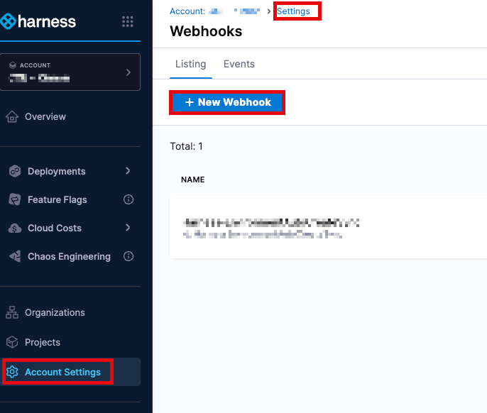
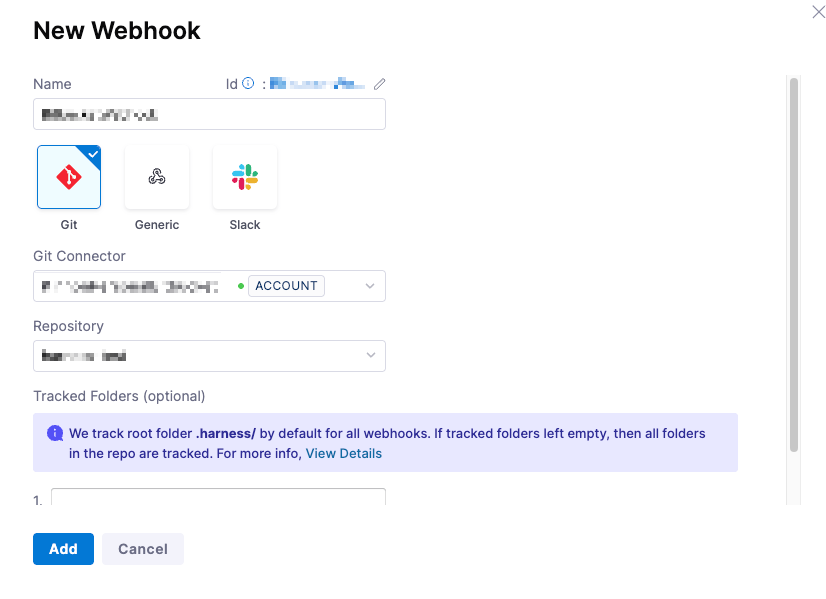
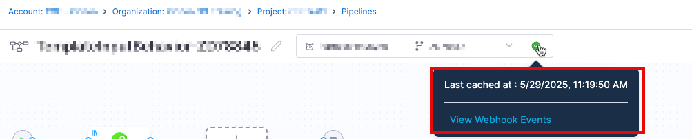

import GitXconnect from '/docs/platform/shared/gitx-connectivity.md'

# Introduction

This knowledge base article discusses how setting up a webhook sync can help prevent reaching the Bitbucket API rate limit issue. 

## API rate limits, what causes them?

Bitbucket Rate Limits are [the number of API requests that you can make within a specific amount of time (1 hour according to current documentation)](https://support.atlassian.com/bitbucket-cloud/docs/api-request-limits/). 
Sometimes, the number of API requests in a specific period of time is high and it stops remote entities from working.  The rate limits are divided into 1-hour rolling windows for the calls.

### Error Messages
Errors messages from Bitbucket that can come from this categorization include:
 
```
Response message: Please try these out: 
1. Please try and rotate your tokens used for GIT operations.
2. Please check your rate limits with your BitBucket GIT provider
                  Rate limit reached on BitBucket provider.
                  Failed to perform GIT operation.
```


```
errorMessage: "Failed to fetch file [path/to/templateorpipeline.yaml] from Bitbucket due to error : No commit found."
```
[For more information about the different types of limits from Github, please see the following](https://support.atlassian.com/bitbucket-cloud/docs/api-request-limits/)


## Easing Bitbucket API Limits with a Webhook Connection

Without a webhook connection, changes made on either the Git repository or Harness are automatically synchronized, but each piece of the pipeline stored remotely in Bitbucket will necessitate an API call.  For example, input sets, templates, each connector, may be stored in Bitbucket and will need to be reconciled and refreshed.  This can quickly add up to a lot of calls to Bitbucket that will affect even those with authenticated accounts


When a webhook connection is established, files are cached at Harness's end, creating a copy of the Harness files in the repository.  Instead of making frequent requests to the Bitbucket API for every operation, the system can rely on the cached data for all tasks, thus limiting the risk of reaching API limits.

## Setting up a webhook for caching
To set up caching with your Bitbucket repo, you can utilize the following setup process

**Account Level:**
Account Settings → Account-level Resources → Webhooks → New Webhook

**Organization Level:**
Organization Resources → Organization-level Resources → Webhooks → New Webhook

**Project Level:**
Project Settings → Project-level Resources → Webhooks → New Webhook


### Webhook Configuration Steps


1. Provide the appropriate name for the connector and select `Git` type of Webhook
2. In the Git connector, select the Bitbucket connector that you have already created.  To establish a connector, please review the [Harness Article on Bitbucket Connectors](https://developer.harness.io/docs/platform/connectors/code-repositories/ref-source-repo-provider/bitbucket-connector-settings-reference/).
3. In Repository, select the Bitbucket repo where your Harness entities are stored.  Please note that if you are storing your entities in more than one repo, you will need to create a separate webhook for each repo.  
4. In Folder Path, specify the directory (e.g., .harness/). This is optional, and if none are selected, all folders will be utilized

:::info
Harness tracks the .harness folder by default in all webhooks.
:::

5. Click Add to register the webhook.
6. Once synced, events appear in the Events tab under Webhooks, including event IDs for troubleshooting.  
7. Entities that are being synchronized will have a green dot that will show the last synchronization



:::note
1. Currently the file cache duration is set to 30 days.
2. Customers are recommended to create a webhook at the account level so all pipelines pulling from the repository can enjoy the benefits of the cache
3. Customers may still have a possibility of encountering issues depending on the amount of changes being pushed/made in each commit
4. Each repository will need to have a webhook established.  For example, setting a webhook up for repository `abc123corp` will not cache data fro the repo `harness123` in Bitbucket
:::

<GitXconnect />