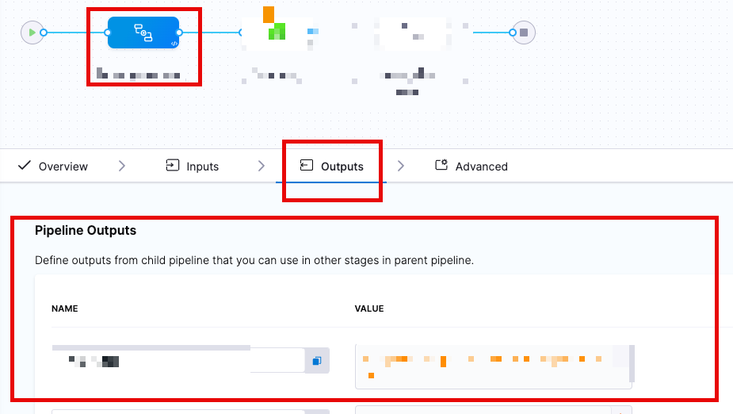

# Introduction

Pipeline chaining refers to the process of linking multiple pipelines together, where the output of one pipeline becomes the input of another. This allows for the sequential execution of processing steps, creating a complex workflow. By automating this chain, you can ensure proper testing and deployment of applications, enhancing the overall efficiency and reliability of the process.

More details on this here: /docs/platform/pipelines/pipeline-chaining/

## Problem statement

How to pass variables from a chained/child pipeline to the main/parent pipeline through output variables. 

## Steps to achieve this usecase

At the **parent pipeline** level of the **pipeline reference stage**, head to the **output definitions section**.  The User can define the Harness expression for the output variable for the chained pipeline. 



You can define the outputs utlizing the Harness Expressions reference utility, as references within a chained pipeline can become complicated.  

For example, a variable referenced within the chained pipeline such as `<+serviceVariables.SampleVariable>` will need to be referred as `<+pipeline.stages.[ChildStageName].spec.serviceVariables.SampleVariable>`
 
### Sample Pipeline

In the below-shared pipeline yaml the first stage is the pipeline stage, In the output section We have defined the expression of the child pipeline which we want to use in the parent pipeline. 
 
The same variable defined in the output section can be used by the further stage with the expression - \<+pipeline.[pipeline_stage_identifier].[output_variable_defined_under_output_section]>.

```
pipeline:
  name: parentPipelineDemo
  identifier: parentPipelineDemo
  projectIdentifier: naidusanity
  orgIdentifier: default
  tags: {}
  stages:
    - stage:
        name: stage1
        identifier: stage1
        description: ""
        type: Pipeline
        spec:
          org: default
          pipeline: childPipelineDemo
          project: naidusanity
          outputs:
            - name: parentOutput
              value: <+pipeline.stages.custom.spec.execution.steps.ShellScript_1.output.outputVariables.outputVar>
    - stage:
        name: cusom2
        identifier: cusom2
        description: ""
        type: Custom
        spec:
          execution:
            steps:
              - step:
                  type: ShellScript
                  name: ShellScript_1
                  identifier: ShellScript_1
                  spec:
                    shell: Bash
                    onDelegate: true
                    source:
                      type: Inline
                      spec:
                        script: |-
                          echo "Printing child values using parent output"
                          echo <+pipeline.stages.stage1.output.parentOutput>
                    environmentVariables: []
                    outputVariables: []
                  timeout: 10m
        tags: {}

```


Once the variable is defined, the subsequent stages can utilize the output variable from a previous stage in a chained (child) pipeline.

::: Note
Outputs from a Chained Pipeline stage cannot be referenced until after the stage has been completed.  The output data must exist, before it can be referenced.
:::