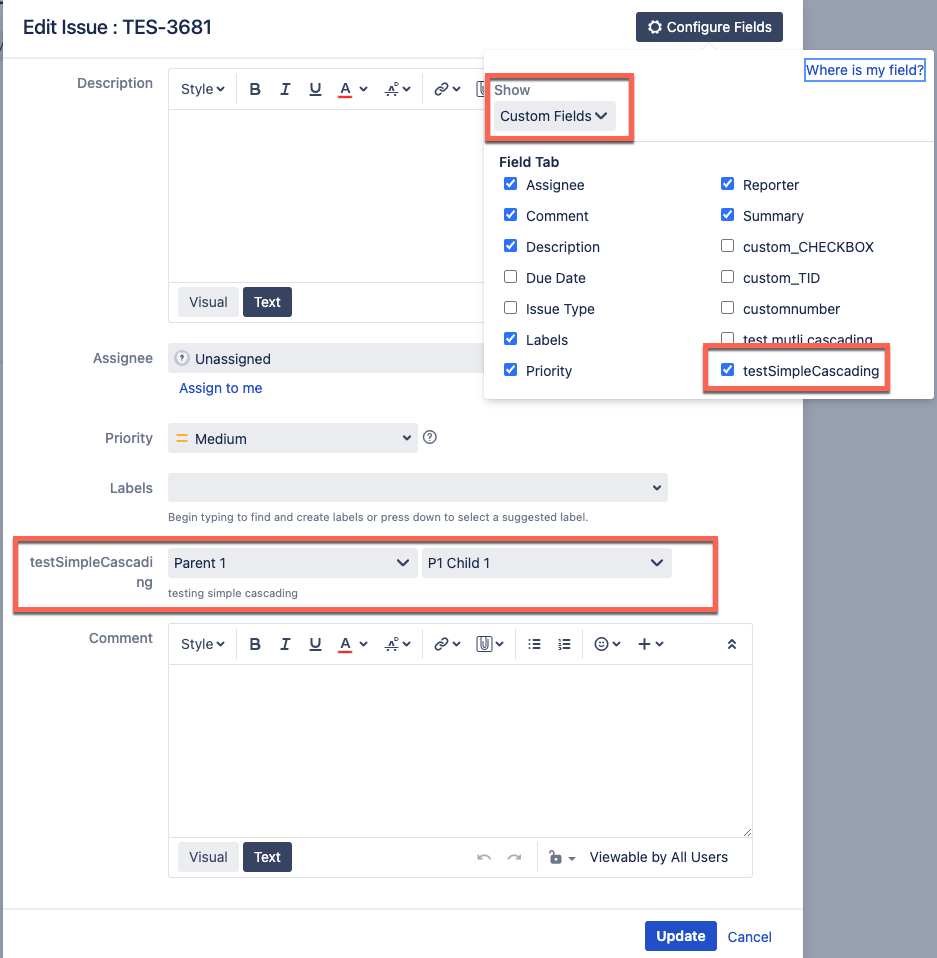

This article talks about using the HTTP step to set the fields that are not supported by Harness using an example. 

By default, Harness don't support cascading lists and other custom field types. For the list of supported Jira fields, go to [Add issue fields](/docs/continuous-delivery/x-platform-cd-features/cd-steps/ticketing-systems/create-jira-issues-in-cd-stages/#add-issue-fields).

We will discuss how to set a [cascading list](https://confluence.atlassian.com/jirakb/creating-dependent-cascading-lists-in-jira-server-datacenter-1142426572.html) using the [HTTP step](/docs/continuous-delivery/x-platform-cd-features/cd-steps/utilities/http-step/). This unblocks integration to jira projects which have such fields marked as mandatory.

Create a pipeline with a [Custom stage](/docs/platform/pipelines/add-a-stage/#add-a-custom-stage) and configure the following steps under the Execution tab of the pipeline. 

## Configure the HTTP step

In the HTTP step's **Step Parameters**, configure the following fields.

- URL: Enter your Jira server details. For example, `https://<your_JIRA_domain>/rest/api/2/issue`.
- Method: Select **POST** HTTP method.
- Request Body: Enter the cURL command to create a task in project `TES` with a summary and cascading field with id `customfield_10500`. Here's a sample:  

  ```
  {
  "fields": {
    "project": { 
      "key": "TES"
     },
    "summary": "Testing select list (cascading)",
    "issuetype": {
      "id": "10003"
     },
    "customfield_10500": {
      "value": "Parent 1",
      "child": {
        "value": "P1 Child 1"
      }      
    }
   }
  }
  ```

- Optional Configuration: Enter the following optional configurations.
  - Headers: Enter the following Key:Value information:
    - Content-Type: `application/json`
    - Authorization: `Basic <authorization_key_to_your_Jira_server>`
  - Output: Enter the variable name and value to get the Jira Issue Id from the pipeline output.  For example:
    - Variable Name: `<issue_key>`
    - Value: Choose Expression input type and enter `<+json.select("key", httpResponseBody)>` 

## Configure the Jira Update step

Now, create a [Jira Update](/docs/continuous-delivery/x-platform-cd-features/cd-steps/ticketing-systems/update-jira-issues-in-cd-stages/#add-a-jira-update-step) step to update the Jira issue as a step during pipeline execution. 

In the Jira Update step's **Step Parameters**, configure the following fields.
- Jira Connector: Select your Jira connector.
- Issue Key: Enter the Jira issue key as an expression: `<+pipeline.stages.testJiraCustomFields.spec.execution.steps.Http_1.output.outputVariables.issue_key>`.

## Sample pipeline YAML

Here's a sample pipeline:  

```
pipeline:
  name: testJiraCustomFields
  identifier: testJiraCustomFields
  projectIdentifier: testNaman
  orgIdentifier: default
  tags: {}
  stages:
    - stage:
        name: testJiraCustomFields
        identifier: testJiraCustomFields
        description: ""
        type: Custom
        spec:
          execution:
            steps:
              - step:
                  type: Http
                  name: Http_1
                  identifier: Http_1
                  spec:
                    url: https://<your_JIRA_domain>/rest/api/2/issue
                    method: POST
                    headers:
                      - key: Content-Type
                        value: application/json
                      - key: Authorization
                        value: Basic <authorization_key_to_your_Jira_server>
                    inputVariables: []
                    outputVariables:
                      - name: issue_key
                        value: <+json.select("key", httpResponseBody)>
                        type: String
                    requestBody: |-
                      {
                        "fields": {
                          "project": { 
                            "key": "TES"
                           },
                          "summary": "Testing select list (cascading)",
                          "issuetype": {
                            "id": "10003"
                           },
                          "customfield_10500": {
                            "value": "Parent 1",
                            "child": {
                              "value": "P1 Child 1"
                            }      
                          }
                        }
                      }
                    assertion: <+httpResponseCode>==201
                  timeout: 10s
              - step:
                  type: JiraUpdate
                  name: JiraUpdate_1
                  identifier: JiraUpdate_1
                  spec:
                    connectorRef: jiraServer
                    issueKey: <+pipeline.stages.testJiraCustomFields.spec.execution.steps.Http_1.output.outputVariables.issue_key>
                    fields:
                      - name: Assignee
                        value: aut************@mailinator.com
                      - name: Description
                        value: This is updated description
                      - name: Priority
                        value: Medium
                    issueType: Task
                    projectKey: TES
                  timeout: 10m
        tags: {}

```


## Viewing the cascading list in the Jira issue

After configuring the HTTP and Jira Update steps, run the pipeline. From the pipeline Output tab, copy the issue URL. In the Jira issue, you can see the cascading field as shown in the image below: 




