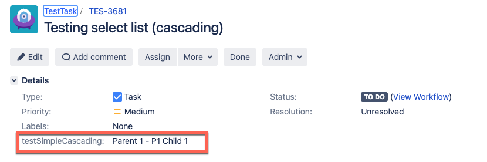

This article talks about setting a [cascading list](https://confluence.atlassian.com/jirakb/creating-dependent-cascading-lists-in-jira-server-datacenter-1142426572.html) when creating a JIRA issue. By default, Jira plugins don't support cascading lists. You can configure cascading lists for your Jira issues using an [HTTP step](/docs/continuous-delivery/x-platform-cd-features/cd-steps/utilities/http-step/). 

Create a pipeline with a [Custom stage](/docs/platform/pipelines/add-a-stage/#add-a-custom-stage) and configure the following steps under the Execution tab of the pipeline. 

## Configure the HTTP step

In the HTTP step's **Step Parameters**, configure the following fields.

- URL: Enter your Jira server details. For example, `https://<your_JIRA_domain>/rest/api/2/issue`.
- Method: Select **POST** HTTP method.
- Request Body: Enter the cURL command to create cascading field. Here's a sample:  

  ```
  {
  "fields": {
    "project": { 
      "key": "TES"
     },
    "summary": "Testing select list (cascading)",
    "issuetype": {
      "id": "10003"
     },
    "customfield_10500": {
      "value": "Parent 1",
      "child": {
        "value": "P1 Child 1"
      }      
    }
   }
  }
  ```
- Optional Configuration: Enter the following optional configurations.
  - Headers: Enter the following Key:Value information:
    - Content-Type: `application/json`
    - Authorization: `Basic <authorization_key_to_your_Jira_server>`
  - Output: Enter the variable name and value to get the Jira Issue Id from the pipeline output.  For example:
    - Variable Name: `<issue_key>`
    - Value: Choose Expression input type and enter `<+json.select("key", httpResponseBody)>` 

## Configure the Jira Update step

Now, create a [Jira Update](/docs/continuous-delivery/x-platform-cd-features/cd-steps/ticketing-systems/update-jira-issues-in-cd-stages/#add-a-jira-update-step) step to update the Jira issue as a step during pipeline execution. 

In the Jira Update step's **Step Parameters**, configure the following fields.
- Jira Connector: Select your Jira connector.
- Issue Key: Enter the Jira issue key as an expression: `<+pipeline.stages.testJiraCustomFields.spec.execution.steps.Http_1.output.outputVariables.issue_key>`.

## Viewing the cascading list in the Jira issue

After configuring the HTTP and Jira Update steps, run the pipeline. From the pipeline Output tab, copy the issue URL. In the Jira issue, you can see the cascading field as shown in the image below: 


