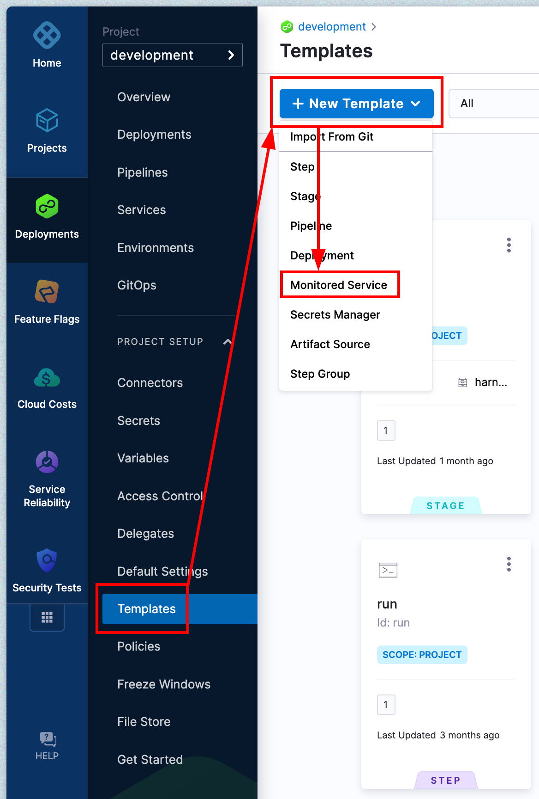
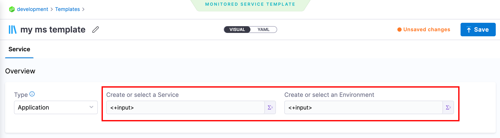
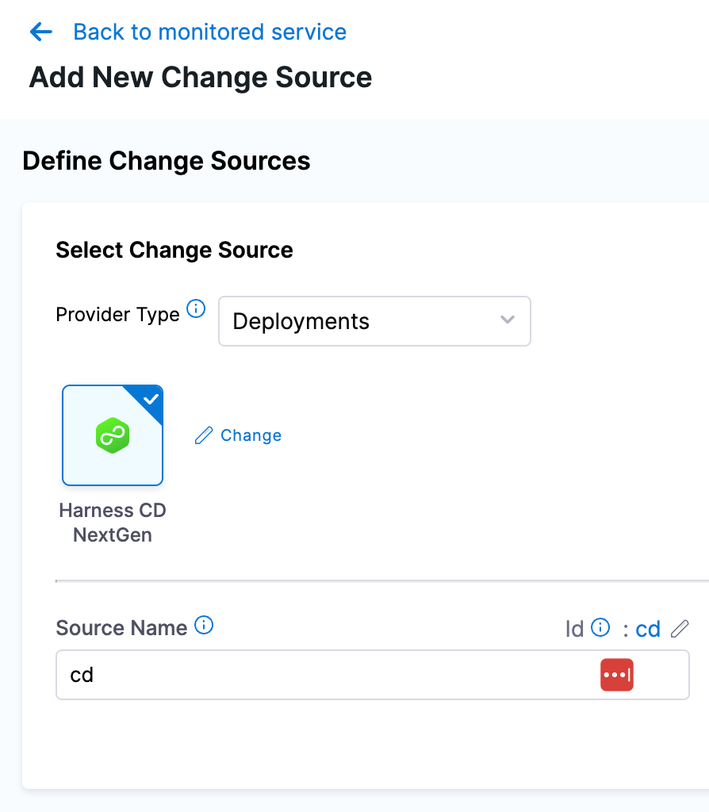
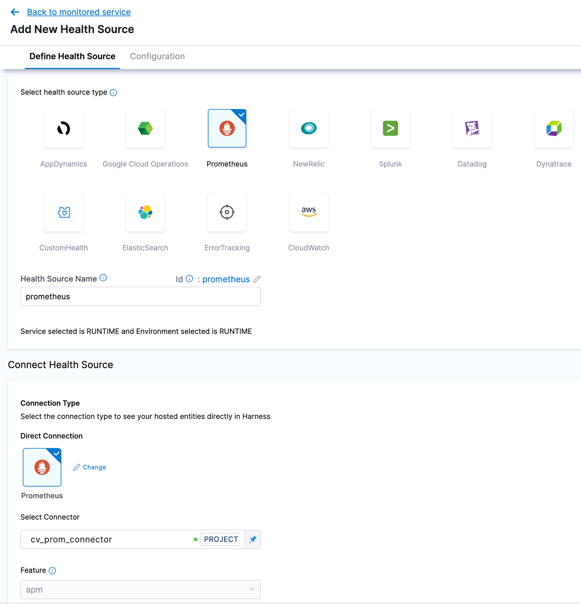
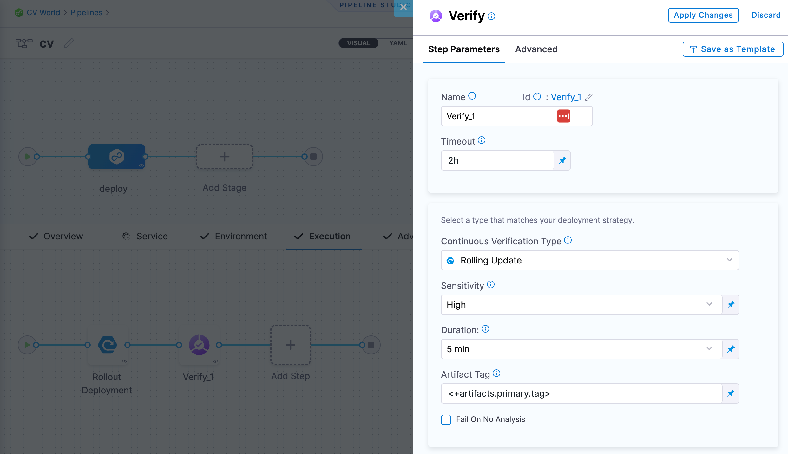
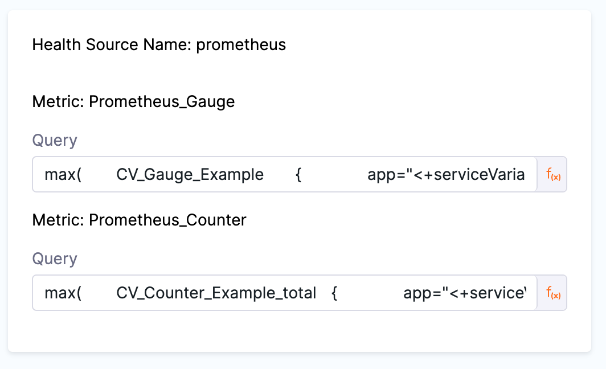
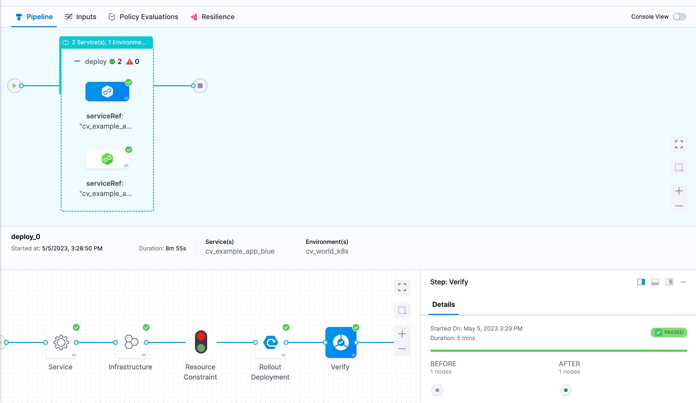

# Introduction

[Continuous Verification](https://developer.harness.io/docs/continuous-delivery/verify/verify-deployments-with-the-verify-step/) is a critical step in the deployment pipeline that validates deployments. Harness CV integrates with APMs and logging tools to verify that the deployment is running safely and efficiently. Harness CV applies machine learning algorithms to every deployment for identifying normal behavior. This allows Harness to identify and flag anomalies in future deployments. During the Verify step, Harness CV automatically triggers a rollback if anomalies are found.

This topic provides an overview of how you can leverage templates to perform CV in a multi-service or multi-environment deployment.

## Monitored Service Templates

The key for using CV in a multi-service or multi-environment deployment are monitored service templates. Just like how you can template a pipeline, stage, or step we can template a monitored service to create a common pattern for our services and their health sources.

Start by going to the CD module, under project setup go to Templates, and then under `+ New Template` select `Monitored Service`. 



Give your template a name, version, and chose wether to store the template in Harness or in a git repository.

First change the service and environment options to be runtime inputs.



Click `+ Add New Change Source`, select `Deployment` for the provider type, select `Harness CD NextGen`, and then give this source a name.



Click `+ Add New Health Source`, select your health source (prometheus in this example), give it a name, and finally select the connector for this source.



On the next screen under `Group Name` click `+ Add New` and create a metric group. Next under `Assign` select the options that relate to the metric you will be measuring. Finally make sure the Query is set to be a runtime input.


Repeat the above for as many metrics as you want to track.

`Submit` and `Save` the template.

The example above used prometheus, but the same thing can be achieved for other types of health sources. Just be sure and use runtime inputs for your queries.

## Stage Setup

Start by creating a multi-service CD stage and either select the services to deploy or set a runtime input.


  
Next fill out the environment and infrastructure we will be deploying to.
  

  
For the execution wizard select your deployment type (we will use rolling for this example). Now after the deployment step add a verify step and configure it for your deployment type and add the desired verification settings.



Under `Monitored Service Type` select `Template` and then `Use Template` to select the template we created in the above section.

For the inputs under `Service` and `Environment` use `<+service.identifier>` and  `<+env.environmentRef>` respectively.

Finally, add the queries for the metrics you configured in the template.

The important part here and how we get CV to work for multi-service deploys is that we can use [Harness variables](https://developer.harness.io/docs/platform/variables-and-expressions/harness-variables/#service) in our query. Things like `<+service.name>` or `<+service.identifier>`. If those cannot be used to generisize your queries you can also create *service variables* in your service definitions to attach your health-source-specific labels to the respective Harness services. For example you could create a service variable for `app_name` and then reference it in your query with `<+serviceVariables.myvar>`.

Here is an example prometheus query that gets a metric based off a kubernetes application name using a service variable:

```
max(
    CV_Gauge_Example {
        app="<+serviceVariables.app_name>"
    }
)
```



If everything has been configured correctly you should be able to deploy your services and the CV step should verify their health based on the query you provided.


