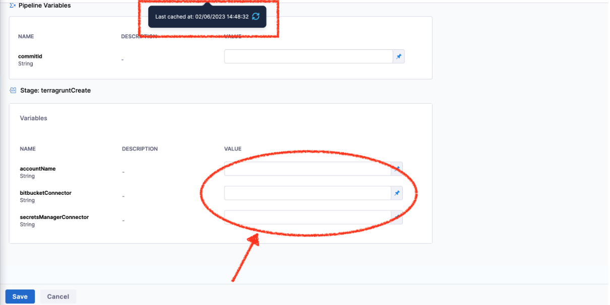

# Introduction

An Input Set includes all the runtime inputs that are not permanent in the Pipeline. Runtime inputs contain the values that you would be prompted to provide when you executed the Pipeline.
More on this is detailed out here https://developer.harness.io/docs/platform/git-experience/manage-input-sets-in-simplified-git-experience/

## Problem Statement

We have several input sets in a pipeline that have been imported from version control.

As attached in the screenshots, don't have the values that are present in the YAML source code (see the source code repository screenshot).

The input set is currently synchronized with the repository.

Expected result: After a sync, the values from the YAML are populated.

Actual result: They aren't.

## Resolution

The issue generally occurs when : 

1. A stage which has runtime inputs and a input set for it

2. Delete that stage and add new stage with new inputs

3. Then check input set view
 

 So in the above case the stage was removed from the pipeline. The inputset didn't change in Harness but only changed in remote. So when the inputset was opened in Harness, we validated it against the newly changed pipeline and the remote reference of the inputset. Clicking on `view diff` option on the top right helps view the difference. Once user saves the difference then the inputset will get updated. 

Therefore

- When we load the input set we are validating against the pipeline. So the view diff option will actually show the difference of the validated inputset and the remote input set. 

- You can validate and then finally save the new inputset which will then get propagated to git.
 
