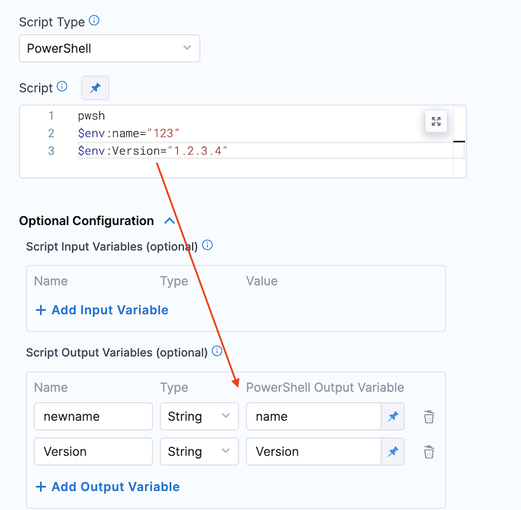
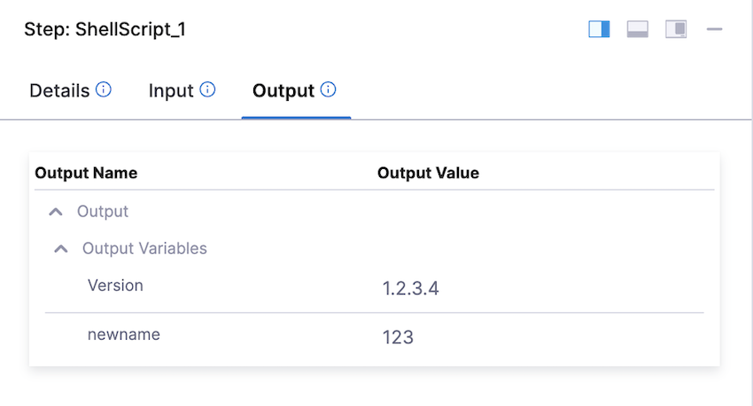

# Introduction

This knowledge base article walks you through how you can configure the Output variable for PowerShell Script. 

The Output Variables is used to export variables from the script to other steps in the stage.

## Steps to configure the output variable for Powershell script

In the Powershell script you need to use the $env with the variable name.

Let's take a look at the below example:

```
  $env:name="123"
  $env:Version="1.2.3.4"
```




The output variable can be use in one of the following:

* Within the stage:
	+ `<+execution.steps.[step_id].output.outputVariables.[output_variable_name]>`
* Anywhere in the pipeline:
	+ `<+pipeline.stages.[stage_Id].spec.execution.steps.[step_Id].output.outputVariables.[output_variable_name]>`
* When step is inside a step group:
	+ `<+pipeline.stages.[stage_Id].spec.execution.steps.[step_group_Id].steps.stepId.build.[output_variable_name]`  


To find the expression to reference your output variables, find the step in the Pipeline execution, and click its Output tab.

