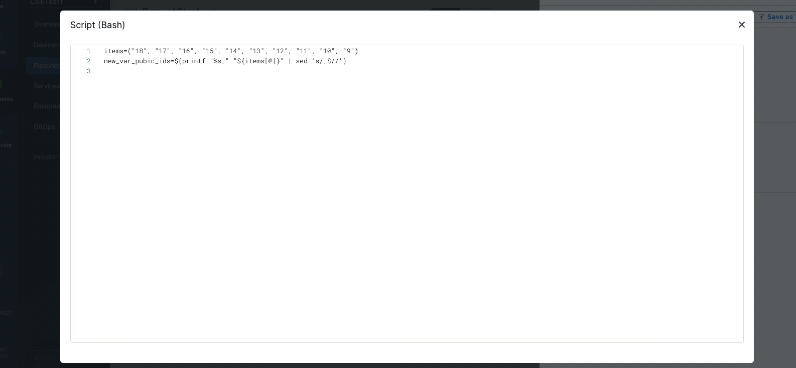
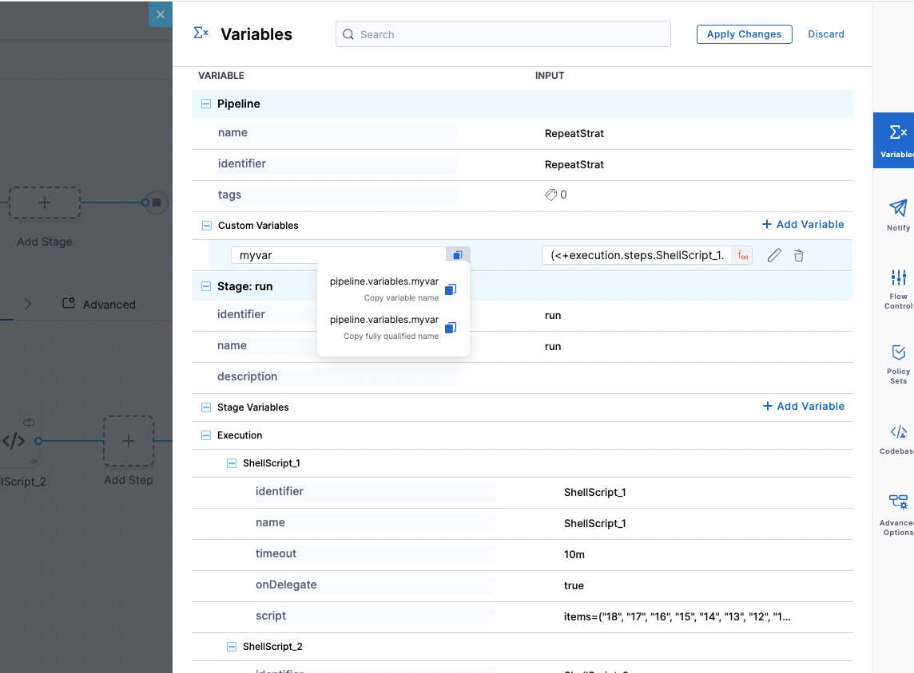
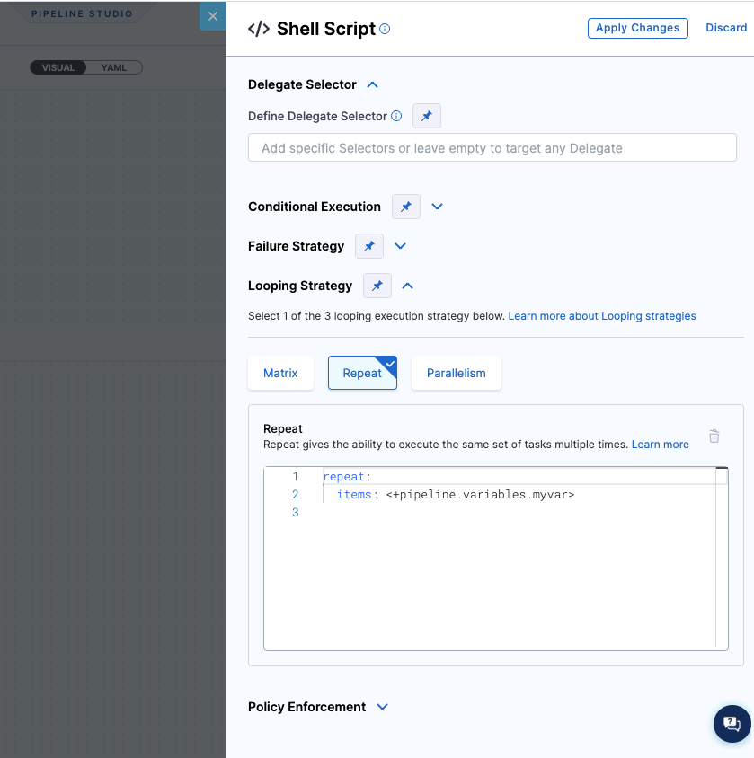

# Introduction

This knowledge base article provides a guide on how to pass the output list of strings from one step to the next step using the looping strategy "repeat". It demonstrates how to properly convert an array into a string and then parse it back into a list of strings before utilizing the "repeat" strategy.


## Problem Statement

How do we pass the output list of first step to next step looping strategy "repeat", the output can be a list or array which needs to be parsed.

## Solution

The Output Variable of the shell script is a string, which you are trying to pass as a list of strings, to avoid this : 
  
1. First you need to convert your array list into a string and then pass it as an output variable.

2. Then convert this string into a list of string again before passing it to the repeat strategy.

Here is an example of how you can achieve it : 

We have a list which is an array of items, that we would like to iterate, we will convert this into a string to pass it as an output variable : 



```
items=("18", "17", "16", "15", "14", "13", "12", "11", "10", "9")
new_var_pubic_ids=$(printf "%s," "${items[@]}" | sed 's/,$//')
```
Create a custom variable which would carry the value of the Output Variable as an expression and we will split it into a list of string 



The custom variable myvar contains an expression of our Output variable note that we are doing a split here :

```
(<+execution.steps.ShellScript_1.output.outputVariables.new_var_pubic_ids>).split(",") 
```
Now use this custom variable in your repeat strategy

