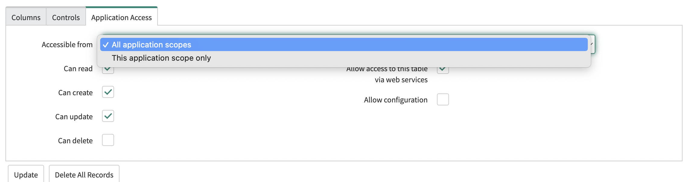

This KB discusses the permissions required for ServiceNow create, update, and approval steps. Make sure that you've the permissions required for the `ticket` and `getMetadata` APIs apart from the permissions mentioned in the following sections. 

## Create ServiceNow tickets

### Create a ServiceNow ticket without templates

Harness uses the following API to create a ServiceNow ticket without templates:  

```
curl --location --request POST '{instance_url}/api/now/table/<ticket_type>'\
--header 'Authorization: Basic {bearer token}' \
--header 'Content-Type: application/json' \
--data-raw '{
    "description" : "sample incident"
}'
```

The `instance_url` mentioned above is the ServiceNow URL provided in the ServiceNow connector.
The `bearer token` mentioned above is the token generated by the credentials provided in ServiceNow.

Required permission: `itil`.

### Create a ServiceNow ticket from a form templates

Harness uses custom script APIs to create a ticket using form templates.
Required permission: `itil`, `x_harne_harness_ap.integration_user_role`.

:::note 
This flow requires the Harness app to be installed in ServiceNow. Review [Important notes for using templates](https://developer.harness.io/docs/continuous-delivery/x-platform-cd-features/cd-steps/ticketing-systems/create-service-now-tickets-in-cd-stages/#important-notes-for-using-templates) for more details.
:::

### Create a ServiceNow ticket from a standard templates

This is supported only for change request ticket types. 

While fetching fields, if the `change_manager` permission is not available, then Harness considers the `description`, `backout_plan`, `test_plan`, and `implementation_plan` fields as read-only instead of adhering to ServiceNow properties. 

Required permission: `itil`.

Required role: `change_manager`.

Harness uses the following API to create a ServiceNow ticket from templates:

```
curl --location --request POST '{instance_url}/api/sn_chg_rest/change/standard/{sys_id}?backout_plan=ABORT&test_plan=TEST'\
--header 'Authorization: Basic {bearer token}' \
--header 'Content-Type: application/json' \
```

## Update ServiceNow tickets 

### Update a ServiceNow ticket without templates

Harness uses the following API to update a ServiceNow ticket without templates:  

```
curl --location --request PATCH '{instance_url}/api/now/table/<ticket_type>' \
--header 'Authorization: Basic {bearer token}' \
--header 'Content-Type: application/json' \
--data-raw '{
    "description" : "updated"
}'
```

The `instance_url` mentioned above is the ServiceNow URL provided in the ServiceNow connector.
The `bearer token` mentioned above is the token generated by the credentials provided in ServiceNow.

Required permission: `itil`.


### Update a ServiceNow ticket from templates

Harness uses custom script APIs to update a ticket using form templates.
Required permission: `itil_admin`, `x_harne_harness_ap.integration_user_role`.

:::note 
This flow requires the Harness app to be installed in ServiceNow. Review [Important notes for using templates](https://developer.harness.io/docs/continuous-delivery/x-platform-cd-features/cd-steps/ticketing-systems/update-service-now-tickets-in-cd-stages/#important-notes-for-using-templates) for more details.
:::

## ServiceNow Approval step

Harness uses the following API to get the fields of the ServiceNow ticket for which the approval or rejection criteria is specified in the Approval step.

```
curl --location --request GET '{instance_url}/api/now/table/<ticket_type>' \
--header 'Authorization: Basic {bearer token}' \
```

The `instance_url` mentioned above is the ServiceNow URL provided in the ServiceNow connector.
The `bearer token` mentioned above is the token generated by the credentials provided in ServiceNow.

Required permission: `itil`.

## General debugging FAQs

1. **Why is apply from template selection blocked when using ServiceNow create/update step?**

   The connector provided is probably missing the `x_harne_harness_ap.integration_user_role` role permission. Another possible reason could be that the delegate might be down. Also, check if Integration for [Harness Software Delivery Platform app](https://store.servicenow.com/sn_appstore_store.do#!/store/application/de154a1e1b75851044cbdb58b04bcb11/1.0.2?referer=%2Fstore%2Fsearch%3Flistingtype%3Dallintegrations%25253Bancillary_app%25253Bcertified_apps%25253Bcontent%25253Bindustry_solution%25253Boem%25253Butility%25253Btemplate%26q%3Dharness&sl=sh) is installed in your ServiceNow instance from the ServiceNow store before using templates to update ServiceNow tickets. 

2. **Why does updating a ServiceNow ticket from a template result in the error: `Error in fetching issue 125c716edb61a910e9748c3b13961918 .Issue does not exist`.**

   The selected ticket type might be different from the actual ticket.

3. **How do you debug an ACL error?**

   Assuming that the integration user has all above mentioned roles for specific use cases.

   1. Identify the user or integration that Harness used as a connector. This could be a specific user, system account, or an integration like an API. 
   2. ServiceNow uses Access Control Lists (ACLs) to control what data a user can access and what they can do with that data. Check the ACLs for the table to which you are trying to insert/update. For example, Incident.
   3. Ensure that the user or integration has the necessary roles to perform the action. This might involve checking their roles, groups, or specific ACL rules. 
   4. If the user or integration does not have the necessary permissions, you will need to update the ACLs. This could involve adding a new ACL rule, or modifying an existing one.
   5. Once the ACLs are updated, create the ServiceNow ticket again. If the insert is successful, the issue has been resolved.
   6. ServiceNow has data restrictions on their UI. There can be various UI policies configured on ServiceNow that may not allow you to perform the operation directly on UI even it is possible via Harness. You can directly use the APIs listed above for debugging permission issues.
   7. Check if the table, for example Change Request has any scoped applications enabled. For details, go to [ServiceNow documentation](https://docs.servicenow.com/bundle/vancouver-application-development/page/build/applications/reference/r_TableApplicationAccessFields.html).
      
   8. Check if there are any data policies written on the user's Dev instance on the table. For details, go to [ServiceNow documentation](https://docs.servicenow.com/bundle/vancouver-platform-administration/page/administer/field-administration/concept/c_DataPolicy.html).
   9. When using custom tables (not Incident, Problem, Change Request, and Change Task in create/update using form templates), make sure to grant cross-scope privileges for the required table with templates (via the Harness app in ServiceNow store). For details, go to [Custom table support](https://developer.harness.io/docs/continuous-delivery/x-platform-cd-features/cd-steps/ticketing-systems/create-service-now-tickets-in-cd-stages/#custom-table-support).

4. **User Permissions Look Proper with SNOW Access Analyzer, but still Receiving Permission Access Failure**

   Although the user which is being used for access to Service Now appears to have the proper permissions, teams may still be getting access errors regarding permissions to a table.  (For example, messages to check permissions to the Incident Table).  The cause of this may not have to do with the User Permissions, but actually has to do with the Rest API Access Policy.

   Please read [the following information in Service Now with regards to how Rest API Access Policies work](https://www.servicenow.com/docs/bundle/yokohama-platform-security/page/integrate/authentication/concept/inbound-authentication-profile.html), and how to make adjustments to them.
   
