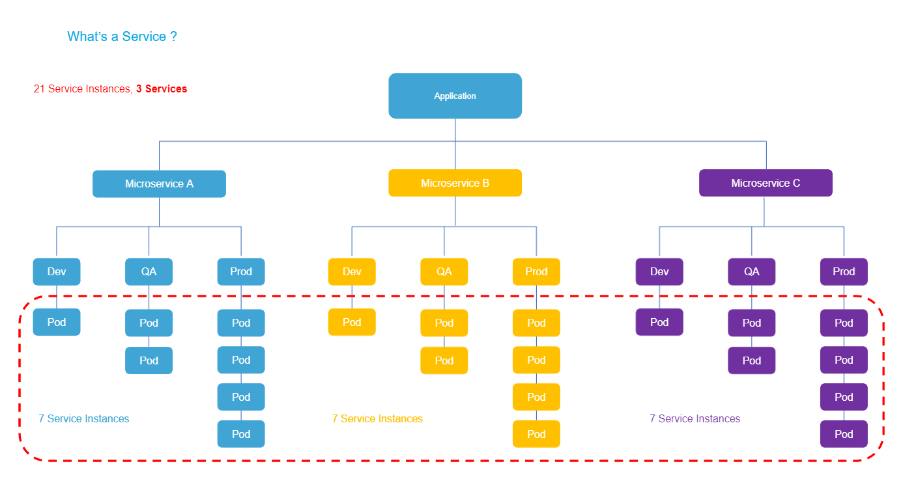
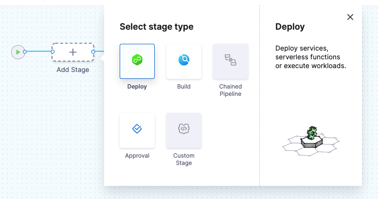

This article addresses some frequently asked questions about Harness Continuous Delivery & GitOps.

For an overview of Harness' support for platforms, methodologies, and related technologies, go to [Supported platforms and technologies](/docs/platform/platform-whats-supported).

For a list of CD supported platforms and tools, go to [CD integrations](/docs/continuous-delivery/cd-integrations).

For an overview of Harness concepts, see [Learn Harness' key concepts](/docs/platform/get-started/key-concepts).

### General FAQs

#### Where can one find instanceKey and infrastructureMappingId values in Trigger Rollback API?

The Instance Key is a combination of the Infrastructure Key and the instance information available in the Instances Table.
Infrastructure key can be found as part of the infrastructure output variables.
Instance information can be found in the Instances Table.

Note that the infrastructureMappingId is not exposed as part of the Infrastructure.


#### How does Harness calculate pricing for CD?

See [Service-based licensing and usage for CD](/docs/continuous-delivery/get-started/service-licensing-for-cd/)

#### My definition of a service differs from the above standard definition. How will pricing work in my case?

Harness allows deployment of various custom technologies such as Terraform scripts, background jobs, and other non-specified deployments. These require custom evaluation to assess the correct Licensing model. Please contact the Harness Sales team to discuss your specific technologies and deployment use cases.

See the **Pricing FAQ** at [Harness pricing](https://harness.io/pricing/).

#### Are there other mechanisms to license Harness CD beyond services?

See the **Pricing FAQ** at [Harness pricing](https://harness.io/pricing/).

Yes, we are happy to have Harness Sales team work with you and understand the specifics of what you are trying to achieve and propose a custom licensing/pricing structure.

#### Do unused/stale services consume a license?

See the **Pricing FAQ** at [Harness pricing](https://harness.io/pricing/).

Harness CD actively tracks and provides visibility into all active services that consume a license.

An active service is defined as a service that has been deployed at least once in the last 30 days. A service deemed inactive (no deployments in the last 30 days), does not consume a license.

#### How will I know if I am exceeding my licensed service usage?

See the **Pricing FAQ** at [Harness pricing](https://harness.io/pricing/).

Harness CD has built-in license tracking and management dashboards that provide you real-time visibility into your license allocation and usage.

If you notice that you are nearing or exceeding your licensed services, please get in touch with Harness Sales team to plan ahead and ensure continued usage and compliance of the product.

#### How many users can I onboard onto Harness CD? Is there a separate pricing for Users?

Harness CD has been designed to empower your entire Engineering and DevOps organization to deploy software with agility and reliability. We do not charge for users who onboard Harness CD and manage various aspects of the deployment process, including looking through deployment summaries, reports, and dashboards. We empower users with control and visibility while pricing only for the actual ‘services’ you deploy as a team.

#### If I procure a certain number of service licenses on an annual contract, and realize that more licenses need to be added, am I able to procure more licenses mid-year through my current contract?

See the **Pricing FAQ** at [Harness pricing](https://harness.io/pricing/).

Yes, Harness Sales team is happy to work with you and help fulfill any Harness-related needs, including mid-year plan upgrades and expansions.

#### If I procure a certain number of service licenses on an annual contract, and realize that I may no longer need as many, am I able to reduce my licenses mid-year through my current contract?

See the **Pricing FAQ** at [Harness pricing](https://harness.io/pricing/).

While an annual contract can not be lowered mid-year through the contract, please contact us and we will be very happy to work with you. In case you are uncertain at the beginning of the contract of how many licenses should be procured - you can buy what you use today to start and expand mid-year as you use more. You can also start with a monthly contract and convert to an annual subscription.

#### What if I am building an open source project?

We love Open Source and are committed to supporting our Community. We recommend [Harness Open Source](/docs/open-source/overview) for hosting your source code repository as well as CI/CD pipelines.

Contact us and we will be happy to provide you with a no restriction SaaS Plan!

#### What if I add more service instance infrastructure outside of Harness?

See the **Pricing FAQ** at [Harness pricing](https://harness.io/pricing/).

If you increase the Harness-deployed service instance infrastructure outside of Harness, Harness considers this increase part of the service instance infrastructure and licensing is applied.

#### When is a service instance removed?

If Harness cannot find the service instance infrastructure it deployed, it removes it from the Services dashboard.

If Harness cannot connect to the service instance infrastructure, it will retry until it determines if the service instance infrastructure is still there.

#### If the instance/pod is in a failed state does it still count towards the service instance count?

Harness performs a steady state check during deployment and requires that each instance/pod reach a healthy state.

A Kubernetes liveness probe failing later would mean the pod is restarted. Harness continues to count it as a service instance.

A Kubernetes readiness probe failing later would mean traffic is no longer routed to the pods. Harness continues to count pods in that state.

Harness does not count an instance/pod if it no longer exists. For example, if the replica count is reduced.

#### What deployment strategies can I use?

Harness supports all deployment strategies, such as blue/green, rolling, and canary.

See [Deployment concepts and strategies](/docs/continuous-delivery/manage-deployments/deployment-concepts)

#### How do I filter deployments on the Deployments page?

You can filter deployments on the the Deployments page according to multiple criteria, and save these filters as a quick way to filter deployments in the future.

#### How do I know which Harness Delegates were used in a deployment?

Harness displays which Delegates performed each task in the Details of each step.


#### Can I restrict deployments to specific User Groups?

Yes, you can enable the Role permission Pipeline Execute and then apply that Role to specific User Groups.


See [Manage roles](/docs/platform/role-based-access-control/add-manage-roles).

#### Can I deploy a service to multiple infrastructures at the same time?

Each stage has a service and target Infrastructure. If your Pipeline has multiple stages, you can deploy the same service to multiple infrastructures.

See [Define your Kubernetes target infrastructure](/docs/continuous-delivery/deploy-srv-diff-platforms/kubernetes/define-your-kubernetes-target-infrastructure).

#### Can I re-run a failed deployment?

Yes, select **Re-run Pipeline**.


#### How to handle the scenario where powershell scripts does not correctly return the status code on failure ?

Though it is an issue with Powershell where it does not return the error code correctly we need this for our step to proceed further and reflect the status correctly. Consider wrapping the code like below in the script:

```
$ErrorActionPreference = [System.Management.Automation.ActionPreference]::Stop

<execution code>

exit $LASTEXITCODE
```

#### Can we persist variables in the pipeline after the pipeline run is completed ?

We do not persist the variables and the variables are only accessible during the context of execution. You can make api call to write it as harness config file and later access the Harness file or alternatively you have a config file in git where you can push the var using a shell script and later access the same config file.


#### How do I access one pipeline variables from another pipeline ?

Directly, it may not be possible. 
 
As a workaround, A project or org or account level variable can be created and A shell script can be added in the P1 pipeline after the deployment which can update this variable with the deployment stage status i.e success or failure then the P2 pipeline can access this variable and perform the task based on its value.
 
The shell script will use this API to update the value of the variable - https://apidocs.harness.io/tag/Variables#operation/updateVariable


#### Why some data for the resource configurations returned by api are json but not the get pipeline detail api ?

The reason the get api call for pipeline is returning a yaml because the pipeline is stored as yaml in harness. As this api call is for fetching the pipeline hence it is returning the yaml definition of the pipeline and not the json.
If still you need json representation of the output you can use a parser like yq to convert the response.


#### How to exit a workflow without marking it as failed

You can add a failure strategy in the deploy stage by either ignoring the failure for the shell script or getting a manual intervention where you can mark that step as a success. 


#### 2 Deployments in pipeline, is it possible for me to rollback the stage 1 deployment if the stage 2 tests returned errors?

We do have a pipeline rollback feature that is behind a feature flag. This might work better as you would be able to have both stages separate, with different steps, as you did before, but a failure in the test job stage could roll back both stages.
 
[Documentation](https://developer.harness.io/docs/platform/pipelines/failure-handling/define-a-failure-strategy-for-pipelines)
  
Also, for the kubernetes job, if you use the Apply step instead of Rollout then the step will wait for the job to complete before proceeding, and you would not need the Wait step.


#### CDNG Notifications custom slack notifications

 It is possible to create a shell script that sends notifications through Slack, in this case, we can refer to this article:

 https://discuss.harness.io/t/custom-slack-notifications-using-shell-script/749


#### Creation of environment via API?

We do support API's for the nextgen : https://apidocs.harness.io/tag/Environments#operation/createEnvironmentV2

```
curl -i -X POST \
  'https://app.harness.io/ng/api/environmentsV2?accountIdentifier=string' \
  -H 'Content-Type: application/json' \
  -H 'x-api-key: YOUR_API_KEY_HERE' \
  -d '{
    "orgIdentifier": "string",
    "projectIdentifier": "string",
    "identifier": "string",
    "tags": {
      "property1": "string",
      "property2": "string"
    },
    "name": "string",
    "description": "string",
    "color": "string",
    "type": "PreProduction",
    "yaml": "string"
  }'
```

#### Download artifact for winrm is not working while Nexus if windows machine is behind proxy in CG
Nexus is supported for NG but not in CG, so you can use custom powershell script something like below:
Invoke-WebRequest -Uri "$\{URI}" -Headers $Headers -OutFile "$\{OUT_FILE}" -Proxy "$env:HTTP_PROXY"


#### How can we automatically create a new service whenever a new service yaml is uploaded to my source repo?
We can create a pipeline with api call for service creation and in that pipeline we can add a trigger to our source repo where service yaml is uploaded. Now whenever there will be a new service yaml the pipeline will get triggered and we can fetch this new service yaml using git cli in the shell step and use the yaml to make the api call for service creation.

#### How do I use all environments and only select infrastructure for multiple environment deployments?
Use filtered lists for this purpose. You can specify "Filter on Entities" as Environment in the first filter and select "Type" as all. Now for the infrastructure you can add another filter and provide the tag filter.


#### How do I list Github Tags for custom artifact when the curl returns a json array without any root element?

We cannot provide an array directly to the custom artifact. It needs a root element to parse the json response.


#### How to use the Stage Variable inside the Shell Script?

A variable expression can be used to access stage variables in pipelines.
Just hover over your variable name, and you will see an option to copy the variable expression path, You can reference this path in shell script.


#### How can we return dynamically generated information to a calling application upon the successful completion of pipelines initiated by API calls from other applications?

You can configure pipeline outputs throughout the stages to include all the data you want to compile. Then, upon execution completion, you can include a shell script that references these outputs and sends the compiled information to the desired API.


#### Can we get details what branch did trigger the pipeline and who did it; the time the pipeline failed or terminated,  while using Microsoft Teams Notification 
These details are not available by default as only (status, time, pipeline name url etc) is only sent and if you need these details might ned to use custom shell script


#### How to pass list of multiple domains for allowing whitelisting while using api ?

Domain whitelisting api takes domain as input array. So if we have multiple domains to be passed this needs to be done as coma separeted string entries in the array. Below is a sample for the same:

```
curl -i -X PUT \
  'https://app.harness.io/ng/api/authentication-settings/whitelisted-domains?accountIdentifier=xxxx' \
  -H 'Content-Type: application/json' \
  -H 'x-api-key: REDACTED' \
  -d '["gmail.com","harness.io"]'
```


#### I have a pipeline containing different stages DEV-QA-UAT-PROD. In UAT I'm using Canary deployment and in PROD it's Blue-Green. In these scenarios how Harness provides proper Roll Back strategies?
Harness provides a declarative rollback feature that can perform rollbacks effectively in different deployment scenarios.
 
For Canary deployment in UAT, you can define the percentage of traffic to route to the new version and set up conditions to switch traffic between the old and new versions. If an anomaly is detected during the canary deployment, Harness will automatically trigger a rollback to the previous version.
 
For Blue-Green deployment in PROD, you can define the conditions to switch traffic between the blue and green environments. If an issue is detected in the green environment, you can easily switch back to the blue environment using the declarative rollback feature.
 
You can define the failure strategy on stages and steps in your pipeline to set up proper rollback strategies. You can add a failure strategy in the deploy stage by either ignoring the failure for the shell script or getting a manual intervention where you can mark that step as a success. Additionally, you can use the declarative rollback feature provided by Harness to perform rollbacks effectively in different deployment scenarios.


#### How to pass the dynamic tag of the image from the CI pipeline to the CD Pipeline to pull the image.
A project or org or account level variable can be created and A shell_script/Run Step can be added in the P1 pipeline to export or output the required variable then the P2 pipeline can access this variable and perform the task based on its value.
 
The shell script will use this API to [update the value of the variable](https://apidocs.harness.io/tag/Variables#operation/updateVariable).


#### Where can one find the API request and response demo for execution of Pipeline with Input Set ?

One can use the below curl example to do so :

```sh
curl -i -X POST \
  'https://app.harness.io/pipeline/api/pipeline/execute/{identifier}/inputSetList?accountIdentifier=string&orgIdentifier=string&projectIdentifier=string&moduleType=string&branch=string&repoIdentifier=string&getDefaultFromOtherRepo=true&useFQNIfError=false&notesForPipelineExecution=' \
  -H 'Content-Type: application/json' \
  -H 'x-api-key: YOUR_API_KEY_HERE' \
  -d '{
    "inputSetReferences": [
      "string"
    ],
    "withMergedPipelineYaml": true,
    "stageIdentifiers": [
      "string"
    ],
    "lastYamlToMerge": "string"
  }'
```

Please read more on this in the following documentation on [Execute a Pipeline with Input Set References](https://apidocs.harness.io/tag/Pipeline-Execute/#operation/postPipelineExecuteWithInputSetList).

#### How do we pass the output list of first step to next step looping strategy "repeat", the output can be a list or array which needs to be parsed ?

The Output Variable of the shell script is a string, which you are trying to pass as a list of strings, to avoid this :
- First you need to convert your array list into a string and then pass it as an output variable.
- Then convert this string into a list of string again before passing it to the repeat strategy.

Please read more on this in the following [Documentation](https://developer.harness.io/kb/continuous-delivery/articles/repeat-strategy).

#### I need to run my step in delegate host?

You can create a shell script and select option as execute on delegate under Execution Target


#### How to fetch files from the harness file store in the run step?
To fetch files from the Harness file store in a Run step, you can use the following example:

```
- step:
    type: Run
    name: Fetch Files from File Store
    identifier: fetch_files
    spec:
      shell: Sh
      command: |
        harness file-store download-file --file-name <file_name> --destination <destination_path>
```
Replace "filename" with the name of the file you want to fetch from the file store, and "destinationpath" with the path where you want to save the file on the target host.

#### Does Harness supports multiple IaC provisioners?

Harness does support multiple Iac provisioners, few examples are terraform, terragrunt, cloud formation, shell script provisioning etc. 

#### How do I setup a Pipeline Trigger for Tag and Branch creation in Github?

The out of the box Github Trigger type does not currently support this however, you can use a Custom Webhook trigger and follow the below steps in order to achieve this. 

1. Create a Custom Webhook trigger
2. Copy the Webhook URL of the created trigger
3. Configure a Github Repository Webhook pasting in the URL copied from Step 2 in the Payload URL
4. Set the content type to `application/json`
5. Select `Let me select individual events.` for the `Which events would you like to trigger this webhook?` section
6. Check the `Branch or tag creation` checkbox


#### What are reserved symbols in PowerShell, and how do I handle them in Harness secrets in Powershell scripts?

Symbols such as `|`, `^`, `&`, `<`, `>`, and `%` are reserved in PowerShell and can have special meanings. It's important to be aware of these symbols, especially when using them as values in Harness secrets.

If a reserved symbol needs to be used as a value in a Harness secret for PowerShell scripts, it should be escaped using the `^` symbol. This ensures that PowerShell interprets the symbol correctly and does not apply any special meanings to it.

The recommended expression to reference a Harness secret is `<+secrets.getValue('secretID')>`. This ensures that the secret value is obtained securely and without any issues, especially when dealing with reserved symbols.


#### Which API is utilized for modifying configuration in the update-git-metadata API request for pipelines?

Please find an example API call below:

```sh
curl --location --request PUT 'https://app.harness.io/gateway/pipeline/api/pipelines/<PIPELINE_IDENTIFIER>/update-git-metadata?accountIdentifier=<ACCOUNT_ID>&orgIdentifier=<ORG_ID>&projectIdentifier=<PROJECT_IDENTIFIER>&connectorRef=<CONNECTOR_REF_TO_UPDATE>&repoName=<REPO_NAME_TO_UPDATE>&filePath=<FILE_PATH_TO_UPDATE>' \
  -H 'x-api-key: <API_KEY>' \
  -H 'content-type: application/json' \

```
Please read more on this in the following [Documentation](https://apidocs.harness.io/tag/Pipeline#operation/importPipeline)


#### How do I perform iisreset on a Windows machine?

You can create a WinRM connector and use a powershell script to perform the iisreset. Make sure the user credentials used for the connection have admin access.


#### If the assigned delegate executing a task goes down does the task gets re-assigned to other available delegates?
If a delegate fails or disconnects, then the assigned task will fail. We do not perform the re-assignment. If the step is idempotent then we can use a retry strategy to re-execute the task.


#### If the "All environments" option is used for a multiple environment deployment, why can we not specify infrastructure?
When the "All environments" option is selected we do not provide infrastructure selection in the pipeline editor. The infrastructure options are available in the run form.

#### We have an updated manifest file for deployment, but delegate seems to be fetching old manifest. How can we update this?

You can clear the local cached repo.

Local repository is stored at `/opt/harness-delegate/repository/gitFileDownloads/Nar6SP83SJudAjNQAuPJWg/<connector-id>/<repo-name>/<sha1-hash-of-repo-url>`.


#### Can we get the pipeline execution url from the custom trigger api response?
The custom trigger api response contains a generic url for pipeline execution and not the exact pipeline execution. If we need the exact pipeline execution for any specific trigger we need to use the trigger activity page.

#### Does Harness offer a replay feature similar to Jenkins?

Yes, Harness provides a feature similar to Jenkins' **Replay** option, allowing you to rerun a specific build or job with the same parameters and settings as the previous execution. In Harness, this functionality is known as **Retry Failed Executions**. You can resume pipeline deployments from any stage or from a specific stage within the pipeline.

To learn more about how to utilize this feature in Harness, go to [Resume pipeline deployments](https://developer.harness.io/docs/platform/pipelines/failure-handling/resume-pipeline-deployments/) documentation.


#### How can I handle uppercase environment identifiers in Harness variables and deploy pipelines?

Harness variables provide flexibility in managing environment identifiers, but dealing with uppercase identifiers like UAT and DR can pose challenges. One common requirement is converting these identifiers to lowercase for consistency. Here's how you can address this:

- Using [Ternary Operator](https://developer.harness.io/kb/continuous-delivery/articles/ternary-operator/): While if-else statements aren't directly supported in variables, you can leverage the ternary operator to achieve conditional logic.

- Updating Environment Setup: Another approach is to update your environment setup to ensure identifiers like UAT and DR are stored in lowercase. By maintaining consistency in the environment setup, you can avoid issues with case sensitivity in your deployment pipelines.


#### What does "buffer already closed for writing" mean?

This error occurs in SSH or WinRM connections when some command is still executing and the connection is closed by the host. It needs further debugging by looking into logs and server resource constraints.


#### Where do I get the metadata for the Harness download/copy command?

This metadata is detected in the service used for the deployment. Ideally, you would have already configured an artifact, and the command would use the same config to get the metadata.


#### Can I use SSH to copy an artifact to a target Windows host?

If your deployment type is WinRM, then WinRM is the default option used to connect to the Windows host.


#### Why doesn't the pipeline skip steps in a step group when another step in the group fails?

If you want this to occur, you neeed to define a conditional execution of `<+stage.liveStatus> == "SUCCESS"` on each step in the group.

#### Why am I getting an error that the input set does not exist in the selected Branch?
This happens because pipelines and input sets need to exist in the same branch when storing them in Git. For example, if your pipeline exists in the `dev` branch but your input set exists in the `main` branch, then loading the pipeline in the `dev` branch and attempting to load the input set will cause this error. To fix this, please ensure that both the pipeline and input set exist in the same branch and same repository.

#### When attempting to import a **.yaml file** from GitHub to create a new pipeline, the message `This file is already in use by another pipeline` is displayed. Given that there are no other pipelines in this project, is there a possibility of a duplicate entry that I may not be aware of?

It's possible that there are two pipeline entities in the database, each linked to the same file path from the Harness account and the GitHub URL. Trying to import the file again may trigger the `File Already Imported` pop-up on the screen. However, users can choose to bypass this check by clicking the `Import` button again.

#### How can you seamlessly integrate Docker Compose for integration testing into your CI pipeline without starting from scratch?

Run services for integration in the background using a `docker-compose.yaml` file. Connect to these services via their listening ports. Alternatively, while running `docker-compose up` in CI with an existing `docker-compose.yaml` is possible, it can complicate the workflow and limit pipeline control, including the ability to execute each step, gather feedback, and implement failure strategies.

#### What lead time do customers have before the CI starts running the newer version of images?

Customers typically have a one-month lead time before the CI starts running the newer versions of images. This allows them to conduct necessary tests and security scans on the images before deployment.


#### Can I export my entire FirstGen deployment history and audit trail from Harness?

You can use the following Harness FirstGen APIs to download your FirstGen audit trial and deployment history:

* [FirstGen Audit Trails API](https://developer.harness.io/docs/first-gen/firstgen-platform/techref-category/api/use-audit-trails-api)
* [FirstGen API](https://developer.harness.io/docs/category/harness-api-firstgen)


#### Why does a remote input set need a commit message input?

Harness requires a commit message so Harness can store the input set YAML in your Git Repo by making a commit to your Git repo.


#### What is the difference between "Remote Input Set" and "Import Input Set from Git"?

**Remote Input Set** is used when you create an input set and want to store it remotely in SCM.

**Import Input Set from Git** it is used when you already have an input set YAML in your Git repo that you want to import to Harness. This is a one-time import.

#### Why does the deleted service remain shown on the overview?

The dashboard is based on historical deployment data based on the selected time frame. Once the deleted service is not present in the selected time frame it will stop showing up on the dashboard.

#### In the overview page why Environments always showed 0 when the reality there are some environments?

The overview page offers a summary of deployments and overall health metrics for the project. Currently, the fields are empty as there are no deployments within the project. Once a deployment is in the project, these fields will be automatically updated.


#### What is the log limit of CI step log fetch step and how can one export the logs ?

Harness deployment logging has the following limitations:

- A hard limit of **25MB** for an entire step's logs. Deployment logs beyond this limit are skipped and not available for download.
The log limit for Harness CI steps is **5MB**, and you can export full CI logs to an external cache.
- The Harness log service has a limit of 5000 lines. Logs rendered in the Harness UI are truncated from the top if the logs exceed the 5000 line limit.


#### Does Harness support any scripts available to migrate GCR triggers to GAR ?

No, one can create a script and use the api to re-create them.
Please read more on this in our [API Docs](https://apidocs.harness.io/tag/Triggers#operation/createTrigger).

Please read more on this in the following [Documentation on logs and limitations](https://developer.harness.io/docs/continuous-delivery/manage-deployments/deployment-logs-and-limitations/) and [Truncated execution logs](https://developer.harness.io/kb/continuous-integration/continuous-integration-faqs/#truncated-execution-logs).

#### In a Helm deployment with custom certificates, what is essential regarding DNS-compliant keys? ? How should delegates be restarted after modifying the secret for changes to take effect ?

Please follow below suggestions:

- Ensure that the secret containing custom certificates adheres strictly to DNS-compliant keys, avoiding underscores primarily. Following any modification to this secret, it is imperative to restart all delegates to seamlessly incorporate the changes.
- Helm Installation Command:
```sh
helm upgrade -i nikkelma-240126-del --namespace Harness-delegate-ng --create-namespace \
  Harness-delegate/Harness-delegate-ng \
  --set delegateName=nikkelma-240126-del \
  --set accountId=_specify_account_Id_ \
  --set delegateToken=your_Delegatetoken_= \
  --set managerEndpoint=https://app.Harness.io/gratis \
  --set delegateDockerImage=Harness/delegate:version_mentioned \
  --set replicas=1 --set upgrader.enabled=true \
  --set-literal destinationCaPath=_mentioned_path_to_destination \
  --set delegateCustomCa.secretName=secret_bundle
```
- CA Bundle Secret Creation (Undesirable):
```sh
kubectl create secret generic -n Harness-delegate-ng ca-bundle --from-file=custom_certs.pem=./local_cert_bundle.pem
```
- CA Bundle Secret Creation (Desirable, no underscore in first half of from-file flag):
```sh
kubectl create secret generic -n Harness-delegate-ng ca-bundle --from-file=custom-certs.pem=./local_cert_bundle.pem
```
Please read more on Custom Certs in the following [Documentation](https://developer.harness.io/docs/platform/delegates/secure-delegates/install-delegates-with-custom-certs/).

#### Can we use Continuous Verification inside CD module without any dependency of SRM ?

Yes, one can set up a Monitored Service in the Service Reliability Management module or in the `Verify step` in a CD stage.
Please read more on this in the following [Documentation](https://developer.harness.io/docs/continuous-delivery/verify/configure-cv/verify-deployments-with-new-relic/#review-cv-setup-options).

#### How do I create a Dashboard in NG, which shows all the CD pipelines which are executing currently, in real-time ?

You can use the "status" field in dashboards to get the status of the deployments.


#### How is infra key formed for deployments.

The Infrastructure key (the unique key used to restrict concurrent deployments) is now formed with the Harness account Id + org Id + project Id + service Id + environment Id + connector Id + infrastructure Id.


#### What if the infra key formed in case when account Id + org Id + project Id + service Id + environment Id are same and the deployments are getting queued because of it.

To make the deployment work you can :

1. Add a connector in the select host field and specify the host.
2. Change the secret identifier (create a new with same key but different identifier).


#### I have a terraform code which I will need to use it deploy resources for Fastly service. And, I would like to know should I create a pipeline in CI or CD module and what's the reasoning behind it?

The decision on whether to create your pipeline in the Continuous Deployment (CD) module or Continuous Integration (CI) module depends on your specific use case and deployment strategy.

If your goal is to automate the deployment of infrastructure whenever there are changes in your code, and you are using Terraform for provisioning, it is advisable to create a pipeline in the CD module. This ensures that your application's infrastructure stays current with any code modifications, providing seamless and automated deployment.

Alternatively, if your use of Terraform is focused on provisioning infrastructure for your CI/CD pipeline itself, it is recommended to establish a pipeline in the CI module. This allows you to automate the provisioning of your pipeline infrastructure, ensuring its availability and keeping it up-to-date.

In broad terms, the CI module is typically dedicated to building and testing code, while the CD module is designed for deploying code to production. However, the specific use case and deployment strategy will guide your decision on where to create your pipeline.

It's worth noting that you also have the option to incorporate both types of processes within a single pipeline, depending on your requirements and preferences.

#### Is there a way to get notified whenever a new pipeline is created?
No, As per the current design it's not possible.

#### Does harness support polling on folders?
We currently, do not support polling on folders. We have an open enhancement request to support this.

#### How do I filter out Approvals for Pipeline Execution Time in Dashboards?
You can get the Approval step duration from the **Deployments and Services V2** data source.


#### What is a service instance in Harness?

A service is an independent unit of software you deploy through Harness CD pipelines.

This will typically map to a service in Kubernetes apps, or to an artifact you deploy in traditional VM-based apps.

Service instances represent the dynamic instantiation of a service you deploy with Harness.

For example, for a service representing a Docker image, service instances are the number of pods running the Docker image.



Notes:

* For services with more than 20 service instances - active pods or VMs for that service - additional service licenses will be counted for each 20 service instances. This typically happens when you have large monolith services.
* See the **Pricing FAQ** at [Harness pricing](https://harness.io/pricing/).

#### What are organizations and projects?

Harness organizations (orgs) allow you to group projects that share the same goal. For example, all projects for a business unit or division.

Within each org you can add several Harness projects.

A Harness project contains Harness pipelines, users, and resources that share the same goal. For example, a project could represent a business unit, division, or simply a development project for an app.

Think of projects as a common space for managing teams working on similar technologies. A space where the team can work independently and not need to bother account admins or even org admins when new entities like connectors, delegates, or secrets are needed.

Much like account-level roles, project members can be assigned project admin, member, and viewer roles

#### What is a Harness pipeline?

Typically, a pipeline is an end-to-end process that delivers a new version of your software. But a pipeline can be much more: a pipeline can be a cyclical process that includes integration, delivery, operations, testing, deployment, real-time changes, and monitoring.

For example, a pipeline can use the CI module to build, test, and push code, and then a CD module to deploy the artifact to your production infrastructure.

#### What's a Harness stage?

A stage is a subset of a pipeline that contains the logic to perform one major segment of the pipeline process. Stages are based on the different milestones of your pipeline, such as building, approving, and delivering.



Some stages, like a deploy stage, use strategies that automatically add the necessary steps.


#### What are services in Harness?

A service represents your microservices and other workloads logically.

A service is a logical entity to be deployed, monitored, or changed independently.

#### What are service definitions?

When a service is added to the stage in a pipeline, you define its service definition. Service definitions represent the real artifacts, manifests, and variables of a service. They are the actual files and variable values.

You can also propagate and override a service in subsequent stages by selecting its name in that stage's service settings.

#### What artifacts does Harness support?

Harness supports all of the common repos.

See [Connect to an artifact repo](/docs/platform/connectors/artifact-repositories/connect-to-an-artifact-repo).

#### What's a Harness environment?

Environments represent your deployment targets logically (QA, production, and so on). You can add the same environment to as many stages as you need.

#### What are Harness infrastructure definitions?

Infrastructure definitions represent an environment's infrastructure physically. They are the actual clusters, hosts, and so on.

#### What are Harness connectors?

Connectors contain the information necessary to integrate and work with third-party tools.

Harness uses connectors at pipeline runtime to authenticate and perform operations with a third-party tool.

For example, a GitHub connector authenticates with a GitHub account and repo and fetches files as part of a build or deploy stage in a pipeline.

See Harness [Connectors how-tos](/docs/category/connectors).

#### How does Harness manage secrets?

Harness includes built-in secrets management to store your encrypted secrets, such as access keys, and use them in your Harness account. Harness integrates will all popular secrets managers.

See [Harness secrets management overview](/docs/platform/secrets/secrets-management/harness-secret-manager-overview).

#### Can I reference settings using expressions?

Yes. Everything in Harness can be referenced by a fully qualified name (FQN). The FQN is the path to a setting in the YAML definition of your pipeline.

See [Built-in Harness variables reference](/docs/platform/variables-and-expressions/harness-variables).

#### Can I enter values at runtime?

Yes. You can use runtime Inputs to set placeholders for values that will be provided when you start a pipeline execution.

See [Fixed values, runtime inputs, and expressions](/docs/platform/variables-and-expressions/runtime-inputs).

#### Can I evaluate values at run time?

Yes. With expressions, you can use Harness input, output, and execution variables in a setting.

All of these variables represent settings and values in the pipeline before and during execution.

At run time, Harness will replace the variable with the runtime value.

See [Fixed Values, runtime inputs, and expressions](/docs/platform/variables-and-expressions/runtime-inputs).

#### Error evaluating certain expressions in a Harness pipeline

Some customers have raised concerns about errors while trying to evaluable expressions (example: `<+pipeline.sequenceId>`) while similar expressions do get evaluated. In this case the concatenation in the expression `/tmp/spe/<+pipeline.sequenceId>` is not working because a part of expression `<+pipeline.sequenceId>` is integer so the concatenation with `/tmp/spec/` is throwing error because for concat, both the values should be string only. 

So we can invoke the `toString()` on the integer value then our expression should work. So the final expression would be `/tmp/spe/<+pipeline.sequenceId.toString()>`. 

#### How to carry forward the output variable when looping steps?

If you are using looping strategies on steps or step groups in a pipeline, and need to carry forward the output variables to consecutive steps or with in the loop, you can use  `<+strategy.iteration>` to denote the iteration count.

For example, assume a looping strategy is applied to a step with the identifier `my_build_step.` which has an output variable `my_variable` The expression `<+pipeline.stages.my_build_step.output.outputVariables.my_variable>` won't work. Instead, you must append the index value to the identifier in the expression, such as: `<+pipeline.stages.my_build_step_0.output.outputVariables.my_variable>`

If you are using with in the loop you can denote the same as `<+pipeline.stages.my_build_step_<+strategy.iteration>.output.outputVariables.my_variable>`

See [Iteration Counts](/docs/platform/pipelines/looping-strategies/looping-strategies-matrix-repeat-and-parallelism/#iteration-counts)

#### How do I get the output variables from pipeline execution using Harness NG API?

We have an api to get the pipeline summary:
 
https://apidocs.harness.io/tag/Pipeline-Execution-Details#operation/getExecutionDetailV2
 
If you pass the flag `renderFullBottomGraph` as true to this api it also gives you the output variables in the execution. You can parse the response to get the output variables and use it accordingly.

#### We have multiple accounts, like sandbox and prod, and we want to move the developments from sandbox to prod easily. Is there a solution for this?

Absolutely! We recommend customers to use test orgs or projects for sandbox development. Our hierarchical separation allows them to isolate test cases from production workloads effectively.

For pipeline development concerns, we have a solution too. Customers can utilize our built-in branching support from GitX. You can create a separate branch for building and testing pipeline changes. Once the changes are tested and verified, you can merge the changes into their default branch.

Sandbox accounts are most valuable for testing external automation running against Harness, which helps in building or modifying objects. This way, you can test changes without affecting production environments.


#### Is there an environment variable to set when starting the container to force the Docker delegate to use client tool libs from harness-qa-public QA repo?

To achieve this, you need to create a test image that points to the harness-qa-public QA repository. This involves updating the Docker file with the appropriate path to the QA buckets.


#### If I delete an infrastructure definition after deployments are done to it, what are the implications other than potential dashboard data loss for those deployments ?

At the moment there is no dependency on the instance sync and infrastructure definition. Infrastructure definition is used only to generate infrastructure details. The instance sync is done for service and environment. Only in case if any these are deleted, the instance sync will stop and delete instances.

:::info

If you are using the default release name format in Harness FirstGen as `release-${infra.kubernetes.infraId}`, it's important to note that when migrating to Harness NextGen, you will need to replace `${infra.kubernetes.infraId}` with the new expression. In Harness NextGen, a similar expression `<+INFRA_KEY>` is available for defining release names. However, it's crucial to understand that these expressions will resolve to completely different values compared to the expressions used in Harness FirstGen.

:::

#### What is the procedure to take services backup?

We do not have any backup ability for services out of the box but you can take the backup of service YAMLs and use them later for creating service if there is any issue with the service.

#### What is Harness FirstGen Graphql API to create Harness pipelines in a specific application?

We do not have a way to create a new pipeline using Graphql in FirstGen. However, we do have APIs to create Harness pipelines in NextGen.

#### How can specific users be able to approve the deployment?

You can create a user group of specific users and specify the same user group in the Approval stage so only those users can able to approve the execution.

For reference: [Select Approvers](https://developer.harness.io/docs/platform/approvals/adding-harness-approval-stages/#select-approvers).

#### Error when release name is too long.

In the deployment logs in Harness, you may get an error similar to this:

```
6m11s Warning FailedCreate statefulset/release-xxx-xxx create Pod release-xxx-xxx-0 in StatefulSet release-xxx-xxx failed error: Pod "release-xxx-xxx-0" is invalid: metadata.labels: Invalid value: "release-xxx-xxx-xxx": must be no more than 63 characters
```

This is an error coming from the kubernetes cluster stating that the release name is too long.  This can be adjusted in the Environments section.
1. Select the environment in question.
2. Select infrastructure definitions, and select the name of the infrastructure definition.
3. Scroll down and expand **Advanced**, and then modify the release name to be something shorter.

#### Where should I add label release: \{\{ .Release.Name }}?

For any manifest object which creates the pod, you have to add this label in its spec. Adding it in Service, Deployment, StatefulSet, and DaemonSet should be enough.

#### What does the release name mean in infrastructure?

The release name is used to create a harness release history object, which contains some metadata about the workloads. This helps us perform the steady state check.

#### Is it possible to apply notification rule on environment level for workflow failure/success?

Workflow notification strategy can only interpret Condition,Scope, and User Group fields. So, all the notification rules are applied on workflow level.


#### Is it possible to apply notification rule on environment level for workflow failure/success?

Workflow notification strategy can only interpret Condition,Scope, and User Group fields. So, all the notification rules are applied on workflow level.

#### How do you determine the number of service instances/licenses for our services?

We calculate service licenses based on the active service instances deployed in the last 30 days. This includes services from both successful and failed deployments. This includes if the step involving a service was skipped during a pipeline execution.

#### What is considered an active service instance for license calculation?

An active service instance is determined by finding the 95th percentile of the number of service instances of a particular service over a period of 30 days.

#### How are licenses consumed based on the number of service instances?

Each service license is equivalent to 20 active service instances. The number of consumed licenses is calculated based on this ratio.

#### Is there a minimum number of service instances that still consume licenses?

Yes, even if a service has 0 active instances, it still consumes 1 service license.

#### Are the licenses calculated differently for different types of services, such as CG and NG?

No, the calculation method remains the same for both CG (Current Generation) and NG (Next Generation) services.

#### Can you provide an example of how service licenses are calculated based on service instances?

Sure! An example of the calculation can be found in the following [Documentation](https://developer.harness.io/docs/continuous-delivery/get-started/service-licensing-for-cd/#example). This example illustrates how the number of service instances corresponds to the consumed service licenses.

#### Is on-demand token generation valid for both Vault's Kubernetes auth type and app role-based auth?

No, on-demand token generation is only valid for app role-based auth.

#### Can we use matrices to deploy multiple services to multiple environments when many values in services and environments are not hardcoded?

Yes, you can use matrices for deploying multiple services to multiple environments even if many values in services and environments are not hardcoded.


#### How to test Harness entities (service, infra, environment) changes through automation?

Harness by default will not let the user push something or create any entity which is not supported or is incorrect as our YAML validator always makes sure the entity is corrected in the right format.
 
You can use YAML lint to verify the YAML format of the entity. There is no way to perform testing (automation testing, unit testing, etc.) of Harness entities before releasing any change within those entities.

#### What happens when the limit of stored releases is reached?

When the limit of stored releases is reached, older releases are automatically cleaned up. This is done to remove irrelevant data for rollback purposes and to manage storage efficiently.


#### Can we use variables in the vault path to update the location dynamically based on environment?

A expression can be used in the URL, for example - Setting up a PATH variable in the pipeline and calling that variable in the get secret - echo "text secret is: " ```<+secrets.getValue(<+pipeline.variables.test>)>```


#### How do I use OPA policy to enforce environment type for each deployment stage in a pipeline i.e. prod or pre-prod?

The infra details are passed as stage specs.

For example, to access the environment type, the path would be - ```input.pipeline.stages[0].stage.spec.infrastructure.environment.type```
You will have to loop across all the stages to check its infra spec.


#### Do we support services and environments at the org level ?

Yes, we do. For more please refer this in following [Documentation](https://developer.harness.io/docs/continuous-delivery/get-started/services-and-environments-overview/#creating-services-at-an-account-or-organization-level).


#### How can Harness detect if the sub-tickets in Jira are closed before the approval process runs?

The first step is to make API calls to the Jira issue endpoint. By inspecting the response from the API call, you can check if the 'subtask' field is populated for the main issue.  Once you identify the subtask issue keys from the API response, you can create a loop to retrieve the status of each sub-ticket using their respective issue keys. This will allow you to determine if the sub-tickets are closed or not before proceeding with the approval process in Harness.

#### What am I not able to delete the template having an “Ad” string in between with adblocker installed?

It will happen due to an ad blocker extension installed on the user system. It will happen only for the template with 'Ad' in the name. For example, Sysdig AdHoc containing an “Ad” string. When this is sent in the API as a path or a query param, this will get blocked by the ad blocker.
 
These ad blockers have some rules for the URIs: if it contains strings like “advert”, “ad”, “double-click”, “click”, or something similar, they block it.

#### What are some examples of values that are not hardcoded in the deployment setup?

Some examples of values that are not hardcoded include chart versions, values YAMLs, infradef, and namespaces. These are currently treated as runtime inputs.

#### When querying the Harness Approval API, the approval details are returning with the message, No approval found for execution.

The API will only return Approval details if there are any approval step pending for approval. If there are no such executions currently, then its expected to return No Approval found for execution

#### Trigger another stage with inputs in a given pipeline?

You cannot do it if the stage is part of the same pipeline. However, using pipeline A and running a custom trigger script inside it can trigger the CI stage which is part of pipeline B.

#### Can I manipulate and evaluate variable expressions, such as with JEXL, conditionals or ternary operators?

Yes, there are many ways you can manipulate and evaluate expressions. For more information, go to [Use Harness expressions](https://developer.harness.io/docs/platform/variables-and-expressions/harness-variables).

#### Can I use ternary operators with triggers?

Yes, you can [use ternary operators with triggers](https://developer.harness.io/kb/continuous-delivery/articles/ternary-operator).

#### Can I customize the looping conditions and behavior?

Yes, Harness NextGen often offers customization options to define the loop exit conditions, maximum iteration counts, sleep intervals between iterations, and more information [here](https://developer.harness.io/docs/platform/pipelines/looping-strategies/looping-strategies-matrix-repeat-and-parallelism).

#### At the organizational level, I aim to establish a user group to which I can assign a resource group containing numerous distinct pipelines across specific projects.

We don’t support specific pipeline selections for specific projects for an organization. But the user can limit the access to the projects by selecting specific projects as scopes to apply in the org level resource group.

#### How do I created a OPA policy to enforce environment type?

The infra details are passed as stage specs.
For example, to access the environment type, the path would be - ```input.pipeline.stages[0].stage.spec.infrastructure.environment.type```
You will have to loop across all the stages to check its infra spec.

#### How to use spilt function on variable?

You can split on any delimiter and use index based access.
For example, if you have a variable with prod-environment-variable, you can use the below expression to get prod:  
```<+<+pipeline.variables.envVar>.split('-')[0]>```

#### How to use the substring function on variable?

You can use the substring function when you need to pass the starting and end index.
For example, if you have a variable with prod-environment-variable, you can use the below expression to get prod:  
```<+<+pipeline.variables.envVar>.substring(0,3)>```

#### How to pass value to a variable manually while running from UI if same pipeline is configured to run via trigger and using variable from trigger.

You can check the triggerType variable to identify if pipeline was invoked via trigger or manually and can use the following JEXL condition:
```<+<+pipeline.triggerType>=="MANUAL"?<+pipeline.variables.targetBranch>:<+trigger.targetBranch>>```

#### How to concatenate secrets with string?

You use either of the following expressions:

* ```<+secrets.getValue("test_secret_" + <+pipeline.variables.envVar>)>```
* ```<+secrets.getValue("test_secret_".concat(<+pipeline.variables.envVar>))>```

#### Can a non-git-sync'd pipeline consume a git-sync'd template from a non-default branch?

Yes, an inline pipeline can consume a template from non-default branch.

:::info Template Library

Reference specific versions of a template on a different branch from the pipeline.

While using Harness Git Experience for pipelines and templates, you can now link templates from specific branches.

Previously, templates were picked either from the same branch as the pipeline if both pipelines and templates were present in the same repository, or from the default branch of the repository if templates were stored in a different repository than the pipeline.

The default logic will continue to be used if no branch is specified when selecting the template. But, if a specific branch is picked while selecting the template, then templates are always picked from the specified branch only.

:::

#### Is there a way to generate a dynamic file with some information in one stage of the pipeline and consume that file content in a different pipeline stage?

For CI:

Go to this [Documentation](https://developer.harness.io/docs/continuous-integration/use-ci/caching-ci-data/share-ci-data-across-steps-and-stages/) for more details.

For CD:

You can use API to create a file in Harness file store and then refer it to other stage. For more details, go to [API documentation](https://apidocs.harness.io/tag/File-Store#operation/listFilesAndFolders).

Or, you can just write a file on the delegate and use the same delegate.

#### How to test Harness entities (service, infra, environment) changes through automation?

Harness by default will not let the user push something or create any entity which is not supported or is incorrect as our YAML validator always makes sure the entity is corrected in the right format.
 
You can use YAML lint to verify the YAML format of the entity. There is no way to perform testing (automation testing, unit testing, etc.) of Harness entities before releasing any change within those entities.

#### What kind of order do we apply to the Docker Tags as part of the artifact we show for the users? 

Except for the latest version of Nexus, it is in alphabetical order.

#### Is there a way to use a pipeline within a pipeline in a template? 

We do not support this, nor do we plan to at this time due to the complexity already with step, stage, and pipeline templates being nested within each other. 

Resolving inputs across those levels is very expensive and difficult to manage for end users.

#### In Harness can we refer to a secret created in org in the account level connector?
No, higher-level entity can refer to lower-scoped entities. For example, we cannot refer to a secret created in org in the account level connector.

#### Do we have multi-select for inputs in NG as we had in FG?

Multiple selection is allowed for runtime inputs defined for pipelines, stages, and Shell Script variables. You must specify the allowed values in the input as mentioned in the above examples.

The multiple selection functionality is currently behind the feature flag, ```PIE_MULTISELECT_AND_COMMA_IN_ALLOWED_VALUES```. Contact Harness Support to enable the feature.

#### How to view Deployment history (Artifact SHA) for a single service on an environment?

You can go to Service under the project --> Summary will show you the details with what artifact version and environment. 


#### Question about deployToAll yaml field, The pipeline yaml for the environment contains deployToAll field. What does that field do?

The field is used when you use the deploy to multiple infrastructures option. 
This field is for deploy to all infra inside an environment. 
[Documentation](https://developer.harness.io/docs/continuous-delivery/x-platform-cd-features/advanced/multiserv-multienv/).

#### Can we use variables in the vault path to update the location dynamically based on environment?

A expression can be used in the URL, for example - Setting up a PATH variable in the pipeline and calling that variable in the get secret - echo "text secret is: " ```<+secrets.getValue(<+pipeline.variables.test>)>```

#### Can we add a delay of n minutes before a pipeline is invoked via trigger?

We don't have any timer for the trigger. It will trigger the pipeline whenever a change is made in the master branch.
Since this is a webhook.
 
As a workaround, a shell script can be added to sleep for 10 mins or n mins as per requirements

#### How can I manually launch a pipeline which has conditional execution based on trigger data?

Pipeline will run into an error because trigger basesd expression will be null.
 
We can add a workaround, instead of adding the condition such as - ```<+trigger.event> == "PR"```, set it to a variable, pass the variable value at runtime, and set the default value as ```<+trigger.event> == "PR"```, so when the pipeline is executed with a trigger default value is passed and it while executing it manually, you can set it as false to skip the condition of this execution.

#### what are PerpetualTask?

PerpetualTasks" refers to any task that is running on the delegate continuously and lasting indefinitely. All the tasks have ```task id```, ```ex - rCp6RpjYTK-Q4WKqcxalsA``` associated with it, we can filter the delegate logs based on the task ID and we can check what step is continuously failing at the delegate, it could be reading secrets from the vault or taking a lock over some resource.

#### Is it possible to disable First Generation?

Yes, You should see the toggle "Allow Harness First generation Access" setting in NG Account Overview UI. Use this to enable and disable the first gen access

#### How do I use OPA policy to enforce environment type for each deployment stage in a pipeline i.e. prod or preprod?

The infra details are passed as stage specs.

For example, to access the environment type, the path would be - ```input.pipeline.stages[0].stage.spec.infrastructure.environment.type```
You will have to loop across all the stages to check its infra spec.

#### What is the purpose of overriding Service Variables in the Environment configured in the Stage Harness?
Overriding Service Variables allows you to modify or specify specific values for your services in a particular environment or stage, ensuring that each deployment uses the appropriate configurations.

#### How to get Bearer token to make Web API calls?

You can get the bear token from the "acl" network request. Open the network tab and search for acl and check the request headers.
You will find the bearer token under Authorization.

#### In pipeline template variable location is there any option to move or place the variables according to our requirements?

You can modify the YAML file to change the variable order. Currently, moving the variable order is not supported in UI.

#### The delegates set `PROXY_HOST` and `PROXY_PORT`, which is different from `HTTP_PROXY` in CI step?

Yes, we use the ```PROXY_HOST``` and ```PROXY_PORT``` variable values to build the ```HTTP_PROXY (or HTTPS_PROX)Y``` environment variable and inject it.

#### Can I add CI/CD steps to customer stage?

Native CI and CD steps are not supported for custom stage, These steps cannot be added via UI. Adding them manually will result in an error while running the pipeline - "Stage details sweeping output cannot be empty".

#### What kind of payload type is supported for policy step?

Policy step is only supported against a JSON payload.

#### How to achieve Parallel Execution of Deploy one service to multiple Infrastructures?

You can add maxConcurrency: X in the repeat strategy, which is the number of concurrent instances running at a time.
eg - if maxConcurrency: 5, it will run 5 concurrent/parallel step/stage.

#### Do we support expression for Harness Variable?

We do not support expression for Harness variables currently created at project account or org level. Only fixed values are currently supported.

#### How to properly pass tag inputs in API call for Harness Filestore?

For Harness file store tags are key value pairs and hence they need to be specified in the similar way , below is an example of how this needs to be specified:

```tags=[{"key":"tag","value":"value"}]```

#### How do I override Service Variables in a Harness Environment within a Stage?
You can override Service Variables in Harness by navigating to the specific Environment within a Stage configuration and then editing the Environment's settings. You can specify new values for the Service Variables in the Environment settings.


#### Can I override Service Variables for only certain services within an Environment?
You can selectively override Service Variables for specific services within an Environment.


#### What happens if I don't override Service Variables for a specific Environment in a Stage?
If you don't override Service Variables for a particular Environment in a Stage, the values defined at the Service level will be used as the default configuration. This can be useful for consistent settings across multiple Environments.


#### Can I revert or undo the overrides for Service Variables in an Environment?
You can revert or undo the overrides for Service Variables in an Environment anytime you can revert variables to their default values.


#### What are some common use cases for overriding Service Variables in an Environment?

   - **Environment-specific configurations:** Tailoring database connection strings, API endpoints, or resource sizes for different environments (e.g., dev, staging, production).
   - **Scaling:** Adjusting resource allocation and load balancer settings for different deployment environments.


#### Where can I find more information and documentation on overriding Service Variables in Harness?

You can find detailed documentation and resources on how to override Service Variables in Harness here: [Documentation](https://developer.harness.io/docs/continuous-delivery/x-platform-cd-features/environments/service-overrides/)


#### Can I use Harness to manage environment-specific configurations for my Cloud Functions?
Yes, Harness supports environment-specific configurations for your functions. You can use Harness secrets management to store sensitive information, such as API keys or database credentials, and inject them into your Cloud Functions during deployment.


#### Can I control sequence of serial and parallel in  Multi Services/Environments ?

No, we cannot control the sequence for Multi Services/Environment deployments. Please refer more on this in the following [Documentation](https://developer.harness.io/docs/continuous-delivery/x-platform-cd-features/advanced/multiserv-multienv/#deploying-in-parallel-or-serial)


#### Is it possible to add variables at the Infrastructure Definition level?
As of now, Harness does not provide direct support for variables within infrastructure definitions. However, you can achieve a similar outcome by using tags in the form of `key:value`. For example, you can define a tag like `region:us-east` and reference it using the following expression: `<+infra.tags.region>`.


####  How do I propagate an environment's namespace to another stage?
By using the following expression on the target stage, you will be able to propagate the namespace. Expression: `<+pipeline.stages.STAGE_IDENTIFIER.spec.infrastructure.output.namespace>`


#### How do I dynamically load values.yaml per environment?
Many of Harness's fields allow you to switch from a static field to an expression field. In your Helm chart/kubernetes manifests declaration, you can switch the values field to an expression field and use an expression like `<+env.name>-values.yaml`. Then, in your repository, create a value per environment.

#### When making a change to a template, do we have to manually go through all the places that template is referenced and run “reconcile”?

Yes, it is expected design behaviour. For more details, go to [Documentation](https://developer.harness.io/docs/platform/templates/templates-best-practices/#reconciliation).

#### How can a customer do migrating of Service Override for Environments for large configurations?

* **Terraform or APIs Used for Initial Configuration:** If the customer initially created the Harness configuration using Terraform, they can easily change the organization identifier by modifying the configuration file. Likewise, if APIs were used for the initial configuration, the same approach applies to change the organization identifier.
* **Creation from UI:** If the customer originally created the configuration through the user interface (UI), a different process is required. In such cases, the customer can follow these steps:
   - Utilize GET APIs to retrieve the existing configuration.
   - Create a new configuration for the new organization using the create APIs.
   - This allows for the necessary overrides and adaptations as needed for the new organization's requirements.

Please refer more on this in the following documentation: [Get Service Overrides](https://apidocs.harness.io/tag/ServiceOverrides#operation/getServiceOverrides) and [Create Service Overrides](https://apidocs.harness.io/tag/ServiceOverrides#operation/createServiceOverride).


#### Is there a specific rationale behind the restriction on using expressions when defining the deployment group for multi-environment deployments ?

Yes, this is indeed a limitation at present. When we initially introduced this feature, it was designed with fixed and runtime input support. Additionally, it's worth noting that we do not currently support passing a list for the service or environment field via an expression.


#### Is it possible to configure a Step Group to run on only a subset of the VMs in the infrastructure?

No, it is not possible to configure a Step Group to run on only a subset of the VMs in the infrastructure. The VMs are grouped at the Environment/Infrastructure level and cannot be further restricted at the Step Group level. 

You would need to apply the restriction at the Step level for each step that needs to run on a subset of the VMs.

#### Why the "Always Execute this Step” condition does not always run in the CD pipeline?

Always execute step runs regardless of success or failure. But, to trigger this condition on failure, the previous step should be considered as failure. If the error is rolled back, then it is not considered a failure. Hence, the next step's conditional execution is not executed. Therefore, a failure strategy such as “Mark as Failure” or "Ignore Failure" is required.


#### Do we support services and envs at the org level?

Yes, we do. For more please refer this in following [Documentation](https://developer.harness.io/docs/continuous-delivery/get-started/services-and-environments-overview/#creating-services-at-an-account-or-organization-level).

#### Can Expressions operate within Harness Variables for configurations at the account level in the Next-Gen version?

No, higher level entity cannot refer to lower scoped entities. Please refer more on this in following [Documentation](https://developer.harness.io/docs/platform/variables-and-expressions/add-a-variable/).

#### Can we use a pipeline within a pipeline in a template?

No, This is a limitation with templates. We do not support creating pipelines stage templates.

#### Does an expression retrieve from which branch the pipeline loaded the YAML?

No, there is no such expression which will always show from which branch the pipeline yaml was loaded.

#### Can we run two input sets of a pipeline together in parallel?

No, it needs to be a different execution every time.

#### Can we select a delegate and see what steps have ran on it without going into each pipeline execution?

No, we don’t have this capability.

#### In Harness FirstGen, how can I remove the old plan-file and start again with a fresh plan to make the workflow run successfully?

You can [enable the Skip Terraform Refresh when inheriting Terraform plan option](https://developer.harness.io/docs/first-gen/continuous-delivery/terraform-category/add-terraform-scripts#option-2-skip-terraform-refresh-when-inheriting-terraform-plan).

#### For variables do we have options to intake parameters via dropdown or radio buttons etc ?

Yes we do, here in the following [Documentation](https://developer.harness.io/docs/platform/variables-and-expressions/runtime-inputs/#supplying-runtime-inputs-during-execution) , with allowed values you can have multiple inputs to select from range of values allowed.

#### In fetch pipeline summary API, what does the fields "numOfErrors" and "deployments" mean?

Deployments field has list of number of total executions per day for last 7 days and numOfErrors field has list of number of failed executions per day for last 7 days.

#### Is there a way I can update the git repo where the pipeline YAML resides?

Yes you can use this API [here](https://apidocs.harness.io/tag/Pipelines#operation/update-pipeline-git-metadata) to update the Git repo of the pipeline.

#### Is it possible to reference a connectors variable in a pipeline?

We do not support referencing variables/values from the connector into the pipeline.

#### How do I resolve No eligible delegate(s) in account to execute task. Delegate(s) not supported for task type `{TERRAFORMTASKNGV6}` error?

Upgrading the delegate to latest version should resolve this issue.

#### What is MonitoredService?

Monitored service are used for service reliability management. You can find more details on this in following [Documentation](https://developer.harness.io/docs/service-reliability-management/monitored-service/create-monitored-service/).

##### How to convert a variable to Lowercase?

You can use .toLowerCase() for example ```<+<+stage.variables.ENVIRONMENT>.toLowerCase()>``` and retry the pipeline.

#### Can I encrypt the Token/Secret passed in the INIT_SCRIPT?

It cannot be encrypted directly but this can be achieved by creating the k8s secret for the credentials and referring them in the init script.

**example** -

``` aws_access_key=kubectl get secrets/pl-credentials --template={{.data.aws_access_key}} | base64 -d```
```aws_secret_key= kubectl get secrets/pl-credentials --template={{.data.aws_secret_key}} | base64 -d```

Another approach would be saving the value in Harness's secret manager/any other secret manager and referencing it in the script.
Check for more info in [Documentation](https://developer.harness.io/docs/platform/secrets/add-use-text-secrets).

#### How do I submit a feature request for Harness Platform?

In the [documentation portal](https://developer.harness.io/docs), scroll down to the bottom of the page, select **Resources** > **Feature Requests**. It will lead you to the internal portal: `https://ideas.harness.io/` where you can submit a feature request.

#### Do we need to install jq library in delegate machine or does Harness provide jq by default?

By default, Harness does not provide jq on delegate host. You need to add the below command in your INIT_SCRIPT for this:

```microdnf install jq```

#### Explain what freeze window means?

Freeze Window can be setup in Harness with certain rules. No deployments can be run during this window. 
A freeze window is defined using one or more rules and a schedule. The rules define the Harness orgs, projects, services, and environments to freeze.
Deployment freeze does not apply to Harness GitOps PR pipelines.
You cannot edit enabled deployment freeze windows. If the deployment freeze window you want to change is enabled, you must first disable it, make your changes, then enable it again.

#### What Roles are required to edit Pipeline Triggers and Input Sets?

The roles required to edit Pipeline Triggers and Input sets are ```View and Create / Edit```.

#### If we have multiple services using this same pipeline template, both within and outside the same project, does Harness differentiate each pipeline execution by service? If both service1 and service2 in the same project are using this same pipeline and are sitting at the approval step, would approving the service1 pipeline cause the service2 pipeline to be rejected?

The pipelines will run just fine, as you used the template and specified different services at the runtime , so it will run independently. 

#### Service showing as active but hasn't been part of a deployment in over 30 days.

Harness shows the Active instances is say you had a deployment and the VM got deployed from a Harness deployment. No matter if we deploy anything else on the VM , until the VM is up and running as it is linked with the service. It will show as active instance. The 30 days mentioned [here](https://developer.harness.io/docs/continuous-delivery/get-started/service-licensing-for-cd/#active-services) , is for service based licence calculation and usage for CD. 

#### Why can't I access dashboards?  It says "Requires Upgrade to Enterprise Plan to set up Dashboards"?

Dashboards requires an Enterprise license for all modules except for the CCM module.

#### Are there variables for account and company name?

Yes, `<+account.name>` and `<+account.companyName>` respectively.

#### Do we need to escape '\{' in manifest for go templating?

The curly brackets are special characters for go and hence we need to escape it. If we do not escape in the manifest the templating will fail to render.

#### Can we use multiple condition check in conditional execution for stages and steps?

We support having multiple condition check in the conditional execution. If you need to execute the stage based on two condition being true you can make use of AND operator, a sample is below:
```<+pipeline.variables.var1>=="value1" & <+pipeline.variables.var2>=="value2"```

#### Can we persist variables in the pipeline after the pipeline run is completed?

We do not persist the variables and the variables are only accessible during the context of execution. You can make api call to write it as harness config file and later access the Harness file or alternatively you have a config file in git where you can push the var using a shell script and later access the same config file.

#### Can we access harness variable of one pipeline from another pipeline?

One pipeline cannot access the variables of other pipelines. Only values of variable created at project, account and org level can be accessed by pipelines. These values for these type of variables are fixed and cannot be changed by pipelines directly. These variable values can be updated via the UI or API.

#### How can I turn off FG (First Generation) responses or remove the switch to CG option?

To disable FG responses:
1. Go to your account settings.
2. Locate the "Allow First Gen Access" option.
3. Turn off the "Allow First Gen Access" setting.
4. Once disabled, the "Launch First Gen" button will no longer be visible, and you will no longer receive FG responses.

#### Under what condition does an immutable delegate automatically upgrade?

Auto-upgrade initiates when a new version of the delegate is published, not when the delegate is expired.

#### Getting an error while evaluating expression/ Expression evaluation fails.

The concatenation in the expression /tmp/spe/\<+pipeline.sequenceId> is not working because a part of expression \<+pipeline.sequenceId> is integer so the concatenation with /tmp/spec/ is throwing error because for concat, both the values should be string only.

So we can invoke the toString() on the integer value then our expression should work. So the final expression would be `/tmp/spe/\<+pipeline.sequenceId.toString()>`.

#### Is it possible to include FirstGen measures and dimensions in custom dashboards using NextGen dashboards?

Yes, NG dashboards support Custom Group (CG) data, and you can create custom dashboards with FirstGen measures and dimensions using the **Create Dashboard** option.

#### Can I use the Service Propagation Feature to deploy dev and prod pipelines without changing critical parameters?

Yes, the Service Propagation allows you to provide fixed critical parameters. Please refer more on this in the following [Documentation 1](https://developer.harness.io/docs/continuous-delivery/x-platform-cd-features/services/propagate-and-override-cd-services/) and [Documentation 2](https://developer.harness.io/docs/continuous-delivery/x-platform-cd-features/overrides-v2/).

#### Do we need to manually filter the API response to check if the pipeline was executed by a trigger in NG ?

Yes,Harness NG uses REST APIs not graphql, this means that we need to review the api calls they are making and provide them the api endpoints that are parity. 

#### What steps are involved in obtaining output from a chained pipeline for use in a different stage?
 
To get output from a chained pipeline and utilize it in another stage, you need to specify the expression of the output variable for the chained pipeline at the parent pipeline level in the output section.

#### Do we have the export manifests option in NG like we have in CG?

No, we have a dry-run step, that will export manifest for customer to use in other steps, but there is no option to inherit manifest.Please refer more on this in the following [Documentation](https://developer.harness.io/docs/continuous-delivery/deploy-srv-diff-platforms/kubernetes/kubernetes-executions/k8s-dry-run/)

#### What YAML parser is being used for harness YAML, Pipelines, or Templates?

We have a YAML schema available on GitHub that you can pull into your IDE for validation.
It is available on [Github Repository](https://github.com/harness/harness-schema/tree/main/v0) and one can look at [Jackson](https://github.com/FasterXML/jackson) as well.

It has usages as following: 

- The schema makes it easy for users to write pipeline and Template YAMLs in their favourite IDE such as IntelliJ/VS. The schema can be imported into the IDE, then used to validate the YAMLs as they are being written and edited.
- The same schema is used internally by Harness to validate YAMLs; so the validation is now standardised.

#### Can there be a way to select a delegate and see what steps have ran on it without going into each pipeline execution?

No, we don't have this capability.

#### Do we have an expression to retrieve from which branch the pipeline loaded the YAML?

No, we don't have such an expression which will always show from which branch the pipeline YAML was loaded.

#### Is there to check the pipeline was ever run in last two years?

As per the current design, the execution history is available up to the past 6 months only.

#### Is it possible to have drop-down options for multiple input?

You can make the variable as Input and define multiple allowed values by selecting the Allowed Values checkbox.

#### How to fail a pipeline or step if some condition is not passed In Bash script?

You can set in script ```set -e``` to exit immediately when a command fails, or you can set exit code to non-zero if certain conditions match and that should fail the step.

#### Is there an easy way to see all the recent deployments of a workflow that had run?

You can use deployment filter and select the workflow and time range and you will able to see all the deployment for that workflow within that time range

#### How do I access one pipeline variables from another pipeline ?

Directly, it may not be possible. 
 
As a workaround, A project or org or account level variable can be created and A shell script can be added in the P1 pipeline after the deployment which can update this variable with the deployment stage status i.e success or failure then the P2 pipeline can access this variable and perform the task based on its value.
 
The shell script will use this API to update the value of the variable - https://apidocs.harness.io/tag/Variables#operation/updateVariable

#### What happens when the CPU usage of a delegate exceeds a certain threshold when the DELEGATE_CPU_THRESHOLD env variable is configured?

When CPU usage exceeds a specified threshold with the `DELEGATE_CPU_THRESHOLD` env variable configured, the delegate rejects the tasks and will not attempt to acquire any new tasks. Instead, it waits until the resource usage decreases.

#### Will the Delegate crash or shut down if it rejects tasks due to resource usage exceeding the threshold?

No, the Delegate will not crash or shut down when it rejects tasks due to high resource usage. It will remain operational but will not attempt to acquire any new tasks until resource levels decrease.

#### How does the Delegate handle task acquisition when it's busy due to resource constraints?

Think of the Delegate's behavior as a queue. If the Delegate is busy and cannot acquire tasks due to resource constraints, other eligible Delegates will be given the opportunity to acquire those tasks.

#### What happens if there are no other eligible Delegates available to acquire tasks when the current Delegate is busy?

If there are no other eligible Delegates available to acquire tasks when the current Delegate is busy, the pipeline will remain in a running state, waiting for a Delegate to become less busy. However, if no Delegate becomes less busy during a specified timeout period, the pipeline may fail.

#### Is it possible to specify a custom threshold for rejecting tasks based on resource usage?

Yes, you can choose to specify a custom threshold for rejecting tasks based on CPU and memory usage. This threshold is controlled by the DELEGATE_RESOURCE_THRESHOLD configuration. If you don't specify a threshold, the default value of 70% will be used.

#### How can I pass a value from one pipeline to another in a chained pipeline setup?

You can pass a value from one pipeline to another by using output variables from the first pipeline and setting them as input variables in the second pipeline.

#### How do I access the value of an output variable from one child pipeline in another child pipeline within a chained pipeline?

To access the value of an output variable from one child pipeline in another child pipeline within a chained pipeline, you need to define the output variable in the first pipeline and set it as an input variable in the second pipeline.

#### Can you provide an example of how to use output variables from one child pipeline as input variables in another child pipeline within a chained pipeline?

Sure, in the first child pipeline, you can define an output variable like ```image_id``` and set its value to something like ```<+pipeline.sequenceID>```. In the second child pipeline, you can then set an input variable with the same name, ```image_id```, and it will automatically receive the value passed from the first child pipeline.

#### What is the benefit of passing values between child pipelines in a chained pipeline configuration?

Passing values between child pipelines allows you to create dynamic and interconnected workflows. It enables you to reuse and share data and results between different stages of your deployment or automation process, enhancing flexibility and efficiency in your pipeline execution.

#### Can you provide step-by-step instructions on how to set email as a notification preference for a user group?

Sure, to set email as a notification preference for a user group, go to the user group settings, locate the notification preferences section, select "email," and then save your changes. This will enable notifications to be sent to the members of that group via email.

#### How to pass the Environment and Infrastructure Definition as a string as a runtime parameter?
You can use the expression \<+trigger.webhook.payload.ref> to get the branch name from the GitHub webhook payload and pass it as the Environment value. In your pipeline, go to the stage where you want to set the Environment value, click on the Environment dropdown, select Runtime Input, and then enter a name for the input. In the Value field, enter the expression \<+trigger.webhook.payload.ref>. 
 
This will dynamically set the Environment value to the branch name from the GitHub webhook payload.

#### Is there an option to copy services/environments/connectors from one project to another?

The easiest way for this would be to copy the yaml for the service/environment or connectors and create the service/env / connector in another project via yaml and paste and create it. But no direct way to copy it to another project. 

#### Can I download pipeline or step execution logs via the UI? 

Yes, you can. First we will need to enable this Feature Flag on your account ```SPG_LOG_SERVICE_ENABLE_DOWNLOAD_LOGS```. After this Feature Flag is enabled, a Downloads logs selector will be available in the edit pipeline (3 dots on top right panel of pipeline execution screen). 

#### How to set up allowed value for entity reference?

Unfortunately, it won't work. These are supposed to be ENTITY types. This is by design. 
In the entity type, you can't specify the allowed values. It's only for the Text, Email & Number type. The infrastructure definition is dependent field on the environment. Hence it will populate once you select the environment. 

#### What does the error "The order in patch list: [map[name:PROXY_PASSWORD value:] map[name:SOMEFIELD value:false] ......] doesn't match $setElementOrder list" means ?

The above error signifies that we have duplicate entries in the envVar in the manifest which is not allowed. To get rid of the error check the manifest envVar section for any duplicate entries, remove it and then re-run the pipeline.


#### Why some data for the resource configurations returned by API are JSON but not the get pipeline detail API?

The reason the get api call for pipeline is returning a yaml because the pipeline is stored as yaml in harness. As this api call is for fetching the pipeline hence it is returning the yaml definition of the pipeline and not the json.
If still you need json representation of the output you can use a parser like yq to convert the response.

##### Can CD Delegate act as an orchestrator?

We support CD delegate act as an orchestrator only while using container steps and with lite-engine only .

##### Saving Input Sets in a different repo than the pipeline.

You can save input sets in a different repo from the pipeline. All you need to do is go to ```Account Settings --> Account Resources --> Default Settings```.
Go under Git Experience and checkmark Allow different repo for Pipeline and InputSets. Now while trying to save the input you can save it in a different repo. 

#### How to view Deployment history (Artifact SHA) for a single service on an environment?

You can go to Service under the project --> Summary will show you the details with what artifact version and environment. 

#### Harness enabling auto-deployment.

To have automatic deployment in Harness, you can make use of triggers. On new artifact. 
Refer this [Documentation](https://developer.harness.io/docs/first-gen/continuous-delivery/model-cd-pipeline/triggers/trigger-a-deployment-on-a-time-schedule/)
As soon as your build is complete and it publishes a new artifact you can setup a trigger on that and it will trigger a Harness Deployment. 

#### Question about deployToAll yaml field, The pipeline yaml for the environment contains deployToAll field. What does that field do?

The field is used when you use the deploy to multiple infrastructures option. 
This field is for deploy to all infra inside an environment. 
[Documentation](https://developer.harness.io/docs/continuous-delivery/x-platform-cd-features/advanced/multiserv-multienv/).


#### Running into Harness Platform Rate limits?

Please note that harness does limit accessive API and execution limitations. Harness does reserve the right to change these limits. 
See site for more details [here](https://developer.harness.io/docs/platform/rate-limits/)

#### How are Harness secrets tied to connector, and what to watch for. 

Customers should be mindful of the fact that connectors are often tied to a secret (password or sshkey) that may expire. This is often a common cause of execution failures with connector errors. 

#### How to visualize and compare pipeline changes? 

Harness allows users to compare changes to a pipeline YAML. This is often useful tool to determine why a pipeline has changed behavior. 
See site for more details [here](https://developer.harness.io/docs/platform/pipelines/executions-and-logs/view-and-compare-pipeline-executions).

#### Do we allow one-time scheduling of pipeline execution ?

Yes, one can set a cron rule that just happens once, it has repeat reschedule icon in UI. Please refer more on this in the following [Documentation](https://developer.harness.io/docs/platform/triggers/schedule-pipelines-using-cron-triggers/#run-once).

#### Do we expect the 2-way git sync functionality to be added to NextGen?

No, we are not bringing the 2 way git sync back in its first Gen form. Instead, we provide git experience support for pipelines, templates today.
On our roadmap, we will provide git experience for service, environments and overrides.Please refer more on this in the following [Documentation](https://developer.harness.io/docs/faqs/git-exp-vs-config-as-code/).

#### Do we support propagation of multiple service stage?

No, this feature is yet to be added, we will update about this very soon.

#### Is the expression \<+configFile.getAsBase64("myFile")> only supported when using service config file and not a config file in File Store? 

Yes, It works for config files added to the service and not any config file from the file store. Please refer more on this in the following [Documentation](https://developer.harness.io/docs/continuous-delivery/x-platform-cd-features/services/add-inline-manifests-using-file-store/#reference-files-in-the-file-store-using-an-expression).

#### Can we increase the Workflow Queue limit?

No, for the Harness based locking on infrastructure, currently the max is 20 and its not configurable, since we allow only 1 concurrent execution per infra. Please refer more on this in the following [Documentation](https://developer.harness.io/docs/first-gen/continuous-delivery/model-cd-pipeline/workflows/workflow-queuing/#limitations).

#### How to exit a workflow without marking it as failed?

You can add a failure strategy in the deploy stage by either ignoring the failure for the shell script or getting a manual intervention where you can mark that step as a success. 

#### 2 Deployments in pipeline, is it possible for me to rollback the stage 1 deployment if the stage 2 tests returned errors?

We do have a pipeline rollback feature that is behind a feature flag. This might work better as you would be able to have both stages separate, with different steps, as you did before, but a failure in the test job stage could roll back both stages.
 
[Documentation](https://developer.harness.io/docs/platform/pipelines/failure-handling/define-a-failure-strategy-for-pipelines)
  
Also, for the kubernetes job, if you use the Apply step instead of Rollout then the step will wait for the job to complete before proceeding, and you would not need the wait step.

#### Backup resource YAML files.

- We do have git experience where you can save your yaml files for pipeline , inputset and templates to your git. 
[Documentation](https://developer.harness.io/docs/platform/git-experience/configure-git-experience-for-harness-entities)
 
- We don't save yaml's for service and other entities like we used to in First Generation: 
[Documentation 1](https://developer.harness.io/docs/faqs/git-exp-vs-config-as-code#does-the-configuration-as-code-support-matrix-include-entities-supported-by-git-experience) and [Documentation 2](https://developer.harness.io/docs/faqs/git-exp-vs-config-as-code#why-did-harness-reduce-the-number-of-supported-entities-backed-by-git).

#### What can be templated using Harness Templates in Next Gen?
You can create templates for various components like steps, stages, and pipelines.

#### Can I version control Harness Templates?
Yes, Harness typically provides version control for templates, allowing you to track changes and roll back to previous versions if needed.

#### Can I share templates across different projects or teams?
Yes, you can share templates across projects and teams in Harness If the template is created at the organisation and account level scope, making it easy to maintain consistency and best practices.

#### Can I customize or modify templates for specific use cases?
Yes, you can customize templates for specific use cases by creating versions of templates and making adjustments as needed. Templates provide a starting point that can be used for specific requirements.

#### Can I control sequence of serial and parallel in  Multi Services/Environments ?

No, we cannot control the sequence for Multi Services/Environment deployments. Please refer more on this in the following [Documentation](https://developer.harness.io/docs/continuous-delivery/x-platform-cd-features/advanced/multiserv-multienv/#deploying-in-parallel-or-serial).

#### Is it possible to add variables at the Infrastructure Definition level?
As of now, Harness does not provide direct support for variables within infrastructure definitions. However, you can achieve a similar outcome by using tags in the form of `key:value`. For example, you can define a tag like `region:us-east` and reference it using the following expression: `<+infra.tags.region>`.

#### What does the "Freeze Window" feature in a CD pipeline do and what does it block?
The "Freeze Window" feature in a CD (Continuous Delivery) pipeline allows for the creation of a period during which certain actions, specifically those related to CD stages, are restricted. However, account administrators can still execute CD pipelines during this freeze window by default. Users without the "Override" permission cannot execute pipelines containing CD stages during the freeze window. The freeze window primarily affects actions associated with CD stages in the pipeline. More details about its functionality can be found in this section: [Freeze Windows Only Apply to CD Stages](https://developer.harness.io/docs/continuous-delivery/manage-deployments/deployment-freeze/#freeze-windows-only-apply-to-cd-stages).

#### How can I generate a report of all deployments made so far?
You can always create dashboards to help you gain insights into your data. However, please note that we have a default retention period for CDS of 6 months. If you need to extend this period, please reach out to Harness support.

#### Does a pipeline delegate selector override the service infrastructure?
It doesn't override the service infrastructure. Instead, it only changes which delegate will execute the necessary operations of your pipeline.

#### Can we trigger a pipeline with a git push on bitbucket?
Yes, you can trigger the pipeline with a git event through bitbucket. You can refer to our [doc](https://developer.harness.io/docs/platform/triggers/triggering-pipelines/) and [video](https://www.youtube.com/watch?v=y8s351IJLXw&t=113s&ab_channel=harness) tutorial.

####  How do I propagate an environment's namespace to another stage?
By using the following expression on the target stage, you will be able to propagate the namespace. Expression: `<+pipeline.stages.STAGE_IDENTIFIER.spec.infrastructure.output.namespace>`

#### How do I redeploy all services in a new cluster?
Currently, this isn't possible. You need to redeploy all of your CD pipelines with a new infrastructure target.

#### Is it necessary for the infrastructure definition in a First Gen workflow to be mandatory ENTITY type for it to work correctly with allowed values?

Yes, it is mandatory for the infrastructure definition in a First Gen workflow to be entity type.

#### Can Harness able to monitor for when a particular image tag changes on DockerHub in order to initiate a hands-free build and push to our repo?

Yes, You can setup a trigger based on the image tag changes on DockerHub repo as suggested in this[ doc.](https://developer.harness.io/docs/platform/triggers/trigger-on-a-new-artifact/).

#### How do I dynamically load values.yaml per environment?
Many of Harness's fields allow you to switch from a static field to an expression field. In your Helm chart/kubernetes manifests declaration, you can switch the values field to an expression field and use an expression like `<+env.name>-values.yaml`. Then, in your repository, create a value per environment.

#### Why can I run the pipeline during a freeze window?
You're probably an administrator or you have the permission to [override freeze windows](https://developer.harness.io/docs/continuous-delivery/manage-deployments/deployment-freeze/#access-control). Users with this role can still perform deployments.

#### What does the error 'org.eclipse.jgit.api.errors.TransportException: git-upload-pack not permitted on' mean?

This error typically indicates a permission issue related to the Git connector used in the pipeline. It often occurs when the credentials or tokens being used for Git access lack the necessary permissions to clone or access the specified repository. To resolve it, validate the authentication setup and ensure the provided credentials have the required permissions for the repository in question.

#### What documents should I refer to when migrating from CG/FG to NG?

- [Migrator tool GitHub repository](https://github.com/harness/migrator)
- [Upgrade guide](https://developer.harness.io/docs/continuous-delivery/get-started/upgrading/upgrade-nextgen-cd)
- [Feature Parity Matrix](https://developer.harness.io/docs/continuous-delivery/get-started/upgrading/feature-parity-matrix)
- [CDNG Upgrade Faq](https://developer.harness.io/docs/continuous-delivery/get-started/upgrading/cdng-upgrade-faq/)
- [Recording for Project V/S Application](https://www.loom.com/share/62f698a3820e4542a471e4d40d41c686?sid=3dc6f3b9-9369-4133-9452-08795c597351)

#### How to identify which stage executed again as part of re-run for failed pipeline?
Navigate to the stage and you will able to see message “This stage has been re-executed.

#### Logs timestamp and start/end time of pipeline is not matching.
This usually happens if any failed pipeline was re-run and some of stage were not ran and we do show logs for older execution
In retry we do copy the logs from previous execution for the stage which we are actually not running.
For example: original execution stage1 → stage2 → stage3->stage4.
If the original execution is failing at stage3 and we retry from stage3, the logs for stage1 and stage2 in latest execution will be copied from original execution along with the log timings.

#### Can we access Phase level exported context variable in Rollback step?
No phase level exported variable will not be accessible in Rollback and need to export context variable on workflow level.

#### How can I schedule cron trigger "at 10:00 every 3 months **4th Monday** of every month UTC"?
You can use  0 0 10 ? 1/3 2#4 *

#### Can we migrate a specific secret from on SM to another SM?

No, It is a feature yet to be added.

#### How long can a pipeline be left running?

A pipeline can be left running for `35 days` on enterprise account and 4 hours for verified free customers.

#### Do we support the creation of PR  at the time of pipeline creation?

No, we support creating remote entities. We have not on-boarded API to create PR  and it is as per product decision.
We can look forward to add this in future. Please refer more on this in following [Documentation](https://apidocs.harness.io/tag/Pipelines/#operation/update-pipeline).

#### Does Harness have documentation for specific user roles?

You can follow the [CD new user onboarding guides](/docs/category/new-users), which include guides for developers, admins, pipeline designers, and platform engineers.

#### Is it anticipated that the harness pipeline will initiate the verification of 'access' permissions to an environment at the outset of an execution, as opposed to conducting such verification progressively as the pipeline advances?

Yes, You can deploy to selective stages.

#### Creation of environment via API?

We do support API's for the nextgen : https://apidocs.harness.io/tag/Environments#operation/createEnvironmentV2

```
curl -i -X POST \
  'https://app.harness.io/ng/api/environmentsV2?accountIdentifier=string' \
  -H 'Content-Type: application/json' \
  -H 'x-api-key: YOUR_API_KEY_HERE' \
  -d '{
    "orgIdentifier": "string",
    "projectIdentifier": "string",
    "identifier": "string",
    "tags": {
      "property1": "string",
      "property2": "string"
    },
    "name": "string",
    "description": "string",
    "color": "string",
    "type": "PreProduction",
    "yaml": "string"
  }'
```
#### What are Service Variables in the context of Harness?
Service Variables in Harness are dynamic parameters or values that can be used within your deployment workflows to customize and control the behavior of your services and pipelines.

#### What is the purpose of overriding Service Variables in the Environment configured in the Stage Harness?
Overriding Service Variables allows you to modify or specify specific values for your services in a particular environment or stage, ensuring that each deployment uses the appropriate configurations.

#### How do I override Service Variables in a Harness Environment within a Stage?
You can override Service Variables in Harness by navigating to the specific Environment within a Stage configuration and then editing the Environment's settings. You can specify new values for the Service Variables in the Environment settings.

#### Can I override Service Variables for only certain services within an Environment
You can selectively override Service Variables for specific services within an Environment.

#### What happens if I don't override Service Variables for a specific Environment in a Stage?
If you don't override Service Variables for a particular Environment in a Stage, the values defined at the Service level will be used as the default configuration. This can be useful for consistent settings across multiple Environments.

#### Can I use expressions or reference other variables when overriding Service Variables?
You can use expressions and reference other variables when overriding Service Variables in Harness. This allows you to create dynamic configurations based on the values of other variables or calculations.

#### Are there any safety measures to prevent unintended changes when overriding Service Variables?
Harness typically provides auditing features to track changes made to Service Variables, helping prevent unintended changes and ensuring accountability.

#### Can I revert or undo the overrides for Service Variables in an Environment?
You can revert or undo the overrides for Service Variables in an Environment anytime you can revert variables to their default values.

#### What are some common use cases for overriding Service Variables in an Environment?

   - **Environment-specific configurations:** Tailoring database connection strings, API endpoints, or resource sizes for different environments (e.g., dev, staging, production).
   - **Scaling:** Adjusting resource allocation and load balancer settings for different deployment environments.

#### Where can I find more information and documentation on overriding Service Variables in Harness?

You can find detailed documentation and resources on how to override Service Variables in Harness here: [Documentation](https://developer.harness.io/docs/continuous-delivery/x-platform-cd-features/environments/service-overrides/)

#### Question about new update to Services and Environments (V2).

The v2 experience has more robust service and environment entities. V2 has service variables, independent infrastructure definitions, environment groups, and file and variable overrides.

With v2, you'll notice a major reduction in the configuration included in pipelines. These changes are also reflected in the Harness APIs.

All new deployment types (ECS, Deployment Template, SSH, WinRM, etc.) are available in v2 only. New innovations such as Enterprise GitOps, multi-services and multi-environments, and environment groups, are in v2 only.

The new v2 experience has been designed to provided users and organizations with simpler configurations and an improved ability to scale.


#### I am working on overrides creation using Terraform. As I see according to the latest update overrides were moved from the Environments tab to a separate tab. We have a use case where I must create all the 3 types provided under service-specific overrides. How to get YAML representation for all 3 types of override

You can get the the detail under Example Usage here https://registry.terraform.io/providers/harness/harness/latest/docs/resources/platform_service_overrides_v2


#### What are OAuth App access restrictions in a Git environment, and how do they affect my ability to push changes to a repository?

OAuth App access restrictions in a Git environment are security measures implemented by an organization to limit data access by third-party applications, even if the user has correct authorization credentials. These restrictions are typically applied to protect sensitive data and ensure secure collaboration. When these restrictions are in place, it may affect your ability to push changes to a repository. If you encounter an error message similar to "Although you appear to have the correct authorization credentials, the organization has enabled OAuth App access restrictions," it means that you are subject to these limitations.


#### Why one cannot configure multiple manifests in non-helm environment ?

At present, we only support Helm K8s and Helm deployments ( not charts as they are treated as artifacts) with multiple manifest services because , allowing for all swimlanes can cause a mega service that can deploy multiple applications and can cause problem in management of the same.


#### How do I change the service artifact source based on environment?

You can use variable expressions in artifact source templates to allow team members to select the repository, path, and tags to use when they run pipelines using artifact source templates. To override service variables at the environment level, you can create environment-level variables and override them for different environments.


#### Which has higher priority, Namespace set in manifest or Namespace provided in infra definition in Harness?

The namespace mentioned in the YAML file will have higher priority than the one mentioned in the infra definition.


#### Is "Scope to Specific Services" for Infra definitions going to available for NG as well ?

Yes, Scope to Specific Services for Infra definitions will be onboarded soon for Next-Gen as well.
For how to use Scope to Specific Services in First-Gen, please follow this [Documentation](https://developer.harness.io/docs/first-gen/continuous-delivery/model-cd-pipeline/environments/infrastructure-definitions/)


#### Is it possible to use Harness for managing cluster updates like ingress and IAM roles in EKS, without the Infrastructure Definition targeting a specific namespace, and ensuring that my YAML files are applied as expected?

The namespace in the YAML file will have higher priority than the one in the infra definition.


#### Can a Step Group be configured to run on a specific subset of the VMs within the infrastructure?

No, it's not possible to configure a Step Group to run on only a subset of the VMs in the infrastructure. VMs are grouped at the Environment/Infrastructure level, and this grouping cannot be further restricted at the Step Group level. To achieve this, you would need to apply the restriction at the individual Step level for each step that needs to run on a specific subset of the VMs.


#### Are services, environments, connectors, and overrides available for versioning within the GitExperience like pipelines?

Unfortunately, these entities cannot be versioned at the moment. However, you can manage and control them using Terraform, which allows for versioning.


#### Does Harness give Jenkins prompt as well while executing Jenkins jobs in pipeline?

The Jenkins prompt message are very specific to jenkins environment and the interaction for the prompts need to be done in jenkins itselg. We do not show the same prompt for interaction in pipeline execution.


#### How do I change the service artifact source based on the environment?

You can use variable expressions in artifact source templates to allow team members to select the repository, path, and tags to use when they run pipelines using artifact source templates. To override service variables at the environment level, you can create environment-level variables and override them for different environments.


#### Is there a way to filter how many of the deployments were to production ?

Yes, we can filter deployments if the environments used for the same are marked as `Prod`


#### How can multi-service pipelines be executed in parallel as stages while ensuring that users select a single environment for all these parallel stages?

One can use the following expression : `<+pipeline.variables.var_name>`


#### Does Harness allow passing of multi-environment as an expression ?

No, we don’t support passing in multi environment as an expression. The feature will be available soon
Please read more on this in the following [Documentation](https://developer.harness.io/docs/continuous-delivery/x-platform-cd-features/advanced/multiserv-multienv/)


#### Can one use a Repeat Looping Strategy if the infrastructure definitions are stored in a variable as CSV, and how can one access and perform actions for individual items within the Repeat Loop ?

You can leverage a Repeat Looping Strategy to iterate through infrastructure definitions stored in a CSV variable. Utilize the following YAML snippet:
```sh
repeat:
  items: <+VariableExpression>.split(",")
```

To access individual items within the Repeat Loop, use the `<+repeat.item>` expression


#### Is there a way to simply update the ECS scaling policy without redeploying the ECS service ?

Many users opt for a shell script approach, where a configuration file is utilized and set as an environment variable. Subsequently, a shell script is crafted to execute the relevant AWS CLI commands, facilitating the update of scaling policies for a deployed service. This versatile method allows for customization and automation across various scenarios and configurations


#### I have a pipeline containing different stages DEV-QA-UAT-PROD. In UAT I'm using Canary deployment and in PROD it's Blue-Green. In these scenarios how Harness provides proper Roll Back strategies?
Harness provides a declarative rollback feature that can perform rollbacks effectively in different deployment scenarios.
 
For Canary deployment in UAT, you can define the percentage of traffic to route to the new version and set up conditions to switch traffic between the old and new versions. If an anomaly is detected during the canary deployment, Harness will automatically trigger a rollback to the previous version.
 
For Blue-Green deployment in PROD, you can define the conditions to switch traffic between the blue and green environments. If an issue is detected in the green environment, you can easily switch back to the blue environment using the declarative rollback feature.
 
You can define the failure strategy on stages and steps in your pipeline to set up proper rollback strategies. You can add a failure strategy in the deploy stage by either ignoring the failure for the shell script or getting a manual intervention where you can mark that step as a success. Additionally, you can use the declarative rollback feature provided by Harness to perform rollbacks effectively in different deployment scenarios.


#### How to refer to the name and identifier for Infrastructure Definition using build-in variables from another stage?
ENV details can be referred from the previous stage using output expressions of that stage.


#### How to disable auto sync for production environments only within the GitOps app
You can update the RBAC to disable auto-sync for the entire GitOps app, but this may not be ideal if you want to enable auto-sync for other environments within the app.


#### Unable to delete a service.

When you are trying to delete a service and it gives you an error saying it has running insatances. But you have already remove the pipeline/environment etc
As When you deploy using Harness , Harness runs a perpetal task to validate about the depployed instance using the infrastructure definition. 
Yoi can either bring down the instance from the infrastucture and then delete the service or use the Force Delete option in Harness if you want to delete the servie but still keep the deployed instance up and running. 


#### Is there a platform page where we can view the deployed image tags for each environment associated with a service ?

One can click on a service and  see all the environments and the artifacts that have been deployed. Higher level views can be accomplished through dashboard like DORA metrics. Please read  more insights on this in the documentation on [Monitor deployments and services in CD dashboards](https://developer.harness.io/docs/continuous-delivery/monitor-deployments/monitor-cd-deployments/)


#### How are Input Sets used during deployments?

During deployments, variables and secrets defined in Input Sets are injected into your application code or environment configurations.


#### What are Harness Overlays?

Harness Overlays are specialized Input Sets that enable you to customize deployments for specific environments or stages. They allow you to override or augment existing Input Set configurations without modifying the original set.


#### Can you provide an example of dynamic provisioning using AWS CDK TypeScript for an ECS deployment?
In the Harness Infrastructure Definition, you map outputs to their corresponding settings using expressions in the format \<+provisioner.STACK_NAME.OUTPUT_NAME>. For example, \<+provisioner.EcsCdkStack.RegionOutput> maps the required AWS region output for an ECS deployment.


#### Can access to specific environments be restricted for users or user groups?

Yes, access to specific environments can be restricted to users or user groups. By creating resource groups, and roles, and assigning permissions, users or groups can be limited to deploying to specific environments only.


#### What role do environment variables play, and where can they be utilized?

Environment variables serve as global variables for a specific environment. These variables can be leveraged in pipelines, manifests, and other configurations associated with that environment.


#### How are service configurations overridden in specific environments?

Service configuration overrides allow you to override service properties when deploying into a particular environment. This flexibility enables you to customize settings based on the target environment.


#### Can an environment have multiple infrastructure definitions?

Yes, an environment can contain multiple infrastructure definitions, each representing a specific VM, Kubernetes cluster, or target infrastructure. When selecting an environment in a pipeline, you can choose from these definitions.


#### What is the role of Environment Service Overrides in override priority?

Environment Service Overrides take precedence at the highest level in the priority order. Understanding how these overrides impact service settings is crucial for effective configuration.


#### How can remote Services, Environment and Infrastructure be created and consumed in Git Experience ?

In Git Experience one can have following options: 
- Remote resources can be persisted in different repositories and branches
- Support for linking these entities in Remote and Inline pipelines
- Moving inline resources to Remote resources
- Support for in-built features such as Service Dashboard and  Post Production Rollback for remote Services


#### Is there a way to restrict user to have only create permission for all the environment but execute on only few ?

For environment we do have access role , in case you do not want to give the user the ability to deploy to the environment and just create/edit it you can remove the access role for the same. So one uer can have a role binding with create access for all the environment types and another role binding with access permission to only few environment types to which we want to allow this user to deploy.


#### Can we create our own custom environment types?

We do not have a way to create environment types, by default there are only two environment types, production and pre-production.


#### What could be the reason for getting following error for Jenkins : `Invalid request: Failed to collect environment variables from Jenkins` ?

It is possible that the EnvInject plugin is not properly configured or enabled in Jenkins. You can check if the plugin is installed and enabled by going to `Jenkins > Manage Jenkins > Manage Plugins` and searching for `EnvInject`. If it is not installed, you can install it from the `Available` tab. If it is installed but not enabled, you can enable it from the Installed tab. Additionally, make sure that the job has the necessary permissions to access the environment variables.
Please read more on this in the following [Documentation](https://developer.harness.io/docs/internal-developer-portal/plugins/available-plugins/jenkins)


#### What is the purpose of merging values YAML files?
Merging values YAML files allows for:

* Overriding default values with environment-specific settings.
* Combining configuration from multiple sources (e.g., Service Definition and Service Overrides).
* Adapting deployments to different environments without modifying the base configuration.


#### What types of settings can be overridden?

* Manifests
* Config Files
* Variables
* Application Settings and Connection Strings (Global Environment only)


#### Can I combine different strategies in my pipeline? 
Yes, you can combine strategies, like using a canary deployment within a blue-green approach for further gradual rollout within the separate environment.


#### Does the Azure connector support service principles ?

Yes. We support System Assigned Managed Identity and User Assigned Managed Identity in the Azure Global and Government environments.
The service principal maps to a managed identity.


#### How would licensing work if a prospect prefers to use Harness CD solely as a script orchestrator for their existing pre-defined process without utilizing Harness Service or Environment for tracking ?

We don't charge separately for infrastructure provisioning swimlanes or custom script orchestration like 'cdk deploy.' Our current licensing model is straightforward, and there's no additional fee for this usage.


#### Can the linking of a GitOps cluster to an environment behave similarly to updating existing entities, allowing for seamless updates rather than producing an error when a link already exists ?

Indeed, the linking of a GitOps cluster to an environment involves an 'insert' call, creating a new link. However, it's worth noting that there's also an 'update' call in place, enabling the system to update the link when necessary, akin to the behavior observed with secret/connector/pipeline entities.
Please follow more in our [API Documentation](https://apidocs.harness.io/tag/Clusters/#operation/AgentClusterService_Update)


#### Do we have predefined rollback step while using shell script provisioning

No, Out for the box Rollback step is not available and you need to add your own scripts under Rollback section of the stage Environment


#### What does the exceeding quota log error in the harness delegate log mean?

We collect delegate logs in case we need to troubleshoot any issues in your pipelines so that you don't have to collect and send us logs. The error is harmless since it doesn't affect any functionality. You can choose to disable sending logs to us by adding an env variable in the delegate YAML documented at https://developer.harness.io/docs/platform/delegates/delegate-reference/delegate-environment-variables/


#### When we deploy multiple service to same infra, will it get a unique identifier if we are using the default release name ```release-<+INFRA_KEY_SHORT_ID>```?

Yes, The infrastructure key is generated by combining the serviceIdentifier, environmentIdentifier, and a specific set of values unique to each infrastructure definition implementation. Hence we would get a unique release name even when we deploy multiple services to same infra using the default release name.


#### How can I enable debug logging for the Terraform Plan Step?

To activate debug logging for the Terraform Plan step, include the environment variable ```TF_LOG=debug``` in the Advanced tab of your Terraform Plan step.


#### How is infra key formed for deployments.

The Infrastructure key (the unique key used to restrict concurrent deployments) is now formed with the Harness account Id + org Id + project Id + service Id + environment Id + connector Id + infrastructure Id.


#### What if the infra key formed in case when account Id + org Id + project Id + service Id + environment Id are same and the deployments are getting queued because of it.

To make the deployment work you can :

1. Add a connector in the select host field and specify the host.
2. Change the secret identifie (create a new with same key but differen identifier)


#### Does using organizational environments come with the same limitations observed at the organizational and account levels, particularly regarding the unavailability of the service metric page and rollback features ?

The service metrics page is not available for organizational/environment-level services. However, all other features are on par with project-level/ org-level services and environments without limitations.
Please read more on CD Service monitoring in the following [Documentation](https://developer.harness.io/docs/continuous-delivery/monitor-deployments/monitor-cd-deployments/)


#### What is the purpose of Harness PR Pipelines in GitOps?

Harness PR Pipelines provide first-class support for modifying GitOps Applications, especially those generated by ApplicationSets with the Git Generator. These pipelines enable users to make targeted changes to microservices in specific target environments, such as development or staging.


#### How does a GitOps ApplicationSet differ from traditional GitOps Applications?

An ApplicationSet acts as an Application factory, defining an application template and syncing it to multiple target environments. It uses generators, such as the Git Generator, to dynamically generate parameters and achieve application automation across various target environments.


#### Is the user can deploy the service to individual environments?
Yes, the user can configure the environment as runtime input.


#### The user would like to be able to deploy multiple artifacts in the same execution and not have to choose only one. Is that possible?
Yes, User can configure the multi-service deployment or else you can configure the parallel stages with the same service with different artifact. Doc: https://developer.harness.io/docs/continuous-delivery/x-platform-cd-features/advanced/multiserv-multienv/#deploy-multiple-services-to-one-environment


#### Is it possible for me to specify an artifact source based on the environment?

You can create overrides for manifest, config file, variable, and values.yaml.
For artifact overrides, I would suggest creating a variable override. You can define the artifact as an expression and use the variable expression.
Create separate variables for prod and non-prod and override the values based on the env.


#### How can you use CloudFormation with Harness?

You can use Harness with CloudFormation in two ways:
Dynamic infrastructure provisioning: you can provision the target infrastructure for a deployment as part of the stage's Environment settings, and then deploy to that provisioned infrastructure in the same stage.
Ad hoc provisioning: provision any resources other than the target infrastructure for the deployment.


#### Accessing a variable in namepsace of an environment which is defined in the shell script step of the pipeline.

You will need to add a custom stage and then export an output variable in order to use this output variable in the deploy stage environment variable as when the pipeline will execute it will initialize the service and environment before getting to tht shell setp. 


#### Environment Selection Options appearing in Custom Stages

Yes you can have the environment selection in custom stage. 
https://developer.harness.io/docs/platform/pipelines/add-a-stage/#environments-and-infrastructure-definitions-in-custom-stages


#### Conditional service overrides or manifest overrides?

You can override at environment level:
https://developer.harness.io/docs/continuous-delivery/deploy-srv-diff-platforms/kubernetes/cd-kubernetes-category/add-and-override-values-yaml-files
 
So you can create multiple yaml file and can use expression in yaml path to resolve correctly.
 
You can also override at runtime:
https://developer.harness.io/docs/continuous-delivery/deploy-srv-diff-platforms/kubernetes/cd-kubernetes-category/add-and-override-values-yaml-files#override-values-at-runtime


#### How does Harness NG rollback if something goes wrong in Production. Will it be automatically done or do we need to trigger anything manually?

You can perform rollbacks manually, automatically, or use a hybrid option (triggering it automatically but requiring approval before it happens).
Post-deployment rollback: This can be considered a manual approach, allowing you to rollback deployments that succeeded on technical criteria but that you want to roll back for other reasons. 
Rollback as a failure strategy: This could be considered an automatic approach. Whenever something is deployed into your environment and an issue occurs during the execution, the failure strategy will trigger the rollback flow. This can be a custom flow or a pre-generated one by Harness.


#### How to delete a job after its execution is complete?

You can add a shell script to check the job status before executing the Kubernetes Delete. To run kubectl commands, it's required to use the Harness Kubeconfig as an environment variable. Here's an example script for guidance:

```
export KUBECONFIG=${HARNESS_KUBE_CONFIG_PATH}
kubectl wait --for=condition=complete job/myjob -n <+infra.namespace>
```


#### How can I create overrides V2 at the infrastructure, environment, and service levels using CLI/API?

You can use the following API method to create overrides: [Create Service Override API](https://apidocs.harness.io/tag/ServiceOverrides#operation/createServiceOverride).


#### Do we need to have the service variable available in service configuration to add an override at environment level?

If the variable is not existing at the service level while creating environment override we will not get the variable in the list for selection. We still however can add a new variable and that will be considered for the override. 


#### Is there any known limitations with Harness CI/CD that we need to be aware of as it relates to being FedRamp ready in SMP ?

There should be no operational challenges encountered while utilizing Harness SMP within current FedRAMP environment.


#### How can a stage be skipped when asserting a CD built-in variable with multi-service/multi-env ?

In a multi-service, multi-environment scenario, an approach to bypass the staging process involves using the `<+matrix.identifier>` to skip based on the infrastructure identifier. It seems the intention is to skip specific infrastructures in a multi-service configuration, based on their configuration.


#### Is there a way to exclude something in a search criteria as a step from all applications in a list of pipelines?

Yes, the regex can be used in search bar for searching pipelines. For now, search bar only check for name, identifier, tag key, tag value and label.

#### Is there a way to get the list of pipelines which does not have smoke test integrated as a step from all applications?

No. For now, search bar only check for name, identifier, tag key, tag value and label.

#### How can we mimic the functionality of assigning Usage Scopes in FirstGen connectors to specify allowed usage for environment types within NextGen?

Functionality for assigning scopes are not yet possible to create. One can try using policies to enforce restriction.
Please read more on OPA Policies the following [Documentation](https://developer.harness.io/docs/continuous-delivery/x-platform-cd-features/advanced/cd-governance/harness-governance-overview/)


#### How is infra key formed for deployments?

The infra key is formed from service Id + environment Id + connector Id +  infrastructure Id


#### How to differentiate between infra key if service Id, environment Id, connector Id, infrastructure Id are same to ensure deployments are not queued?

You can either change the connector id (creating duplicate connector with same spec) or Change the secret identifier in case of secure shell deployments.


#### In the overview page why Environments always showed 0 when the reality there are some environments?

The overview page offers a summary of deployments and overall health metrics for the project. Currently, the fields are empty as there are no deployments within the project. Once a deployment is in the project, these fields will be automatically updated.


#### How can one obtain the overall status of a group after the looping process, particularly within a multi-environment deployment stage?

Harness provides the overall status after the looping process. The `Expression Engine V2` serves this purpose and was specifically designed for such use-cases.
Please read more on this in the following [Documentation][https://developer.harness.io/docs/platform/variables-and-expressions/expression-v2/]


#### In the context of a multi-environment deployment stage followed by a custom notification stage, is there a method to ascertain the status of the deployment stage?

Yes, there is a method to determine the status of the deployment stage within such a setup. Utilizing the Expression Engine V2 facilitates this requirement. Comprehensive information and guidance on this functionality can be found in the provided [Documentation](https://developer.harness.io/docs/platform/variables-and-expressions/expression-v2/)


#### What considerations need to be addressed regarding the integration of S3 steps within our containerized CD step groups, particularly concerning multi-line environment variables and file sharing across different stages?

Harness provides plugins which execute predefined functions and essentially serve as templated scripts, adaptable to any programming language, to perform specific tasks. One can also leverage [Drone plugin](https://plugins.drone.io/plugins/s3) for the same.
Please read more on this in the following [Documentation](https://developer.harness.io/docs/continuous-delivery/x-platform-cd-features/cd-steps/containerized-steps/plugin-step/)


#### For Helm Subchart support, if there are multiple subcharts, is there a way to define and manage these additional subcharts beyond the single field provided?

The utilization of Multiple Helm Charts facilitates the deployment of individual standalone Helm Charts via a single service. These charts, akin to artifact sources, correspond to Helm Charts per environment. The Sub Chart feature becomes particularly beneficial when users possess an umbrella chart with dependencies, as exemplified in the provided [GitHub repository](https://github.com/thisrohangupta/custom-remote-test-repo/tree/main/parent-chart/charts). Upon accessing`/charts/`, both the primary chart and child chart can be obtained.
One can also configure the YAML to add additional sub chart dependencies.
Please read more on this in the following [Documentation](https://developer.harness.io/docs/continuous-delivery/deploy-srv-diff-platforms/helm/deploy-helm-charts#using-subcharts)


#### How to trigger one pipeline from another and use the first pipeline's shell script output as inputs for the second, ensuring runtime inputs like environment and infrastructure names are passed?

One can use output variables from one pipeline as inputs for another, defining the receiving pipeline's variables as runtime inputs.
Please read more on this in the following [Documentation](https://developer.harness.io/kb/continuous-delivery/articles/output-variable-for-powershell-script/)


#### Why can't I see a new Service Override I created through the API in the UI

If using the `updateServiceOverride` [V1 Service API](https://apidocs.harness.io/tag/ServiceOverrides/#operation/updateServiceOverride) API, you will not be able to see the Service Override as this API is creating a V1 Service Override. V1 Services have been deprecated and thus is no longer supported. To create a Service Override via the API, use the new [V2 Service API ](https://apidocs.harness.io/tag/Environments/#operation/upsertServiceOverride).


#### Why I am not getting option to select multiple infrastructure?

Multiple infrastructure option is enabled only when the option "Deploy to multiple Environments or Infrastructures" is selected in the environment section of the pipeline.


#### What is ingress.yaml used for?

An ingress.yaml file in Kubernetes serves as a configuration blueprint for managing Ingress resources, which control external access to services within the cluster. These files contain settings defining rules for routing incoming HTTP and HTTPS traffic based on specified criteria such as hostnames and URL paths. Typically structured in YAML format, an ingress.yaml file outlines how requests from external sources are directed to different services within the Kubernetes cluster. This includes specifying which services handle traffic for particular hostnames or paths, along with any necessary configurations such as load balancing or SSL termination. In essence, ingress.yaml files provide a way to centrally manage and define the ingress behaviour for applications running in a Kubernetes environment, facilitating efficient routing and external access control.


#### Can I pull in environment files from Git?

It is not possible to pull the environment YAML file from Git. Import from Git feature is not yet available for service and Environment for GitEx.


#### How can I configure the delegate to utilize a new version of the Helm binary?

To integrate a new version of the Helm binary with the delegate:

1. Install the desired version of the Helm binary on the delegate host.
2. Set `HELM3_PATH` environment variable to point to the location of the newly installed Helm binary.

   This can be accomplished by adding the following lines to the delegate's YAML file:

   ```
   - name: HELM3_PATH
     value: /path/to/new/helm/binary
   ```

   Replace `/path/to/new/helm/binary` with the actual path to the newly installed Helm binary.

3. Restart the delegate to apply the changes.


#### Which entities such as service or environment are factors that determine the metrics displayed in Deployment Dashboard?

In our setup, two Looker dashboard models are specifically designed to showcase data solely from pipeline executions with a CD stage. The data aggregation and presentation within these views adapt dynamically based on the chosen attributes for display on the dashboard
Please read more on Looker/Dashboard Behaviour in the following [Doumentation](https://developer.harness.io/docs/cloud-cost-management/use-ccm-cost-reporting/ccm-cost-categories/cost-categories-usage/#behaviour)


#### What's the difference between matchType all and any?

If using a Filtered List to deploy to multiple environments, you can dynamically set which environments to deploy to using tags. The `matchType` field is used to define the operator for the tags list.

All - Only deploy to environments matching all the tags.

Any - Deploy to environments matching any of the tags.


#### Can our git experience be used for services. environments, and pipelines? Can we enforce that all resources for a specific projects only come from a specific git repo?

Yes, git experience can be used for services, envs and infra as well, also one can always enforce git repo for all entities at all levels (account, org, project).


#### Is it expected behavior for members of a group with permissions to create/edit Non-Production environments to be able to delete infrastructure definitions within those environments, despite not having explicit deletion permissions?

Yes, The behavior of infrastructure deletion is consistent with environment update operations. Infrastructure operations are treated as environment updates, which explains the ability to delete infrastructure definitions within the environment.
Please read more on Environment and InfraDefintion behaviour in the following [Documentation](https://developer.harness.io/docs/continuous-delivery/x-platform-cd-features/environments/create-environments/#important-notes).


#### In FirstGen, within the Infrastructure Definition, there was an option to provide Target Group details for a pipeline of type ASG deployment, which has now migrated to NextGen. How can this be provided in the NextGen pipeline?

Although ASG support has been redesigned in NextGen, we will be taking the target groups attached with your base ASG. So, all the target groups that the base ASG you provided in infrastructure is attached with will get attached to your new ASG also. No need to provide the target groups separately.


#### How do I setup TLS in GitOps Agent?

To setup TLS in the GitOps Agent, mount the certificates onto the Agent deployment:

```
containers:
  volumeMounts:
  - mountPath: /path/to/cert
    name: your-tls-cert-volume
volumes:
- name: your-tls-cert-volume
  configMap:
    name: your-tls-cert-configMap
    defaultMode: 420
```

Next, set the `SSL_CERT_FILE` environment variable in the Agent deployment manifest:

```
containers:
- command:
    - /app/agent
  name: gitops-agent
  image: harness/gitops-agent:v0.72.0
  imagePullPolicy: Always
  env:
    - SSL_CERT_FILE: "/path/to/cert/crt.pem"
```

This environment variable will tell the Agent to look at the file specified in the given path. In this example, the Agent will look at `/path/to/cert/cert/crt.pem` and use it for TLS.


#### When a Shell Script step is run on a delegate in a Custom stage, what is the environment that it is run within? As in, what is the current working directory it uses?

The default directory that the Shell Script steps run in is `/tmp` and is removed after the step finishes its execution.


#### How can one effectively manage remote environments and infrastructures within Harness SMP?

To enable remote environments and infrastructures in your Service Management Platform (SMP), follow these implementation guidelines:

- Make sure your SMP is updated to the latest version. 
- Activate the feature flag, `CDS_ENV_GITX` on the designated environment.
Go to [Manage Harness environments and infrastructures from Git](https://developer.harness.io/docs/platform/git-experience/manage-environments-infra-definitions) for more information.


#### Does Harness support the use of OpenID Connect(OIDC) for connecting to various systems such as Amazon Web Services(AWS) and Google Cloud Platform (GCP)?

Yes, we currently support OIDC integration for [Google Cloud Platform (GCP)](https://developer.harness.io/docs/platform/connectors/cloud-providers/ref-cloud-providers/gcs-connector-settings-reference/#use-openid-connect-oidc) and [Amazon Web Services (AWS)](https://developer.harness.io/docs/platform/connectors/cloud-providers/ref-cloud-providers/aws-connector-settings-reference/#credentials).

Additional support is coming soon, including facilitating authentication, short-lived token acquisition based on Harness context, and various operational tasks like deployment, builds, or secret retrieval within the respective cloud provider environments.


#### What options are available for freezing deployments in Harness?

In Harness, you can freeze deployments at different levels such as project, environment, or organization.


#### How can I specify freeze windows for specific test environments within projects in Harness?

To specify freeze windows for specific test environments within projects, you can utilize the Freeze Window feature at the project level in Harness. This allows you to halt specific environments as needed.


#### How can I handle uppercase environment identifiers in Harness variables and deploy pipelines?

Harness variables provide flexibility in managing environment identifiers, but dealing with uppercase identifiers like UAT and DR can pose challenges. One common requirement is converting these identifiers to lowercase for consistency. Here's how you can address this:

- Using [Ternary Operator](https://developer.harness.io/kb/continuous-delivery/articles/ternary-operator/): While if-else statements aren't directly supported in variables, you can leverage the ternary operator to achieve conditional logic.

- Updating Environment Setup: Another approach is to update your environment setup to ensure identifiers like UAT and DR are stored in lowercase. By maintaining consistency in the environment setup, you can avoid issues with case sensitivity in your deployment pipelines.

#### Can you run a step or a stage when the pipeline is aborted?
No, when a pipeline is aborted, the pipeline execution stops and the pipeline enters an aborted state. The status of the pipeline will be Aborted. 
 
However, you can mark a specific stage as failed during pipeline execution by selecting the Mark Stage As Failed option. This lets you abort a step that is running and trigger a configured failure strategy after the step is aborted.

#### How to delete/remove version in template?
You can click on 3 dots(kebab menu) from the template library. Then click on the delete option then choose the version of the template you want to delete.

#### How can I prevent Terraform state drift caused by AWS ECR permissions policies created by Harness?

There are a couple of approaches you can take to mitigate this issue:

- Pre-create ECR repository: To avoid state drift, consider creating the ECR repository with the necessary permissions beforehand. Create an IAM policy that grants the required permissions for Harness actions, such as creating and updating services, tasks, and container instances. Attach this policy to the IAM role used by the ECS cluster. By doing this, ensure that the ECR repository has the correct permissions from the start, reducing the likelihood of drift.
- Modify Harness AWS connector permissions: Another option is to prevent Harness from altering IAM policies by adjusting the permissions within the Harness AWS connector. However, be cautious with this approach as it may impact the functionality of your deployment pipeline. Removing permissions related to the IAM policy from the Harness AWS connector can prevent unwanted changes to ECR permissions policies. Evaluate the impact on your workflow before implementing this solution.

By managing permissions and considering the implications of changes made by Harness, you can effectively address Terraform state drift and maintain the stability of your deployment environment.


#### How to get stage.Selected env?

You can use environment variables like `<+env.name>` or `<+env.identifier>`, so that it resolves to the environment used for that stage.


#### Can the two releases have the same name?

Yes. The release name is based on `serviceIdentifier-environmentIdentifier-connectorRef-namespace`. If both pipeline have same `serviceIdentifier`, `environmentIdentifier`, `connectorRef`, and `namespace`, then both releases have the same name.


#### Is the environment required in a custom stage?

No.

#### Variable substitution problem when moving from First Gen to Next Gen?

We might see errors around the variable substitution when moving them from First Gen to Next Gen, 
It could be due to how we define variables in Next Gen as compared to First Gen.

Harness expressions are identified using the \<+...> syntax. For example, \<+pipeline.name>.

#### How to setup allowedvalue for entity reference?

Unfortunately, it won't work. These are supposed to be ENTITY types. This is by design. 
In the entity type, you can't specify the allowed values. It's only for the Text, Email & Number type. The infradefinition is dependent field on the environment. Hence it will populate once you select the environment. 

#### Can I set variables at the environment level with environments V2?

You can add variables directly in the Environment by navigating to override and selecting the environment tag.

If a service variable with same name exist, it is treated as overridden, otherwise it creates a variable you can access with the service variable expression syntax.

#### Sharing dashboard to a person who is not a Harness user

The sharing option for the harness dashboard requires picking a specific user group within the harness itself along with different levels of access. So they will only have access to the dashboard and not a user who is not part of any group in harness.

#### CDNG Notifications custom slack notifications

It is possible to create a shell script that sends notifications through Slack, in this case, we can refer to this [article](https://discuss.harness.io/t/custom-slack-notifications-using-shell-script/749).

#### How to delete a template version without deleting the template?

When you click on Delete Template option in the template , you will get all the version listed out and you will need to select the version to be deleted. 

#### Is there a way to get all the services list present in harness along with their id's and other meta data via gql

We have the API to get the services list based on ApplicationID. 
 
https://developer.harness.io/docs/first-gen/firstgen-platform/techref-category/api/use-services-api#fetch-the-list-of-services-for-a-given-application

```
{  
  services(  
    filters: [  
 { application: { operator: EQUALS, values: ["<applicationId>"] } }  
 ]  
    limit: 1000  
  ) {  
    pageInfo {  
      total  
    }  
    nodes {  
      id  
      name  
    }  
  }  
}
```

#### Is there a way to prevent the "Get Started" prompt from popping up for newly transitioned teams coming over to NG?

No, for now it not an optional event. We may include a feature flag on this in future.

#### What does the Update Release Repo step expect for GitOps?

For the Update Release Repo step, you can enter variables in the step to update key-value pairs in the config file you are deploying. If there is a matching variable name in the variables of the Harness service or environment used in this pipeline, the variable entered in this step will override them.

#### What could be the possible issue for not able create a ServiceNow ticket from a template?

One can check for below possibilities : 

-  Is the Harness app installed in the servicenow instance used by this connector.
Please refer here for [Reference](https://developer.harness.io/docs/continuous-delivery/x-platform-cd-features/cd-steps/ticketing-systems/create-service-now-tickets-in-cd-stages/#servicenow-user-roles)

- Is the permissions for the integrated user include `x_harne_harness_ap.integration_user_role`.
Please refer here for [Reference](https://developer.harness.io/docs/continuous-delivery/x-platform-cd-features/cd-steps/ticketing-systems/create-service-now-tickets-in-cd-stages/#:~:text=Make%20sure%20you%20have%20the%20following%20roles).

#### Can I compare environment services in Harness?

Currently, this isn't possible in the UI. However, you can use the Harness API to retrieve environment configurations and compare them externally.


#### If the "All environments" option is used for a multiple environment deployment, why can we not specify infrastructure?
When the "All environments" option is selected we do not provide infrastructure selection in the pipeline editor. The infrastructure options are available in the run form.


#### How do I use all environments and only select infrastructure for multiple environment deployments?
Use filtered lists for this purpose. You can specify "Filter on Entities" as Environment in the first filter and select "Type" as all. Now for the infrastructure you can add another filter and provide the tag filter.


#### Why can a user with no permissions in an environment edit service and infrastructure specific overrides?
The user does not need environment related permissions for service and infrastructure specific overrides but only service edit/create permission. Hence even when they do not have access to a specific environment they will still be able to edit this override.


#### What does the feature flag, `HARNESS_AWS_ASSUME_ROLE_DURATION` do?
Once the `HARNESS_AWS_ASSUME_ROLE_DURATION` feature flag is enabled, you can set the environment variable value to override the default duration for assuming AWS roles. This feature requires Harness Delegate version 01.04.82700 or higher.


#### What is the most efficient method in Harness to allow users to select from one set of options while automatically populating the remaining variables without requiring user intervention?
You can achieve similar functionality using Overrides in Harness. Overrides enable you to define values for runtime inputs based on the specific environment or infrastructure where the pipeline is executed.

You can establish a default set of values for these inputs and then utilize overrides to populate them based on user selections. 

This streamlines the user experience by presenting only the relevant options, while automatically filling in the remaining values based on the selection.
For more information, go to [Service overrides](https://developer.harness.io/docs/continuous-delivery/x-platform-cd-features/environments/service-overrides/).


#### How can different versions be deployed to separate clusters or stages within a single pipeline?
You can enable the multi-service and multi-environment deployment strategy in your CD stage to deploy different service versions to different clusters or stages within the same pipeline using overrides at environment value.


#### Are environment level `<+input>` fields supported in the pipeline run screen?
Any variable used as `<+input>` will be asked to provide a value at the runtime.


#### How can I restrict a user to provide CPU and Memory values of CI step within the limit in harness?
This can be achieved via an OPA policy. You can create an OPA policy to check the values values for CPU and memory and warn and prevent the user from saving the pipeline if the values exceed your limit.
Here is an example of the Run step:
```
package pipeline_environment
deny[msg] {
input.pipeline.stages[_].stage.spec.execution.steps[_].step.spec.resources.limits.memory > "500M"
    # Error message with details about the naming convention
    msg := "Pipeline is using more memory than allowed"
}
deny[msg] {
input.pipeline.stages[_].stage.spec.execution.steps[_].step.spec.resources.limits.cpu > "0.5"
 msg := "Pipeline is using more CPU than allowed"
}
```

#### Do we have audit trials for changes in Dashboard?

No, this feature is yet to come.

#### How can one dynamically build the name of a secret?

Harness expressions are assessed and replaced within the script before script execution commences, allowing only the use of precomputed values and prohibiting the utilization of values calculated during script execution.
One can use an example like `<+secrets.getValue(<+....OutputVariables.AppCredentialsPath>)>`

#### Does Harness support the ability to apply Kubernetes patches against existing resources?
Yes, the new Kubernetes Patch step enables users to apply specific configurations on deployments or post-deployment processes.
To effectively employ this feature, it is imperative to fulfill the following prerequisites:
- Ensure that your delegate version is 828xx or newer.
- Enable the Feature Flag `CDS_K8S_PATCH_STEP_NG` within your operational environment.
To learn more about this step, go to [Kubernetes Patch Step](https://developer.harness.io/docs/continuous-delivery/deploy-srv-diff-platforms/kubernetes/cd-k8s-ref/kubernetes-patch-step).


#### How do I export deployments from the UI or the API?
You can download pipeline or step execution logs via the UI. You can download the pipeline, stage, and step execution logs via the API.
The process of downloading logs is the same for all Harness modules. Your access to certain modules and settings limits the functionality available to you.
To effectively employ this feature, enable the Feature Flag `SPG_LOG_SERVICE_ENABLE_DOWNLOAD_LOGS` within your operational environment.
For more information, go to [Download execution logs](https://developer.harness.io/docs/platform/pipelines/executions-and-logs/download-logs/).


#### Are environment-level ```<+input>``` fields supported when running a pipeline?
Yes, Harness supports using environment-level ```<+input>``` fields when running a pipeline. These runtime inputs can be defined in the environment and then selected at runtime when running the pipeline.


#### Is it expected behaviour for the environment drop-down to display all environments when there's no mapping associated with the environment group?
Yes, that is the expected behaviour. When there's no mapping associated with the environment group, all environments will be displayed in the drop-down menu.

#### Getting error: "The incoming YAML exceeds the limit XXXXX code points", How do I resolve this?

The issue is due to a very large sized yaml. This is an issue with the snakeyaml lib
The YAML size needs to be reduced or use matrix/strategies to add multiple steps/stages instead of adding them one by one.

#### What is the primary difference between the new delegates and the legacy delegates?

We redesigned our delegates to enhance security and stability while introducing advanced features like High Availability and metrics scraping.
These improved delegates are referred to as "immutable delegates". 
While the fundamental task execution remains largely unchanged, the new delegates are designed to offer additional features and improvements. 

#### How can I distinguish between the legacy delegates and the new delegates?

Legacy delegates are identifiable by their image tag and versioning scheme, which is always "harness/delegate:latest." 
The new delegates have a different versioning scheme and are designed to offer enhanced functionality.

#### Does the new delegate not support authentication by passing accountSecret it requires using of delegate token?

These are actually the same thing, there was just a name change in new delegates. They can however fallback to ACCOUNT_SECRET if you don’t provide DELEGATE_TOKEN variable, but they can be the same value. 
Note, depending on how you provide the secret (i.e. if it’s through a secret resource or plain env variable) the actual secret value might need to be base64 encoded.

#### I do not see in the new delegate helm chart is the option to specify delegateProfile, is that still supported?

DelegateProfile is deprecated, you can leverage INIT_SCRIPT to run scripts at delegate startup. Adding few Links that can help you get going.
Go to [Helm chart](https://github.com/harness/delegate-helm-chart/blob/main/harness-delegate-ng/values.yaml#L87) and
[INIT_SCRIPT](https://developer.harness.io/docs/platform/delegates/install-delegates/overview/#use-init_script) documentation for more details.

#### How do I preserve quotes in Output Variable?

To preserve the quotes please encapsulate the array by single quotes('').

#### How can I check the status of connectors?

You can check the status of connectors at the Account, ORG, and Project levels.

#### Is there a centralized dashboard to monitor all connectors?

Currently, we do not have a centralized dashboard to monitor all connectors.

#### How often are connector statuses updated?

Connector statuses are updated frequently. When a connector's status fails, the result is cached, and the next update occurs when the connector is referred to in a pipeline run.

#### Are there any metrics available to monitor connector status?

Currently, there are no metrics exposed for monitoring connector status. However, there is an API available to monitor the status of individual connectors.

#### Can I monitor the activity of connectors through logging?

We do not have logging to check connector activity directly. To monitor logs for specific events, you can select one delegate for a connector with issues, and logs can be parsed for that delegate to check for connector activity.


#### How do I set secrets starting with numbers in NG?

Naming conventions in NG are consistently applied to all entity types. According to our existing convention, we do not permit identifiers to start with numbers.

#### How do I change the service artifact source based on environment?

You can use variable expressions in artifact source templates to allow team members to select the repository, path, and tags to use when they run pipelines using artifact source templates. To override service variables at the environment level, you can create environment-level variables and override them for different environments.

#### Can a single custom plugin be created that could be used in steps for both the CI and CD modules?

Yes, it is possible to create a single custom plugin that can be used in both the CI and CD modules. The documentation for creating custom plugins is similar for both modules, and the same plugin can be used in both. The only difference is in how the plugin is used in the pipeline. In the CI module, the plugin is used in a [Plugin step](https://developer.harness.io/docs/continuous-integration/use-ci/use-drone-plugins/explore-ci-plugins), while in the CD module, it is used in a [Containerized step](https://developer.harness.io/docs/continuous-delivery/x-platform-cd-features/cd-steps/containerized-steps/plugin-step). As long as the plugin is designed to work in both types of steps, it can be used in both modules.

#### Why is the plan sent to the secret manager?

The plan is sent to the secret manager as part of the design. This is a deliberate approach to how secrets are managed within the system.

#### Is there an option to decrypt the plan at a different point in the process?

Yes, there is an option to decrypt the plan, but it can be done at either the Harness platform end or the delegate end.

#### Are there limitations to decrypting the plan at the Harness platform end?

Yes, there is a limitation to consider. Decryption at the Harness platform end is only compatible with the Harness secret manager. Other secret management solutions may not support this option.

#### Is there any way by which we can not provide project name in the webhook curl and it works by unique identifier?

Since the triggers are linked to pipelines, org ID and project ID is required parameter for it.

#### Which has higher priority, Namespace set in manifest or Namespace provided in infra definition in Harness?

The namespace mentioned in the YAML file will have higher priority than the one mentioned in the infra definition.

#### We have setup deploy pipeline which is connected to ECR artifact, in which we can select an image from ecr and it's tag when run the pipeline. How can we use image and tag information in the stage

You should be able to see the artifacts details in service output of the execution, you can reference this value via expressions in the next stage.

#### How can I call another pipeline without any request body from a API?

Please use this this API - https://apidocs.harness.io/tag/Pipeline-Execute#operation/postPipelineExecuteWithInputSetYaml
YAML body is not required for it.

#### Is the location of the state file independent of what delegate the pipeline runs on?

Yes, the State file is present at Harness SaaS not on delegates.

#### Is "Scope to Specific Services" for Infra definitions going to available for NG as well ?

Yes, Scope to Specific Services for Infra definitions will be onboarded soon for Next-Gen as well.
For how to use Scope to Specific Services in First-Gen, please follow this [Documentation](https://developer.harness.io/docs/first-gen/continuous-delivery/model-cd-pipeline/environments/infrastructure-definitions/)

#### How can one validate an issue while saving a pipeline ?

For validating an issue first one should know how we save a pipeline : 

- When user click on pipeline save, we try to validate the yaml using schema
- If pipeline contains templates, we try to fetch templates and nested templates too so that we can see any issues
- We create filters and other validations based on different types of stages
- We do policy evaluations
- Finally, inline vs remote where we have remote dependency.
- Essentially, the pipeline size, the nested structure & location can vary the response times.
If one feels like an issue for latency in API response receiving please consider above steps and take actions accordingly.

#### Should the Fetch Instances step return only one instance for executing a trigger to an external orchestrator, such as Ansible or Puppet?

Fetch instance should return the instance on which the artifact will be deployed.

#### Does Harness continually/occasionally re-Fetch Instances for Deployment Templates to keep the service instance count accurate, even if a K8s Deployment scales up outside of a deploy pipeline ?

For a deployment that may scale up or down after the initial deployment, the Fetch instance script should be designed to consistently return the current state of the system, and this script is executed periodically as part of a Perpetual task to ensure accuracy.

#### Do we currently support IP whitelisting for requests made against the Harness API ?

Yes, to configure this, please proceed to the UI where you will find an option with two checkboxes: one for API and the other for UI. You can define the CIDRs in the respective fields and apply the settings accordingly. Please read more on this in the following [Documentation](https://developer.harness.io/docs/platform/security/add-manage-ip-allowlist/)

#### Where can one find all `Active CD Feature Flags` for Harness ?

Please find all the `Active CD Feature Flags` in the following [Documentation](https://developer.harness.io/docs/continuous-delivery/cd-integrations#active-cd-feature-flags/)

#### Is it possible to hide an executed script from being displayed in the console/execution logs ?

No, this functionality enhancement is yet to come.

#### Is it possible to set a pipeline variable as an array of strings ?

One can set a comma separated strings and split them wherever one wants to use as array.
Possible example expression can be : `<+pipeline.variables.targetIds.split(",")>`

#### Is there a way to determine whether the pipeline method was stored remotely or inline?

This information is available through our OPA policies. To illustrate, you can create a policy to validate the pipeline YAML/JSON when running the pipeline. Here's an example policy:

```
package pipeline

# Generate an error if the pipeline is inline
deny[msg] {
    input.pipeline.gitConfig # Check if gitConfig exists

    # Display a user-friendly error message
    msg := sprintf("Pipeline is inline")
}
```

#### How to parse multiple yaml manifests in policy steps?

At present, OPA evaluations are performed using JSON inputs for evaluation purposes. The system automatically converts YAML data into JSON and then forwards it to the OPA service for evaluation. While this process works seamlessly for single YAML files, for multiple YAML files it won't work since we don't support it currently.

#### How to allow remote pipelines to run only with origin from a main branch?

You can achieve this using our OPA policies, here is an example:

```
package pipeline

# Generate an error if the pipeline is running on a branch other than 'main'
deny[msg] {
    input.pipeline.gitConfig.branch != "main" # Check if the branch is 'main'

    # Display a user-friendly error message
    msg := sprintf("Running the pipeline on a branch other than 'main' is not allowed. The selected branch was: '%s'", input.pipeline.gitConfig.branch)
}
```

#### How can I send the pipeline's logs to Loki?

To accomplish this, you can download the logs using our API method "download-logs-via-api" and then send them to Loki. We do not have built-in functionality for this.

#### How do I stop a pipeline based on a condition?

To stop a pipeline based on a condition, you can incorporate conditional or failure execution in specific steps. Configure expressions so that if the condition is not met, you can mark the step as a failure or introduce a manual intervention step to mark the entire pipeline as a failure. You can trigger various error types to initiate the failure strategy in your step.

#### How can we return dynamically generated information to a calling application upon the successful completion of pipelines initiated by API calls from other applications?

You can configure pipeline outputs throughout the stages to include all the data you want to compile. Then, upon execution completion, you can include a shell script that references these outputs and sends the compiled information to the desired API.

#### Does Harness provide support for Keyfactor?

Currently, we do not offer direct support or a connector to Keyfactor.

#### Can we get details what branch did trigger the pipeline and who did it; the time the pipeline failed or terminated, while using Microsoft Teams Notification?
These details are not available by default as only (status, time, pipeline name url etc) is only sent and if you need these details might ned to use custom shell script

#### How to create role binding (to a usergroup) through the API?
You can use below api by updating the details
`https://app.harness.io/authz/api/roleassignments/multi?accountIdentifier=string&orgIdentifier=string&projectIdentifier=string`

#### If there is temporary failure/communication issue for sometime while connecting to service how to make sure step is tried multiple times instead of getting failed with tried once?
You can configure failure strategy and use retry option for multiple run

#### How can we provide more details in approval step for approver?
You can use Include stage execution details in approval option so that approvers get the execution history for this Pipeline. This can help approvers make their decision.

#### I want to run a step always irrespective of failure or success.
You can use conditional execution and configure Always execute this stage

#### How to dynamically generate a tag?
Currently we can not use Harness variable expression for tag.

##### How to pass list of multiple domains for allowing whitelisting while using api ?

Domain whitelisting api takes domain as input array. So if we have multiple domains to be passed this needs to be done as coma separeted string entries in the array. Below is a sample for the same:

```
curl -i -X PUT \
  'https://app.harness.io/ng/api/authentication-settings/whitelisted-domains?accountIdentifier=xxxx' \
  -H 'Content-Type: application/json' \
  -H 'x-api-key: REDACTED' \
  -d '["gmail.com","harness.io"]'
```

#### Can the domain whitelisting api be used for ip allowlist as well?

No, we have a separate ip allowlist api and the domain whitelisting api is very specific to domain whitelisting and does not take ip inputs. Below api should be used for ip allowlist:

```
v1/ip-allowlist
```

#### Is there any built-in variable to access one pipeline execution outputs in another pipeline?

The variable access works only in the context of current executing pipelines. We do not have a built-in way to access some other pipeline execution variables from another pipeline.

#### How can we utilize output variables from one pipeline stage or execution in another execution?

To pass output variables from one pipeline stage to another, you can use pipeline chaining. In the parent pipeline, define the output variable in the output section of the first stage. Then, in the second stage, use the expression `<+pipeline.[pipeline_stage_identifier].[output_variable_defined_under_output_section]>` to reference the output variable from the first stage. When you run the parent pipeline, the output variable from the first stage will be passed to the second stage as an input variable.

Harness also has an endpoint you can use in a shell script step or a http step to make an api call for fetching execution detail of another pipeline `api/pipelines/execution/v2/{planExecutionId}`. If we pass the attribute `renderFullBottomGraph` as true in this api call we get all the variables in the pipeline as response.
This can later be parsed to get the desired output variables and published accordingly to be used in other steps/pipeline.

#### How to know if a connector is failing?

Currently we do not have a way to notify on connector failure. We do show in the UI if any connector is failing the connection test as we will be testing the connectors at regular interval. 
We do however have api for testing connectors on demand as well. We can create a cron for our critical connectors test and create a notification through the cron based on the test results.

#### Can we block access to only api calls from certain IP address?

The ip allowlist options can be configured optionally for UI and api. If we only want to block api access we need to select only UI option during configruation. This way access to api call from those api range will not be allowed.

#### Is there a short notation for accessing step output variable within the same step group ?

Within the same step group we can shorten the expression for accessing step variable. A sample expression is below:

`<+stepGroup.steps.step1Identifier.output.outputVariables.myvar>`

#### Is there a short notation for accessing step output variable within same stage and outside of step group?

We can also shorten the expression for accessing output variables of a step inside the step group to be accessed by another step outside the step group. Below is the expression example:

```
<+execution.steps.somestepgroup.steps.ShellScript_1.output.outputVariables.myvar>
```

#### How to use secret identifiers for secret variables?

Secret variables need to select which secret identifier they resolve to. However it allows for use of expression as well. We can have a variable assigned type as expresion and use a runtime input variable in that expression. The runtime input in this secnario will be treated as the secret identifier.

An example expression will be below:

```
<+<+pipeline.variables.someinput>+"secret">
```
Here someinput variable can be runtime input and if we need to access a secret with name "devsecret" the input to variable "someinput" should be "dev".

#### Can we add two primary artifact in the service?

We can add two primary artifacts in the service however the execution will run with only one primary artifact. At the runtime we need to select which primary artifact the pipeline will run with.

#### Do we have a inline values override in Next Gen? 

We do not have a separate option for inline values yaml override. However in Next gen we allow to use values override from Harness file store. So we can create the values yaml override in harness file store and add it in the values override configruation.

#### Is space allowed in variable names?

Space in pipeline variable names does not confirm to the naming convention for the variables used. Varaible names can only contain alphanumerics -, _ and $ . 

#### Is there a way I can create multiple triggers in the same pipeline such that each trigger is registered with a different GitHub repo as a webhook?

Yes, you can create multiple triggers in the same pipeline, each registered with a different GitHub repo as a webhook. To do this, you would create a separate trigger for each GitHub repo, and specify the appropriate repository name and event type for each trigger.

#### I am unable to create secrets starting with numbers in Next Gen?

Naming conventions in Next Gen are consistently applied to all entity types. According to our existing convention, we do not permit identifiers to start with numbers.

#### How do I provide runtime input to the custom secret manager (Connector and Template)?

You can set a variable in the custom secret manager and set its value as runtime time.

#### Is it possible to trigger a CI stage by a trigger of type artifact? 

The trigger variables for CI aren't set so historically we did not support triggering of CI stage.

#### Why on echoing the date powershell shell script step adding an extra line?

Using the Write-Host command instead of echo will get the result in one line.

#### How do I access the artifacts metadata from the service definition in the pipeline?

You can get the artifact metadata from the service step output, each output value can be referred to via the corresponding expression.

#### Which API can I use to get the Projects and ORGs on the account?

You should use:
https://apidocs.harness.io/tag/Organization/#operation/get-organizations for getting organizations within an account. The "org" parameter is an optional parameter

```
curl -i -X GET \
'https://app.harness.io/v1/orgs?&page=0&limit=30&sort=name&order=ASC' \
-H 'Harness-Account: REDACTED' \
-H 'x-api-key: REDACTED'
```

Please use https://apidocs.harness.io/tag/Org-Project#operation/get-org-scoped-projects for getting projects scoped to an org.

```
curl -i -X GET \
'https://app.harness.io/v1/orgs/default/projects?has_module=true&page=0&limit=30&sort=name&order=ASC' \
-H 'Harness-Account: REDACTED' \
-H 'x-api-key: REDACTED'
```


#### Is there a way to filter how many of the deployments were to production ?

Yes, we can filter deployments if the environments used for the same are marked as `Prod`.

#### Is there a way to get the name of the person triggering the execution?

Yes, one can use the [expressions](ttps://developer.harness.io/docs/platform/variables-and-expressions/harness-variables) `<+pipeline.triggeredBy.email>` and `<+pipeline.triggeredBy.email>`.

#### Does `workflow variables` in Current-Gen work same as `regular platform variables` in Next-Gen?

For infomation about this, go to:
* [Migrate variables and expressions from firstgen to nextgen](https://developer.harness.io/docs/platform/variables-and-expressions/harness-variables/#migrate-firstgen-expressions-to-nextgen).
* [Workflow variables](https://developer.harness.io/docs/first-gen/continuous-delivery/model-cd-pipeline/workflows/add-workflow-variables-new-template/).
* [Add and reference variables](https://developer.harness.io/docs/platform/variables-and-expressions/add-a-variable).

#### Does creating a CD stage with cleanup scripts cost usage of license ?

No, It won’t use a license if an artifact isn’t being deployed onto a target host.

#### Is cache intelligence available between CD steps, or just for CI ?

It is only present in CI as caching dependencies needs to build an artifact is a CI only concept.

#### Can we not not use `<+input>.executionInput()`  in the ternary operator to wait for user entry ?

No, this is not possible yet for the excution. We may consider this as Enhancement Request in upcoming future.

#### Does Harness support the use of two Target Groups and allow the utilization of either the Load Balancer or Route53 DNS for orchestrating the switching between the routes to the Blue or Green Services ?

In the next generation, we support the utilization of a `load balancer` with target groups for the switching between blue and green. In the current generation, we used to support both `load balancer` and `Route53 DNS` for this purpose

#### How can one tell if a service is v1 or v2 ?

For V1 services, they only include a name, description, and tag. There is no service definition associated with these services. However V2 services consists of them all including `service definitions`, `manifest path` and `artifact` if one wants to pass an image in pipeline at runtime.
Please read more on this in the following [Documentation](https://developer.harness.io/docs/continuous-delivery/get-started/upgrading/upgrade-cd-v2)

#### Does Harness have restrictions for running parallel jobs in trial accounts?

Yes, there are [concurrency limits](https://developer.harness.io/docs/platform/pipelines/pipeline-settings) by plan tier.

#### Where can one find the documentations for pre-requisites when migrating from First-Gen to Next-Gen?

Please find the pre-requisite for migration documentation [here](https://harness.github.io/migrator/prerequisites)

#### Can one filter the artifact files based on the extension (such as `*.zip`)?

Yes, one can use the `Artifact Filter` instead of `Artifact Directory` when creating an Artifact and apply the regex to filter the path.

#### How can I make sure build artifacts pulled into Harness come from protected branches before production deployment?

You can select the Artifact filter option and configure the service's Artifact source as needed.

#### How can one parse a JSON string in a pipeline expression?

Please one may follow steps mentioned below :

- Use the expression `<+ json.object(<+pipeline.variable.myJsonThing>)>`.
- One can also try JQuery in a shell script or container step and capture output variables.
- Read more on this in the following [Documentation](https://developer.harness.io/docs/continuous-delivery/x-platform-cd-features/cd-steps/utilities/json-and-xml-functors/).

#### Is there a way to conditionally include specific values in a YAML configuration file ?

No, one cannot add conditionals to the `values.yaml`.One can only apply conditionals in the actual manifest.

#### What is feature associated with the FF in First-Gen called CDS_CG_INLINE_SSH_COMMAND?

The feature associated with the First-Gen flag called `CDS_CG_INLINE_SSH_COMMAND` introduces an alternative mode of script execution. By default, user-provided scripts are copied to a temporary file on the host and then executed. However, in cases where certain host machines have restrictions on file creation and execution, particularly in the`/tmp` folder, this feature allows for direct script execution using an SDK. This eliminates the need to create temporary files, making it more adaptable to systems with limitations on file operations in specific directories.

#### How can one fetch the details of Subscription License Count and Subscription end date?

One can use the curl command as - 
``` 
curl --location 'https://app.harness.io/gateway/ng/api/licenses/<accountIdentifier>/summary?routingId=<accountIdentifier>&moduleType=CD' \
--header 'authorization: <Bearer token>' \ 
```

The response to above call should look like something below - 

```
{
  "edition": "ENTERPRISE",
  "licenseType": "PAID",
  "moduleType": "CD",
  "maxExpiryTime": <Subscription end date>,
  "totalWorkload": <Subscription License Count>,
  "totalServiceInstances": 0
}
```

#### Do we have an API to get details for usage percentage of active service instance?

No, we don't have an API to calculate the percentage , it is based on UI implementation on `License Count` and the current number of active services.

#### When publishing an artifact, what is the specific interval for polling and can a user configure it ?

Polling interval for publishing an artifact is `1 minute`. Harness don't allow to configure this by user
Please read more on this in the following [Documentation](https://developer.harness.io/docs/platform/triggers/trigger-on-a-new-artifact/#important-notes)

#### What is the work flow for secrets in Harness SaaS ?

Secrets retrieved by a delegate do not get transmitted back to the central platform. Delegates establish connections with diverse secret managers throughout the pipeline execution, without transmitting any confidential information back to the platform
Please read more on this in the following [Documentation](https://developer.harness.io/docs/platform/secrets/secrets-management/harness-secret-manager-overview/)


#### What is the artifact polling interval for triggers?

Artifacts are polled at every 1-minute interval

#### Can I configure artifact polling internally?

Currently, this interval of 1 minute is hard coded but we have an enhancement request in progress to expose this made configurable.
Please contact Harness support for more info

#### What is the default behavior on calling the triggerexecutiondetails rest API endpoint if the trigger is not active?

We will return an error message("trigger history not found") until the trigger event becomes available.

#### What is the default behavior, if I don't pass any value for a variable, Does Harness render it as blank or "null"?

In run pipeline form and in triggers, if the input set is not applied, empty values are sent as “”, and if the input set is applied, they are sent as \<+input> which is treated as null.

#### How do I trim space from variables as Harness preserves space in variable value?

If you want variables to be trimmed before being fed into their pipeline, you can define the variable like this:
 
```<+<+variable.MY_VARIABLE>.trim()>```

#### Does Harness NG support the "Skip artifact version already deployed" parameter as present in CG?

We do support "Skip artifact version already deployed" for WinRM SSH deployment. It is present under the advanced section of the pipeline.

#### How do I select a single delegate pod for all my steps if multiple delegates are on the same selector?

Currently, only selectors can selected for steps. Though we can pass the delegate selector from one step to another if there are multiple delegates with that selector it will pick any available.

#### How do we resolve the issue when a pipeline is getting triggered twice though there is only one trigger?

Check if you have 2 Harness webhooks pointing to this same account registered in your repo. If there are, please delete one of them, each repo is supposed to have only one Harness webhook registered in it. Also please check if there is a webhook configured at the organization level.

#### What is the time limit for a pipeline execution?

The maximum limits for a single pipeline run are 35 days for paid plans and 4 hour for free plans with a verified account.

These limits are applied because:
- There is a limit on the total number of concurrent and queued executions. If some pipelines run/wait for days/weeks, they consume valuable resources from other projects in the account and delay queues.
- Usually, very long running pipelines are waiting on something (approvals, test results, deployments) that took longer than expected. A quicker timeout makes it clear that something went wrong in the workflow, instead of indefinitely waiting.
- Long running pipelines impact the availablility of Harness resources.

For more information, go to [Deloyment logs and limitations](https://developer.harness.io/docs/continuous-delivery/manage-deployments/deployment-logs-and-limitations) and [Pipeline settings](https://developer.harness.io/docs/platform/pipelines/pipeline-settings).

#### Can we create Custom remote manifest template in Next-Gen ?

No, this feauture is yet to be introduced.

#### Can we disable the Fetch Instances in custom deployment stage ?

No, Fetch instances manifest check the deployed resources exist to be used at surface up on dashboard.
Disabling such is not an available option.

#### What expression can be employed to account for the status of children within a matrix when the default expression currentStatus does not suffice ?

By default the expression we use is currentStatus which does not take into account the status of children inside matrix. Inorder to acheive the same behaviour we can use `liveStatus` expression.

#### Can one implement execution of the pipeline using the following expression  `<+stage.variables.Notification_To> != ""`?

One can also use implementation `<+stage.variables.Notification_To> != "" || <+stage.variables.Notification_To> != "null"` for more reliable results as this will always resolve as a boolean value instead of an empty string.

#### Can we configure channels dynamically using expressions for pipelie Slack notification?

No, We do not resolve the expression in the test channel capability, the user would need to hardcode a channel and test
Also, we do not log the resolved pipeline expression into the slack notification configuration

#### How long does the Perpetual Task in Service instace count stays live and what is the interval perid of this check?

Perpetual Task run after 10 mins interval which sync instances details, But stays alive for 2 weeks. So, after 10 mins service dashboard should be updated but live expectation can be for upto 2 weeks from here.
Please read more on this in the following [Documentaion](https://developer.harness.io/docs/continuous-delivery/monitor-deployments/monitor-cd-deployments/#how-instance-information-is-obtained).

#### What is the variable type set to if an echo for the variable is made?

The variable type is available for all inclusion types (ex. int, float,..etc). If one wishes to constraint the value accordingly, they can use expressions in case of the same ( say for int one can use the method `intValue()` or `expression.toInteger()` )
Please read more on the variable inputs in the following [Documentation](https://developer.harness.io/docs/platform/variables-and-expressions/harness-variables).

#### How to fetch user group id by name using graphql?
You can use below query 
query\{userGroupByName(name:"Basic User")\{id}}

#### How to fetch application by name using graphql?
You can use below query 
query\{applicationByName(name:"appname")\{id}}

#### We have a parent pipeline with the child pipelines and wanted to know if there is any built-in variable to check if the pipeline is triggered by another pipeline. 
There is no built-in variable to check if a pipeline is triggered by another pipeline. Even if a pipeline is triggered by another pipeline, it will still be considered a "Manual" trigger type. You may need to use a custom variable or some other method to track this information.

#### After moving the pipeline source code from Inline to Repository. Is there a way to roll back this change as we cannot find it in the UI?
No, You should not face any issues with the trigger when it comes to inline or remote pipeline. There is no way to roll back. 
 
However, you can copy the yaml from your git and create a new inline pipeline in Harness or you can use the import from remote option and create a new remote pipeline let us know if you encounter any issues with the trigger we will help you with the next steps.

#### What is the equivalent variable for  $\{artifact.label.get(“labelkey)} In NG
You can use  `<+artifact.label.get(“labelkey”)>`

#### "Is there an expression, such as '\<+pipeline.stages.Deploy.strategy.finalStatus>', to get the status of a stage outside of the looping strategy?"
The expression "\<+strategy.currentStatus>" only works within the context of the looping strategy, there is no expression like "\<+pipeline.stages.Deploy.strategy.finalStatus>" to get the status of a stage outside of the looping strategy.

You can try using the expression "\<+pipeline.stages.STAGE_ID.status>" to get the status of a specific stage.

#### Unable to edit Delegate profiles in NextGen
DelegateProfile is deprecated in Harness NextGen, and you can leverage INIT_SCRIPT to run scripts at delegate startup. There is no option to associate Delegate configurations with delegates in Harness NextGen.

#### How to change the pipeline source code back from the repository to inline? Is there a way to roll back this change as we cannot find it in the UI?
There is no way to roll back, You can copy the yaml from your git and create a new inline pipeline in Harness or you can use the import from remote option and create a new remote pipeline.

#### How can I specify to use the account connector during migration?
This config will do that  connector-scope: accountIn case you want to do it connector to connector basis you can refer to this - https://harness.github.io/migrator/advanced/overrides-and-settings

#### How to download pipeline logs based on the given pipeline execution key?

You can [download execution logs](https://developer.harness.io/docs/platform/pipelines/executions-and-logs/download-logs) from the Harness UI or via API.

#### Is it possible to publish some custom data like outputs from the variables or custom messages, strings (any information basically) in the Artifacts tab?

The only way to publish data in the Artifacts tab is by providing a URL to a publicly accessible location where the artifact is stored. If you do not have any public buckets, you can consider using a private bucket and generating a pre-signed URL to access the artifact. 
 
This URL can be used in the file_urls setting of the Artifact Metadata Publisher plugin to publish the artifact in the Artifacts tab. Another option is to use a different cloud storage provider that allows you to generate temporary URLs for private objects, such as Google Cloud Storage signed URLs or AWS S3 pre-signed URLs.

#### How to pass the dynamic tag of the image from the CI pipeline to the CD Pipeline to pull the image?
A project or org or account level variable can be created and A shell_script/Run Step can be added in the P1 pipeline to export or output the required variable then the P2 pipeline can access this variable and perform the task based on its value.
 
The shell script will use this API to update the value of the variable - https://apidocs.harness.io/tag/Variables#operation/updateVariable

#### How can I dynamically reference step group IDs within a loop, such as loop_0, loop_1, loop_2, as they change dynamically?
You can achieve this usecase using the expression `\<+execution.steps.step-group-id\<+strategy.identifierPostFix>.steps.step-id.output.outputVariables.var>`.


#### How to make Pipeline  input value required?
You need to select the checkbox "Set Variable as Required During Runtime" after editing the variable

#### Which variable we can use to refer artifact repository?
You can use variable `\<+artifacts.primary.repositoryName>`.

#### Autoscaler manifest file deployment is throwing 400 and failing with  An error occurred while trying to set the rules. The autoscaler responded with: Bad Request Reason
As we can see that it was failing while setting the rule, so need to validate the Rule section in manifest and you can try applying the manifest directly on cli.

#### Tags are sorted differently in FirstGen and NextGen.

As of today we do not sort on timestamp. It is sorted lexically.
Also , the artifact collection in First Gen was different.
We did artifact collection in First Gen and we do not do artifact collection in Next Gen.
With collection we kept a track on our side by caching which is why we could show the list in sorted manner.
We do not do that in NG anymore and We make API calls on the fly and show it. 
Docker does not guarantee an order and there is no timestamp information provided, so we sort lexically. 

#### Multi-service deploy skipping services in case of a failure for any 1 stage.

Lets take an example that max concurrency is set to 15. 
As the max concurrency is 15 and the when the first 15 executions started the failure one was running for 4m 57seconds, but other successfully one finished in around 30-40second, say first 15 started, 
1,2,3,4,5,6,7,8,9,10 ... 14 completed in 30-40seconds so next 16,17,18,---29 will picked as it will always run 15 concurrently, but 15 job is still running. same way the new 14 also completed in 30-40seconds so it picked up next 14 and so on. so till 82 it picked up the job which ran but soon after that the failure one completed and it skipped all the next runs.


#### Active Service Instances Showing in the Services.

When we do a deployed using Harness. We always will see the Active Instance in thr service based on the deployed. 
Harness does a sync task every 10mins to the infrastructure where the instances was deployed. 
If we remove the host , harness will show 0 active instances after the 10min sync runs. 

#### API to get license count, expiry date.

You can use the licenses API endpoint for Subscription License Count and Subscription end date
``` 
curl --location 'https://app.harness.io/gateway/ng/api/licenses/<accountIdentifier>/summary?routingId=<accountIdentifier>&moduleType=CD' \
--header 'authorization: <Bearer token>' \
``` 
The result should be like this:
``` 
{
  "edition": "ENTERPRISE",
  "licenseType": "PAID",
  "moduleType": "CD",
  "maxExpiryTime": <Subscription end date>,
  "totalWorkload": <Subscription License Count>,
  "totalServiceInstances": 0
}
```
 
#### Unable to see real time console logs for a pipeline execution.

It could be that you are nopt able to see real time console logs for a pipleine execution but once the pipeline completes it shows all the logs. 
You can open the devleoper tools and check the network while the pipeline is executing. If you see a failed stream api , then issue most likely is on the proxy settings. You also need to make sure Server-Sent Events are not blocked:
 
Reference : https://stackoverflow.com/questions/13672743/eventsource-server-sent-events-through-nginx

#### How to use a JSON type secret value. 

Let's take an example that your secret value is json and you stored it as a secret in Harness. Yoiu should reference it with singlw quote like :

```TEST_KEY='<+secrets.getValue("boa-uat-gcp-key")}>'```

#### Pipelines notifications on slack secret expression for slack webhook URL.

You can also store the slack webhook url as secret in Harness and then use it for the pipeline notifcations.

Use the below expression : 
```<+secrets.getValue("slack_webhook_url")>```
Here the slack_webhook_url is secret stored in Harness which has the real webhook url value. 

#### Unable to delete a service.

When you are trying to delete a service and it gives you an error saying it has running insatances. But you have already remove the pipeline/environment etc
As When you deploy using Harness , Harness runs a perpetal task to validate about the depployed instance using the infrastructure definition. 
Yoi can either bring down the instance from the infrastucture and then delete the service or use the Force Delete option in Harness if you want to delete the servie but still keep the deployed instance up and running. 

#### Freeze window slack notifictaion.

You can setup slack notification on Freeze window enabling. When go set a freeze window , go to notiifcation and select the option "Freeze window is enabled and active" amd under method choose the slack and set the slack webhook url. 

#### Where can one find the metadata of the step/stage executed in a pipeline?

One can now find the metadata of any step/stage in a pop-over of the same on hovering the entity. This is a recent change from showing the data from stage name to a pop-over.

#### Where can one find the API request and response demo for execution of Pipeline with Input Set?

One can use the below curl example to do so :

```sh
curl -i -X POST \
  'https://app.harness.io/pipeline/api/pipeline/execute/{identifier}/inputSetList?accountIdentifier=string&orgIdentifier=string&projectIdentifier=string&moduleType=string&branch=string&repoIdentifier=string&getDefaultFromOtherRepo=true&useFQNIfError=false&notesForPipelineExecution=' \
  -H 'Content-Type: application/json' \
  -H 'x-api-key: YOUR_API_KEY_HERE' \
  -d '{
    "inputSetReferences": [
      "string"
    ],
    "withMergedPipelineYaml": true,
    "stageIdentifiers": [
      "string"
    ],
    "lastYamlToMerge": "string"
  }'
```

Please read more on this in the following documentation on [Execute a Pipeline with Input Set References](https://apidocs.harness.io/tag/Pipeline-Execute/#operation/postPipelineExecuteWithInputSetList)

#### How would I deploy to a pipeline via api call but not have to specify all stages?

One can pass the api call to deploy a pipeline , but it should contain all the stages mentioned in the pipeline.
To allow selective stage(s) executions? option. You can set webhook triggers to run specific pipeline stages using this option.
example yaml : 
```sh
trigger:
  name: stage3Trigger
  identifier: stage3Trigger
  enabled: true
  description: ""
  tags: {}
  stagesToExecute:
    - stage3
  orgIdentifier: NgTriggersOrg
  projectIdentifier: viniciusTest
pipelineIdentifier: ThreeStagesPipeline
source:
  type: Webhook
  spec:
    type: Custom
    spec:
      payloadConditions: []
      headerConditions: []
inputYaml: |
  pipeline:
    identifier: ThreeStagesPipeline
    stages:
      - stage:
          identifier: stage3
          type: Custom
          variables:
            - name: stage3var
              type: String
              value: stage3Var
```

Please read more on this in the following documentation on [Run specific stage on pipeline](https://developer.harness.io/docs/platform/pipelines/run-specific-stage-in-pipeline/)

#### Is there a platform page where we can view the deployed image tags for each environment associated with a service?

One can click on a service and  see all the environments and the artifacts that have been deployed. Higher level views can be accomplished through dashboard like DORA metrics. Please read  more insights on this in the documentation on [Monitor deployments and services in CD dashboards](https://developer.harness.io/docs/continuous-delivery/monitor-deployments/monitor-cd-deployments/).

#### How can we do secret migration using Go-Code file?

One can always use the secrets.go mentioned in the [Github Public Repo](https://github.com/harness/migrator/blob/master/secrets.go)

```sh
package main

import (
    log "github.com/sirupsen/logrus"
    "github.com/urfave/cli/v2"
)

func migrateSecrets(*cli.Context) (err error) {
    promptConfirm := PromptSecretDetails()
    err = MigrateEntities(promptConfirm, []string{migrationReq.SecretScope}, "secrets", Secret)
    if err != nil {
        log.Fatal("Failed to migrate secrets")
    }
    return
    }
```

Please read more on Migrating secrets in the following [Documentation](https://github.com/harness/migrator/blob/master/secrets.go).

#### How long we retain data post migration for CG SaaS?

Harness keeps data retention for CD NG - 6 months (execution data) and audit trail for 2 years.
Please read more on this on our Pricing webpage - [here](https://www.harness.io/pricing?module=cd#).
Also follow more on this in the following [Documentation](https://developer.harness.io/docs/platform/references/data-retention/).

#### Does Harness support to resolve secrets using Harness expressions directly in Terraform code?

Harness does not support this use case where a non-Harness entity is able to get the secret value bypassing Harness entirely.

#### Missing Execution Id under Executions for a pipeline.
You might see that for a pipeline under Executions, you may see that the execution Id is 32 and then next execution Id 34, and 33 seems to be missing. This happens when you re-run a pipeline from the last failed stage or a specific stage. To access the failed execution, you can go the pipeline and click on the Execution History on the top right corner. 

#### Favorite Project Marking in Harness UI.
You can mark projects as Favourites, so that you can filter your favourite projects from the long list of projects faster. 

Go to the Projects page, and then on the project, click the star icon to mark them as favourite. 

#### Adding artifact source in a service using API.
You can make use of the update service API with the artifact source added in the YAML in the body. For details, go to [Harness API documentation](https://apidocs.harness.io/tag/Project-Services#operation/update-service).

#### API to list all secret managers in an account.
You can use the [list connectors API](https://apidocs.harness.io/tag/Connectors#operation/getConnectorListV2) filter in the account.  You can use SECRET_MANAGER to list all secret mangers from the account. 

#### How to pass multiple environments and infrastructures as expressions?

You can use the following sample YAML:  

```yaml
name: Stage2 
identifier: Stage2 
description: "" 
type: Deployment 
spec: 
  deploymentType: Kubernetes 
  environments: 
    metadata: 
      parallel: true 
    values: 
      - environmentRef: <+exportedVariables.getValue("pipeline.ENV_INFO.ENV_ID")> 
        deployToAll: false 
        infrastructureDefinitions: <+<+exportedVariables.getValue("pipeline.ENV_INFO.INFRA_IDS")>.split(",")>
```

Make sure that the infrastructure Ids are in the format `identifier: id,identifier: id2` as shown below:

```
export INFRA_IDS=$( echo '<+inputSet>'| jq -r '.pipeline.stages[0].parallel[0].stage.spec.environments.values[0].infrastructureDefinitions|map("identifier: "+ .identifier)|join(",")')`
```
#### How can I limit the total number of pipelines running in account?

To limit the total number of pipelines running in the organization, you can set the limit for concurrent pipeline executions at the account level. This setting can be found under Default setting and then "Pipeline" section, and then "Concurrent Active Pipeline Executions."

#### How to export connector list?

You can use API to export connector list [API](https://apidocs.harness.io/tag/Connectors#operation/getConnectorCatalogue)

#### How to find pending harness approvals?

You can create a deployment dashboard and use field Harness aprroval and filter on status as pending.

#### What is a potential issue when running multiple pipelines in parallel using bash script steps?

When running multiple pipelines in parallel that use bash script steps, they can affect each other if they hit the same delegate instance. This occurs because the pipelines run in the same user context and environment, potentially causing interference between two completely different pipelines, which isn't always obvious.

#### We are executing a OPA policy but while executing the policy the tags are coming as empty.

 The tags are based on key-value pair, you need to provide them as key-value based to appear in policy.

#### What permissions are needed to view account-level environments in a project?

This is not a permissions issue. Harness does not support viewing account-level or organization-level environments within the project view.

#### In trigger, Does a pull request event occur for a forked repository?

No, pull request events do not occur on the forked repository.

#### How can we create a trigger on a fork event? 

You can create a custom trigger to initiate a pipeline for a fork event. First, enable the Webhook setting to capture the event logs for the fork. Once enabled, you will be able to capture the event logs for every fork on the repository, and based on the payload, trigger conditions can be set.

### How to create a file in Harness File Store via Shell Script?

To create a File Store from a Shell Script, you can use the [Harness API](https://apidocs.harness.io/tag/File-Store#operation/create).

#### How can we delete Artifactory images from JFrog using Harness?

 You can use Jfrog [API] (https://jfrog.com/help/r/jfrog-rest-apis/delete-item) to delete artifacts. For calling this API you can either use HTTP step or a shell script.

#### In the Build dashboard, We have selected "Builds and Repositories" but do not have the option to add Environment and Service name filters, what could be the issue?

As Environment and Services are not part of the Build stage, they are not shown in the Build and Deployment dashboard. To display Environment and Services, you will need to use the Deployments and Services dashboard.

#### Is there a way to fetch audit event to a CSV or any other format.

You can use [API](https://apidocs.harness.io/tag/Audit#operation/getAuditEventList) to fetch the audit events, which can then be further processed into CSV or other formats.

#### What is Input Data Preprocessing in Harness Pipelines?

Input Data Preprocessing in Harness Pipelines involves preparing and transforming input data before it is processed in a pipeline. This ensures that the data is in the correct format and contains the necessary information for successful pipeline execution.
Please read more on this in the [Documentation](https://developer.harness.io/docs/platform/pipelines/input-data-preprocessing/)

#### What types of Input Data can be preprocessed in Harness Pipelines?

In Harness Pipelines, you can preprocess various types of input data, including JSON, YAML, and plain text. The preprocessing steps can involve tasks such as data validation, transformation, and enrichment to ensure the input data meets the required standards for pipeline execution.

#### How do we configure Harness Pipelines to `save blank fields as empty` strings during data preprocessing?

To configure Harness Pipelines to save blank fields as empty strings during data preprocessing, you need to set the appropriate parameter in your pipeline configuration. This ensures that any fields that are left blank in the input data are treated as empty strings, preventing potential issues or errors during pipeline execution.
Avail this feature with below configurations : 
- The feature is behind the feature flag : `CDS_ENABLE_RAW_MODE`
- Set settings `Show checkbox to Save Blank Fields as Empty String` as true 
- Set settings `Default value of Blank Fields as Empty String` as true

To read more on this refer to documentation on [Handling empty strings in Input Variable](https://developer.harness.io/docs/platform/pipelines/input-data-preprocessing/)

#### Can customers request the deactivation of the AIDA feature for their account?

Customers can deactivate the AIDA feature themselves without needing to request or create a support ticket. The AIDA setting is available in the default settings of the platform, allowing users to manage this feature directly.

#### Is AIDA definitively enabled on the Harness platform?

AIDA is enabled on the Harness platform by default. To read more on the security impact of this please refer the [Documentation](https://www.harness.io/legal/aida-privacy) 

#### Is there a way to reference a step group variable without knowing the step group ID in Harness Pipelines?

Yes, we can use exported variables to reference a step group variable without knowing the step group ID.
One can follow the syntax : `<+exportedVariables.getValue("stepGroup.ALIAS_NAME.OUTPUT_VARIABLE_NAME")>` This method allows you to reference the variable by its alias name instead of needing to know the step group ID. For more details, you can refer to the Harness documentation on [Scoping output variables using aliases](https://developer.harness.io/docs/continuous-delivery/x-platform-cd-features/cd-steps/utilities/shell-script-step/#scoping-output-variables-using-aliases)

#### Can permissions be set on delegates in Harness?

Yes, permissions can be set on delegates using Harness Role-Based Access Control (RBAC). Under roles one can set permissions to `view`, `create/edit` and `delete` the delegates.
For more details, refer to the Harness documentation on [Delegate Permissions](https://developer.harness.io/docs/platform/delegates/delegate-concepts/delegate-overview#delegate-permissions)

#### How can Python be used in CD or Custom stages of Harness?

In CD/Custom Stages, Python can be utilized through the implementation of a Step Group, which allows access to the Run Step that supports Python.
For more details, refer to the Harness documentation on [Containerized Step Groups](https://developer.harness.io/docs/continuous-delivery/x-platform-cd-features/cd-steps/containerized-steps/containerized-step-groups/)

#### What is the API endpoint and the required details to create Global Environment overrides?

You can use the API: https://apidocs.harness.io/tag/ServiceOverrides/#operation/createServiceOverride to create Global Environment overrides.

#### Is it possible to swap the template from the other branch that is already used in the pipeline?
Yes, User can swap the template by changing the branch in the git config of the template.

#### How can user skip the steps based on previous step output?
User can configure the output variable in the previous step and use that variable with the expression in the conditional execution configuration of the step that you want to skip.

#### How to run the command step only on single server?
User can run the command step only on single server by using the below repeat looping strategy:
```
repeat:
    items: ["0.0.0.0"]
```
#### How can user skip a CI/CD pipeline build through commit?
You can skip a CI/CD pipeline build by including one of the following keywords anywhere within your commit message:
[skip ci]
[ci skip]
[skip pipeline]
[pipeline skip]
[no_ci]

#### Can the skip keywords be used in any part of the commit message?

Yes, the skip keywords can be placed anywhere within the commit message, including within sentences or alongside other text. For example, This is a [ci skip] commit.

#### Does harness pipeline support triggering GitHub action workflow from the pipeline?
As per the current design, there's no native step for this but user can write a shell script at the end of execution to trigger the GitHub action workflow.


### Infrastructure provisioning FAQs

For frequently asked questions about Harness infrastructure provisioning, go to [Infrastructure provisioning FAQs](/docs/continuous-delivery/cd-infrastructure/provisioning-faqs).

### Deployment types FAQs

For frequently asked questions about deployment swimlanes supported by Harness, go to the following docs:  

- [Open Source and Free Edition FAQs](/docs/continuous-delivery/deploy-srv-diff-platforms/community-ed/gitness-community-edition-faqs)
- [Kubernetes deployment FAQs](/docs/continuous-delivery/deploy-srv-diff-platforms/kubernetes/kubernetes-faqs)
- [Helm and Native Helm deployment FAQs](/docs/continuous-delivery/deploy-srv-diff-platforms/helm/helm-deployment-faqs)
- [Kustomize deployment FAQs](/docs/continuous-delivery/deploy-srv-diff-platforms/kustomize/kustomize-faqs)
- [Azure deployment FAQs](/docs/continuous-delivery/deploy-srv-diff-platforms/azure/azure-faqs)
- [AWS deployment FAQs](/docs/continuous-delivery/deploy-srv-diff-platforms/aws/aws-deployment-faqs)
- [Google Cloud Functions FAQS](/docs/continuous-delivery/deploy-srv-diff-platforms/google-cloud-functions/google-functions-faqs)
- [Serverless Lambda deployments FAQs](/docs/continuous-delivery/deploy-srv-diff-platforms/serverless/serverless-deployment-faqs)
- [Custom deployment FAQs](/docs/continuous-delivery/deploy-srv-diff-platforms/custom/custom-deployment-faqs)
- [Tanzu deployment FAQs](/docs/continuous-delivery/deploy-srv-diff-platforms/tanzu/tanzu-application-service-deployment-faqs)
- [SSH and WinRM deployment FAQs](/docs/continuous-delivery/deploy-srv-diff-platforms/traditional/ssh-winrm-faqs)
- [Integrations FAQs](/docs/continuous-delivery/deploy-srv-diff-platforms/integrations/integrations-faqs)

### Execution strategies FAQs

For frequently asked questions about the execution strategies supported by Harness, go to [Deployment strategies FAQs](/docs/continuous-delivery/manage-deployments/deployment-faqs).

For frequently asked questions about CD steps, go to [CD steps FAQs](/docs/continuous-delivery/x-platform-cd-features/cd-steps/cd-steps-faqs).

### Continuous Verification FAQs

For frequently asked questions about Harness Continuous Verification, go to [Continuous Verification FAQs](/docs/continuous-delivery/verify/continuous-verification-faqs).

### GitOps FAQs

For frequently asked questions about Harness GitOps, go to [GitOps FAQs](/docs/continuous-delivery/gitops/gitops-faqs).
