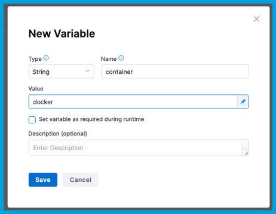

# Why Am I Getting “Kaniko container runtime error” While Pushing Images To Docker Registry?

## Module
Harness CI 

## Environment 
- Infrastructure - Kubernetes 
- OS: Linux

## Issue 
While building and pushing an image to the docker registry, one can encounter the following error:


## Resolution 
The resolution is to add an environment stage variable named “container” with a value “docker”.
Follow these simple steps to do add a stage variable:

- Navigate to `Variable` on the left side of the pipeline studio.You can refer to the below screenshot for the reference.


- Go to the stage where the `Build and Push an Image to Docker Registry` step is added.
- Go to `stage variable` -> `Add variable`.
- Write variable name as `container` and type will be string and then select `Save`.
- Give the value of the variable as `docker`.

- Click on `Apply Changes`.

## Diagnostic Step

``` 
1 info 01/11/2022 13:06:02 + /kaniko/executor --dockerfile=Dockerfile --context=dir://. --destination=**************/pythonsample:latest --snapshotMode=redo --digest-file=/kaniko/digest-file
2 info 01/11/2022 13:06:02 kaniko should only be run inside of a container, run with the --force flag if you are sure you want to continue 
3 info 01/11/2022 13:06:02 exit status 1
```


