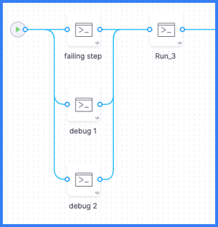

If you need to debug failures that aren't captured in the standard [Build logs](https://developer.harness.io/docs/continuous-integration/use-ci/viewing-builds/#build-details), you can add two Run steps to your pipeline that run in parallel with the failing step. The Run steps contain commands that monitor the activity of the failing step and generate logs that can help you debug the failing step.

In your pipeline's YAML, add the two debug monitoring steps, as shown in the following example, alongside the failing step, and group the three steps in parallel. Make sure the `timeout` is long enough to cover the time it takes for the failing step to fail; otherwise the debug steps will timeout before capturing the full logs for the failing step.

```yaml
              - parallel:
                  - step:
                      type: Run
                      name: failing step
                      ...
                  - step:
                      type: Run
                      name: Debug monitor 1
                      identifier: debug_monitor_1
                      spec:
                        connectorRef: YOUR_DOCKER_CONNECTOR ## Specify your Docker connector's ID.
                        image: alpine ## Specify an image relevant to your build.
                        shell: Sh
                        command: top -d 10
                      timeout: 10m ## Allow enough time to cover the failing step.
                  - step:
                      type: Run
                      name: Debug monitor 2
                      identifier: debug_monitor_2
                      spec:
                        connectorRef: YOUR_DOCKER_CONNECTOR ## Specify your Docker connector's ID.
                        image: alpine ## Specify an image relevant to your build.
                        shell: Sh
                        command: |-
                          i=0
                          while [ $i -lt 10 ]
                          do
                              df -h
                              du -sh *
                              sleep 10
                              i=`expr $i + 1`
                          done
                      timeout: 10m ## Allow enough time to cover the failing step.
              - step: ## Other steps are outside the parallel group.
                  type: Run
                  name: Run 3
                  ...
```

After adding the debug monitoring steps, run your pipeline, and then check the debug steps' [Build logs](https://developer.harness.io/docs/continuous-integration/use-ci/viewing-builds/#build-details).

:::tip Parallel steps

Your parallel group (under the `-parallel` flag) should include only the two debug monitoring steps and the failing step.

You can arrange steps in parallel in the Visual editor by dragging and dropping steps to rearrange them.

<!--  -->

<DocImage path={require('../static/parallel-debug-steps.png')} />

:::
