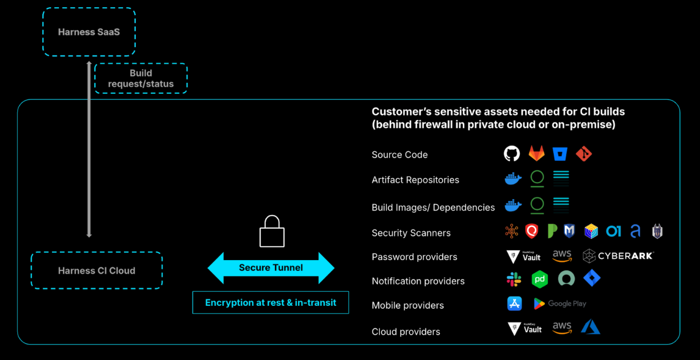

## **Security**

### Can I trust Harness CI Cloud with my intellectual property (source code, artifacts, and so on)? 

Yes. Harness CI Cloud **doesn't** retain your data after running a build. ([link to docs](https://developer.harness.io/docs/continuous-integration/secure-ci/secure-connect/))

### Can Harness CI Cloud securely connect to my complex and private firewalled infrastructure? 

Yes. You can use [Secure Connect](https://developer.harness.io/docs/continuous-integration/secure-ci/secure-connect/) for Harness CI Cloud to connect to your private assets through a secure tunnel.

* Extension of your existing private infrastructure  
* Dedicated infrastructure  
* Encryption at rest and in transit  
* Passwords are stored using OIDC  
* No customer assets stored in Harness

<!--   <DocImage path={require('static/harness-cloud-faqs-1-secure-connect.png')} width="60%" height="60%" title="Click to view full size image" />
-->

### Can I prove that Harness CI Cloud is secure so I can get it approved quickly by the required stakeholders (security team, DevOps platform team, infrastructure teams, and so on)? 

Yes. Harness CI Cloud has been penetration tested by external experts, and it is [ISO and SOC2](https://trust.harness.io/) certified. If you're already using Harness CI Cloud, additional approval isn't needed to enable Secure Connect to connect to your firewalled assets.

### What is SLSA and why do I need it?

**SLSA** (Supply-chain Levels for Software Artifacts) is a security framework designed to ensure the integrity of software supply chains. It provides a set of standards and practices that organizations can adopt to mitigate the risks associated with software development and deployment, particularly those related to the integrity and security of software artifacts.

Companies can benefit from SLSA in the following ways:

**Supply Chain Security**:

* **Preventing Tampering**: SLSA helps in preventing unauthorized changes to software artifacts at various stages of the supply chain.  
* **Reducing Risks of Compromise**: By following SLSA guidelines, companies can reduce the risk of supply chain attacks, where malicious actors might try to inject vulnerabilities or backdoors into software during its development or distribution.

**Compliance and Assurance**:

* **Regulatory Compliance**: Many industries are subject to regulations that require stringent security measures. Adopting SLSA can help companies meet these regulatory requirements.  
* **Customer Assurance**: Demonstrating adherence to SLSA can increase customer trust by showing a commitment to high security standards and best practices.

**Incident Response and Forensics**:

* **Traceability**: SLSA helps in maintaining detailed records of software changes and their origins, which is crucial for incident response and forensic investigations in the event of a security breach.

### How is SLSA v1.0 different from SLSA v0.1?

SLSA v1.0 builds on the foundation laid by SLSA v0.1, offering a more comprehensive, detailed, and practical framework for securing the software supply chain. The transition from v0.1 to v1.0 represents a move from conceptual ideas to actionable standards, making it easier for organizations to implement and benefit from SLSA's security measures.

**SLSA v0.1**

* **Initial Draft**: SLSA v0.1 is an early draft version that introduces the basic concepts and structure of the SLSA framework.  
* **Basic Definitions**: It outlines the fundamental principles and goals of securing the software supply chain but may lack detailed guidelines and specific requirements.  
* **Conceptual Foundation**: Focuses on establishing the conceptual foundation and the need for supply chain security, providing a preliminary structure for different levels of compliance.  
* **Limited Details**: Contains limited implementation details and examples, serving more as an introductory guide rather than a comprehensive standard.

**SLSA v1.0**

* **Mature Framework**: SLSA v1.0 represents a more mature and refined version of the framework, incorporating feedback and improvements based on the initial draft and real-world experiences.  
* **Detailed Guidelines**: Provides more detailed and concrete guidelines for each level of compliance, making it easier for organizations to implement and achieve different SLSA levels.  
* **Clear Requirements**: Offers clear and specific requirements for each level, ensuring that organizations understand what is needed to achieve and maintain compliance.  
* **Implementation Examples**: Includes practical examples and best practices to help organizations apply the standards in real-world scenarios.  
* **Enhanced Security Measures**: Refines and enhances security measures, providing more comprehensive protections against supply chain threats.  
* **Provenance and Integrity**: Emphasizes the importance of provenance (tracking the origins and changes of software artifacts) and integrity, with more explicit requirements and mechanisms for ensuring these aspects.

**Key Enhancements in SLSA v1.0**

1. **Provenance Requirements**:  
   * **v0.1**: Introduces the concept of provenance but with limited detail.  
   * **v1.0**: Provides detailed requirements for generating, recording, and verifying provenance information.  
2. **Build Integrity**:  
   * **v0.1**: Suggests the need for secure builds without extensive detail.  
   * **v1.0**: Specifies detailed requirements for build environments, including isolation, reproducibility, and security controls.  
3. **Security Controls**:  
   * **v0.1**: Highlights the importance of security controls but in a more generalized manner.  
   * **v1.0**: Lists specific security controls and practices required at each compliance level.  
4. **Compliance Levels**:  
   * **v0.1**: Introduces the concept of multiple compliance levels but with less specificity.  
   * **v1.0**: Clearly defines the criteria and requirements for each compliance level, providing a more structured path for organizations to follow.

### How does Harness help my organization achieve the highest level of SLSA?

SLSA (Supply-chain Levels for Software Artifacts) v1.0 Level 3 (L3) represents a comprehensive set of practices and requirements aimed at ensuring a high level of security and integrity for software supply chains. SLSA defines different levels of compliance, with each higher level providing stronger guarantees. Level 3, in particular, focuses on tamper resistance, non-falsifiable provenance, and build integrity.

The Harness CI Cloud environment is designed to isolate build processes, preventing any potential influence between runs. The hosted containerized step in Harness CI restricts build steps to access the provenance key information in compliance with SLSA specifications. ([link to blog post](https://www.harness.io/blog/an-in-depth-look-at-achieving-slsa-level-3-compliance-with-harness))  

## **Developer productivity**

### Will moving to Harness Cloud affect my development team’s productivity?

No. Moving to Harness Cloud will improve developer productivity.

Harness’ engineering team moved from Jenkins (self-managed) to Harness Cloud. We measured developer happiness after the move and we found that the developer happiness grew by 50%. Also, with self-managed infrastructure, the 4 developers were dedicated to maintaining the infrastructure. After the move to Harness Cloud, these 4 developers focused on the core product rather than maintaining infrastructure.

Another example is of a US-based bank where we showed that we could save \~2M developer hours per year if they moved from Jenkins/self-managed to Harness Cloud.

## **Cost benefits**

### What kind of cost/speed benefits have Harness Cloud customers seen after moving to Harness Cloud?

**GitHub**  
RisingWave’s build time was reduced by half after moving from GitHub runners \-\> Harness Cloud ([link to case study](https://www.harness.io/case-studies/risingwave-slashes-build-times-by-50-switching-from-github-actions-to-harness-ci)). They did not use any other optimizations (Test Intelligence, Cache Intelligence, etc.)

A global employment solutions company improved their build times by 3x after moving from GitHub-based runners to Harness Cloud.

**Jenkins**  
Qrvey accelerated their builds by 8x and reduced their build times from 90 minutes to 12 minutes. They also freed by a couple of developer’s time that was spent on maintaining self-managed infrastructure before moving to Harness. ([link to case study](https://www.harness.io/case-studies/qrvey-saves-hours-on-build-time-leading-to-happy-engineers))

## **Overview**

### Do you have a list of all the features in Harness Cloud?

