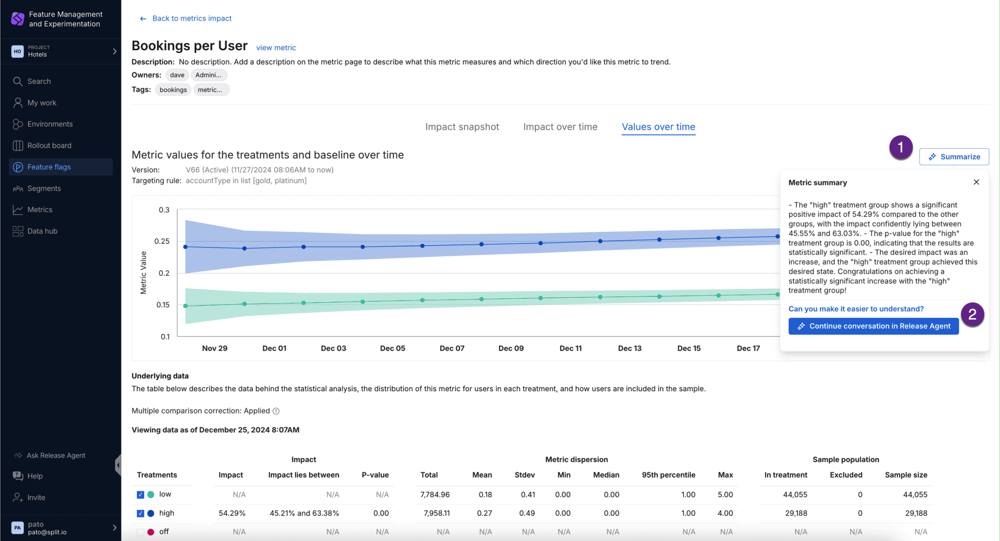
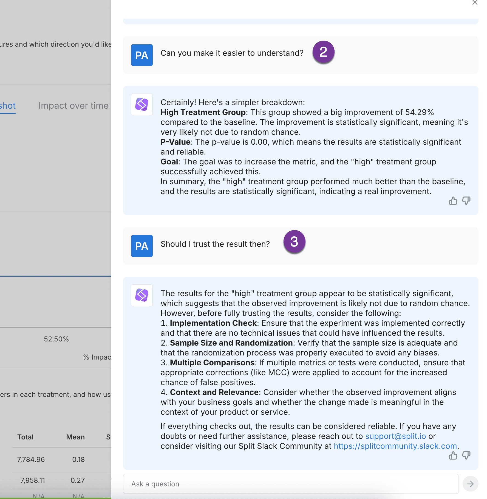

import Link from "@docusaurus/Link";

  <button style={{borderRadius:'8px', border:'1px', fontFamily:'Courier New', fontWeight:'800', textAlign:'left'}}> help.split.io link: https://help.split.io/hc/en-us/articles/21188803158157-Switch-AI-assistant </button>

## Overview

  <strong>Release Agent</strong> is an in-app AI chatbot designed to streamline the
  use of Harness FME. It offers multilingual support, rapid responses, and
  knowledge-based assistance by utilizing our public documentation and blogs. Release Agent
  makes it easy for all developers to get the help they need, without ever leaving
  the Harness interface. This documentation provides technical details and guidelines
  for developers to work with Release Agent effectively.

## Getting Started

  If Release Agent is available to your team, you will find the Release Agent icon in the
  bottom left.

import ButtonImage from './static/release-agent-button.png';

  

  When you click **Release Agent** the chat will open on the right side of the screen.
  You can click on one of the suggested questions to get started or type in your
  own question.

import SidePanel from './static/release-agent-popup.png';

  

### Example questions

<ul>
  <li>How do I set up a JavaScript SDK in my codebase?</li>
  <li>How do I create and manage feature flags in FME?</li>
  <li>How can I integrate FME with my application using the SDK?</li>
  <li>What are the best practices for naming feature flags and events?</li>
  <li>How do I set up an A/B test in Harness FME?</li>
  <li>Can you explain how FME's targeting rules work?</li>
  <li>How can I use segments to target specific groups of users?</li>
  <li>What data types can I track using FME events for measurement?</li>
  <li>How do I interpret the metrics on my experiments' results?</li>
  <li>How do I export data from FME for further analysis?</li>
  <li>What are the implications of feature flag rollout strategies, such as canary
    releases?</li>
  <li>How do I troubleshoot issues with the FME SDK?</li>
  <li>Can I use FME across multiple environments, and how?</li>
  <li>How does Harness FME handle data privacy and security?</li>
  <li>What are best practices for cleaning up old flags and technical debt?</li>
</ul>

## Metric summary

Release Agent can summarize metric results on the Metric details page.

To see the Metric summary and ask follow-up questions:

1. Drill into a metric tile on a Metrics impact dashboard and click **Summarize**.

2. After viewing the summary, type your follow-up question and click **Continue conversation in Release Agent**.

Continue to ask additional follow-up questions if you would like, including suggestions for next steps.

## Accuracy

  Please be aware that Release Agent is an automated system and is currently in Beta.
  It may not always provide 100% accurate information. While we strive to provide
  accurate information, we cannot guarantee the accuracy, completeness, or timeliness
  of the information provided by the chatbot. You can always reach out to [support@split.io](mailto:support@split.io) for additional help

  We have experienced that Release Agent can have hallucinations when asked to return
  a numerical value. When dealing with numbers, the limitations of LLMs can often
  be more pronounced due to the precision and context required with numerical information.

## Upcoming Enhancements

  The introduction of Release Agent is just the beginning, as the forward-looking product
  roadmap of Harness FME reflects a robust integration of AI into its services by introducing
  automated features that simplify and enhance the development process, including:

<ul>
  <li>
    <strong>Immediately Actionable Insights: </strong>Enabling Release Agent to not
    only interpret queries but also perform background tasks like API calls.
    This would allow a user to be alerted on their phone when a release has an
    issue, and ask Release Agent to kill the release immediately, without needing to
    return to a computer.
  </li>
  <li>
    <strong>Easy Tech Debt Collection:</strong> Identifying and resolving obsolete
    code with a quick and simple request to Release Agent.&nbsp;
  </li>
</ul>

## Feedback and Support

  For support inquiries or to report issues with Release Agent, please submit a request
  via [support@split.io](mailto:support@split.io).
  Provide detailed descriptions and reproduction steps for issues to facilitate
  expedited troubleshooting. Your feedback is instrumental for the iterative enhancement
  of Release Agent.

