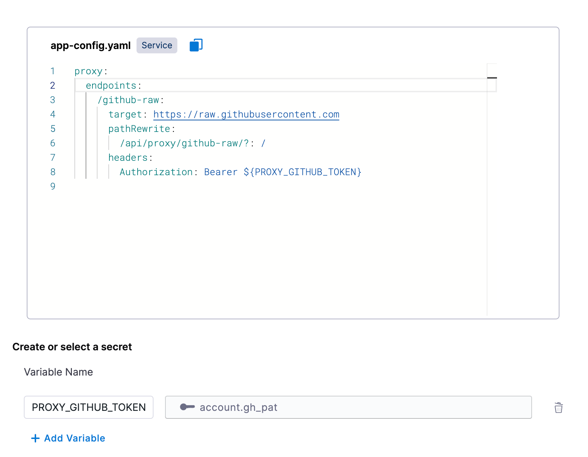

# Overview

Instead of using an API to retrieve JSON data with a backend proxy, we can store JSON files in GitHub and use an HTTP call to get the raw file back as pure JSON.

## Setup

First enable the `Configure Backend Proxies` [plugin](https://developer.harness.io/docs/internal-developer-portal/plugins/overview) in your IDP instance.

Once enabled, go to the plugins page and select the `Configure Backend Proxies` plugin to view its configuration.

The following is a proxy definition to resolve raw files from GitHub:

```
proxy:
  endpoints:
    /github-raw:
      target: https://raw.githubusercontent.com
      pathRewrite:
        /api/proxy/github-raw/?: /
      headers:
        Authorization: Bearer ${PROXY_GITHUB_TOKEN}
```

What we are doing here is:

1. Declaring a proxy called `github-raw`
2. Targeting a base URL of `https://raw.githubusercontent.com`
3. Rewriting any request from `/api/proxy/github-raw/` to `https://raw.githubusercontent.com/` and appending anything after `github-raw/` to the `githubusercontent.com/` URL
4. Passing an authentication header using the variable `PROXY_GITHUB_TOKEN`

We will need to create a variable below called `PROXY_GITHUB_TOKEN` and select the Harness account secret that holds the value. This needs to be a GitHub PAT that can resolve files from your target repositories.

After configuring the above your plugin configuration should look like this:



## Usage

Now that we have the proxy defined, we can use it in a workflow definition to retrieve JSON values to be used in a dropdown picker.

Before, you might have had a parameter with the following hard-coded list of options:

```
properties:
  some-property:
    type: string
    title: Some Property
    enum:
      - item1
      - item2
```

Now with our custom backend for GitHub raw files, we can query GitHub to get our JSON and pull out the relevant keys to show as options in our picker:

```
properties:
  some-property:
    type: string
    ui:field: SelectFieldFromApi
    ui:options:
      title: Some Property
      description: An input for users to select
      path: "proxy/github-raw/<org name>/<repo name>/<branch name>/<path to JSON file>"
```

The above is if your JSON is a simple list of values:

```
["item1", "item2"]
```

If you have complex JSON you can follow the usage pattern [described here](https://developer.harness.io/docs/internal-developer-portal/flows/dynamic-picker/#parsing-api-response-using-filters).

## Alternative Configurations

If you don't want to have to pass the organization and project identifier in every workflow, or you want to lock the proxy down to a specific org or repo, we can just add more of the URL to the proxy config, and pass less in the picker path.

### Organization specific

Proxy config:

```
proxy:
  endpoints:
    /github-raw:
      target: https://raw.githubusercontent.com/<org name>/
```

Usage:

```
properties:
  some-property:
    type: string
    ui:field: SelectFieldFromApi
    ui:options:
      title: Some Property
      description: An input for users to select
      path: "proxy/github-raw/<repo name>/<branch name>/<path to JSON file>"
```

### Repository specific

Proxy config:

```
proxy:
  endpoints:
    /github-raw:
      target: https://raw.githubusercontent.com/<org name>/<repo name>/<branch name>
```

Usage:

```
properties:
  some-property:
    type: string
    ui:field: SelectFieldFromApi
    ui:options:
      title: Some Property
      description: An input for users to select
      path: "proxy/github-raw/<path to JSON file>"
```

# Conclusion

With the above backend proxy, you can store raw JSON in GitHub and reference it across your IDP workflows. This is especially useful if you have common sets of inputs you need to use across many workflows and want to have a single source of truth.
