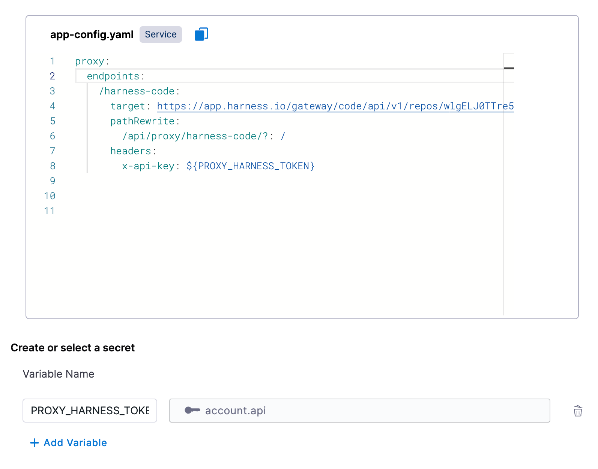

# Overview

Instead of using an API to retrieve JSON data with a backend proxy, we can store JSON files in Harness Code and use an HTTP call to get the raw file back as pure JSON.

## Setup

First enable the `Configure Backend Proxies` [plugin](https://developer.harness.io/docs/internal-developer-portal/plugins/overview) in your IDP instance.

Once enabled, go to the plugins page and select the `Configure Backend Proxies` plugin to view its configuration.

The following is a proxy definition to resolve raw files from GitHub:

```
proxy:
  endpoints:
    /harness-code:
      target: https://app.harness.io/gateway/code/api/v1/repos/<your harness account id>/
      pathRewrite: 
        /api/proxy/harness-code/?: /
      headers:
        x-api-key: ${PROXY_HARNESS_TOKEN}
```

What we are doing here is:

1. Declaring a proxy called `harness-code`
2. Targeting a base URL of `https://app.harness.io/gateway/code/api/v1/repos/<your harness account id>/`
3. Rewriting any request from `/api/proxy/harness-code/` to `app.harness.io/gateway/code/api/v1/repos/<your harness account id>/` and appending anything after `harness-code/` to the `app.harness.io/` URL
4. Passing an authentication header using the variable `PROXY_HARNESS_TOKEN`

We will need to create a variable below called `PROXY_HARNESS_TOKEN` and select the Harness account secret that holds the value. This needs to be a Harness API key with read access to Code repos, preferably from a service account, that can resolve files from your target repositories.

After configuring the above your plugin configuration should look like this:



## Usage

Now that we have the proxy defined, we can use it in a workflow definition to retrieve JSON values to be used in a dropdown picker.

Before, you might have had a parameter with the following hard-coded list of options:

```
properties:
  some-property:
    type: string
    title: Some Property
    enum:
      - item1
      - item2
```

Now with our custom backend for Harness Code raw files, we can query GitHub to get our JSON and pull out the relevant keys to show as options in our picker:

```
properties:
  some-property:
    type: string
    ui:field: SelectFieldFromApi
    ui:options:
      title: Some Property
      description: An input for users to select
      path: "proxy/harness-code/<harness org id>/<harness project id>/<repo name>/+/raw/<path to json>"
```

The above is if your JSON is a simple list of values:

```
["item1", "item2"]
```

If you have complex JSON you can follow the usage pattern [described here](https://developer.harness.io/docs/internal-developer-portal/flows/dynamic-picker/#parsing-api-response-using-filters).

## Alternative Configurations

If you don't want to have to pass the organization and project identifier in every workflow, or you want to lock the proxy down to a specific org, project, or repo, we can just add more of the URL to the proxy config, and pass less in the picker path.

### Organization specific

Proxy config:

```
proxy:
  endpoints:
    /harness-code:
      target: https://app.harness.io/gateway/code/api/v1/repos/<your harness account id>/<harness org id>/
```

Usage:

```
properties:
  some-property:
    type: string
    ui:field: SelectFieldFromApi
    ui:options:
      title: Some Property
      description: An input for users to select
      path: "proxy/harness-code/<harness project id>/<repo name>/+/raw/<path to json>"
```

### Project specific

Proxy config:

```
proxy:
  endpoints:
    /harness-code:
      target: https://app.harness.io/gateway/code/api/v1/repos/<your harness account id>/<harness org id>/<harness project id>/
```

Usage:

```
properties:
  some-property:
    type: string
    ui:field: SelectFieldFromApi
    ui:options:
      title: Some Property
      description: An input for users to select
      path: "proxy/harness-code/<repo name>/+/raw/<path to json>"
```

### Repository specific

Proxy config:

```
proxy:
  endpoints:
    /harness-code:
      target: https://app.harness.io/gateway/code/api/v1/repos/<your harness account id>/<harness org id>/<harness project id>/<repo name>/+/raw/
```

Usage:

```
properties:
  some-property:
    type: string
    ui:field: SelectFieldFromApi
    ui:options:
      title: Some Property
      description: An input for users to select
      path: "proxy/harness-code/<path to json>"
```

# Conclusion

With the above backend proxy, you can store raw JSON in Code and reference it across your IDP workflows. This is especially useful if you have common sets of inputs you need to use across many workflows and want to have a single source of truth.
