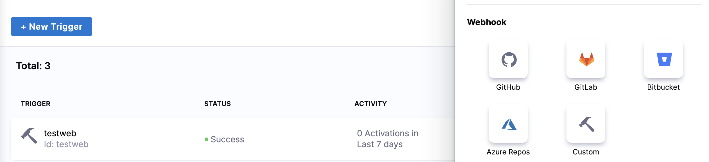
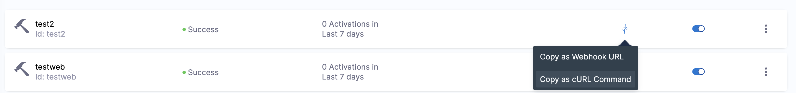

# API to run a pipeline with runtime inputs

This knowledge base article walks you through how you can run a pipeline with runtime inputs through API.

## Steps

1. In the pipeline trigger, create the custom webhook.


2. Copy the curl command from the webhook


3. Now in the curl command, you can pass the variable name and value in place of sample key and value at runtime while executing the pipeline.
   

Example cURL:

```
curl -X POST -H 'content-type: application/json' --url 'https://app.harness.io/gateway/pipeline/' -d '{"samplekey": "samplevalue"}'
```  