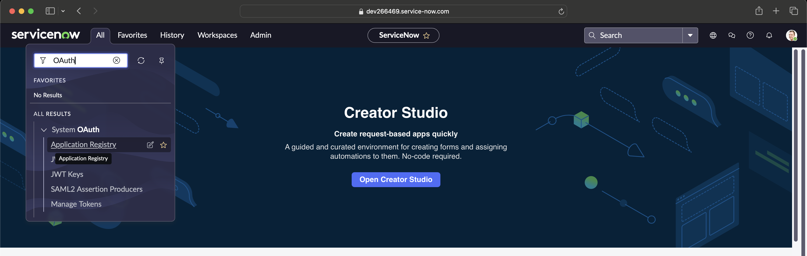
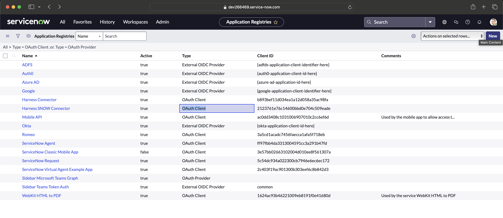
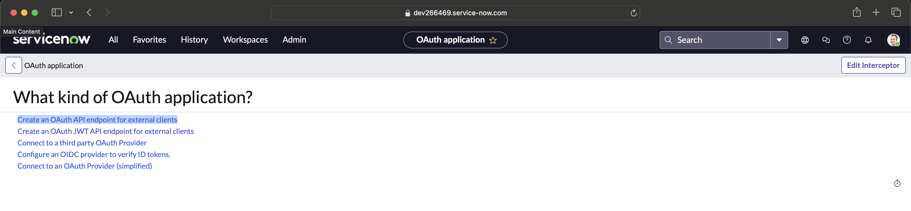
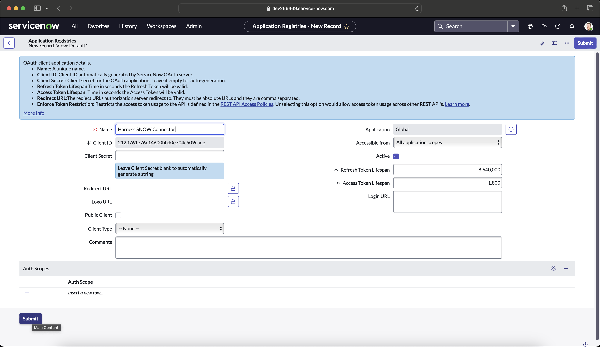
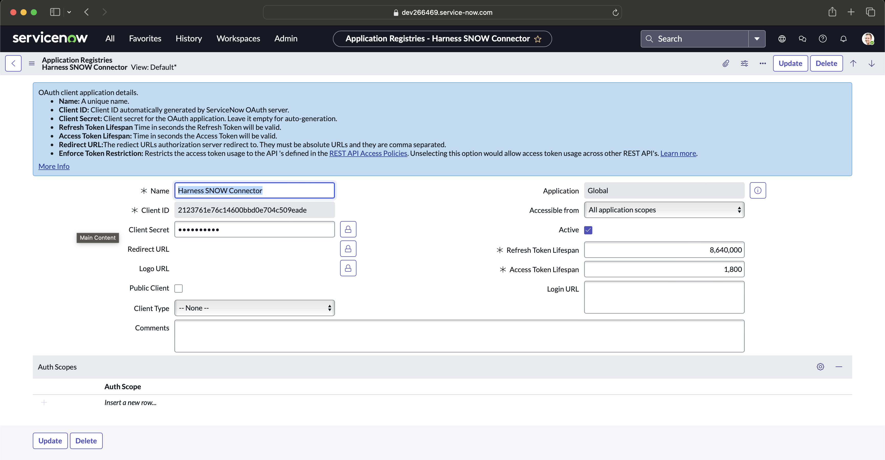
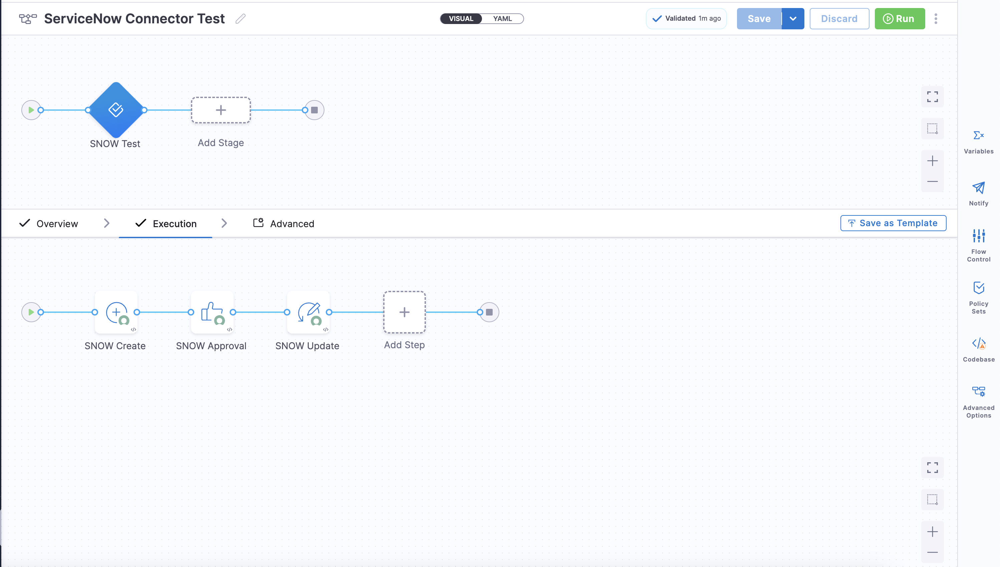

# ServiceNow Connector - OIDC Refresh Token

You can connect Harness to ServiceNow using a Harness ServiceNow connector. This connector enables you to approve and reject pipeline steps directly within Harness.

## Supported Authentication Methods
Harness supports the following authentication methods:

1. **Username and Password**
2. **ADFS Client Credentials with Certificate**
3. **OIDC Refresh Token**

> **Note**: Harness recommends avoiding the "Username and Password" authentication method for production-grade setups.

This document is intended to be used alongside the Harness DeveloperHub article on [Connecting to ServiceNow](https://developer.harness.io/docs/platform/connectors/ticketing-systems/connect-to-service-now/).

## Document Scope
The scope of this document is to provide the necessary configuration steps within the ServiceNow instance to set up a Harness ServiceNow Connector.

## ServiceNow Instance OAuth Configuration

1. **Log in to your ServiceNow instance**. For important notes, refer to the [Harness DeveloperHub Important Notes](https://developer.harness.io/docs/platform/connectors/ticketing-systems/connect-to-service-now/#important-notes).

2. In the left-hand **Application Navigator**, search for **"OAuth"** under **All** and go to **Application Registry**.



3. Click **New** and select **Create an OAuth API endpoint for external clients**. Assign a meaningful name and click **Submit**.  
   > For more details about the other fields, refer to the [ServiceNow Connector Documentation](https://docs.servicenow.com/bundle/xanadu-platform-security/page/administer/security/task/t_CreateEndpointforExternalClients.html).







4. Once configured, you’ll receive a **Client ID**, **Client Secret**, **Username**, and **Password**. With these credentials, you can generate the **Refresh Token** and **Access Token**. **Refresh Token** is needed for the ServiceNow (SNOW) Connector in Harness.



### Generate the Refresh Token and Access Token

Use the following `curl` command to obtain the tokens:

```bash
curl --location --request POST 'https://<instance-host>.service-now.com/oauth_token.do' \
--header 'Accept: application/json' \
--header 'Content-Type: application/x-www-form-urlencoded' \
--data-urlencode 'grant_type=password' \
--data-urlencode 'client_id=b893bef11d034ea1a12d058a35ac98fa' \
--data-urlencode 'client_secret=********' \
--data-urlencode 'username=admin' \
--data-urlencode 'password=********'
```

### OAuth Token Response Example

After executing the token generation `curl` command, the response will look like this:

```json
{
  "access_token": "KHFeW3Y-IabRcWGdSPKWop98o_EiFjgnvLtehQl1ULTfsqZ1xerrd-6GpUbf8GSJ0ss****o0StERjAdba3TbYrJaw",
  "refresh_token": "lX18oGvfH5aph7YaiOBkKFvgQyCD5j7VFdh-kA4JpjPgk4MLcB0HdgN1-j-BoprYNuSw****LQEf0W5YIFxzQ",
  "scope": "",
  "token_type": "Bearer",
  "expires_in": 1799
}
```

## Creating the ServiceNow Connector in Harness

Now that you have all the required credentials:
1. **Client ID**
2. **Client Secret**
3. **Refresh Token**
4. **Token URL** (formed based on the example in the Harness DeveloperHub article)

You can proceed to create a **ServiceNow Connector** in Harness and test the connection. This step will require a Harness Delegate.

## Testing the ServiceNow Connector with a Simple Pipeline

To verify the connector configuration, create a simple pipeline in Harness. 



Below is an example YAML file for testing the connector:

```yaml
pipeline:
  name: ServiceNow Connector Test
  identifier: ServiceNow_Connector_Test
  projectIdentifier: InfiniteBlue
  orgIdentifier: default
  tags: {}
  stages:
    - stage:
        name: SNOW Test
        identifier: SNOW_Test
        description: ""
        type: Approval
        spec:
          execution:
            steps:
              - step:
                  name: SNOW Create
                  identifier: SNOW_Create
                  type: ServiceNowCreate
                  timeout: 5m
                  spec:
                    connectorRef: SNOW_Connector
                    ticketType: incident
                    fields:
                      - name: description
                        value: Testing Harness ServiceNow Connector
                      - name: short_description
                        value: Testing Harness ServiceNow Connector
                    createType: Normal
              - step:
                  name: SNOW Approval
                  identifier: SNOW_Approval
                  type: ServiceNowApproval
                  timeout: 1d
                  spec:
                    approvalCriteria:
                      type: KeyValues
                      spec:
                        matchAnyCondition: true
                        conditions:
                          - key: state
                            operator: equals
                            value: Resolved
                    rejectionCriteria:
                      type: KeyValues
                      spec:
                        matchAnyCondition: true
                        conditions: []
                    connectorRef: SNOW_Connector
                    ticketNumber: <+pipeline.stages.SNOW_Test.spec.execution.steps.SNOW.ticket.ticketNumber>
                    retryInterval: 1m
                    ticketType: incident
              - step:
                  name: SNOW Update
                  identifier: SNOW_Update
                  type: ServiceNowUpdate
                  timeout: 5m
                  spec:
                    useServiceNowTemplate: false
                    connectorRef: SNOW_Connector
                    ticketType: incident
                    ticketNumber: <+pipeline.stages.SNOW_Test.spec.execution.steps.SNOW.ticket.ticketNumber>
                    fields:
                      - name: state
                        value: "7"
        tags: {}
```
This example pipeline performs the following actions:

1. **Creates a new ServiceNow ticket**: The pipeline creates an incident ticket in ServiceNow with specified fields, such as description and short description.

2. **Approves the ticket**: An approval step waits for the ticket to reach the desired state, such as "Resolved". If the conditions are met, the approval is granted; otherwise, it can be set to reject.

3. **Updates the ticket status**: Once approved, the pipeline updates the ticket status or any other specified fields to indicate completion or further action as needed.

These steps confirm that the ServiceNow Connector is properly configured and functional within Harness.

