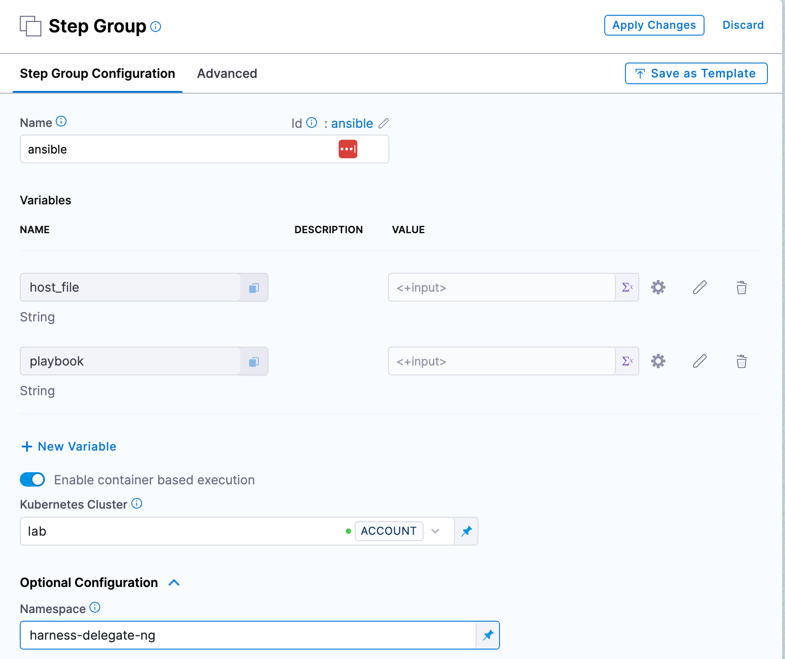
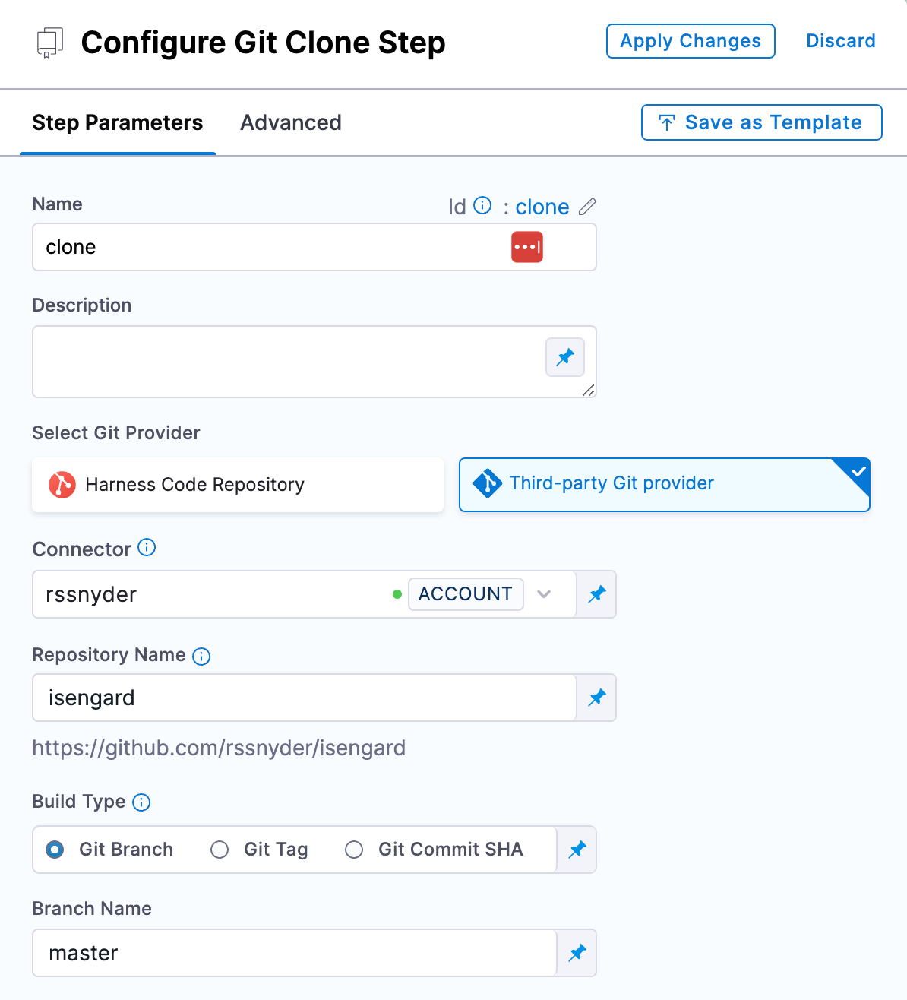
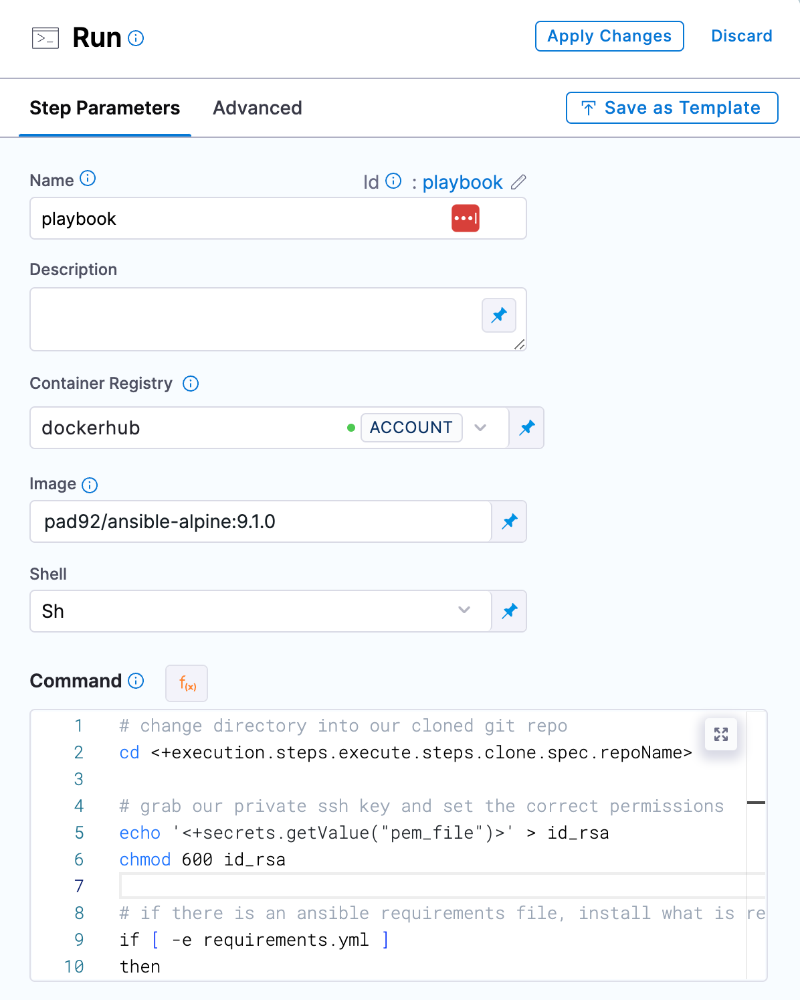
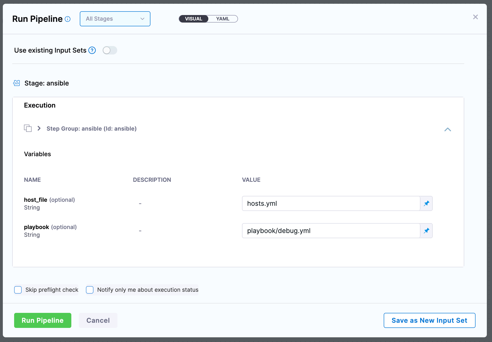

# Overview

To run ansible in a Harness pipeline, we can leverage containerized step groups to clone the repo with our Ansible playbooks, and a run step to execute the playbooks based on your operating model.

[An example of a step group template following the below guide is located here.](https://github.com/harness-community/solutions-architecture/tree/main/kb/reference-architectures/ansible)

# Prerequisites

The following guide will assume you have the following in your Harness account:

1. Git connector
2. Docker connector
3. Kubernetes connector
4. SSH private key as a Harness file secret

## Step Group

Create a new Harness pipeline. For the stage type we will use "Custom", but you can leverage this same pattern in CI, CD, or IaC stages.

Click "Add Step" and select "Add Step Group". Give the step group a name and toggle the setting for "Enable container based execution".

Select your Kubernetes connector where you want the pipeline to run, and expand the optional configuration step to specify a specific namespace for the ansible container to run in.

We need to create a few variables for the inputs to our ansible execution. Click "+ New Variable" and create two variables, one for `hosts_file` and one for `playbook`. Set both to be runtime inputs.



Click "Apply Changes" in the top right to create the step group.

### Clone Codebase

Within the step group you created, select "Add Step" and add a new "Git Clone" step.

Select your git provider, and fill in the repository details based on the location of your ansible playbooks.



Click "Apply Changes" in the top right to save your repo settings.

### Run Ansible

Hover your mouse to the right of the clone step within your step group, select the blue + icon and select "Add Step" and add a new "Run" step.

Select your docker connector, and specify an image that has the ansble version you wish to use. For this example I will be using `pad92/ansible-alpine:9.1.0` but you can use any docker image that has ansible included.

In the "command" section we will write the execution of our playbook. An example of doing so is included below:

```
# change directory into our cloned git repo
cd <+execution.steps.ansible.steps.clone.spec.repoName>

# grab our private ssh key and set the correct permissions
echo '<+secrets.getValue("pem_file")>' > id_rsa
chmod 600 id_rsa

# if there is an ansible requirements file, install what is required
if [ -e requirements.yml ]
then
    ansible-galaxy install -r requirements.yml
else
    echo "no requirements.yml found"
fi

# execute the playbook
ansible-playbook --private-key=id_rsa -i <+execution.steps.ansible.variables.host_file> <+execution.steps.ansible.variables.playbook>
```

Please note that the JEXL included assume the step group has an identifier of `ansible` and the clone step of `clone`, you may need to adjust the JEXL based on how you nameed those resources. It also assumes your SSH secret file id is `pem_file`.



Click "Apply Changes" in the top right to save your run settings.

### Run

Now when you save your pipeline and execute it, you will be prompted for your hosts and playbook file.



## Expanding

Based on how you run ansible, you can manipulate the step group variables to include more inputs, or add more to the command step to account for extra steps in your ansible workflow.

### Vault passwords

If you need to have a vault password locally for your playbooks to run, you can include it the same way you include your private SSH key. Simply add the following to your run step:

```
echo '<+secrets.getValue("vault_password")>' > .vault_password
```

And then in your command step, account for the vault file:

```
ansible-playbook --vault-password=.vault_password --private-key=id_rsa -i <+execution.steps.ansible.variables.host_file> playbooks/<+execution.steps.ansible.variables.playbook>
```

### Extra vars

Sometimes you may have variables you need to include at runtime for your plays. You can easily create a new step group variable for this, and add the variable to your ansible command:

```
ansible-playbook --private-key=id_rsa -i <+execution.steps.ansible.variables.host_file> -e '<+execution.steps.ansible.variables.extra_vars>' <+execution.steps.ansible.variables.playbook>
```

#### Required vars

If you have ansible variables you want set on every run, but want to have them as pipeline inputs, you can again create a step group variable for this, and add them into your ansible command:

```
ansible-playbook --private-key=id_rsa -i <+execution.steps.ansible.variables.host_file> -e 'my_req_var=<+execution.steps.ansible.variables.my_req_var> <+execution.steps.ansible.variables.extra_vars>' <+execution.steps.ansible.variables.playbook>
```

The above example add a variable `my_req_var` to the extra vars flag, while also passing in any additonal variables specified via pipeline input.

## Deployment Template

How to turn the above into a custom deployment template, coming soon.
