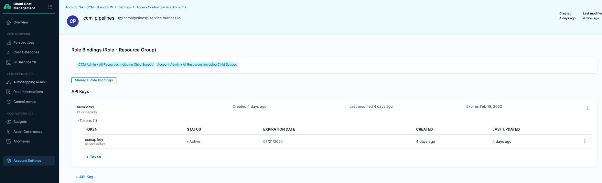
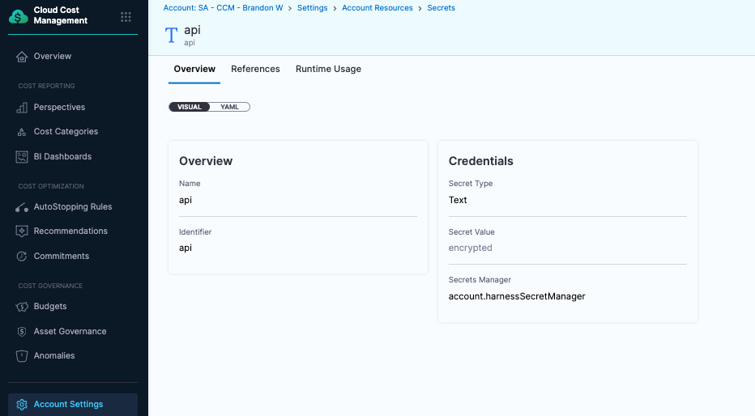

# Overview

We can use a Harness pipeline to automatically add schedule based rules to all EC2 instance in an account based on a tag.  We use Asset Governance to find the instances and send the data to the pipeline.  If there already is an autostopping rule on to the EC2 instance, a new one won't be added.

## Setup

This guide assumes you have CCM set up correctly for asset governance and autostopping for at least one cloud account and a delegate available to execute pipeline steps.  Any EC2 instance we want to add an rule for, must have the key:value of `Schedule:usWorkHours`

## Secret Setup

We need an api key to do certain platform and CCM actions in the pipeline.  Create a service account with CCM Admin and Account Admin permissions for all resources.  Generate an api key.  In this case, we named the secret `api`.  Remember the name given, it will be used in future steps.

  

  

## Pipeline Setup

Create a pipeline in some Harness project. 

### Setup the Stage / Step Group 

1. Create a new Stage
2. Add a Step Group that contains three steps.  All three steps are `Run` steps.  They will be configured to use a Python image to execute Python scripts.  For all three steps, there is a common setup that needs to happen.  All three will use the  built in Harness Connector Adapter, image=`rssnyder/py3requests`, and Shell=`Python`.
  
  Step Container Setup:

  
  
  The three steps are:

  1. 'Find Existing Autostopping Rule'
      * Configure an output variable `RULE_ID`.  Will be used in next step.
      * Environment Variables:

      ```
      INSTANCE_ID (Runtime input).  Passed into the step from webhook. = <+-input>
      HARNESS_ACCOUNT_ID (Expression). Built in Harness variable = <+account.identifier>
      HARNESS_ENDPOINT (Fixed value) = Either app.harness.io OR app3.harness.io.  Get this from the front portion of your Harness URL
      HARNESS_PLATFORM_API_KEY (Expression).  The secret we build in the previous step. = <+secrets.getValue("account.api")>
      ```

      

  2. 'Find AWS CCM Connector for Account'
      * Configure a conditional execution only if 'Find Existing Autostopping Rule' doesn't find a rule:
      `<+execution.steps.Create_AutoStopping_Rules.steps.Find_Existing_AutoStopping_Rule.output.outputVariables.RULE_ID> == ""` 
      * Configure an output variable `CONNECTOR_ID`.  Will be used in next step.
      * Environment Variables:

      ```
      ACCOUNT_ID (Runtime input).  Passed into the step from webhook. = <+-input>
      HARNESS_ACCOUNT_ID (Expression). Built in Harness variable = <+account.identifier>
      HARNESS_ENDPOINT (Fixed value) = Either app.harness.io OR app3.harness.io.  Get this from the front portion of your Harness URL
      HARNESS_PLATFORM_API_KEY (Expression).  The secret we build in the previous step. = <+secrets.getValue("account.api")>
      ```

      

  3. 'Create AutoStopping Rule'      
      * Configure a conditional execution only if 'Find Existing Autostopping Rule' doesn't find a rule:
      `<+execution.steps.Create_AutoStopping_Rules.steps.Find_Existing_AutoStopping_Rule.output.outputVariables.RULE_ID> == ""`
      
      * Environment Variables:

      ```
      HARNESS_ACCOUNT_ID (Expression). Built in Harness variable = <+account.identifier>
      HARNESS_ENDPOINT (Fixed value) = Either app.harness.io OR app3.harness.io.  Get this from the front portion of your Harness URL
      HARNESS_PLATFORM_API_KEY (Expression).  The secret we build in the previous step. = <+secrets.getValue("account.api")>
      INSTANCE_ID (Runtime input).  Passed into the step from webhook. = <+-input>
      REGION (Runtime input).  Passed into the step from webhook. = <+-input>
      IDLE_TIME (Fixed value).  Minimum value of 5 minutes.  Once scheduled downtime happens, this is the amount of time Harness waits to shut down the instance
      SCHEDULE_DAYS (Fixed value).  Comma delimiated.  Sunday = 0, Saturday = 6
      SCHEUDLE_START_H (Fixed value).  0-23.  
      SCHEDULE_START_M (Fixed value).  0-59.
      SCHEDULE_END_H (Fixed value).  0-23.
      SCHEDULE_END_M (Fixed value).  0-59.
      SCHEDULE_TIMEZONE (Fixed value).  Example America/Chicago for central U.S. time
      ```

      

      Conditional Execution Setup:

      
    


The final pipeline setup should looke like this:


### Add Python code for each step

1. Python code for Find Existing Autostopping Rule:

```
from os import getenv, environ

from requests import post, get

PARAMS = {
    "routingId": getenv("HARNESS_ACCOUNT_ID"),
    "accountIdentifier": getenv("HARNESS_ACCOUNT_ID"),
}

HEADERS = {"x-api-key": getenv("HARNESS_PLATFORM_API_KEY")}


def get_autostopping_rules(dry_run: bool = False, page: int = 0):
    resp = post(
        f"https://{getenv('HARNESS_URL')}/gateway/lw/api/accounts/{getenv('HARNESS_ACCOUNT_ID')}/autostopping/rules/list",
        params=PARAMS,
        headers=HEADERS,
        json={"page": page, "limit": 1, "dry_run": dry_run},
    )

    resp.raise_for_status()

    data = resp.json()

    results = data.get("response", {}).get("records", [])
    if data.get("response", {}).get("pages") > page + 1:
        results.extend(get_autostopping_rules(dry_run, page + 1))

    return results


def get_existing_rule_id():
    target_instance_id = getenv("INSTANCE_ID")

    if not target_instance_id:
        print("no INSTANCE specified")
        exit(1)

    rules = get_autostopping_rules()

    matches = [
        x
        for x in rules
        if x.get("routing", {}).get("instance", {}).get("filter", {}).get("ids", [])[0]
        == target_instance_id
    ]
    if matches:
        rule_id = matches.pop().get("id")
        print(f"found existing rule for {target_instance_id}: {rule_id}")
        environ["RULE_ID"] = str(rule_id)
    else:
        environ["RULE_ID"] = ""


if __name__ == "__main__":
    get_existing_rule_id()
```

2. Python code for Find AWS Connector for Account:

```
from os import getenv, environ

from requests import post, get

PARAMS = {
    "routingId": getenv("HARNESS_ACCOUNT_ID"),
    "accountIdentifier": getenv("HARNESS_ACCOUNT_ID"),
}

HEADERS = {"x-api-key": getenv("HARNESS_PLATFORM_API_KEY")}


def get_ccm_aws_connectors(page: int = 0):
    local_params = PARAMS.copy()
    local_params.update({"pageIndex": page, "pageSize": 50})

    resp = post(
        f"https://{getenv('HARNESS_URL')}/gateway/ng/api/connectors/listV2",
        params=local_params,
        headers=HEADERS,
        json={"types": ["CEAws"], "filterType": "Connector"},
    )

    resp.raise_for_status()

    data = resp.json()

    results = data.get("data", {}).get("content", [])
    if data.get("data", {}).get("totalPages") > page:
        results.extend(get_ccm_aws_connectors(page + 1))

    return results


def get_connector_for_account():
    account_id = getenv("ACCOUNT_ID")

    connectors = get_ccm_aws_connectors()

    matches = [
        x
        for x in connectors
        if x.get("connector", {}).get("spec", {}).get("awsAccountId") == account_id
    ]
    if matches:
        connector_id = matches.pop().get("connector", {}).get("identifier")
        print(f"found connector for {account_id}: {connector_id}")
        environ["CONNECTOR_ID"] = str(connector_id)
    else:
        environ["CONNECTOR_ID"] = ""


if __name__ == "__main__":
    get_connector_for_account()
```

3. Python code for Create AutoStopping Rule:

```
from os import getenv, environ

from requests import post, get

PARAMS = {
    "routingId": getenv("HARNESS_ACCOUNT_ID"),
    "accountIdentifier": getenv("HARNESS_ACCOUNT_ID"),
}

HEADERS = {"x-api-key": getenv("HARNESS_PLATFORM_API_KEY")}


def create_autostopping_rule(
    instance_id: str,
    region: str,
    connector_id: str,
    idle_time_mins: int,
    dry_run: bool = False,
):
    resp = post(
        f"https://{getenv('HARNESS_ENDPOINT')}/gateway/lw/api/accounts/{getenv('HARNESS_ACCOUNT_ID')}/autostopping/v2/rules",
        params=PARAMS,
        headers=HEADERS,
        json={
            "service": {
                "name": instance_id,
                "account_identifier": "<+account.identifier>",
                "fulfilment": "ondemand",
                "kind": "instance",
                "cloud_account_id": connector_id,
                "idle_time_mins": idle_time_mins,
                "custom_domains": [],
                "health_check": {
                    "protocol": "http",
                    "path": "/",
                    "port": 80,
                    "timeout": 30,
                    "status_code_from": 200,
                    "status_code_to": 299,
                },
                "routing": {
                    "ports": [],
                    "instance": {"filter": {"ids": [instance_id], "regions": [region]}},
                },
                "opts": {
                    "dry_run": dry_run,
                    "preservePrivateIP": False,
                    "deleteCloudResources": False,
                    "alwaysUsePrivateIP": False,
                    "hide_progress_page": False,
                    "preserve_private_ip": False,
                    "always_use_private_ip": False,
                },
                "metadata": {"cloud_provider_details": {"name": connector_id}},
                "disabled": False,
                "match_all_subdomains": False,
                "access_point_id": "",
            },
            "deps": [],
            "apply_now": True,
        },
    )

    resp.raise_for_status()

    data = resp.json()

    return data.get("response", {}).get("id")


def create_autostopping_schedule(
    name: str,
    description: str,
    connector_id: str,
    rule_id: str,
    days: list,
    start_h: int,
    start_m: int,
    end_h: int,
    end_m: int,
    tz: str,
):
    local_params = PARAMS.copy()
    local_params.update({"cloud_account_id": connector_id})

    resp = post(
        f"https://{getenv('HARNESS_ENDPOINT')}/gateway/lw/api/accounts/{getenv('HARNESS_ACCOUNT_ID')}/schedules",
        params=local_params,
        headers=HEADERS,
        json={
            "schedule": {
                "name": name,
                "created_by": "",
                "account_id": getenv("HARNESS_ACCOUNT_ID"),
                "description": description,
                "resources": [{"ID": str(rule_id), "Type": "autostop_rule"}],
                "details": {
                    "uptime": {
                        "days": {
                            "all_day": False,
                            "days": days,
                            "start_time": {"hour": start_h, "min": start_m},
                            "end_time": {"hour": end_h, "min": end_m},
                        }
                    },
                    "timezone": tz,
                },
            },
        },
    )

    resp.raise_for_status()

    data = resp.json()

    return data


def create():
    rule_id = create_autostopping_rule(
        getenv("INSTANCE_ID"),
        getenv("REGION"),
        getenv("CONNECTOR_ID"),
        int(getenv("IDLE_TIME", 130)),
    )

    if rule_id:
        print(f"created rule {rule_id} for", getenv("INSTANCE_ID"))
        environ["RULE_ID"] = str(rule_id)
    else:
        environ["RULE_ID"] = ""
        exit(1)

    try:
        days_raw = getenv("SCHEDULE_DAYS", "1,2,3,4,5").split(",")
        days = [int(x) for x in days_raw]
    except ValueError:
        print(f"non integer day supplied: {days_raw}")
        exit(1)

    try:
        start_h = int(getenv("SCHEDULE_START_H"))
        start_m = int(getenv("SCHEDULE_START_M"))
        end_h = int(getenv("SCHEDULE_END_H"))
        end_m = int(getenv("SCHEDULE_END_M"))
    except ValueError:
        print("non integer time supplied for start or end h/m")
        exit(1)

    schedule_id = create_autostopping_schedule(
        getenv("INSTANCE_ID"),
        "created via governance+pipeline automation",
        getenv("CONNECTOR_ID"),
        rule_id,
        days,
        start_h,
        start_m,
        end_h,
        end_m,
        getenv("SCHEDULE_TIMEZONE"),
    )

    print(schedule_id)


if __name__ == "__main__":
    create()
```

## Create Pipeline Webhook

Next click on "Triggers" in the top right and select "+ New Trigger" and select the 'Custom' Webhook type. Give the trigger a name and click continue. Skip the conditions section by clicking continue. Create the trigger based on this yaml:

```
trigger:
  name: Asset Governance
  identifier: Asset_Governance
  enabled: true
  description: ""
  tags: {}
  stagesToExecute: []
  orgIdentifier: default
  projectIdentifier: default_project
  pipelineIdentifier: ec2_instance_governance_as
  source:
    type: Webhook
    spec:
      type: Custom
      spec:
        payloadConditions: []
        headerConditions: []
  inputYaml: |
    pipeline:
      identifier: ec2_instance_governance_as
      stages:
        - stage:
            identifier: AutoCreate
            type: Custom
            spec:
              execution:
                steps:
                  - stepGroup:
                      identifier: Create_AutoStopping_Rules
                      steps:
                        - step:
                            identifier: Find_Existing_AutoStopping_Rule
                            type: Run
                            spec:
                              envVariables:
                                INSTANCE_ID: <+trigger.payload.instance_id>
                        - step:
                            identifier: Find_AWS_CCM_Connector_for_Account
                            type: Run
                            spec:
                              envVariables:
                                ACCOUNT_ID: <+trigger.payload.account_id>
                        - step:
                            identifier: Create_AutoStopping_Rule
                            type: Run
                            spec:
                              envVariables:
                                REGION: <+trigger.payload.region>

```

Click "Create Trigger". On the triggers screen, select the "WEBHOOK" icon and copy the webhook URL.  Store this URL somewhere, it will be used later.


## Rule Setup

Navigate to CCM and select the "Asset Governance" feature. Select "Rules" in the top right and press "+ New Rule".

We want to send EC2 instance where they contain tag key  `Schedule` to a pipeline webhook:

```
  policies:
  - name: ec2-instances-to-autostop
    resource: ec2
    filters:
        - "tag:Schedule": 'usWorkHours'
    actions:
        - type: webhook
          url: "<add webhook from previous set here>"
          batch: true
          body: |-
            {
              "instance_id": resource.InstanceId,
              "account_id": account_id,
              "region": region
            }
```

In this example, we are:
  1. Calling our pipeline trigger
  2. Setting the body that includes all the data we need to autostop

Replace the url with the webhook url we copied earlier

If you instead want to call the webhook once for every resource found, simply set `batch` to `false`.

## Execute

Now when we run an enforcement on the asset governance rule (not in dry-run mode) and when a resource is found, asset governance will call our pipeline custom trigger and pass the metadata. Navigate to "Execution History" on the top right.  Click on one of the executions and ensure the pipeline completed successfully. 


From here you can expand your pipeline to do any number of actions based on the information received. 

## Exceptions / Things to Consider

1. If a rule was created using a tag and the tag was later removed, the rule will still exist.
2. Selecting 'allregions' option in the enforcement isn't support.
3. This example is only for U.S. work hours.  If you wanted to make another schedule you should:
    * Clone the pipeline
    * Update the schedule environment variables in the 'Create AutoStopping Rule' step
    * Clone the governance rule
    * Update the webhook in the rule for the new pipeline
    * Update the filter in the rule to be the new schedule tag value