# Overview

The process below defines a system where we can use the Harness modules Code Repository and Infrastructure as Code together to accomplish creating CCM cloud connectors at scale.  For this exercise, we'll focus on AWS CCM Cloud Connectors, but other cloud providers could follow this same process.

To accomplish this, we will store our Terraform code in Code Repository.  We'll then use this repo in the IaCM module to apply the connectors.

Users of this guide should have an understanding of the Harness modules Code Repository, IaCM, and CCM.

## Setup

In the pipeline portion of this guide we will need a Kubernetes cluster a delegate running in the cluster that has permissions to deploy a pod.  Please don't proceed until there is confirmation this is configured.

###  Create A Project

The project will use the Code Repository and IaCM modules.

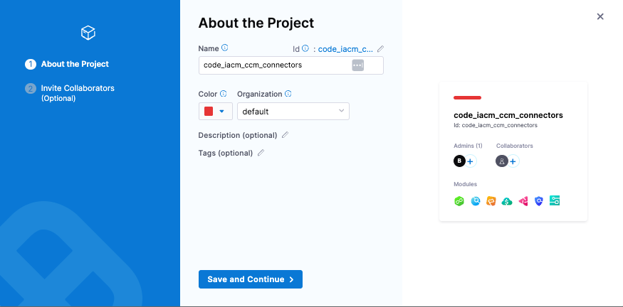

###  Create A New Code Repository and Add IaC Code For Connectors

This will be used to store and maintain our IaC.

1. Go into your new project and create a new Code repository. This will hold the code for our CCM connectors.

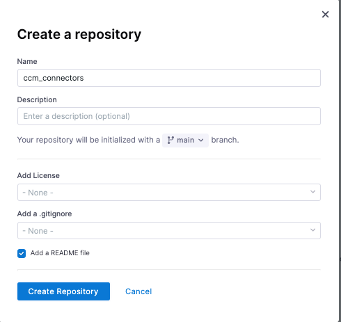

2. Create a main.tf file that contains Terraform code.  We'll use two parts of this: [Part 1](https://developer.harness.io/kb/cloud-cost-management/articles/best-practices/aws-connectors-and-roles#setup-providers) is for the providers portion and [Part 2](https://developer.harness.io/kb/cloud-cost-management/articles/best-practices/aws-connectors-and-roles#use-the-built-in-locals-value-to-define-the-accounts-statically) for defining accounts statically.

Note: For the role_arn, you'll have to replace the role name `HarnessCERole` with whatever role name you used when you provisioned it into each AWS account for Harness to use. It has to have the appropriate permissions done correctly for each CCM feature you want to use.  Setting up this roles is outside the scope of this exercise, but possibilities are located [here](https://developer.harness.io/kb/cloud-cost-management/articles/best-practices/aws-connectors-and-roles#create-roles-in-each-aws-account).

```
terraform {
  required_providers {
    aws = {
      source  = "hashicorp/aws"
      version = "~> 5.0"
    }
    harness = {
      source = "harness/harness"
    }
  }
}

provider "aws" {
  region = "us-east-1"
}

provider "harness" {}

data "harness_platform_current_account" "current" {}

locals {
  aws-non-prod = ["000000000005", "000000000006"]
  aws-prod = ["000000000007", "000000000008"]
}

resource "harness_platform_connector_awscc" "data" {
  for_each = toset(concat(local.aws-non-prod, local.aws-prod))

  identifier = "aws${each.key}"
  name       = "aws${each.key}"

  account_id = trimspace(each.key)

  features_enabled = [
    "OPTIMIZATION",
    "VISIBILITY",
    "GOVERNANCE",
  ]
  cross_account_access {
    role_arn    = "arn:aws:iam::${each.key}:role/HarnessCERole"
    external_id = "harness:891928451355:${data.harness_platform_current_account.current.id}"
  }
}
```

###  Create A New IaCM Workspace

We'll use this to store our IaC configuration, variables, states, and other resources necessary to manage our AWS CCM cloud connectors

1. Navigate to the IaCM module and create a new workspace.  
    - Provisioner:
        - Connector (a few options): 
            - If you have a AWS connector for your master billing account already (not a CCM AWS connector), choose this for your connector.  
            - If you need to create a new connector, the suggestion is to [use OIDC](https://developer.harness.io/docs/platform/connectors/cloud-providers/ref-cloud-providers/aws-connector-settings-reference/#credentials). You'll have to provision a role in your master billing AWS account that trusts Harness. In setup, you can skip setting up the backoff strategy and select connect through Harness platform for the connectivity mode.  You have to select a connector to complete setup.  Even though we aren't going to use this connector in our example (because we are getting the account ids statically in the Terraform code), we still have to specify the connector.
        - Workspace Type:
            - Choose the latest version of OpenTofu as our support for Terraform ends with 1.5.7 [due to licensing changes](https://developer.harness.io/docs/infra-as-code-management/whats-supported/#supported-iac-frameworks).
    - Repository:
        - Choose Harness Code Repository and select the repository we created in the first step.  Select main as the branch and the folder path should be blank as we created the main.tf in the root directory.

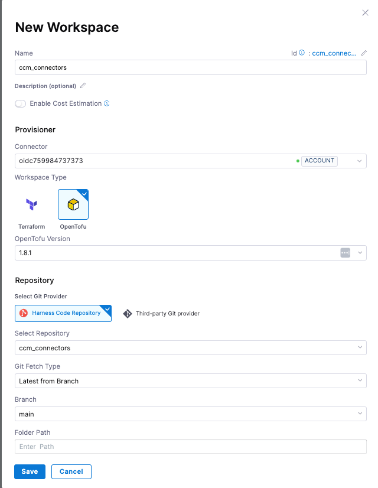

#### Define Variables

The AWS authentication is handled via the OIDC connector defined above, but Harness authentication still needs to be configured.  To define the Harness authentication, we need to define two environment variables: Harness account id and Harness platform API key.  

For the Harness platform API Key, you'll need to:

1. Create a service account
2. Give the service account account admin for all account level resources. This is overpermissive.  If you want, you can also create a custom role that only has connector admin.
3. Create an API key, then a token. Copy the token value
4. Create a a new secret with the token

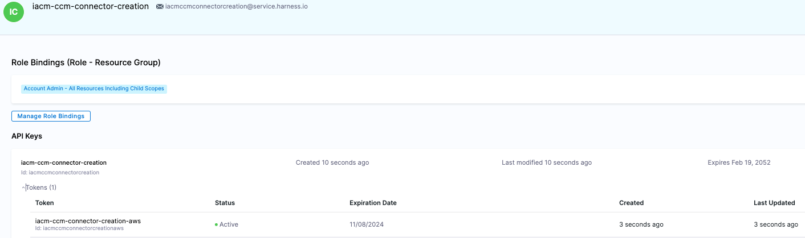

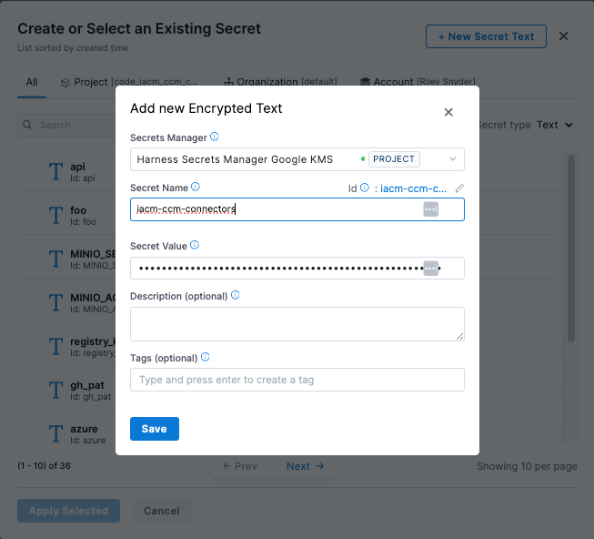

      ```
      HARNESS_ACCOUNT_ID (string). Built in Harness variable = <+account.identifier>
      HARNESS_PLATFORM_API_KEY (secret) = New secret created from the steps above
      ```

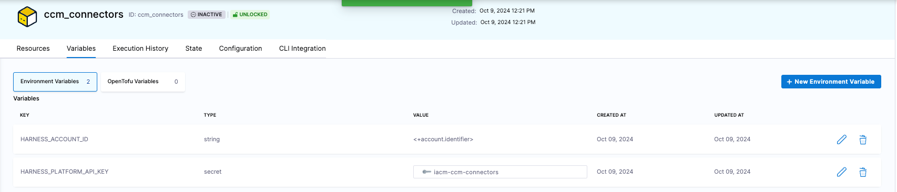

###  Create A Terraform Pipeline

Create a new pipeline. The pipeline will be used to run our init, plan, and apply Terraform stages.

1. Add a new stage. Select `Infrastructure` as the stage type and name the stage `ccm_connectors`
    - Select the infrastructure as Kubernetes, select the Kubernetes cluster you identified earlier on at the beginning of the setup portion of this guide, and choose your namespace


2. Select the workspace we created in the step above
3. For execution, choose the 'Blank Canvas' operation
4. Add a step, select 'IACM OpenTofu Plugin'.  Set the command to `init` and leave everything else the same
5. Add another step, select 'IACM OpenTofu Plugin'.  Set the command to `plan` and leave everything else the same
6. Add another step, select 'IACM Approval'.  Leave everything else the same
7. Add a final step, select 'IACM OpenTofu Plugin'.  Set the command to `apply` and leave everything else the same
8. Save the stage

Things to consider:

1. By running this pipeline in your cluster, you are going to be pulling images into your cluster. If your company doesn't allow this, you'll either have to:
    - Get a security exception to be able to pull from Docker Hub 
    or 
    - Mirror the Harness image into your local repository, edit the step yamls of each step to update the step specs.  You'll have to define the image and connector.  If you don't have it already, you'll have to create a Docker connector for your company repo and specify

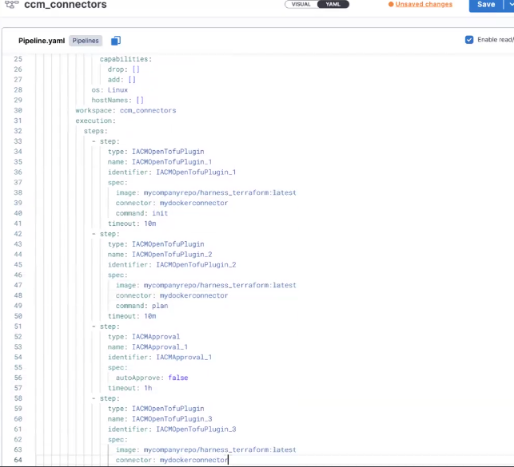

2.  You'll need firewall exceptions for the steps as well.  Each step must download OpenTofu at runtime. This was a conscious decision because you might have hundreds of workspaces using various OpenTofu versions, and managing all those versions would be a significant task.

## Run The Pipeline

In the previous steps, we spent time going over setting up the OIDC connector to be able to read from the master billing account. This is necessary when you [want to provision a connector for each account in the organization dynamically](https://developer.harness.io/kb/cloud-cost-management/articles/best-practices/aws-connectors-and-roles#use-the-aws-provider-to-get-all-accounts-in-the-organization).  In our example we don't actually need this because if you remember our IaC code, we are defining the account ids in code statically.

1. Run the pipeline.  The code will run up until the approval step

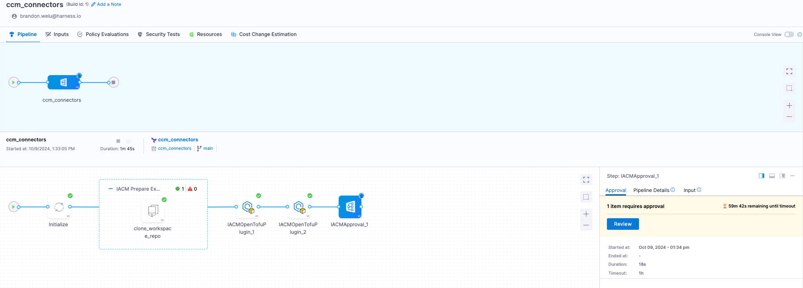

2.  Review and approve the pipeline.  In this example, I've been assigned Project Admin for all resources so I can approve the pipeline.  If you want to add RBAC for who can approve your pipeline, either give them Project Admin or use the fine-grain `Approve` permission in the Infrastructure as Code section and create a custom role.

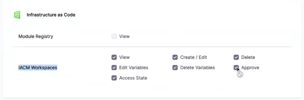

3. After the pipeline is complete, navigate to connectors in account setting and verify the connectors created.  In the screenshot below, the status is failed only because the IAM role I'm expecting isn't in the accounts yet.

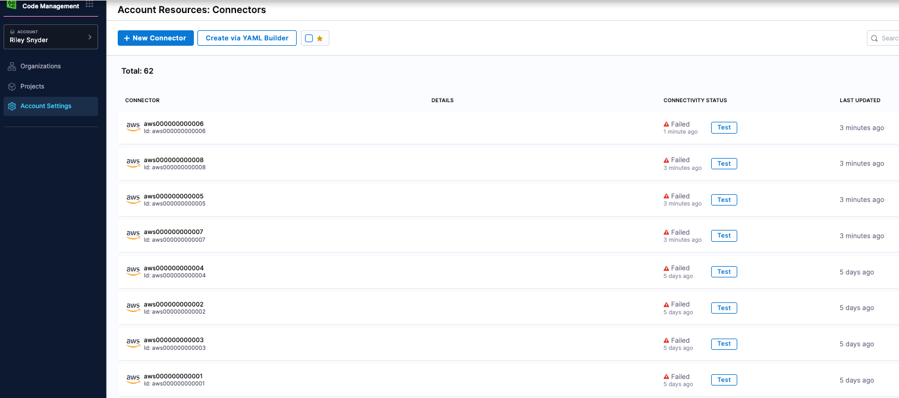

## Schedule Pipeline Runs

You can add a Cron trigger to run the pipeline on a frequency.  This is useful for when new AWS accounts get added, we can automatically run the pipeline and pick create new connectors for them.

1. Select your pipeline, select 'Triggers' on the top right of the screen, and create a new trigger.
2. Scroll to the bottom of the trigger options and select 'Cron'
3. Run it daily (or whatever you prefer)

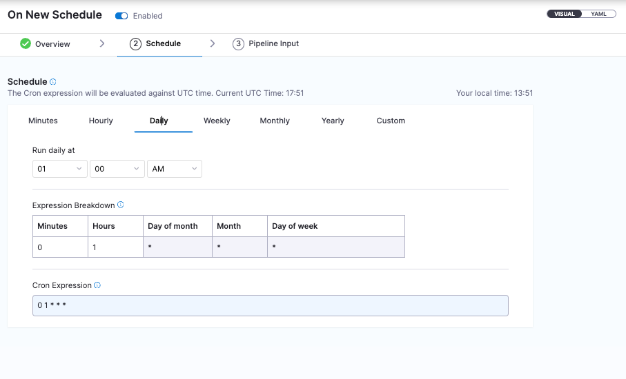
