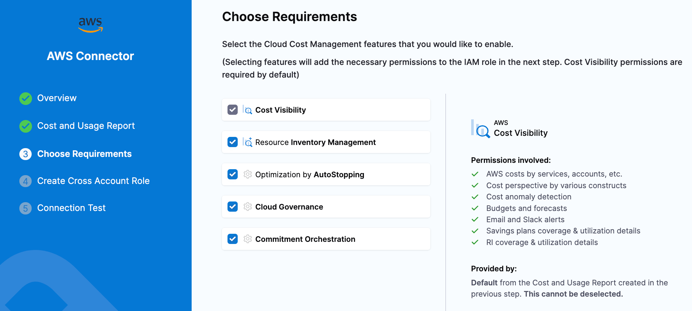

# CCM AWS Permissions

When creating a Harness IAM Role in AWS for CCM, there are many different permissions sets based on the features you are trying to leverage in specific accounts. This guide is meant to cover all the different features of CCM and the permissions you need to assign to enable them.

To enable specific features on a connector you need to set a specific string in the `featuresEnabled` field (list) in the connector YAML. The keys for each feature are listed in the sections below.



## Testing Permissions

:::info When to enable

All accounts

:::

No matter the feature you are using, when testing connector health in the UI Harness attempts to check it's own access using `iam:SimulatePrincipalPolicy`.

```json
{
    "Statement": [
        {
            "Action": "iam:SimulatePrincipalPolicy",
            "Effect": "Allow",
            "Resource": "arn:aws:iam::{AWS_ACCOUNT_ID}:role/{ROLE_NAME}",
            "Sid": "test"
        }
    ],
    "Version": "2012-10-17"
}
```

## Cost Ingestion

:::info featuresEnabled

BILLING

:::

:::info When to enable

Master/Payer or any account which has a CUR you need to ingest

:::

To ingest cost from AWS, Harness leverages a Cost and Usage Report (CUR) that is generated by AWS (CUR 2.0 not supported). These reports are delivered to an S3 bucket in your payer account. When assigning permissions, we will need access to both read the bucket where the CUR reports are being delivered and write to a Harness owned bucket so that we can receive the data and load it into your Harness account.

We also include some permissions for Organizations so we can collect things like account names, account tags and access to see the definition of the CUR to make sure it matches Harness standards.

Finally we ask for `ce:GetRightsizingRecommendation` to collect Compute Optimizer recommendations at the organization level, to be shown in Harness Recommendations.

```json
{
    "Statement": [
        {
            "Action": [
                "s3:ListBucket",
                "s3:GetObject",
                "s3:GetBucketLocation"
            ],
            "Effect": "Allow",
            "Resource": [
                "arn:aws:s3:::{YOUR_CUR_BUCKET_NAME}/*",
                "arn:aws:s3:::{YOUR_CUR_BUCKET_NAME}"
            ],
            "Sid": "readBillingBucket"
        },
        {
            "Action": [
                "s3:PutObjectAcl",
                "s3:PutObject",
                "s3:ListBucket"
            ],
            "Effect": "Allow",
            "Resource": [
                "arn:aws:s3:::{HARNESS_S3_BUCKET}*/*",
                "arn:aws:s3:::{HARNESS_S3_BUCKET}*"
            ],
            "Sid": "writeHarnessBucket"
        },
        {
            "Action": [
                "organizations:List*",
                "organizations:Describe*",
                "cur:DescribeReportDefinitions",
                "ce:GetRightsizingRecommendation"
            ],
            "Effect": "Allow",
            "Resource": "*",
            "Sid": "readOrg"
        }
    ],
    "Version": "2012-10-17"
}
```

In the above policy `{YOUR_CUR_BUCKET_NAME}` needs to be replaced with your S3 bucket where CUR reports are being delivered.

`{HARNESS_S3_BUCKET}` is the Harness S3 bucket where your CUR will be copied to. This bucket changes based on your Harness account, but most customers will use `ce-customer-billing-data-prod`.

## Events/Inventory

:::info featuresEnabled

VISIBILITY

:::

:::info When to enable

Accounts where infrastructure is provisioned, usually every account except for the master/payer

:::

To let Harness collect inventory data (used in dashboards) you need to give read permissions to EC2, RDS, ECS and CloudWatch as well as collect Compute Optimizer recommendations for EC2.

The ECS permissions are also used to generate recommendations to best-fit your task sizing for cost savings.

```json
{
    "Statement": [
        {
            "Action": [
                "rds:DescribeDBSnapshots",
                "rds:DescribeDBSnapshotAttributes",
                "rds:DescribeDBInstances",
                "rds:DescribeDBClusters",
                "ecs:ListTasks",
                "ecs:ListServices",
                "ecs:ListContainerInstances",
                "ecs:ListClusters*",
                "ecs:DescribeTasks",
                "ecs:DescribeServices",
                "ecs:DescribeContainerInstances",
                "ecs:DescribeClusters",
                "ec2:DescribeVolumes",
                "ec2:DescribeSnapshots",
                "ec2:DescribeRegions",
                "ec2:DescribeInstances*",
                "cloudwatch:GetMetricData",
                "ce:GetRightsizingRecommendation"
            ],
            "Effect": "Allow",
            "Resource": "*",
            "Sid": "inventory"
        }
    ],
    "Version": "2012-10-17"
}
```

## Asset Governance

:::info featuresEnabled

GOVERNANCE

:::

:::info When to enable

Accounts where infrastructure is provisioned, usually every account except for the master/payer

:::

When enabling asset governance, it is best practice to start with a read-only policy so you can run rules in dry-run, receive out-of-the-box recommendations, and begin to create your own custom governance recommendations.

We suggest you use the AWS-provided `ViewOnlyAccess` policy which will allow Harness to access AWS resources in a read-only manner.

`arn:aws:iam::aws:policy/job-function/ViewOnlyAccess`

Once you are ready to perform actions using governance, you can create a custom policy to allow only the actions you want to take via governance, or use built-in policies to provide whatever access you are comfortable with.

For example if you are going to begin auto-deleting snapshots using governance, you might assign `ec2:DeleteSnapshot` or `arn:aws:iam::aws:policy/AmazonEC2FullAccess`.

## Commitment Orchestrator

:::info featuresEnabled

COMMITMENT_ORCHESTRATOR

:::

:::info When to enable

Master/Payer accounts

:::

To start getting your commitment coverage information you can provide read-only access in your payer account.

```json
{
    "Statement": [
        {
            "Action": [
                "ec2:DescribeReservedInstancesOfferings",
                "ce:GetSavingsPlansUtilization",
                "ce:GetReservationUtilization",
                "ec2:DescribeInstanceTypeOfferings",
                "ce:GetDimensionValues",
                "ce:GetSavingsPlansUtilizationDetails",
                "ec2:DescribeReservedInstances",
                "ce:GetReservationCoverage",
                "ce:GetSavingsPlansCoverage",
                "savingsplans:DescribeSavingsPlans",
                "organizations:DescribeOrganization",
                "ce:GetCostAndUsage",
                "rds:DescribeReservedDBInstancesOfferings",
                "pricing:GetProducts"
            ],
            "Effect": "Allow",
            "Resource": "*",
            "Sid": "viewcoverage"
        }
    ],
    "Version": "2012-10-17"
}
```

Once you set up the orchestrator and are ready to approve recommendations, you can give access to make purchases.

```json
{
    "Statement": [
        {
            "Action": [
                "ec2:PurchaseReservedInstancesOffering",
                "ec2:GetReservedInstancesExchangeQuote",
                "ec2:AcceptReservedInstancesExchangeQuote",
                "ec2:DescribeReservedInstancesModifications",
                "ec2:ModifyReservedInstances",
                "savingsplans:DescribeSavingsPlansOfferings",
                "savingsplans:CreateSavingsPlan",
                "rds:PurchaseReservedDBInstancesOffering"
            ],
            "Effect": "Allow",
            "Resource": "*",
            "Sid": "purchase"
        }
    ],
    "Version": "2012-10-17"
}
```

## Autostopping

:::info featuresEnabled

OPTIMIZATION

:::

:::info When to enable

Accounts where infrastructure is provisioned, usually every account except for the master/payer

:::

Autostopping has many ways to optimize resource usage and reduce costs. Across the different compute and routing SKUs there are many possible permissions needed. Based on your compute and application architecture you can use the following information to build a least-privileged policy.

### EC2 with Fixed Schedules

| Policy                | Usage                                                                                                                                        |
|-----------------------|----------------------------------------------------------------------------------------------------------------------------------------------|
| ec2:DescribeInstances | List VMS in Harness UI for rule creation and in rule details page. This will be used in other operations while starting and stopping the VM. |
| ec2:CreateTags        | Create tags on the EC2 while creating an Autostopping rule.                                                                                  |
| ec2:StartInstances    | Start EC2                                                                                                                                    |
| ec2:StopInstances     | Stop EC2                                                                                                                                     |

### Spot EC2 with Fixed schedules

| Policy                                                                          | Usage                                                        |
|---------------------------------------------------------------------------------|--------------------------------------------------------------|
| ec2:DescribeVolumes ec2:CreateImage ec2:DescribeImages                          | Creating Snapshot for Spot VM                                |
| ec2:TerminateInstances                                                          | Spot VMs are terminate during cool down instead of stopping. |
| ec2:DeregisterImage ec2:DeleteSnapshot                                          | Delete snapshot after deleting Autostopping rule             |
| ec2:RequestSpotInstances ec2:DescribeSpotInstanceRequests ec2:DescribeAddresses | Create spot VM during warm up                                |
| ec2:RunInstances                                                                | Create on demand instance in case spot VM creation fails     |

### EC2 with ALB

Also requires actions listed under `EC2 with Fixed Schedules`

| Policy                                              | Usage                                                                                                                                                                                       |
|-----------------------------------------------------|---------------------------------------------------------------------------------------------------------------------------------------------------------------------------------------------|
| acm:ListCertificates                                | Describe certificates in create ALB flow                                                                                                                                                    |
| ec2:DescribeVpcs                                    | List VPCs in create ALB flow                                                                                                                                                                |
| ec2:DescribeSecurityGroups                          | List security groups in create ALB flow                                                                                                                                                     |
| elasticloadbalancing:DescribeLoadBalancers          | Describe load balancers in create ALB flow                                                                                                                                                  |
| iam:ListRoles                                       | Lambda requires a role to execute and push the logs to cloud watch. We have a separate role for that. iam:ListRoles is used in code to list roles and identify the role created for lambda. |
| ec2:DescribeSubnets                                 | List subnets for the selected VPC while creating ALB.                                                                                                                                       |
| elasticloadbalancing:CreateLoadBalancer             | Create ALB. Needed only if customer wants to create ALB from Harness                                                                                                                        |
| elasticloadbalancing:SetSecurityGroups              | Attach security groups to ALB. Needed only if customer wants to create ALB from Harness.                                                                                                    |
| elasticloadbalancing:DescribeTargetGroups           | Describe target group. This is used to get details of lambda target group and EC2 target group                                                                                              |
| elasticloadbalancing:CreateTargetGroup              | Create lambda target group and health check target group                                                                                                                                    |
| elasticloadbalancing:AddTags                        | Add tags to Harness created target groups                                                                                                                                                   |
| lambda:GetFunction                                  | Get lambda function details                                                                                                                                                                 |
| lambda:CreateFunction                               | Create lambda function                                                                                                                                                                      |
| iam:PassRole                                        | We specify the lambda role when we try to create lambda. Create lambda with role in request will succeed only if this permission is present                                                 |
| lambda:AddPermission                                | This is needed to allow the lambda Target Group to execute the lambda.                                                                                                                      |
| elasticloadbalancing:RegisterTargets                | Required to add lambda to target group                                                                                                                                                      |

### ASG with Fixed schedules

| Policy                                | Usage                                                                   |
|---------------------------------------|-------------------------------------------------------------------------|
| autoscaling:DescribeAutoScalingGroups | List ASG                                                                |
| autoscaling:UpdateAutoScalingGroup    | Set the desired capacity of ASG during warm up and cool down operations |
| ec2:DescribeSpotPriceHistory          | Get the spot price for savings computation                              |

### ASG with ALB

This is a combination of permissions for `ASG with Fixed schedules` and `EC2 with ALB` policies.

### RDS

| Policy                  | Usage                         |
|-------------------------|-------------------------------|
| rds:DescribeDBInstances | List RDS instances            |
| rds:DescribeDBClusters  | List RDS clusters             |
| rds:ListTagsForResource | List tags associated with RDS |
| rds:StartDBInstance     | Start RDS Instance            |
| rds:StartDBCluster      | Start RDS Cluster             |
| rds:StopDBInstance      | Stop RDS Instance             |
| rds:StopDBCluster       | Stop RDS Cluster              |

### ECS with Fixed schedules

| Policy                     | Usage                                                            |
|----------------------------|------------------------------------------------------------------|
| ecs:ListClusters           | List ECS clusters                                                |
| tag:GetResources           | List tags for selecting ECS service by tag                       |
| ecs:ListServices           | List ECS services                                                |
| ecs:ListTasks              | List tasks for ECS service                                       |
| ecs:DescribeServices       | Describe ECS services                                            |
| ecs:UpdateService          | Needed set the desired task count while warming and cooling down |
| ecs:DescribeTaskDefinition | Describe ECS Task                                                |
| ecs:DescribeTasks          | Describe ECS Tasks                                               |

### ECS with ALB

This is a combination of permissions for `ECS with Fixed schedules` and `EC2 with ALB` policies.

### Provisioning Autostopping Proxy

| Policy                            | Usage                                                                                               |
|-----------------------------------|-----------------------------------------------------------------------------------------------------|
| ec2:DescribeInstanceTypeOfferings | List machine types available for Proxy                                                              |
| ec2:DescribeKeyPairs              | List key pairs for Proxy                                                                            |
| ec2:RunInstances                  | Create Proxy VM                                                                                     |
| secretsmanager:GetSecretValue     | Permission to read TLS certificate and secret. Needed only if TLS is used.                          |
| ec2:AllocateAddress               | Allocate static IP                                                                                  |
| ec2:DescribeVpcs                  | List VPCs in create proxy flow                                                                      |
| ec2:DescribeSecurityGroups        | List security groups in create proxy flow                                                           |
| ec2:DescribeSubnets               | List subnets for the selected VPC while creating ALB.                                               |
| ec2:TerminateInstances            | Delete the Proxy VM while deleting proxy Scope of this permission can be reduced to only proxy VMs. |
| ec2:DescribeImages                | Describe the image for proxy                                                                        |
| ec2:AssociateAddress              | Associating address with VM                                                                         |
| ec2:DisassociateAddress           | Disassociate address while deleting proxy                                                           |
| ec2:ReleaseAddress                | Release address while deleting proxy                                                                |
| ec2:ModifyInstanceAttribute       | Modify security group of proxy VM if needed                                                         |

### Fine-Grain Policy

The following is an example policy JSON split out based on the statements above:

```json
{
    "Statement": [
        {
            "Action": [
                "ec2:DescribeInstances",
                "ec2:CreateTags",
                "ec2:StartInstances",
                "ec2:StopInstances"
            ],
            "Effect": "Allow",
            "Resource": "*",
            "Sid": "scheduledEC2"
        },
        {
            "Action": [
                "ec2:DescribeVolumes",
                "ec2:CreateImage",
                "ec2:DescribeImages",
                "ec2:TerminateInstances",
                "ec2:DeregisterImage",
                "ec2:DeleteSnapshot",
                "ec2:RequestSpotInstances",
                "ec2:DescribeSpotInstanceRequests",
                "ec2:DescribeAddresses",
                "ec2:RunInstances"
            ],
            "Effect": "Allow",
            "Resource": "*",
            "Sid": "scheduledSpotEC2"
        },
        {
            "Action": [
                "acm:ListCertificates",
                "ec2:DescribeVpcs",
                "ec2:DescribeSecurityGroups",
                "elasticloadbalancing:DescribeLoadBalancers",
                "iam:ListRoles",
                "ec2:DescribeSubnets",
                "elasticloadbalancing:CreateLoadBalancer",
                "elasticloadbalancing:SetSecurityGroups",
                "elasticloadbalancing:DescribeTargetGroups",
                "elasticloadbalancing:CreateTargetGroup",
                "elasticloadbalancing:AddTags",
                "lambda:GetFunction",
                "lambda:CreateFunction",
                "iam:PassRole",
                "lambda:AddPermission",
                "elasticloadbalancing:RegisterTargets"
            ],
            "Effect": "Allow",
            "Resource": "*",
            "Sid": "albEC2"
        },
        {
            "Action": [
                "autoscaling:DescribeAutoScalingGroups",
                "autoscaling:UpdateAutoScalingGroup",
                "ec2:DescribeSpotPriceHistory"
            ],
            "Effect": "Allow",
            "Resource": "*",
            "Sid": "scheduledASG"
        },
        {
            "Action": [
                "rds:DescribeDBInstances",
                "rds:DescribeDBClusters",
                "rds:ListTagsForResource",
                "rds:StartDBInstance",
                "rds:StartDBCluster",
                "rds:StopDBInstance",
                "rds:StopDBCluster"
            ],
            "Effect": "Allow",
            "Resource": "*",
            "Sid": "rds"
        },
        {
            "Action": [
                "ecs:ListClusters",
                "tag:GetResources",
                "ecs:ListServices",
                "ecs:ListTasks",
                "ecs:DescribeServices",
                "ecs:UpdateService",
                "ecs:DescribeTaskDefinition",
                "ecs:DescribeTasks"
            ],
            "Effect": "Allow",
            "Resource": "*",
            "Sid": "scheduledECS"
        },
        {
            "Action": [
                "ec2:DescribeInstanceTypeOfferings",
                "ec2:DescribeKeyPairs",
                "ec2:RunInstances",
                "secretsmanager:GetSecretValue",
                "ec2:AllocateAddress",
                "ec2:DescribeVpcs",
                "ec2:DescribeSecurityGroups",
                "ec2:DescribeSubnets",
                "ec2:TerminateInstances",
                "ec2:DescribeImages",
                "ec2:AssociateAddress",
                "ec2:DisassociateAddress",
                "ec2:ReleaseAddress",
                "ec2:ModifyInstanceAttribute"
            ],
            "Effect": "Allow",
            "Resource": "*",
            "Sid": "proxy"
        }
    ],
    "Version": "2012-10-17"
}
```
