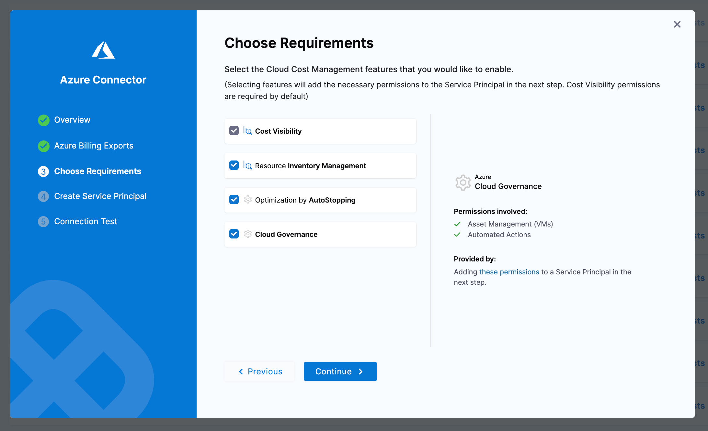

# CCM Azure Permissions

When adding the Harness service principal to your Azure tenant, there are many different permissions sets based on the features you are trying to leverage in specific subscriptions. This guide is meant to cover all the different features of CCM and the permissions you need to assign to enable them.

To enable specific features on a connector you need to set a specific string in the `featuresEnabled` field (list) in the connector YAML. The keys for each feature are listed in the sections below.

## Cost Ingestion

:::info featuresEnabled

BILLING

:::

:::info When to enable

The subscription where the storage account lives that holds your cost exports

:::

To ingest cost from Azure, Harness leverages a Cost Export that is generated by Azure. These reports are delivered to a Storage Account in some subscription. When assigning permissions, we will need access to read the blob container where the exports are being delivered.

You will need to assign the built-in role `Storage Blob Data Reader` to the storage account which holds your exports.

## Events/Inventory

:::info featuresEnabled

VISIBILITY

:::

:::info When to enable

Subscriptions where infrastructure is provisioned, usually all

:::

To let Harness collect inventory data (used in dashboards) and Advisor recommendations you need to give read permissions to the subscription. You can do this by assigning the built in `Reader` role.

## Asset Governance

:::info featuresEnabled

GOVERNANCE

:::

:::info When to enable

Subscriptions where infrastructure is provisioned, usually all

:::

When enabling asset governance, it is best practice to start with a read-only policy so you can run rules in dry-run, receive out-of-the-box recommendations, and begin to create your own custom governance recommendations.

We suggest you use the Azure-provided `Reader` role which will allow Harness to access Azure resources in a read-only manner.

Once you are ready to perform actions using governance, you can create a custom policy to allow only the actions you want to take via governance, or use built-in roles to provide whatever access you are comfortable with.

For example if you are going to begin auto-deleting disks using governance, you might assign `Microsoft.Compute/disks/delete`.

## Autostopping

:::info featuresEnabled

OPTIMIZATION

:::

:::info When to enable

Subscriptions where infrastructure is provisioned, usually all

:::

Autostopping has many ways to optimize resource usage and reduce costs. Across the different compute and routing SKUs there are many possible permissions needed. Based on your compute and application architecture you can use the following information to build a least-privileged policy.

### VM with Fixed Schedules

| Policy                                                | Usage                |
|-------------------------------------------------------|----------------------|
| Microsoft.Resources/subscriptions/resourcegroups/read | List resource groups |
| Microsoft.Compute/virtualMachines/read                | List VMs             |
| Microsoft.Compute/virtualMachines/start/action        | Start VMs            |
| Microsoft.Compute/virtualMachines/deallocate/action   | Stop VMs             |

### VM with App Gateway

| Policy                                                                                                                                                                                                                                  | Usage                                     |
|-----------------------------------------------------------------------------------------------------------------------------------------------------------------------------------------------------------------------------------------|-------------------------------------------|
| Microsoft.Network/virtualNetworks/read                                                                                                                                                                                                  | List virtual networks                     |
| Microsoft.Network/virtualNetworks/subnets/read                                                                                                                                                                                          | List subnets                              |
| Microsoft.Network/publicIPAddresses/read                                                                                                                                                                                                | List public IP addresses                  |
| Microsoft.Network/applicationGateways/read                                                                                                                                                                                              | List app gateways                         |
| Microsoft.Storage/storageAccounts/write Microsoft.Storage/storageAccounts/read Microsoft.Storage/storageAccounts/listKeys/action                                                                                                        | For traffic detection using access logs   |
| Microsoft.Web/sites/write Microsoft.Web/sites/read Microsoft.Web/sites/config/write Microsoft.Web/sites/functions/write Microsoft.Web/sites/functions/read                                                                              | Create Azure function for initial warm up |
| Microsoft.Network/applicationGateways/write Microsoft.Network/virtualNetworks/subnets/join/action  Microsoft.Network/publicIPAddresses/join/action microsoft.insights/diagnosticSettings/write Microsoft.Network/networkInterfaces/read | Permissions to create application gateway |
| Microsoft.Network/applicationGateways/backendhealth/action                                                                                                                                                                              | Needed during warmup                      |

### Provisioning Autostopping Proxy

| Policy                                                                                                                                                                                                                                       | Usage                                |
|----------------------------------------------------------------------------------------------------------------------------------------------------------------------------------------------------------------------------------------------|--------------------------------------|
| Microsoft.Network/virtualNetworks/read                                                                                                                                                                                                       | List virtual networks                |
| Microsoft.Network/virtualNetworks/subnets/read                                                                                                                                                                                               | List subnets                         |
| Microsoft.Network/networkSecurityGroups/read                                                                                                                                                                                                 | List network security groups         |
| Microsoft.Network/networkSecurityGroups/securityRules/read                                                                                                                                                                                   | List security rules                  |
| Microsoft.Compute/sshPublicKeys/read                                                                                                                                                                                                         | List SSH Keys                        |
| Microsoft.Network/publicIPAddresses/write                                                                                                                                                                                                    | create static IP                     |
| Microsoft.Network/publicIPAddresses/read                                                                                                                                                                                                     | Read IP address                      |
| Microsoft.Network/networkInterfaces/write Microsoft.Network/networkSecurityGroups/join/action Microsoft.Network/virtualNetworks/subnets/join/action Microsoft.Network/networkInterfaces/read Microsoft.Network/networkInterfaces/join/action | Basic permissions to setup VM        |
| Microsoft.Compute/virtualMachines/write                                                                                                                                                                                                      | Create VM                            |
| Microsoft.Compute/virtualMachines/delete                                                                                                                                                                                                     | Delete proxy VM                      |
| Microsoft.Network/publicIPAddresses/delete                                                                                                                                                                                                   | Delete public IP allocated for proxy |
| Microsoft.Network/networkInterfaces/delete                                                                                                                                                                                                   | Delete proxy network interface       |
| Microsoft.Compute/disks/delete                                                                                                                                                                                                               | Delete OS disk of proxy              |
