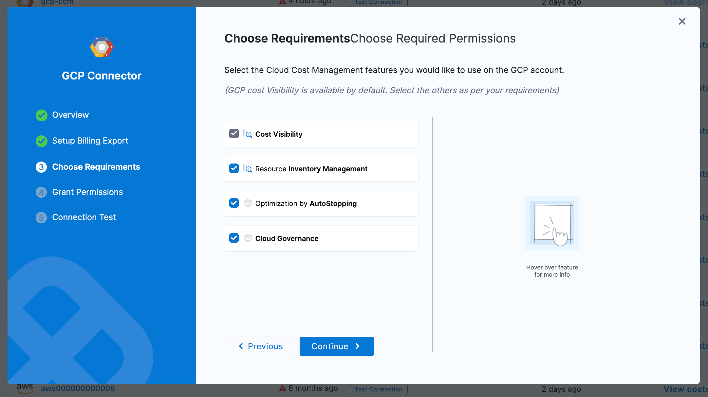

# CCM GCP Permissions

When assigning permissions to Harness' service account to GCP for CCM, there are many different permissions sets based on the features you are trying to leverage in specific accounts. This guide is meant to cover all the different features of CCM and the permissions you need to assign to enable them.

To enable specific features on a connector you need to set a specific string in the `featuresEnabled` field (list) in the connector YAML. The keys for each feature are listed in the sections below.

## Cost Ingestion

:::info featuresEnabled

BILLING

:::

:::info When to enable

Project which holds the BigQuery table where your Billing Export lives

:::

To ingest cost from GCP, Harness leverages a Billing Export that is generated by GCP. These reports are delivered to a BigQuery table in some project. When assigning permissions, we will need access to read the data in the table.

To do this you can assign `roles/bigquery.dataViewer` on the table.

## Events/Inventory

:::info featuresEnabled

VISIBILITY

:::

:::info When to enable

Projects where infrastructure is provisioned, usually all

:::

To let Harness collect inventory data (used in dashboards) you need to give read permissions to the subscription. You can do this by assigning the built in `roles/Reader` role.

## Asset Governance

:::info featuresEnabled

GOVERNANCE

:::

:::info When to enable

Projects where infrastructure is provisioned, usually all

:::

When enabling asset governance, it is best practice to start with a read-only policy so you can run rules in dry-run, receive out-of-the-box recommendations, and begin to create your own custom governance recommendations.

We suggest you use the GCP-provided `roles/Reader` role which will allow Harness to access GCP resources in a read-only manner.

Once you are ready to perform actions using governance, you can create a custom policy to allow only the actions you want to take via governance, or use built-in roles to provide whatever access you are comfortable with.

For example if you are going to begin auto-deleting disks using governance, you might assign `compute.disks.delete`.

## Autostopping

:::info featuresEnabled

OPTIMIZATION

:::

:::info When to enable

Projects where infrastructure is provisioned, usually all

:::

Autostopping has many ways to optimize resource usage and reduce costs. Across the different compute and routing SKUs there are many possible permissions needed. Based on your compute and application architecture you can use the following information to build a least-privileged policy.

### VM with Fixed Schedules

| Policy                      | Usage                                                                        |
|-----------------------------|------------------------------------------------------------------------------|
| compute.instances.list      | List VMs                                                                     |
| compute.instances.setLabels | Tag VM                                                                       |
| compute.regions.get         | Get region information to list zones                                         |
| compute.regions.list        | List regions                                                                 |
| compute.zoneOperations.get  | Required while waiting to complete VM operations, for example stop operation |
| compute.instances.stop      | Stop VM                                                                      |
| compute.instances.start     | Start VM                                                                     |

### Instance Group with Fixed schedules

| Policy                              | Usage                                                                               |
|-------------------------------------|-------------------------------------------------------------------------------------|
| compute.regions.get                 | Get region information to list zones                                                |
| compute.regions.list                | List regions                                                                        |
| compute.instanceGroups.list         | list instance groups                                                                |
| compute.instanceGroupManagers.list  | list managed instance groups                                                        |
| compute.instanceGroups.get          | get instance groups details                                                         |
| compute.instances.get               | Get instances in instance groups                                                    |
| compute.autoscalers.list            | List autoscalers                                                                    |
| compute.autoscalers.get             | Get autoscaler details                                                              |
| compute.autoscalers.update          | For updating autoscaler configurations. This is needed during warm up and cool down |
| compute.instances.list              | List VMS in instance group                                                          |
| compute.instances.delete            | Deleting VMs from managed instance groups during cool down                          |
| compute.globalOperations.get        | Get status of operations                                                            |
| compute.regionOperations.get        | Get status of operations                                                            |
| compute.zoneOperations.get          | Get status of operations                                                            |

### Provisioning Autostopping Proxy

| Policy                            | Usage                |
|-----------------------------------|----------------------|
| compute.networks.list             | List networks        |
| compute.machineTypes.list         | List machine types   |
| compute.subnetworks.list          | List subnets         |
| compute.firewalls.list            | List security groups |
| compute.addresses.create          | Create address       |
| compute.addresses.get             | Get address          |
| compute.disks.create              | create disk          |
| compute.subnetworks.use           | Use sub network      |
| compute.instances.create          | Create proxy VM      |
| compute.subnetworks.useExternalIp | use static IP        |
| compute.addresses.use             | Use address          |
| compute.instances.setMetadata     | Set VM metadata      |
| compute.instances.setTags         | Set tags             |
| compute.addresses.delete          | Delete address       |
| compute.instances.delete          | Delete proxy VM      |
