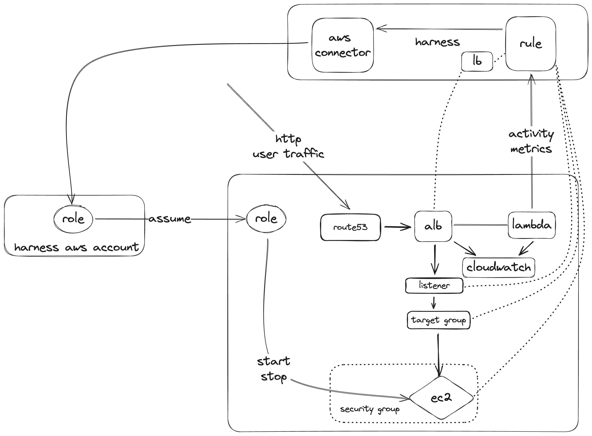
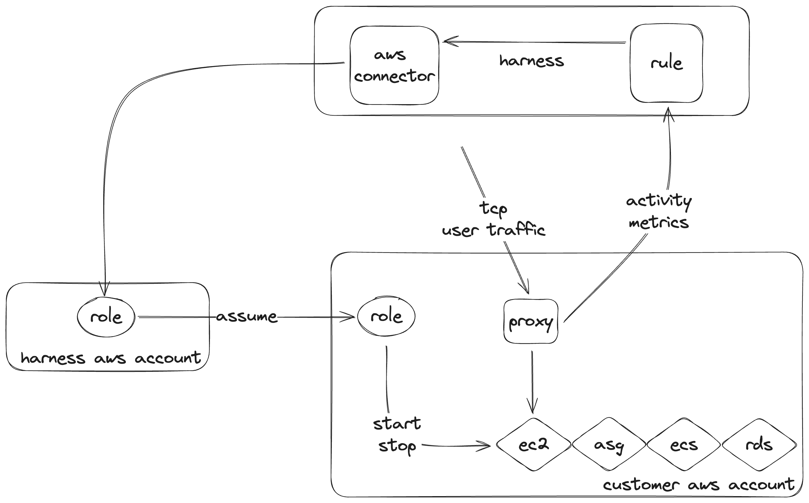
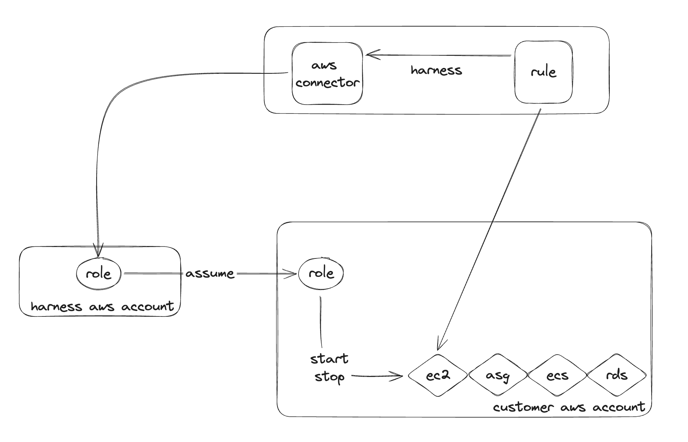
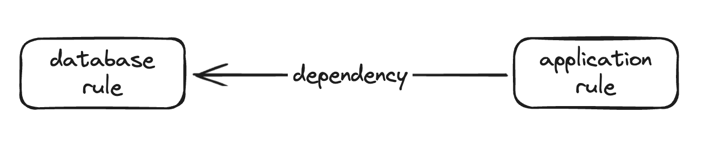

# AWS Auto Stopping

Auto stopping in AWS enables you to spin down EC2 instances, RDS databases, ASGs, and ECS Services. You can do this either by monitoring traffic with an ALB or proxy, or by creating defined schedules of uptime and downtime.

## Creating Rules

You can create auto stopping rules in the Harness UI or via IAC with Terraform. The recommended approach is to use IAC to define your resources.

A rule can use both traffic monitoring and schedules to define its stopping behavior.

## Ingress Based

### ALB

If the application has an existing ALB, or the application is HTTP based, then you can use an ALB to measure the usage of the application for auto stopping.

The flow of an ALB auto stopping rule is as follows:

0. Harness shuts down the EC2 instance
1. Harness modifies the ALB to point at the created lambda function
2. When traffic is received, lambda presents the user with the progress page
3. Harness starts up the EC2 instance
4. When instance is ready, ALB is modified to send traffic to EC2
5. The lambda monitors cloudwatch for activity logs
6. When cloudwatch shows no activity, the lambda updates Harness
7. Repeat from step 1

### Proxy

If the application uses non HTTP traffic then you must use an auto stopping proxy, which is an Ubuntu EC2 that is provisioned into your account.

The flow of a proxy auto stopping rule is as follows:

0. Harness shuts down the instance
1. When traffic is received, proxy presents the user with the progress page
2. Harness starts up the instance
3. When instance is ready, proxy sends traffic to the application
4. When proxy shows no activity, it updates Harness
5. Repeat from step 1

## Schedule Based

In tandem with traffic based stopping you can define uptime and downtime schedules that will keep the application up, or down, based on a pre-defined schedule.

Uptime schedules will ensure that applications are not taken offline, no matter the traffic seen by the ALB/proxy.

Downtime schedules will keep the application offline, no matter the traffic seen by the ALB/proxy.

|          |     idle    |    active  |
|----------|:-----------:|-----------:|
| uptime   |  app up    |  app up   |
| downtime |  app down  |  app down |

### Schedule-Only Rules

If you do not have an ALB/proxy, or you only want to stop/start your application based on a schedule, you can optionally create a non-ingress rule.

When creating a non-ingress rule, Harness will act as if it was an ingress rule, but never see traffic.

So without any schedule applied, the application will always be down, and you can apply uptime schedules to force the application to stay up.

That is to say, you should only apply uptime schedules to non-ingress rules.

## Dependencies

You can define a dependency on another auto stopping rule. This will make sure that the dependent rule is online when the rule with the configured dependency is online.

For example, you have a stopping rule for a database configured in Harness. When you create a stopping rule for the application you can specify a dependency on the database rule so that whenever the application is online Harness will ensure that the database is also online.

0. Database and application are offline
1. Application receives some trigger to come online
2. Harness triggers the database to come online, waits the specified amount of time
3. Harness triggers the application to come online.

## Warming Up Workloads

There is an API available to "warm up" or "cool down" a rule for a specified amount of time. This can be helpful when you have a schedule applied but some developer needs access to an application, or needs to test bringing the workload down.

To call this API the token used must have auto stopping rule view in the Harness account.

## Provisioning via Terraform

There exists several examples of configuring and deploying rules in [this](https://github.com/wings-software/AutoStoppingLab/tree/main/aws) repository.