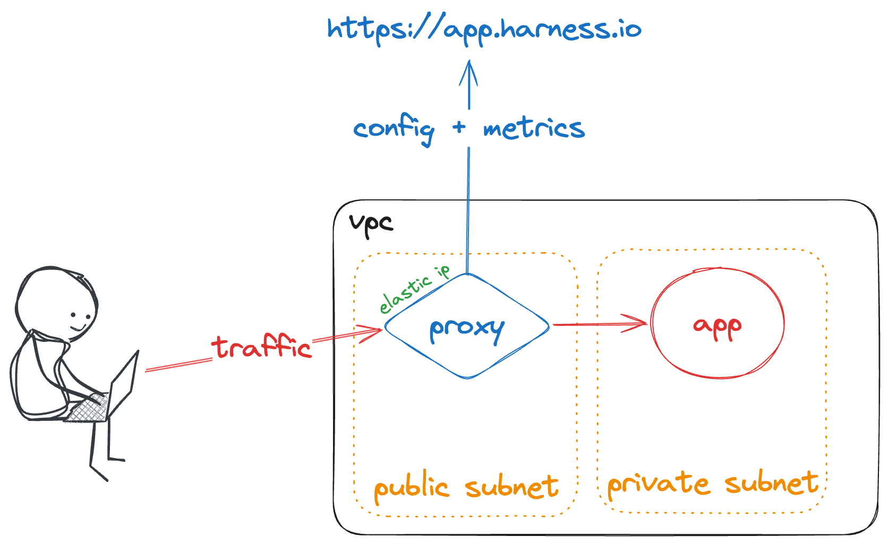
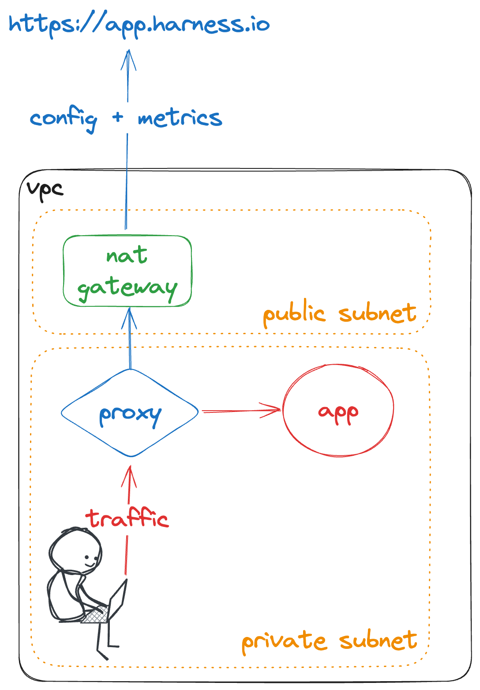

# Setup

When provisioning an an autostopping proxy, you must be sure that the proxy can be reached by users of the application (instance to be stopped), and reach the application (instance). It will also need outbound internet access for initial setup and receive updates from Harness.

There are two common patterns when deploying the proxy, public or private.

If the proxy needs to receive traffic from the public internet it can be placed in a public subnet with an elastic IP.



If the traffic the proxy is receiving originates from a private network, you can place it in a private subnet as long as it still has access to the internet (usually though a NAT Gateway).



In both cases the proxy needs access to the internet. It uses this access to be initialized when first provisioned (download envoy), receive updates from Harness (new rules being created), and pass back usage metrics and activity for rules.

# Maintenance

## Rotate API Key

When the API key you used when provision the proxy expires, you will need to rotate the key manually.

Log into the box via SSH using the PEM key you specified when creating the proxy.

The API Key is stored in a file located at `/var/lw_proxy/config.toml`:

```
accessPointID="ap-crun4gs76otnefrectlg"
apiURL="https://app.harness.io/gratis/lw/api"
proxyPort=8093
usageTrackingPort=8094
authToken="sat.wlgELJ0TTre5aZhzpt8gVA.xxx.xxx"
accountID="wlgELJ0TTre5aZhzpt8gVA"
```

Replace the `authToken` key with your newly created token.

# Troubleshooting

When troubleshooting issues with the Auto Stopping proxy the following are simple steps you can take to narrow down what could be causing issues.

## Check proxy security groups

The proxy will need security group (network firewall) access to receive traffic on the random ports assigned to different services being proxied by the machine.

- Usually you will want to allow traffic from any source to the destination port on the proxy (eg. `56102`)
- AWS/Azure: Check the security groups on the proxy instance and validate the source and destination rules match our access pattern
- GCP: Check the network tags on the instance and the corresponding firewall rules to make sure the access pattern is allowed

## Validate traffic can reach the proxy

To check that traffic is reaching the proxy you can SSH into the proxy VM and check the proxy logs. When the user hits the proxy you should see logs confirming the traffic.

To see these logs run the following command: `journalctl -fu lw_tcp_proxy`
This will tail the live logs in your terminal. If you want to just see a one-time dump of the current logs you can omit the `-f` flag.

## Check application security groups

You should validate that the firewall rules allow the proxy to reach the app server at the destination port.

- Usually you will want to allow traffic from the proxy (or any source) to the destination port on the application server (eg. `80`)
- AWS/Azure: Check the security groups on the app instance and validate the source and destination rules match our access pattern
- GCP: Check the network tags on the instance and the corresponding firewall rules to make sure the access pattern is allowed

## Validate the proxy can reach the app server

To check that the proxy can reach the app server you can SSH into the proxy VM and check access on the application port.

Once you have a terminal session on the proxy VM:
- Install the necessary tools: `sudo apt install net-tools`
- To validate the app port is open: `nc -z -v <ip of app server> <dstination port>` 
- If you see no output, that means we cannot access the destination port, and you need to check the security groups on the application server
- If you see output about a connection, this validates the proxy can reach the application

## Validate that the internal services of the proxy are running
        
You can check that the proxy is running it's internal services by SSHing into it and check the system status.

- There is an internal service on the proxy running on port 8094 and 8093
    - If you go to `http://<ip of proxy>:8093` you should see text that includes your account id, this is one hint that the internal workings of the proxy are running as expected
        - You will need to make sure port 8093 is open in the security group the proxy is using
- You can check the status and logs of the proxy services with the following commands:
    - `systemctl status lw_tcp_proxy`
    - `systemctl status lw_proxy`
