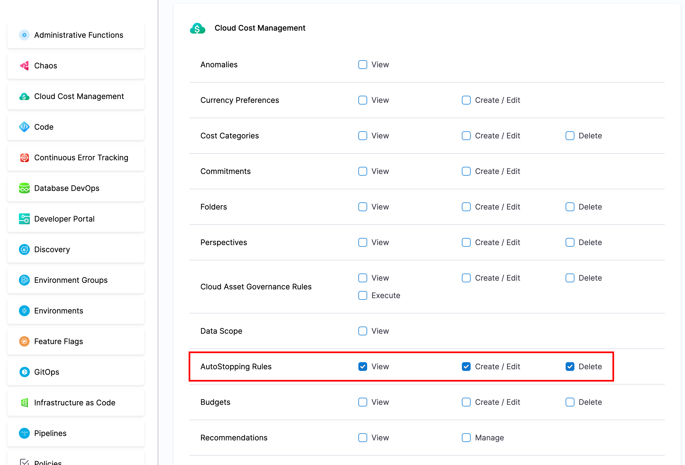
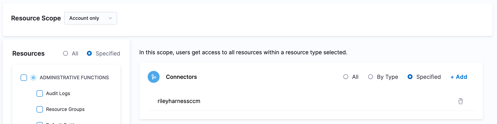
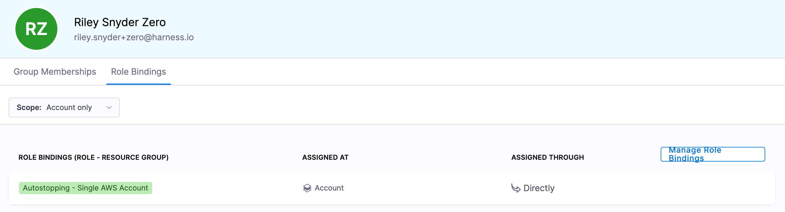

# RBAC

You can control view, create+edit, and delete access for AWS, Azure, and GCP autostopping based on cloud connectors (cloud accounts).

## Role

Under account settings > roles, you can create a role with any combination of view, create+edit, and delete.

For example a viewer role might have "viewer" while an editor role may have "view", "create+edit", and "delete".



You will also need to grant `Connector:View` so that users can load all the information on the autostopping rules.

If the user trying to access autostopping dosn't have `User:View` on `_all_account_resources` they will get an error in the autostopping UI that they lack this permissions. This is because the UI makes API calls to get information on users in the Harness account to be able to display who made changes on the rules.

## Resource Group

To control the cloud accounts a user can perform the above actions on, you need to create a resource group (under account settings > resource groups) that encapsulates.

Under "Shared Resources" select "Connectors" and then "Specified". Here you can select all the CCM AWS Account Connectors for the accounts which you want to give access to.

You will create as many resource groups as needed depending on how many seperate access patterns you have.



## Assigning Access

Once you have a role and resource group, you can assign this access to a user, group, or service account.

You can use your generic "Autostopping" role and select the resource group created that outlines the target access for the user/group/serviceaccount.



# Terraform

You can use the Harness Terraform provider to create the resource groups needed for managing access in to your cloud accounts.

```hcl
# pull in current account context
data "harness_platform_current_account" "current" {}

# create a ccm aws connector for an account
resource "harness_platform_connector_awscc" "member" {
  identifier = "member"
  name       = "member"

  account_id  = "012345678902"
  features_enabled = [
    "OPTIMIZATION",
    "VISIBILITY"
  ]
  cross_account_access {
    role_arn    = "arn:aws:iam::012345678902:role/HarnessCERole"
    external_id = "harness:867530900000:${data.harness_platform_current_account.current.id}"
  }
}

# create a resource group for the account
resource "harness_platform_resource_group" "member" {
  identifier  = "member"
  name        = "member"

  account_id           = data.harness_platform_current_account.current.id
  allowed_scope_levels = ["account"]
  included_scopes {
    filter     = "EXCLUDING_CHILD_SCOPES"
    account_id = data.harness_platform_current_account.current.id
  }
  resource_filter {
    include_all_resources = false
    resources {
      resource_type = "CONNECTOR"
      identifiers = [
        # scope this resource group to this ccm aws connector
        harness_platform_connector_awscc.member.id
      ]
    }
  }
}
```