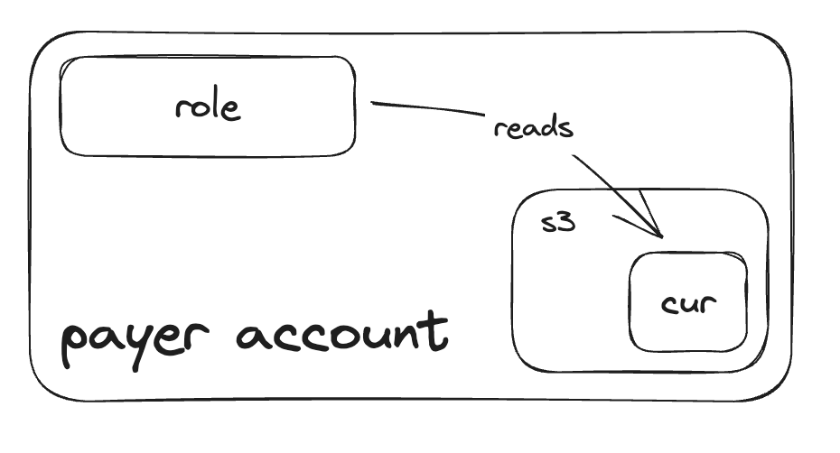
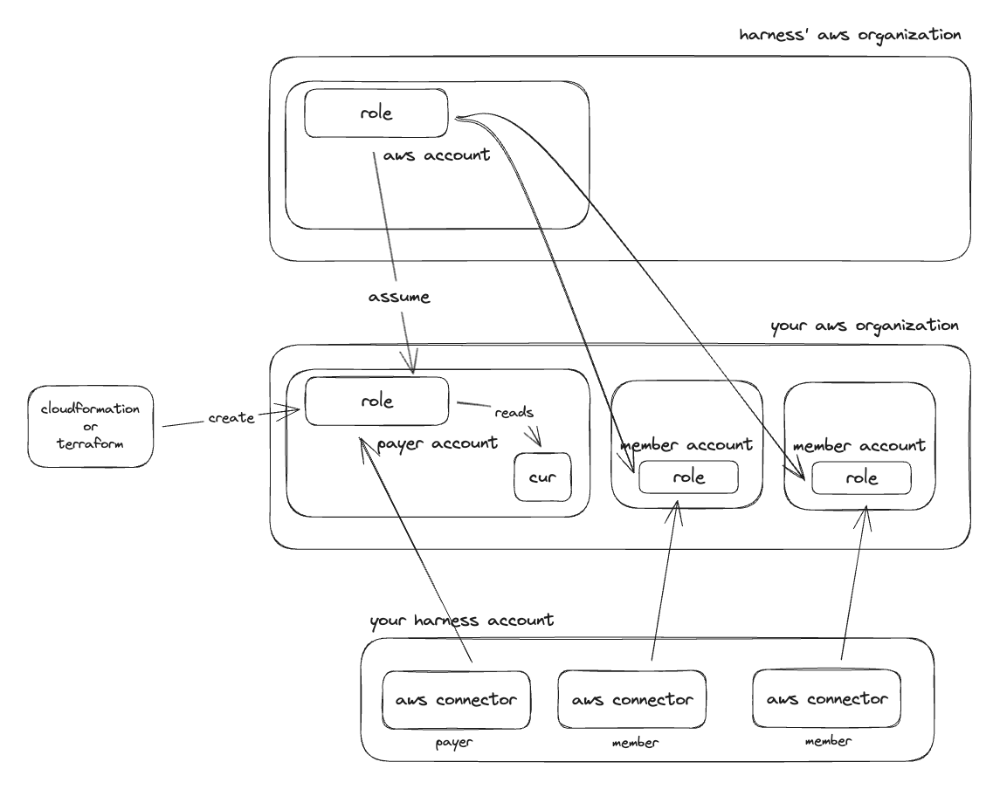

# AWS

Accounts in AWS are usually structured via organizations. In this case you will have a single master/payer account where all account cost is rolled into. If you do not use organizations then you will need to repeat this process for every account with billing information that you want ingested into Harness.

Whenever you add a new payer account to Harness it may take up to 24 hours for cost data to appear.

## Payer Account

The first step is to [create a CUR](/docs/cloud-cost-management/get-started/onboarding-guide/set-up-cost-visibility-for-aws#cost-and-usage-reports-cur) (Cost Usage Report) in the payer account. Once the CUR is created, we will need to create a role that has access to the S3 bucket that the CUR resides in. This role will have a trust policy that allows Harness to assume the role and copy the CUR data to an S3 bucket in Harness' AWS account for data ingestion.



There is a CloudFormation template or Terraform module to provision this role. [The CloudFormation stack is located here](https://continuous-efficiency-prod.s3.us-east-2.amazonaws.com/setup/ngv1/HarnessAWSTemplate_V2.yaml), and the [Terraform module here](https://github.com/harness-community/terraform-aws-harness-ccm).

For both the template and the module there are inputs you must specify for your setup:

- S3 Bucket: This is the bucket in your payer account where your CUR resides
- External ID: This is extra information used when Harness assumes your AWS role to further verify the identity
  - The recommended format for the external id is `harness:<harness' aws account id>:<your harness account id>`
  - Harness' AWS account id is `891928451355`
  - You can retrieve your Harness account id from the account settings page in Harness, you can optionally use any random string
- Role name: The name of the AWS IAM role provisioned that will be granted access to the S3 bucket, and allow assumption from Harness
- Enable billing: This provisions a policy that allows the role to access the S3 bucket given for the CUR data
  - See the `HarnessBillingMonitoringPolicy` in the template for the exact permissions included and modify as necessary.
- Enable commitment read: (required for commitment orchestrator) This provisions a policy that gives access to read RI and savings plan data
  - See the `HarnessCommitmentReadPolicy` in the template for the exact permissions included and modify as necessary.
- Enable commitment write: (required for commitment orchestrator to make purchases) This provisions a policy that gives access to purchase RI and savings plans
  - See the `HarnessCommitmentWritePolicy` in the template for the exact permissions included and modify as necessary.

For the rest of the feature enablement inputs you should set these as false (disabled) in your payer account, because it is unlikely that you will have workloads running inside the payer account.

```terraform
module "ccm" {
  source  = "harness-community/harness-ccm/aws"
  version = "0.1.1"

  s3_bucket_arn           = "arn:aws:s3:::harness-ccm"
  external_id             = "harness:012345678901:wlgELJ0TTre5aZhzpt8gVA"
  enable_billing          = true
  enable_commitment_read  = true
  enable_commitment_write = true
}
```

Enabling EC2 recommendations for all accounts at once is possible by navigating to Compute Optimizer and opting in member accounts.  [Opt in member accounts for Compute Optimizer](https://docs.aws.amazon.com/compute-optimizer/latest/ug/viewing-accounts.html). 

**You may need to adjust the S3 bucket policy to allow the newly created Harness IAM role to read objects in the bucket.**

### Harness CCM AWS Connector

Now that the CUR and role have been created in the payer account we need to create a corresponding CCM AWS connector in your Harness account to start billing data ingestion.

You can create this connector through the UI or via the API with a tool like Terraform. Using Terraform is the recommended approach and there is a [Harness Terraform provider here](https://registry.terraform.io/providers/harness/harness/latest/docs).

To configure the connector you will need the following information:

- Account ID: The AWS account id for your payer account
- Cross account role ARN: The ARN for the IAM role that was created in your payer account via the template/module that has access to read the S3 bucket
- Cross account role external ID: This is the same external ID you specified in the template/module when you created the role.
- S3 bucket: The name (not ARN) of the S3 bucket where the CUR is located
- Report name: The name (not ARN) of the CUR in the payer account
- Features enabled: The CCM features that you want to use in this account
  - At minimum this should be `BILLING` for the payer account

```terraform
resource "harness_platform_connector_awscc" "payer" {
  identifier = "payer"
  name       = "payer"

  account_id  = "012345678901"
  report_name = "harnessccm"
  s3_bucket   = "harnessccm"
  features_enabled = [
    "BILLING",
  ]
  cross_account_access {
    role_arn    = "arn:aws:iam::012345678901:role/HarnessCERole"
    external_id = "harness:867530900000:myharnessaccountid"
  }
}
```

## Member Accounts

Enabling CCM for your payer account gets your cost data into Harness and enabled you to start creating perspectives, budgets, alerts, and dashboards. To leverage the other features like auto stopping and asset governance, we need to create roles and connectors in each account where you want to use these other features.

You should leverage the same template/module that you did for the payer account but with different inputs for the features you want to enable. You will be deploying the template/role into every non-payer account where you want to utilize the other CCM features.

[The CloudFormation stack is located here](https://continuous-efficiency-prod.s3.us-east-2.amazonaws.com/setup/ngv1/HarnessAWSTemplate_V2.yaml), and the [Terraform module here](https://github.com/harness-community/terraform-aws-harness-ccm).

For both the template and the module there are inputs you must specify for your setup:

- S3 Bucket: Leave this input blank for non-payer accounts
- External ID: This is extra information used when Harness assumes your AWS role to further verify the identity
  - The recommended format for the external id is `harness:<harness' aws account id>:<your harness account id>`
  - Harness' AWS account id is `891928451355`
  - You can retrieve your Harness account id from the account settings page in Harness, you can optionally use any random string
- Role name: The name of the AWS IAM role provisioned that will be granted access to the S3 bucket, and allow assumption from Harness
  - You should use the same role name in every non-payer account
- Enable billing: This should be set to false for non-payer accounts
- Enable commitment read: This should be set to false for non-payer accounts
- commitment write: This should be set to false for non-payer accounts
- Enable events: This enables read access in the account for inventory management
  - This will enable EC2 and ECS recommendation gathering as well as compute metadata around EC2, ECS, and RDS
    - Be sure and [enable Compute Optimizer](https://docs.aws.amazon.com/compute-optimizer/latest/ug/viewing-accounts.html) in these accounts. 
  - See the `HarnessEventsMonitoringPolicy` in the template for the exact permissions included and modify as necessary
- Enable autostopping: This enables access that is necessary to auto stop workloads in your account
  - There are specific inputs to enable the precise permissions needed for different types of autostopping
  - There is also an input for the `LambdaExecutionRoleName` which is a role used for the lambda function that is used when auto stopping using an ALB, unless you have specific naming schemes this can be left as the default
- Enable governance: This provisions a policy that has read access to the AWS account to enable running rules in dry run and generating custom recommendations 
  - When you create a custom asset governance role, you may need to attach additional policies to the role to allow you to do the actions your policy is attempting to make

```terraform
module "ccm-member" {
  source                = "harness-community/harness-ccm/aws"
  version               = "1.0.0"
  
  external_id             = "harness:891928451355:wlgELJ0TTre5aZhzpt8gVA"

  enable_events           = true

  autostopping_loadbalancers = ["alb", "proxy"]
  autostopping_resources     = ["ec2", "ec2-spot", "asg", "rds", "ecs"]

  enable_governance      = true
  governance_policy_arns = [
    "arn:aws:iam::aws:policy/AmazonEC2FullAccess"
  ]
}
```

### Harness CCM AWS Connector

Now that the role has been created in the member accounts we need to create corresponding CCM AWS connectors in your Harness account to allow you to use the account for the other Harness features.

You can create these connectors through the UI or via the API with a tool like Terraform. Using Terraform is the recommended approach and there is a [Harness Terraform provider here](https://registry.terraform.io/providers/harness/harness/latest/docs).

To configure the connector you will need the following information:

- Account ID: The AWS account id for your payer account
- Cross account role ARN: The ARN for the IAM role that was created in your payer account via the template/module that has access to read the S3 bucket
- Cross account role external ID: This is the same external ID you specified in the template/module when you created the role.
- Features enabled: The CCM features that you want to use in this account
  - You should not set `BILLING` for non-payer accounts
  - You should set the other features based on what you enabled in the template/module
    - `OPTIMIZATION` (autostopping), `VISIBILITY` (events; inventory/recommendations), `GOVERNANCE`

```terraform
resource "harness_platform_connector_awscc" "member" {
  identifier = "member"
  name       = "member"

  account_id  = "012345678902"
  features_enabled = [
    "OPTIMIZATION",
    "VISIBILITY",
    "GOVERNANCE"
  ]
  cross_account_access {
    role_arn    = "arn:aws:iam::012345678902:role/HarnessCERole"
    external_id = "harness:867530900000:myharnessaccountid"
  }
}
```

## Overview



## EC2 Recommendations

To enable EC2 recommendations you must have [Rightsizing Recommendations](https://docs.aws.amazon.com/cost-management/latest/userguide/ce-rightsizing.html) turned on in the account with EC2 that you want recommendations for. Harness does not compute recommendations but pulls them from compute optimizer across your accounts and centralizes them in CCM.

In addition, you must have the `Events` policy provisioned in the account as well, specifically the Harness-AWS role in your account must have the `ce:GetRightsizingRecommendation` permission.
