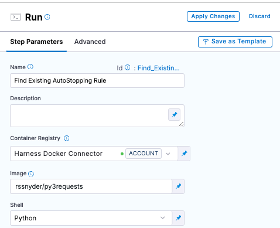
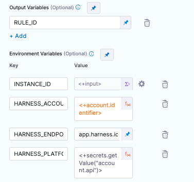
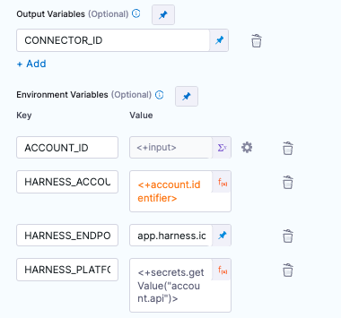
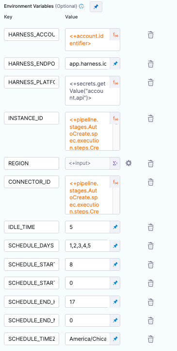
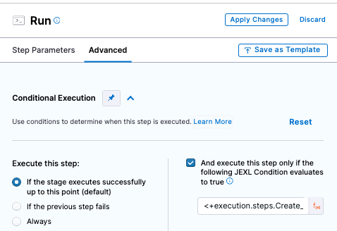
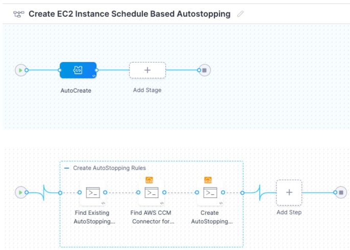
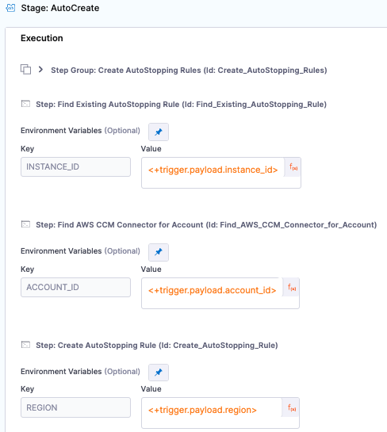
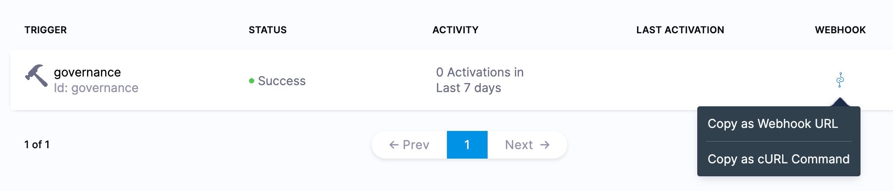
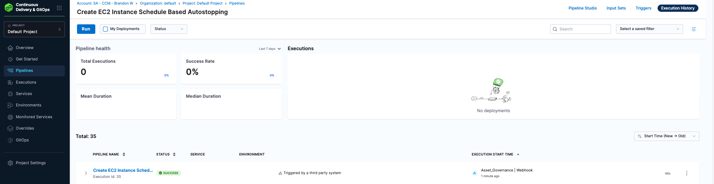

# Overview

The process below defines a system where we can locate EC2 instances based on a particular tag and automatically created schedule based autostopping rules to shut the instance down during non work hours.

To accomplish this, we use CCM Asset Governance to locate the resources and a Harness pipeline to automate the creation of the autostopping rules and their schedules.

Users of this guide should have an understanding of schedule based autostopping, Harness pipelines, Harness service accounts, and secrets.

## Setup

This guide assumes you have CCM set up correctly for Asset Governance and autostopping for at least one cloud account.  

You will also need a [Kubernetes connector](https://developer.harness.io/docs/platform/connectors/cloud-providers/ref-cloud-providers/kubernetes-cluster-connector-settings-reference/) with access to deploy pods in some cluster. 

We need an api key to do certain platform and CCM actions in the pipeline. Create a service account with CCM Admin and Account Viewer permissions for all resources. Generate an api key and store the api key as a secret. In this case, we will assume the secret id is `api`. Remember the id given, it will be used in future steps.

## Pipeline Setup

Create a pipeline in some Harness project. 

### Setup the Stage / Step Group 

1. Create a new Stage of type `custom`
2. Add a Step Group to the execution tab of your stage. Give it a name and select `enable container base execution`, select your kubernetes connector in the Kubernetes cluster selection box.
3. We will now create three steps in our step group. All three steps are `Run` steps. They will be configured to use a Python image to execute a Python script. For all three steps, there is a common setup that needs to happen described below. All three will use the built in Harness Connector, image=`rssnyder/py3requests`, and Shell=`Python`. You can also use any other Docker Hub conneector and image as long as the image has Python3 and `requests`. We'll purposefully leave the command section blank for now and add in the Python code in a subsequent step.
  
  Run Step Setup:

  
  
  The three steps are:

  1. 'Find Existing Autostopping Rule'
      * Configure an output variable `RULE_ID`. Will be used in next step.
      * Environment Variables:

      ```
      INSTANCE_ID (Runtime input).  Passed into the step from webhook. = <+input>
      HARNESS_ACCOUNT_ID (Expression). Built in Harness variable = <+account.identifier>
      HARNESS_ENDPOINT (Fixed value) = Either app.harness.io OR app3.harness.io.  Get this from the front portion of your Harness URL
      HARNESS_PLATFORM_API_KEY (Expression).  The secret we built in the previous step. = <+secrets.getValue("account.api")>
      ```

      

  2. 'Find AWS CCM Connector for Account'
      * Go to the `Advanced` tab and configure a conditional execution only if 'Find Existing Autostopping Rule' doesn't find a rule:
      `<+steps.Find_Existing_AutoStopping_Rule.output.outputVariables.RULE_ID> == ""` 
      * Configure an output variable `CONNECTOR_ID`.  Will be used in next step.
      * Environment Variables:

      ```
      ACCOUNT_ID (Runtime input).  Passed into the step from webhook. = <+input>
      HARNESS_ACCOUNT_ID (Expression). Built in Harness variable = <+account.identifier>
      HARNESS_ENDPOINT (Fixed value) = Either app.harness.io OR app3.harness.io.  Get this from the front portion of your Harness URL
      HARNESS_PLATFORM_API_KEY (Expression).  The secret we built in the previous step. = <+secrets.getValue("account.api")>
      ```

      

  3. 'Create AutoStopping Rule'      
      * Configure a conditional execution only if 'Find Existing Autostopping Rule' doesn't find a rule:
      `<+steps.Find_Existing_AutoStopping_Rule.output.outputVariables.RULE_ID> == ""`
      
      * Environment Variables:
      The `SCHEDULE_` environment variables define the uptime schedule for rule in this process.

      ```
      HARNESS_ACCOUNT_ID (Expression). Built in Harness variable = <+account.identifier>
      HARNESS_ENDPOINT (Fixed value) = Either app.harness.io OR app3.harness.io.  Get this from the front portion of your Harness URL
      HARNESS_PLATFORM_API_KEY (Expression).  The secret we built in the previous step. = <+secrets.getValue("account.api")>
      INSTANCE_ID (Expression).  Grabs the value from first step = <+steps.Find_Existing_AutoStopping_Rule.spec.envVariables.INSTANCE_ID>
      REGION (Runtime input).  Passed into the step from webhook. = <+input>
      CONNECTOR_ID (Expression).  Grabs the value from the second step = <+steps.Find_AWS_CCM_Connector_for_Account.output.outputVariables.CONNECTOR_ID>
      IDLE_TIME (Fixed value).  Minimum value of 5 minutes.  Once scheduled downtime happens, this is the amount of time Harness waits to shut down the instance
      SCHEDULE_DAYS (Fixed value).  Comma delimiated.  Sunday = 0, Saturday = 6
      SCHEUDLE_START_H (Fixed value).  0-23.  
      SCHEDULE_START_M (Fixed value).  0-59.
      SCHEDULE_END_H (Fixed value).  0-23.
      SCHEDULE_END_M (Fixed value).  0-59.
      SCHEDULE_TIMEZONE (Fixed value).  Example America/Chicago for central U.S. time
      ```

      

  4. Conditional Execution Setup for steps 2 and 3:

      
    

The final pipeline setup should look like this:




### Add Python Code For Each Step

After the Python code is added, make sure to save your pipeline as we will navigate away from the pipeline UI in the next step.

1. Python Code For Find Existing Autostopping Rule:

```
from os import getenv, environ

from requests import post, get

PARAMS = {
    "routingId": getenv("HARNESS_ACCOUNT_ID"),
    "accountIdentifier": getenv("HARNESS_ACCOUNT_ID"),
}

HEADERS = {"x-api-key": getenv("HARNESS_PLATFORM_API_KEY")}


def get_autostopping_rules(dry_run: bool = False, page: int = 0):
    resp = post(
        f"https://{getenv('HARNESS_URL')}/gateway/lw/api/accounts/{getenv('HARNESS_ACCOUNT_ID')}/autostopping/rules/list",
        params=PARAMS,
        headers=HEADERS,
        json={"page": page, "limit": 1, "dry_run": dry_run},
    )

    resp.raise_for_status()

    data = resp.json()

    results = data.get("response", {}).get("records", [])
    if data.get("response", {}).get("pages") > page + 1:
        results.extend(get_autostopping_rules(dry_run, page + 1))

    return results


def get_existing_rule_id():
    target_instance_id = getenv("INSTANCE_ID")

    if not target_instance_id:
        print("no INSTANCE specified")
        exit(1)

    rules = get_autostopping_rules()

    matches = [
        x
        for x in rules
        if x.get("routing", {}).get("instance", {}).get("filter", {}).get("ids", [])[0]
        == target_instance_id
    ]
    if matches:
        rule_id = matches.pop().get("id")
        print(f"found existing rule for {target_instance_id}: {rule_id}")
        environ["RULE_ID"] = str(rule_id)
    else:
        environ["RULE_ID"] = ""


if __name__ == "__main__":
    get_existing_rule_id()
```

2. Python Code For Find AWS Connector for Account:

```
from os import getenv, environ

from requests import post, get

PARAMS = {
    "routingId": getenv("HARNESS_ACCOUNT_ID"),
    "accountIdentifier": getenv("HARNESS_ACCOUNT_ID"),
}

HEADERS = {"x-api-key": getenv("HARNESS_PLATFORM_API_KEY")}


def get_ccm_aws_connectors(page: int = 0):
    local_params = PARAMS.copy()
    local_params.update({"pageIndex": page, "pageSize": 50})

    resp = post(
        f"https://{getenv('HARNESS_URL')}/gateway/ng/api/connectors/listV2",
        params=local_params,
        headers=HEADERS,
        json={"types": ["CEAws"], "filterType": "Connector"},
    )

    resp.raise_for_status()

    data = resp.json()

    results = data.get("data", {}).get("content", [])
    if data.get("data", {}).get("totalPages") > page:
        results.extend(get_ccm_aws_connectors(page + 1))

    return results


def get_connector_for_account():
    account_id = getenv("ACCOUNT_ID")

    connectors = get_ccm_aws_connectors()

    matches = [
        x
        for x in connectors
        if x.get("connector", {}).get("spec", {}).get("awsAccountId") == account_id
    ]
    if matches:
        connector_id = matches.pop().get("connector", {}).get("identifier")
        print(f"found connector for {account_id}: {connector_id}")
        environ["CONNECTOR_ID"] = str(connector_id)
    else:
        environ["CONNECTOR_ID"] = ""


if __name__ == "__main__":
    get_connector_for_account()
```

3. Python Code For Create AutoStopping Rule:

```
from os import getenv, environ

from requests import post, get

PARAMS = {
    "routingId": getenv("HARNESS_ACCOUNT_ID"),
    "accountIdentifier": getenv("HARNESS_ACCOUNT_ID"),
}

HEADERS = {"x-api-key": getenv("HARNESS_PLATFORM_API_KEY")}


def create_autostopping_rule(
    instance_id: str,
    region: str,
    connector_id: str,
    idle_time_mins: int,
    dry_run: bool = False,
):
    resp = post(
        f"https://{getenv('HARNESS_ENDPOINT')}/gateway/lw/api/accounts/{getenv('HARNESS_ACCOUNT_ID')}/autostopping/v2/rules",
        params=PARAMS,
        headers=HEADERS,
        json={
            "service": {
                "name": instance_id,
                "account_identifier": "<+account.identifier>",
                "fulfilment": "ondemand",
                "kind": "instance",
                "cloud_account_id": connector_id,
                "idle_time_mins": idle_time_mins,
                "custom_domains": [],
                "health_check": {
                    "protocol": "http",
                    "path": "/",
                    "port": 80,
                    "timeout": 30,
                    "status_code_from": 200,
                    "status_code_to": 299,
                },
                "routing": {
                    "ports": [],
                    "instance": {"filter": {"ids": [instance_id], "regions": [region]}},
                },
                "opts": {
                    "dry_run": dry_run,
                    "preservePrivateIP": False,
                    "deleteCloudResources": False,
                    "alwaysUsePrivateIP": False,
                    "hide_progress_page": False,
                    "preserve_private_ip": False,
                    "always_use_private_ip": False,
                },
                "metadata": {"cloud_provider_details": {"name": connector_id}},
                "disabled": False,
                "match_all_subdomains": False,
                "access_point_id": "",
            },
            "deps": [],
            "apply_now": True,
        },
    )

    resp.raise_for_status()

    data = resp.json()

    return data.get("response", {}).get("id")


def create_autostopping_schedule(
    name: str,
    description: str,
    connector_id: str,
    rule_id: str,
    days: list,
    start_h: int,
    start_m: int,
    end_h: int,
    end_m: int,
    tz: str,
):
    local_params = PARAMS.copy()
    local_params.update({"cloud_account_id": connector_id})

    resp = post(
        f"https://{getenv('HARNESS_ENDPOINT')}/gateway/lw/api/accounts/{getenv('HARNESS_ACCOUNT_ID')}/schedules",
        params=local_params,
        headers=HEADERS,
        json={
            "schedule": {
                "name": name,
                "created_by": "",
                "account_id": getenv("HARNESS_ACCOUNT_ID"),
                "description": description,
                "resources": [{"ID": str(rule_id), "Type": "autostop_rule"}],
                "details": {
                    "uptime": {
                        "days": {
                            "all_day": False,
                            "days": days,
                            "start_time": {"hour": start_h, "min": start_m},
                            "end_time": {"hour": end_h, "min": end_m},
                        }
                    },
                    "timezone": tz,
                },
            },
        },
    )

    resp.raise_for_status()

    data = resp.json()

    return data


def create():
    rule_id = create_autostopping_rule(
        getenv("INSTANCE_ID"),
        getenv("REGION"),
        getenv("CONNECTOR_ID"),
        int(getenv("IDLE_TIME", 130)),
    )

    if rule_id:
        print(f"created rule {rule_id} for", getenv("INSTANCE_ID"))
        environ["RULE_ID"] = str(rule_id)
    else:
        environ["RULE_ID"] = ""
        exit(1)

    try:
        days_raw = getenv("SCHEDULE_DAYS", "1,2,3,4,5").split(",")
        days = [int(x) for x in days_raw]
    except ValueError:
        print(f"non integer day supplied: {days_raw}")
        exit(1)

    try:
        start_h = int(getenv("SCHEDULE_START_H"))
        start_m = int(getenv("SCHEDULE_START_M"))
        end_h = int(getenv("SCHEDULE_END_H"))
        end_m = int(getenv("SCHEDULE_END_M"))
    except ValueError:
        print("non integer time supplied for start or end h/m")
        exit(1)

    schedule_id = create_autostopping_schedule(
        getenv("INSTANCE_ID"),
        "created via governance+pipeline automation",
        getenv("CONNECTOR_ID"),
        rule_id,
        days,
        start_h,
        start_m,
        end_h,
        end_m,
        getenv("SCHEDULE_TIMEZONE"),
    )

    print(schedule_id)


if __name__ == "__main__":
    create()
```

## Create Pipeline Webhook

Next click on `Triggers` in the top right and select `+ New Trigger` and select the `Custom` Webhook type. Give the trigger a name and click continue. Skip the conditions section by clicking continue. Input the follow JEXL for the three inputs:

```
INSTANCE_ID (Expression) = <+trigger.payload.instance_id>
ACCOUNT_ID (Expression) = <+trigger.payload.account_id>
REGION (Expression) = <+trigger.payload.region>
```
 

Click `Create Trigger`. On the triggers screen, select the `WEBHOOK` icon and copy the webhook URL. Store this URL somewhere, it will be used later.



## Rule Setup

Navigate to CCM and select the `Asset Governance` feature. Select `Rules` in the top right and press `+ New Rule`.

We want to send EC2 instances that contain tag `Schedule` = `usWorkHours`, and send the instance information to the pipeline we created above.

```
  policies:
  - name: ec2-instances-to-autostop
    resource: ec2
    filters:
        - "tag:Schedule": 'usWorkHours'
    actions:
        - type: webhook
          url: "<add webhook from previous set here>"
          batch: false
          body: |-
            {
              "instance_id": resource.InstanceId,
              "account_id": account_id,
              "region": region
            }
```

In this example, we are:
  1. Find EC2 instances that have the tag `Schedule` = `usWorkHours`
  2. Calling our pipeline trigger
  3. Setting a body that includes all the data we need to create and autostopping rule

Replace the url with the webhook url we copied earlier

## Execute

When we run the Asset Governance rule (not in dry-run mode) and when a resource is found, Asset Governance will call our pipeline custom trigger and pass the metadata. Navigate to `Execution History` of your pipeline and ensure the latest pipeline was successful. If you want to automate the invoking of the Asset Governance rule, you can create an [enforcement](https://developer.harness.io/docs/cloud-cost-management/use-ccm-cost-governance/asset-governance/AWS/Harness-Concepts#enforcements)



## Exceptions / Things to Consider

1. If a rule was created using a tag and the tag was later removed, the rule will still exist.
2. Selecting 'allregions' option in the enforcement isn't support.
3. This example is only covers one specific schedule. If you wanted to make another schedule you should:
    * Clone the pipeline
    * Update the schedule environment variables in the 'Create AutoStopping Rule' step
    * Create a new trigger
    * Clone the governance rule
    * Update the webhook in the rule for the new pipeline
    * Update the filter in the rule to be the new schedule tag value