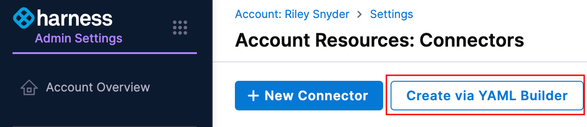

# Overview

Unlike normal setup of AWS and Azure cost ingestion, because of the hard seperation of cloud provider's China regions, you cannot simply create a role, export, and ingest cost through a Harness connector.

To ingest cost from a China region, you will need to create cost exports, sync the exports to a global region location, and then create a connector to ingest the exports.

## Create cost exports

You should set up cost exports in the China regions following the normal process:

* [AWS](/docs/cloud-cost-management/get-started/onboarding-guide/set-up-cost-visibility-for-aws#cost-and-usage-reports-cur)
* [Azure](https://developer.harness.io/docs/cloud-cost-management/get-started/onboarding-guide/set-up-cost-visibility-for-azure/#azure-billing-exports)

## Sync exports

Create a bucket or storage account in the normal global region. This could be the same bucket/account used for your global based cost exports.

You will need to automate a process of syncing the data between the China and global region locations. A popular tool is [rclone](https://rclone.org/) which will let you define different targets with seperate credentials, and then sync the locations.

You should set this process to perform a sync at least once a day, if not multiple times to make sure data is always up to date.

## Set up connectors

You will need to create a Harness connector to ingest the China costs from the global bucket. You can create a connector using the UI or API/TF, but if you try and create a connector in the UI for the same account/subscription you have set up for global costs, the wizard will prevent you from doing so.

In this event, you can copy the YAML of your global connector, and use the YAML builder in the UI to manually create a connector for the same account/subscription. You will just need to change the ID of the new connector to something unique.

All the export settings on the connector need to match the setup of the connector in the China region. The only difference may be for Azure the `containerName` could be different based on the name of the container you sync the export to.

The connector you create for AWS China costs will fail because we will be unable to check the setting on the China export, and this connector will always be in a "failed" state.

For Azure the connector should perform a check as noraml and show green when it can see exports in the location specifed. 
