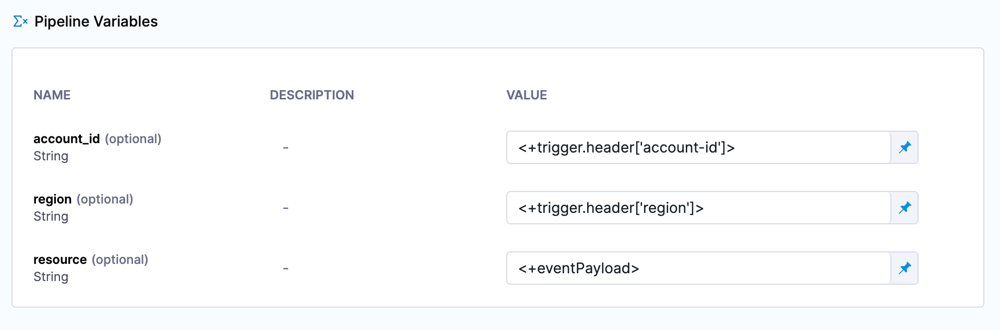
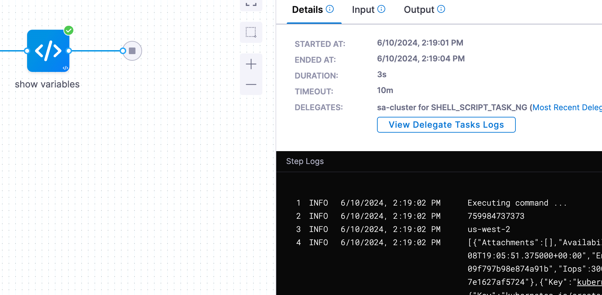

# Overview

Using the [webhook action](https://cloudcustodian.io/getting-started/actions/) from cloud custodian we can trigger a Harness pipeline to do additional actions on asset governance findings.

## Setup

This guide assumes you have CCM set up correctly for asset governance for at least one cloud account.

## Pipeline setup

Create a pipeline in some Harness project. On the right hand side select "variables" and under "pipeline" and "custom variables" select "+ Add Variable". Create variables "account_id", "region", and "resource" all of type "runtime input".


Create a new custom stage, and add a script step. In the script let's simply print out the variables we just created:

```
echo '<+pipeline.variables.account_id>'
echo '<+pipeline.variables.region>'
echo '<+pipeline.variables.resource>'
```


Next click on "triggers" in the top right and select "+ New Trigger" and select the custom type. Give the trigger a name and click continue, do not enter any conditions and click continue. For the inputs to our three variables, enter the following:

- account_id: `<+trigger.header['account-id']>`
- region: `<+trigger.header['region']>`
- resource: `<+eventPayload>`



Click "Create Trigger". On the triggers screen select the webhook icon, and copy the webhook URL for later.


## Rule setup

Navigate to CCM and select the asset governance feature. Select "Rules" in the top right and press "+ New Rule".

Let's take an example rule for detecting unattached EBS instances:

```
policies:
  - name: find-unattached-ebs
    resource: ebs
    filters:
      - Attachments: []
      - State: available
```

We want to add an action to call our pipeline webhook:

```
policies:
  - name: find-unattached-ebs
    resource: ebs
    filters:
      - Attachments: []
      - State: available
    actions:
      - type: webhook
        url: https://app.harness.io/gateway/pipeline/api/webhook/custom/v2
        batch: true
        method: POST
        body: resources
        headers:
          account-id: account_id
          region: region
```

Here we are calling our pipeline trigger, and passing the account and region where we found the resources in the headers and a body that includes all the resources located. If you instead want to call the webhook once for every resource found, simply set `batch` to `false`.

## Execute

Now when we run the rule (not in dry-run mode) if a resource is found, asset governance will call our pipeline custom trigger and pass the metadata. If we view the execution we can see the information printed in the logs.



From here you can expand your pipeline to do any number of actions based on the information received. 
