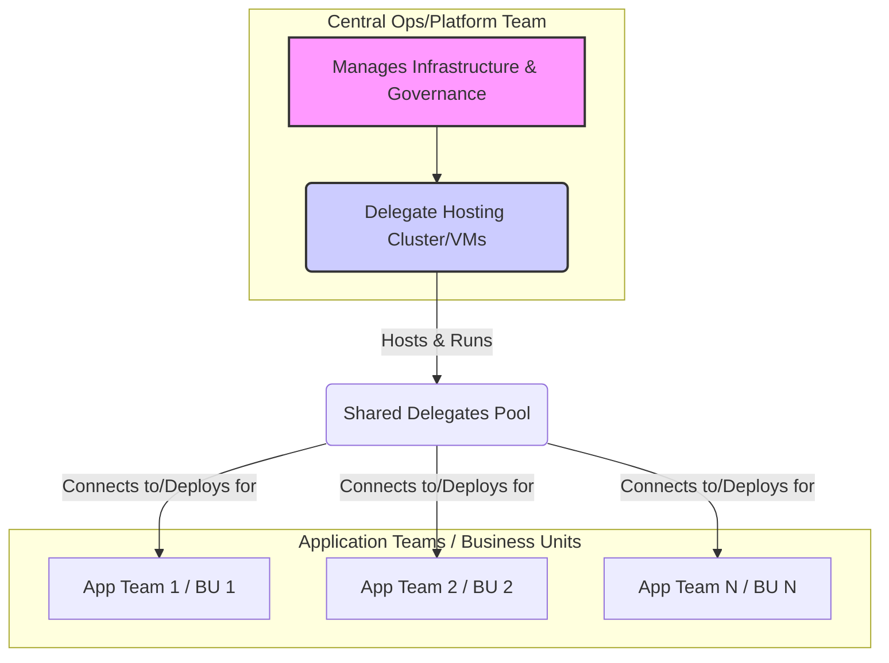
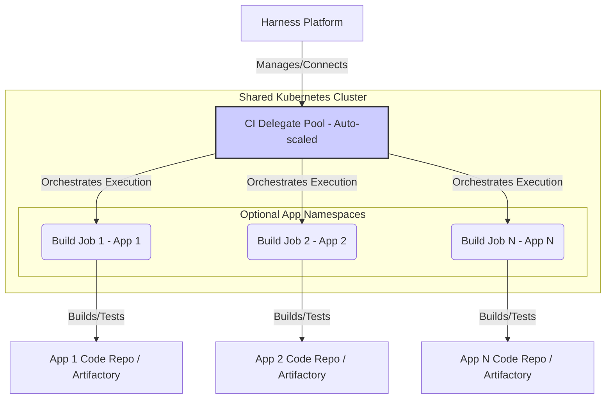
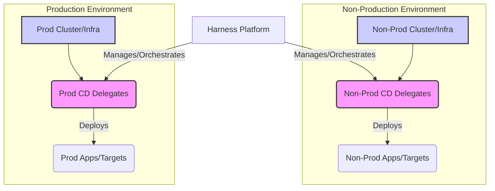
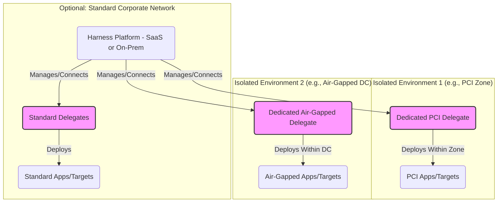

# Harness Delegate Architecture Best Practices

## Harness Delegate Overview
* [Delegate overview](https://developer.harness.io/docs/platform/delegates/delegate-concepts/delegate-overview/)

## Design considerations for choosing the right Delegate Architecture:

* Ownership and Team structure  
  * Ownership of teams over Infrastructure decisions is the most important design consideration.   
  * Having a centralized team to create, upgrade and maintain delegate hosting infrastructure enables centralized governance and distributed onboarding of Delegates  
  * Lack of Centralized practice and different BUs controlling RBAC individually needs distributed patterns  
* Performance  
  * Optimized build execution and deployment times are important design considerations.   
  * For example Delegates hosted on Serverless has additional startup time  
* Operations  
  * This covers high availability, upgrade and maintenance requirements.    
* Security  
  * Delegates need to access applications hosted in different Cloud providers and Data centers. It is an important design consideration to contain blast radius at all circumstances  
* Cost  
  * Some patterns allow efficient cost optimization strategies than others . 

<<<<<<<<< Temporary merge branch 1
## Delegate Reference Architectures & Patterns

### 1. Centralized Delegate Management

**Description:** In this model, a central operations or platform team manages the infrastructure (e.g., Kubernetes cluster, VMs) where Delegates are hosted. They handle creation, upgrades, maintenance, and governance for Delegates used across multiple application teams or business units. This promotes consistency, standardization, and potentially better resource utilization, but requires coordination.

---

### 2. Distributed Delegate Management

**Description:** Here, individual Business Units (BUs) or application teams take ownership of deploying and managing their own Delegates and the underlying infrastructure. This pattern often arises due to distinct RBAC requirements, network segmentation, or a need for autonomy. It can lead to varied configurations and potentially duplicated effort if not governed carefully.

```mermaid
%%{
  init: {
    "flowchart": {
      "subGraphTitleMargin": {
        "top": 0,
        "bottom": 20
      }
    }
  }
}%%
graph TD
    direction LR
    subgraph "Business Unit N<br>App Team N"
        E[Manages Own Infra & Delegates] --> F(Delegate Hosting N);
        F -- Hosts --> DN(Delegates BUN)
        DN -- Deploys/Builds for BUN --> AppN(Applications BUN);
    end
    subgraph "Business Unit 2<br>App Team 2"
        C[Manages Own Infra & Delegates] --> D(Delegate Hosting 2);
        D -- Hosts --> D2(Delegates BU2)
        D2 -- Deploys/Builds for BU2 --> App2(Applications BU2);
    end
    subgraph "Business Unit 1<br>App Team 1"
        A[Manages Own Infra & Delegates] --> B(Delegate Hosting 1);
        B -- Hosts --> D1(Delegates BU1)
        D1 -- Deploys/Builds for BU1 --> App1(Applications BU1);
    end

    style A color:#333,fill:#f9f,stroke:#333,stroke-width:2px
    style C color:#333,fill:#f9f,stroke:#333,stroke-width:2px
    style E color:#333,fill:#f9f,stroke:#333,stroke-width:2px
    style B color:#333,fill:#ccf,stroke:#333,stroke-width:2px
    style D color:#333,fill:#ccf,stroke:#333,stroke-width:2px
    style F color:#333,fill:#ccf,stroke:#333,stroke-width:2px
```

---

## Common patterns adapted for Delegate Architecture, pros and cons:

## Delegate Architecture Best Practices (Applicable to All modules CI/CD/CCM/STO/IACM):
=========
## Common patterns adapted for Delegate Architecture, pros and cons:

 

## Delegate Architecture Best Practices(Applicable to All modules CI/CD/CCM/STO/IACM):
>>>>>>>>> Temporary merge branch 2

1. Create a separate Application Identifier for Harness Delegate hosting Infrastructure in CMDB and Tag each Delegate with App identifier. This is extremely important and useful for efficient operations and telemetry  
2. Naming standardization is crucial for efficient Delegate Onboarding and Governance automation  
   1. Leverage BU Naming standards from CMDB or already existing asset governance  
   2. Delegate naming convention should serve as self identifier of its scope and purpose  
3. Harness recommends Auto update of base images of Delegates. Refer [Doc](https://developer.harness.io/docs/platform/delegates/install-delegates/delegate-upgrades-and-expiration/). Also configure Delegate for [Graceful Shutdown](https://developer.harness.io/docs/platform/delegates/delegate-concepts/graceful-delegate-shutdown-process/)  
4. In case “Auto update is not allowed because of security policies”  
   1. Setting up automation to create and update Base images is important for efficient operations  
   2. Scanning base image before upgrade using minimal base image ensures security  
5. Setup Delegate Onboarding Automation and Governance to add Delegates for new BUs and Applications on demand  
6. Create a BootStrap Delegate through script to avoid circular Dependency and use ‘bootstrap delegate’ to onboard delegates through automation  
7. Auto scaling is a must and leverage Managed Infrastructure like EKS or GKE with HPA/ KEDA/Karpenter/Cluster autoscaler  
8. Resort on Active-Active Setup for resiliency and optimal SLA, also use same selectors and same naming convention for Primary and DR delegates to avoid manual intervention to switch forth and back in between Primary and Secondary environments  

<<<<<<<<< Temporary merge branch 1
## CI Delegate Architecture Best Practices

### 3. Shared CI Delegate Pool (Single Cluster)

**Description:** This pattern is recommended specifically for CI (Continuous Integration). CI Delegates primarily orchestrate build tasks, which run as ephemeral jobs (e.g., Kubernetes Jobs). A single, auto-scaled pool of Delegates hosted on one Kubernetes cluster can efficiently serve many applications. Builds are triggered by the Delegate but execute independently. For cost allocation, build jobs can optionally be run in application-specific namespaces while delegates reside in a common one.

=========
 

##  CI Delegate Architecture Best Practices:
>>>>>>>>> Temporary merge branch 2

1. Single Kubernetes Cluster is recommended for hosting CI delegates since CI Delegate is a mere orchestrator. Build steps are executed as Kubernetes Jobs  
2. Same pool of Delegates can be used for all Applications in any size of Enterprise given that artifactory is cloud agnostic, auto scaling is set up  
3. If capturing cost incurred by each Application is a requirement and hindering from using common set of delegates for , Running CI Delegates in common namespace and moving Build step execution jobs to App Specific namespaces is a tip that provides optimal usage of Delegates and required insights 

<<<<<<<<< Temporary merge branch 1
## CD Delegate Architecture Best Practices

### 4. Separated Prod/Non-Prod CD Delegates (Different Clusters)

**Description:** A crucial best practice for CD (Continuous Deployment). Delegates responsible for deploying to non-production environments are hosted separately (ideally on different infrastructure/clusters) from those deploying to production. This enforces isolation, adheres to network security policies (firewalls), and reduces the risk of non-prod issues impacting production deployments.

=========
## CD Delegate Architecture Best Practices:

1. Always use separate set of Delegates for Non-prod and Prod Deployments  
2. Highly recommend to host Non-prod & Prod Delegates on different clusters adhering to the network and firewall compliance requirements  
3. Go with Distributed pattern for Apps residing in PCI compliance and Air-gapped cloud Accounts/ BUs  
<<<<<<<<< Temporary merge branch 1
4. Highly recommend to maintain source of truth for both Delegate installs and init_script
5. setup standardized catalog with security vetted init_scripts available for delegate onboarding
6. Explicit deny of CLI capabilities( aws cli, kubectl etc) on Delegates is important to contain blast-radius impact of unintended consequences of script execution  
7. Resort on just-in-time access with explicit approval if CLI access is must for any operations

### 5. Distributed CD Delegates for Isolated Environments (PCI / Air-Gapped)

**Description:** For applications residing in highly secure or isolated networks (like PCI-compliant zones or air-gapped data centers), Delegates *must* be deployed *within* that specific network boundary. These Delegates connect back to the Harness Platform (or vice-versa, depending on configuration) but perform deployment tasks locally within the isolated environment, respecting the security perimeter.

=========
4. Highly recommend to maintain source of truth for both Delegate installs and init\_script   
5. setup standardized catalog with security vetted init\_scripts available for delegate onboarding   
6. Explicit deny of CLI capabilities( aws cli, kubectl etc) on Delegates is important to contain blast-radius impact of unintended consequences of script execution  
7. Resort on just-in-time access with explicit approval if CLI access is must for any operations
>>>>>>>>> Temporary merge branch 2
