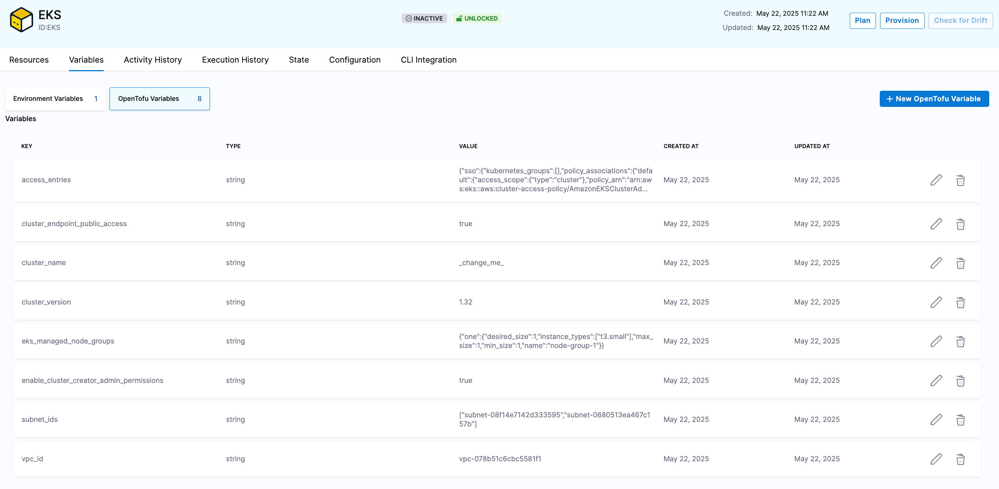

# Bootstrapping Harness Build Infrastructure with IaCM and the EKS Module

Harness Infrastructure-as-Code allows you to run your pipelines on Harness-hosted machines or self-hosted via a Kubernetes Cluster. If you do not have a cluster today but want to run your pipelines on your own infrastructure, we can use the Harness-hosted runner to provision an EKS cluster which we can then set up for running Harness builds.

## Set up GitHub and Cloud Connectors

The first thing we need to do is make sure we have connectors to resolve Terraform code and AWS credentials.

### GitHub

We will be leveraging the [AWS EKS Module for Terraform](https://github.com/terraform-aws-modules/terraform-aws-eks) to provision our build cluster so we need a connector that can resolve this repo. If you already have one in your Harness account you can skip this step. Otherwise, go to account/org/project settings and create a new "GitHub" connector.

We can chose the "Repository" type and enter the full URL to the EKS module code `https://github.com/terraform-aws-modules/terraform-aws-eks`.


For authentication you can either generate a PAT, create a GitHub app, or authorize the Harness app through OAuth.

Finally make sure you select "Connect through the Harness platform" as the connection type.


### AWS

Since we are provisioning to AWS we will need an AWS connector, and because we are using Harness hosted infrastructure we will be limited to using IAM User keys or an OIDC role. You shouldn't need to enter a backoff strategy, and make sure you select "Connect through the Harness platform" as the connection type.


## Create IaCM Workspace

A workspace in IaCM represents the Terraform code you want to provision and a single "state" or instantiation of the code. We will create a workspace that points to the AWS EKS Module source as our code, uses the AWS connector we created for access to provision, and finally some variables to actually customize the EKS cluster being deployed.

Navigate to the IaCM module and workspaces, then create a new workspace. Give it a name and be sure to enable cost estimation so we can be good stewards and know the impact we are having on the bill.


[Navigate to the module repository](https://github.com/terraform-aws-modules/terraform-aws-eks) and take a look at the most recent release.


Then select `Third-party Git Provider` and select the connector we created for the source repository, fetch by tag and enter the latest tag we saw.


Select the AWS connector you created, and what Terraform distribution to use.


Click `Save` to create the workspace.

### Add Variables

Because we are leveraging the module source as our codebase, we need to configure the module via inputs (variables) in our workspace. 

First we need to add an environment variable for setting the target AWS region:

| **Name** | **Value** |
| --- | --- |
| AWS_REGION | us-west-2 |


Next we set TF variables for the inputs to the module.

[You can view the module inputs here](https://github.com/terraform-aws-modules/terraform-aws-eks?tab=readme-ov-file#inputs) and the README also includes many examples of EKS patterns.

Below is an attempt at a minimum-input set to get an EKS cluster deployed:

| **Name** | **Value** |
| --- | --- |
| cluster_name | harness-build-infra |
| cluster_version | 1.32 |
| cluster_endpoint_public_access | true |
| vpc_id | vpc-123 |
| subnet_ids | ["subnet-123456"] |
| enable_cluster_creator_admin_permissions | true |
| eks_managed_node_groups | {"one":{"desired_size":1,"instance_types":["t3.small"],"max_size":1,"min_size":1,"name":"node-group-1"}} |



### Bootstrap with Terraform

The following is an example of creating the above IaCM workspace using the Harness Terraform provider.

You will need to change the `vpc-id` and `subnet_ids` variable.

```hcl
terraform {
  required_providers {
    harness = {
      source = "harness/harness"
    }
  }
}

variable "org_id" {
  type        = string
  description = "Organization Identifier"
}

variable "project_id" {
  type        = string
  description = "Project Identifier"
}

variable "github_connector_id" {
  type        = string
  description = "GitHub Connector Identifier"
}

variable "aws_connector_id" {
  type        = string
  description = "AWS Connector Identifier"
}

resource "harness_platform_workspace" "this" {
  name                    = "Harness Build Infra"
  identifier              = "harness_build_infra"
  org_id                  = var.org_id
  project_id              = var.project_id
  provisioner_type        = "opentofu"
  provisioner_version     = "1.9.0"
  repository              = "terraform-aws-modules/terraform-aws-eks"
  repository_sha          = "v20.35.0"
  repository_path         = ""
  cost_estimation_enabled = true
  provider_connector      = var.aws_connector_id
  repository_connector    = var.github_connector_id

  terraform_variable {
    key        = "cluster_name"
    value      = "harness-build-infra"
    value_type = "string"
  }

  terraform_variable {
    key        = "cluster_version"
    value      = "1.32"
    value_type = "string"
  }

  terraform_variable {
    key        = "cluster_endpoint_public_access"
    value      = "true"
    value_type = "string"
  }

  terraform_variable {
    key        = "vpc_id"
    value      = ""
    value_type = "string"
  }

  terraform_variable {
    key        = "subnet_ids"
    value      = jsonencode([])
    value_type = "string"
  }

  terraform_variable {
    key        = "enable_cluster_creator_admin_permissions"
    value      = "true"
    value_type = "string"
  }

  terraform_variable {
    key = "eks_managed_node_groups"
    value = jsonencode({
      one = {
        name = "node-group-1"

        instance_types = ["t3.small"]

        min_size     = 1
        max_size     = 1
        desired_size = 1
      }
    })
    value_type = "string"
  }

  environment_variable {
    key        = "AWS_REGION"
    value      = "us-west-2"
    value_type = "string"
  }
}
```

## Create IaCM Pipeline

Next create a new Harness pipeline and add an IaCM stage.


For build infrastructure we will use `Cloud`.


Set the workspace to `Runtime Input`, this will allow this pipeline to be used with other workspaces in the future.


On the execute page, select the `Provision` jumpstart.


Before the apply step, add in an IaCM approval.


Finally we can run the pipeline, and select the workspace we created above.


## Deploy the Delegate

Once the apply has completed, your cluster should be up and running.

We can authenticate to the cluster locally by using the following command:

```
aws eks update-kubeconfig --region <region> --name <cluster-name>
```

Once authentication is set (and kubectl/helm are installed) we can deploy a delegate.

Go to account/org/project settings (based on the scope in which you want this build-infra to be used) and select delegates, and then `Install New Delegate`.

The Delegate wizard will help give you the commands necessary to deploy a delegate into the cluster. Helm is the preferred method of installation here.


The delegate name should ideally be the name of the cluster you created.

Run the three commands, and your delegate should be up and running shortly!

## Create Connectors

The last step to setting up build infrastructure is to create a Kubernetes connector for the cluster.

Connectors tell Harness how to connect to platforms, in this case "how can we connect to this cluster".

You can go to account/org/project settings and select connectors, `+ New Connector`, then select `Kubernetes Cluster`


Make the name of the connector the same as the cluster name.

Select `Use the credentials of a specific Harness Delegate (IAM role, service account, etc)` as our connection method.


Make sure `Only use Delegates with all of the following tags` is selected and then chose the name of the delegate you deployed from the dropdown.

Click `Save and Continue`

### Bootstrap with Terraform

You can also create connectors using Terraform:

```hcl
resource "harness_platform_connector_kubernetes" "harness_build_infra" {
  identifier  = "harness_build_infra"
  name        = "Harness Build Infra"

  inherit_from_delegate {
    delegate_selectors = ["harness-build-infra"]
  }
}
```

Make sure the `delegate_selectors` match the name you gave the delegate.

## Using Kubernetes Build Infrastructure

Now you can create a new IaCM pipeline, but when you get to the `Infrastructure` selection, select `Kubernetes`, find the connector we created, and select a namespace (that exists already) to run our pipelines in.


This infrastructure can be used for IaCM, CI, and any container-based pipeline executions. You also now have a delegate deployed which is used in many different areas of Harness.
