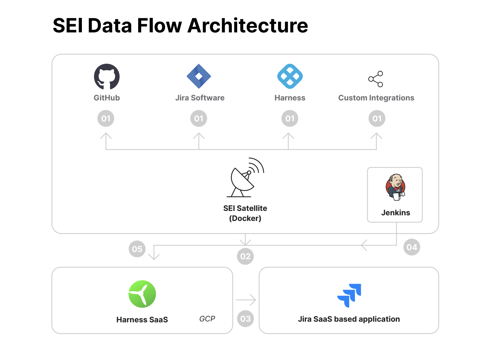
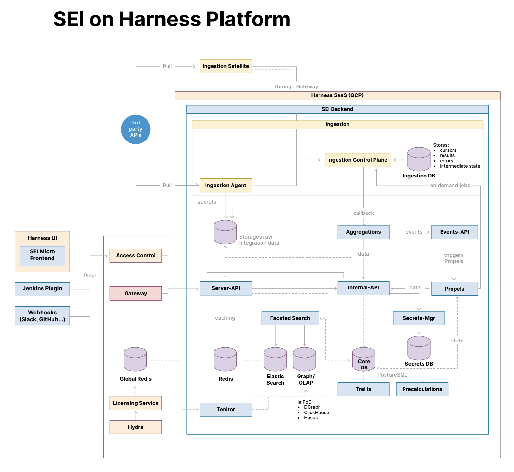
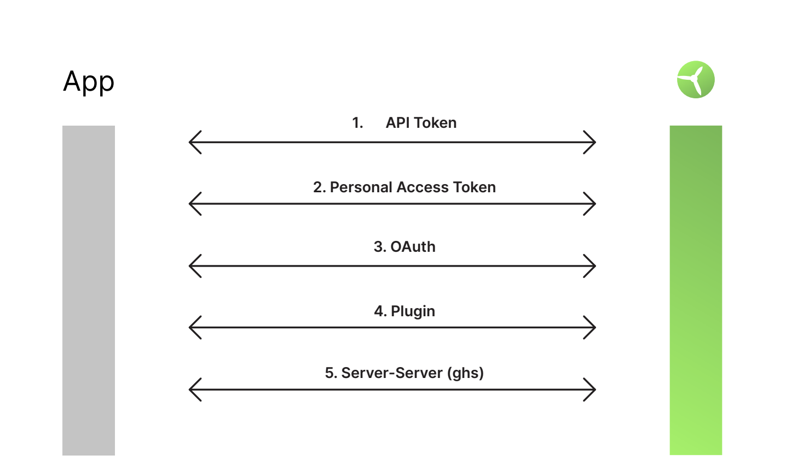

This topic outlines the architecture for the Harness Software Engineering Insights module, including its ingestion methods, integrations, and security methods.

## Data flow architecture

* The Ingestion satellite connects outbound to on-premise user systems such as JIRA and GitHub to fetch metadata via APIs.
* Authentication tokens to connect to these applications never leave the user environment
* SEI satellite makes an outbound connection to SEI SaaS APIs to post the metadata
* SEI SaaS directly connects to SaaS based SDLC tools (example JIRA Cloud or GitHub Cloud) via APIs
* SEI Jenkins Plugin is installed on user's Jenkins server. The SEI Jenkins Plugin will make an outbound connection to the SEI SaaS App (licensed users) login into Harness SEI UI portal using secure transport.

## Harness SEI architecture

## REST API Polling

* If App is on-premises version SEI Ingestion Satellite running in your premises connects to the API endpoint
* If App is SaaS version SEI connects to the SaaS APIs
* For most applications it works with the basic/default permissions

## Webhook based access

* Webhooks can only be used in forward scans
* May require Admin permissions in some Apps

## Authentication

## Data access control

