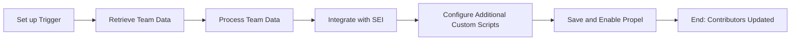
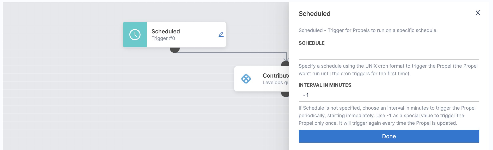
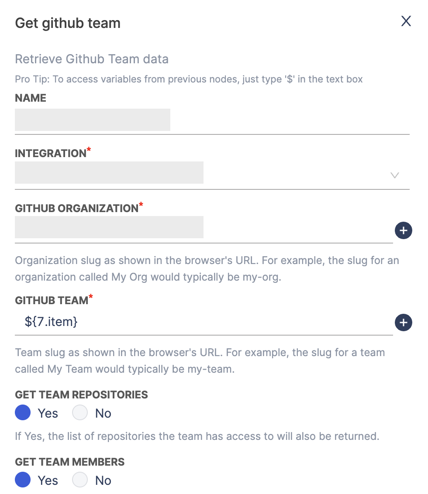
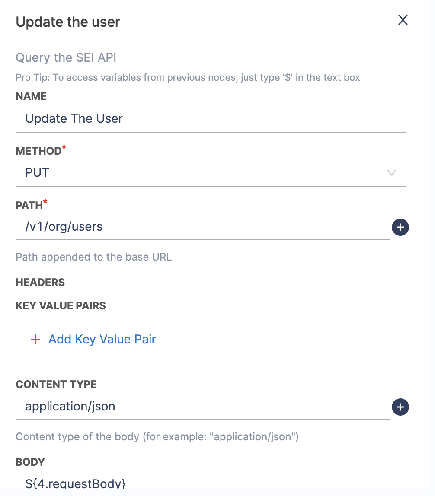
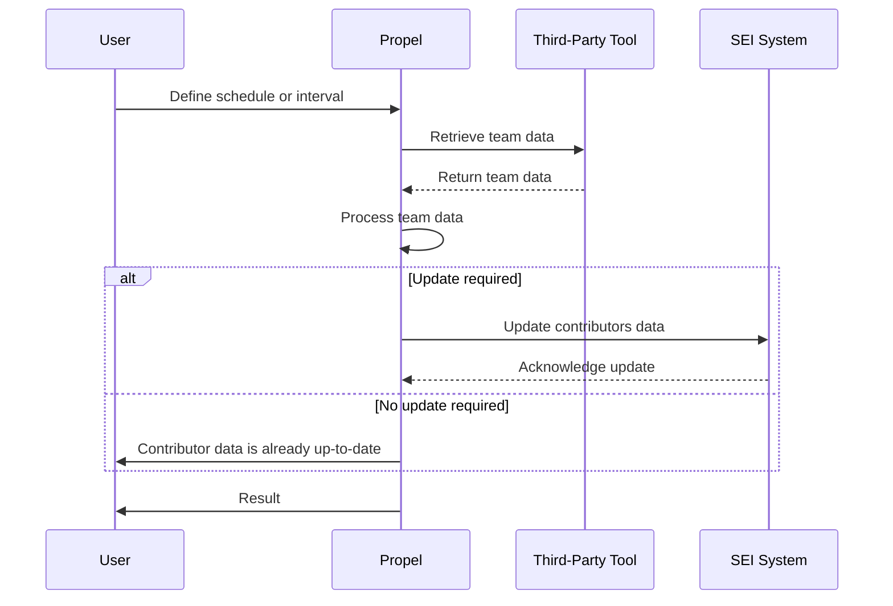

This guide outlines the process for efficiently onboarding a large number of contributors to Harness Software Engineering Insights (SEI). Contributors include developers and team members whose actions contribute to your SEI metrics and insights.

:::note Onboarding Plan
Contact [Harness Support](mailto:support@harness.io) to request a personalized, end-to-end onboarding plan for your organization. Specify your team size, timeline, and key objectives to receive a simplified experience that ensures smooth adoption of the Harness SEI module.
:::

## Step 1: Use integrations to fetch contributors data from a third party tool

Configure integrations with third-party tools. SEI automatically detects user identities and creates contributor profiles.

For detailed information on available integrations and setup instructions, go to [SEI Integrations](/docs/software-engineering-insights/sei-integrations/sei-integrations-overview). 

:::info
Please note that after adding or updating an integration, it may take up to 24 hours for the data to be fully reflected in SEI. Widgets and insights will update once synchronization is complete.
:::

## Step 2: Update the contributors list for missing details (Optional)

When you configure new integrations, SEI automatically detects user identities in your integrations and creates contributors from those identities. However, there are several reasons you might need to modify contributors, such as:

* Users don't have the same email address for all accounts.
* A user's identity wasn't detected through the integration.
* You need to populate data for custom attributes that isn't otherwise populated.

The approach for updating contributors depends on the size of your organization.

### For Small Scale Organizations

If your organization has fewer than 300 developers, you can use the CSV upload method.

To modify contributors, you must export a CSV file, edit it, and then import the edited file.

* In your **Harness project**, go to the **SEI module**, and select **Account**.
* Select **Contributors** under **Data Settings**.
* Select **Import and Export Contributors**.
* Select **Export Existing Contributors** or, if you don't yet have any contributors, select **Export Sample CSV**.
* Open the CSV file and edit the data accordingly.
* Go back to the **Contributors** page in SEI, and select **Import and Export Contributors**.
* Select **Import Contributors**, and upload your modified CSV file.

If you need to manually add a contributor, and add a row for each new contributor. At minimum, you must provide a name and email for the contributor to be valid.

### For Large-Scale Organizations

Organizations with large developer teams (500-2000+) can leverage Propels, SEI's automation framework, to automate contributor data updates. Propels allow you to create custom workflows to interact with various services.



Here's an example of how you can create a Propel to automatically update contributor data from third-party tools:

1. **Set up the Trigger:** Define a schedule (cron format) or interval for the Propel to run periodically. This can be done using a scheduled trigger in the Propel configuration.



2. **Retrieve Team Data:**
   - Use a node to connect to the third-party tool (e.g., GitHub) and retrieve team data. Ensure that the integration is set up with the necessary credentials and permissions.
   - Configure the node with necessary credentials and permissions.
   - Set up the API request to fetch contributor data.



3. **Process Team Data:**
   - Use a scripting node to process the retrieved team data. This can involve extracting specific details like Contributor Team, Manager and other information.
   - Implement custom logic as needed to format or transform the data according to your requirements. For example, create an array of all team members:

```golang
function handleNode(context) {
  const members = JSON.parse(context.getParam('members'));
  const allMembers = members.map(member => member.login);
  
  return { 
    state: 'success',
    output: { 
      allMembers: allMembers
    } 
  };
}
```

4. **Integrate with SEI:**
   - Use a SEI Query node to make API calls to SEI for updating contributor information.
   - Configure the API call to update or create contributors. 



5. **Configure additional Custom Script nodes**
   - You can configure more Custom Script nodes if additional processing is required. You can pass relevant data from the previous nodes as input parameters.

6. **Finalize and Test:**
   - Review the Propel configuration to ensure all nodes are correctly set up and connected.
   - Test the Propel to verify it retrieves and processes data correctly, handling errors as configured.

7. **Save the Propel:**
   - Once testing is complete, enable the Propel to run on the defined schedule or trigger.

Note that this is a high-level overview of how you can use a Propel to update the Contributors data automatically. Specific implementation details will vary based on the chosen tool and SEI system configurations.





:::info License Utilization
A Contributor is counted as a licensing unit if they have at least one user account associated with an integrated Source Code Management (SCM) tool, such as GitHub, GitLab, Bitbucket or any other. For more information, go to [SEI Subscriptions and Licenses](/docs/software-engineering-insights/get-started/sei-subscription-and-licensing)
:::