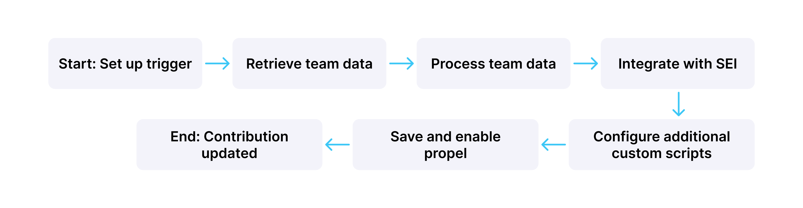
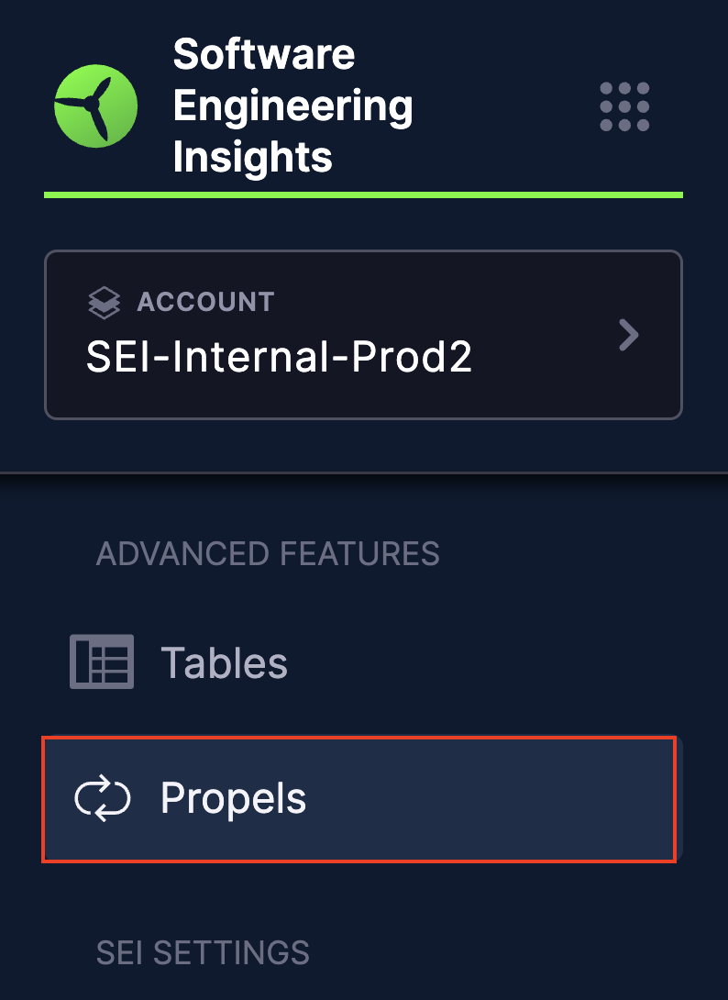
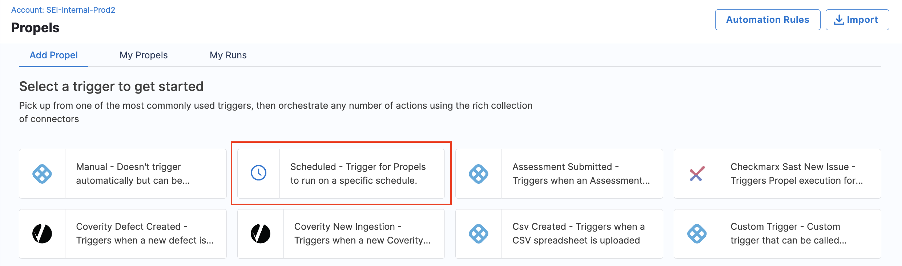
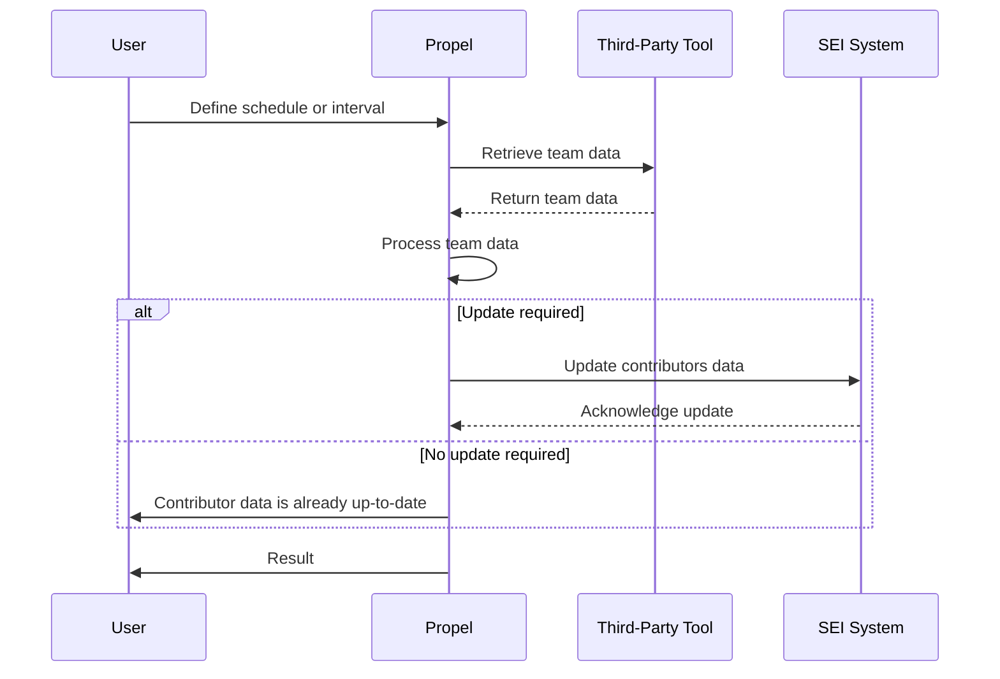

This guide outlines the process for efficiently scaling your teams on Harness Software Engineering Insights (SEI). Contributors include developers and team members whose actions contribute to your SEI metrics and insights.

:::note Onboarding Plan
Contact [Harness Support](mailto:support@harness.io) to request a personalized, end-to-end onboarding plan for your organization. Specify your team size, timeline, and key objectives to receive a simplified experience that ensures smooth adoption of the Harness SEI module.
:::

## Step 1: Use integrations to fetch contributors data from your SDLC tools

SEI can automatically detect user identities and create contributor profiles by integrating with your existing SDLC tools such as [Jira](/docs/software-engineering-insights/sei-integrations/automated-integrations/sei-jira-integration), [Github](/docs/software-engineering-insights/sei-integrations/automated-integrations/sei-github-integration) etc. For detailed information on available integrations and setup instructions, go to [SEI Integrations](/docs/software-engineering-insights/sei-integrations/sei-integrations-overview).

:::info
Please note that after adding or updating an integration, it may take up to 24 hours for the data to be fully reflected in SEI. The contributor list, reports and insights will update once synchronization is complete.
:::

## Step 2: Update the contributors list for missing details

When you configure new integrations, SEI automatically detects user identities in your integrations and creates contributors from those identities. However, there are several reasons you might need to modify contributors, such as:

* Users don't have the same email address for all accounts.
* A user's identity wasn't detected through the integration.
* You need to populate data for custom attributes that isn't otherwise populated.

This is an optional step but recommended for using SEI Profiles, Collections and License Utilization. The approach for updating contributors depends on the size of your organization.

### Case 1: Scale SEI for Small Scale Organizations

If your organization has fewer than 300 developers, you can use the CSV upload method.

To modify contributors, you must export a CSV file, edit it, and then import the edited file.

* In your **Harness project**, go to the **SEI module**, and select **Account**.
* Select **Contributors** under **Data Settings**.
* Select **Import and Export Contributors**.
* Select **Export Existing Contributors** or, if you don't yet have any contributors, select **Export Sample CSV**.
* Open the CSV file and edit the data accordingly.
* Go back to the **Contributors** page in SEI, and select **Import and Export Contributors**.
* Select **Import Contributors**, and upload your modified CSV file.

If you need to manually add a contributor, and add a row for each new contributor. At minimum, you must provide a name and email for the contributor to be valid.

### Case 2: Scale SEI for Large-Scale Organizations

Organizations with large developer teams (300-2000+) can use Propels, SEI's automation framework, to automate contributor data updates. Propels allow you to create custom workflows to interact with various services.



:::note Recommendation
It is recommended to work closely with [Harness Support](mailto:support@harness.io) when setting up Propels to automate contributor data updates. The Harness team can provide support and ensure the Propel is configured correctly for your specific use case and SEI system setup.
:::

Here's an example of how you can create a Propel to automatically update contributor data from a third-party tool:

#### Step 1: Create a new Propel

* In your **Harness Project**, select the **SEI Module**, and go to your **Account**.
* Select **Propels** under **Advanced Features** to create a new workflow automation.



#### Step 2: Set up the Trigger

* Choose **Scheduled** as the trigger type for the Propel.



* Define the schedule (cron format) or interval for the Propel to run periodically. This can be done using a scheduled trigger in the Propel configuration.


#### Step 3: Retrieve Team Data

* Add a node to connect to the third-party tool (e.g., GitHub) and retrieve team data.
* Connect it to the output of the **Trigger node**.
* Configure the node with necessary credentials and permissions.
* Set up the **API request** to fetch contributor data.


:::info
Note that if you're if you're fetching data from a tool for which an integration already exists in SEI (e.g., GitHub), ensure that the integration is set up with the required credentials and permissions.
:::

#### Step 4: Process Team Data

* Add a **Custom Script node** to process the retrieved team data. This can involve extracting specific details like Contributor Team, Manager and other information.
* Connect it to the output of the previous node.
* Implement custom logic as needed to format or transform the data according to your requirements. For example, create an array of all team members:

```golang
function handleNode(context) {
  const members = JSON.parse(context.getParam('members'));
  const allMembers = members.map(member => member.login);
  
  return { 
    state: 'success',
    output: { 
      allMembers: allMembers
    } 
  };
}
```

#### Step 5: Integrate with SEI

* Use a **SEI Query node** to make API calls to SEI for updating contributor information.
* Connect it to the output of the **Custom Script node**.
* Configure the API call to update or create new contributors.


#### Step 6: Configure additional Custom Script nodes

* Based on your requirements you can add more **Custom Script** nodes to the **Propel workflow** if additional processing is required. You can pass relevant data from the previous nodes as input parameters.

#### Step 7: Test the Propel

* Review the **Propel configuration** to ensure all nodes are correctly set up and connected.
* Test the Propel to verify it retrieves and processes data correctly, handling errors as configured.

#### Step 8: Save the Propel

Once testing is complete, enable and save the Propel to run on the defined schedule or trigger.

This Propel will now run periodically and automatically update the Contributors data in SEI with the necessary information. This allows you to efficiently scale the management of contributors in Harness SEI, ensuring your team's data is accurately represented and your insights remain up-to-date.

:::info
Note that this is a high-level overview of how you can use a Propel to update the Contributors data automatically. Specific implementation details will vary based on the chosen tool and SEI system configurations.
:::

The diagram below represents the end-to-end data interactions for the Propel example:



:::info License Utilization
A Contributor is counted as a licensing unit if they have at least one user account associated with an integrated Source Code Management (SCM) tool, such as GitHub, GitLab, Bitbucket or any other. For more information, go to [SEI Subscriptions and Licenses](/docs/software-engineering-insights/get-started/sei-subscription-and-licensing)
:::