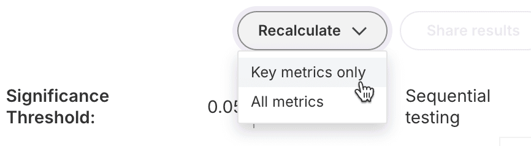

### 2024-09-11
#### Metrics
##### Recalculate Key Metrics Only
When requesting a manual recalculation of metrics, you can reduce the computation time by limiting the recalculation to Key metrics. To select this faster path to results, click the **Recalculate** button and then click **Key metrics only**. If you prefer to recalculate Key, Supporting, and Guardrail metrics, click **All metrics** instead.

Reminder: Key, Supporting, and Guardrail metrics are automatically calculated on a schedule, starting five minutes after a feature flag change and going to progressively longer intervals until the last automated calculation at 28 days. You do not need to press the Recalculate button unless you want to kick off a calculation before the next scheduled run or after the 28-day mark.
Learn more in our docs:
- [Automated calculation frequency](https://help.split.io/hc/en-us/articles/360020844451-Metrics-impact-tab#01J7EY70WAJTZ8NK9K3R1Q70Y8)
- [Manually recalculating metrics](https://help.split.io/hc/en-us/articles/360020844451-Metrics-impact-tab#manually-recalculating-metrics)
