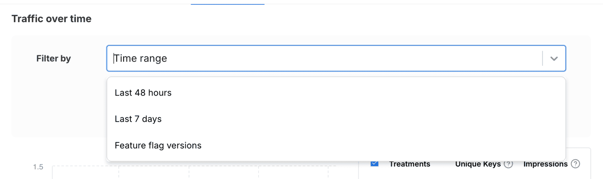

### 2024-09-12
#### Monitoring
##### Traffic Insights and Alerts
The **Alerts** tab has been renamed **Monitoring** and expanded to show real-time traffic insights over time and any alerts fired for the flag on a single page.

By default, traffic over the **Last 48 hours** is shown, but you may also select the **Last 7 days**, another **Time range**, or a specific **Feature flag version**:

Changes made to flags (i.e., new flag versions) are displayed as vertical bars for context:

For more information, have a look at the [Monitoring tab docs](https://help.split.io/hc/en-us/articles/30098162579853-Monitoring-tab).
