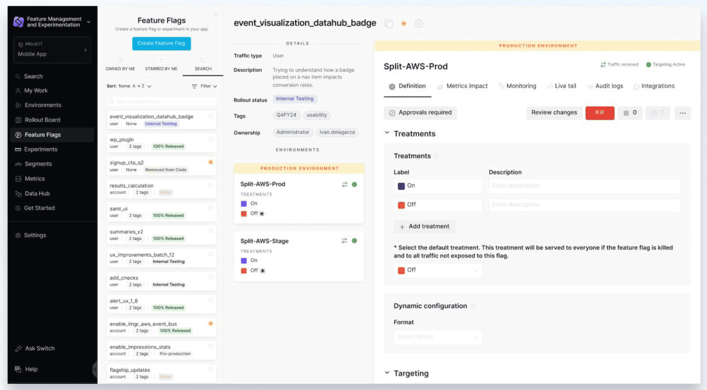

### 2024-09-30
#### Better Together: Split + Harness
##### New Colors, Names for Organization and Workspace
Starting on September 30th, we began a progressive rollout to update the Split UI, bringing it closer to the look of Harness:

Beyond a change in color scheme, you will also see two changes to **terminology**:
- **Workspaces** will now be known as **Projects** in the UI
- **Organizations** will now be known as **Accounts** in the UI

Note: These terminology changes are being made only to labels in the UI at this time. To avoid introducing a breaking change, the [Admin API](https://docs.split.io/reference/introduction) will continue to use the strings ws, workspace, organizationId, and orgId until further notice.
