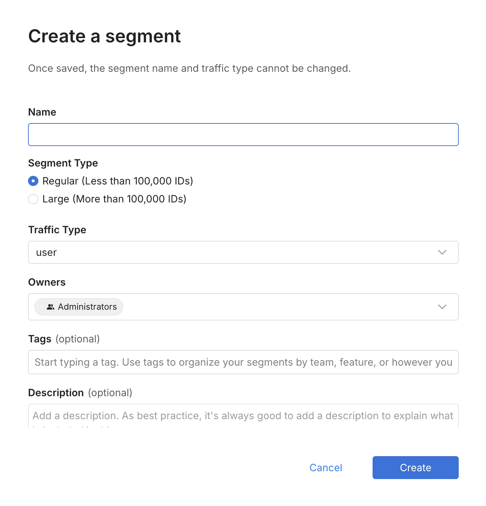

### 2025-01-07
#### Targeting
##### Large segments
Harness Feature Management and Experimentation (FME) now supports "Large segments" (lists of targeting IDs) that can contain more than 100,000 IDs.
Large segments support multiple use cases where bulk targeting of specific IDs is required:
- Communicating with more than 100,000 specific customers in-app after an incident.
- Targeting any set of users based on attributes not available within the app at runtime.
- Performing large-scale A/B tests on specific user bases, exported from external tools.
Effective immediately, Enterprise tier customers may create and use Large segments containing up to one million (1,000,000) IDs. Significantly higher limits are available by request.

Learn more about Large segments and the ways they differ from Standard segments in the documentation:
- [Create a segment](https://help.split.io/hc/en-us/articles/360020407512-Create-a-segment)
- [Target segments](https://help.split.io/hc/en-us/articles/360020525252-Target-segments)
Note: The initial release of Large segments is focused on client-side SDK usage only. Server-side SDKs do not yet support Large segments, but soon will. Until they are supported, evaluations of feature flags that target Large segments will return control on server-side SDKs.
##### Admin API Endpoints
After familiarizing yourself with Large segments at the above links, you may find these UI and API equivalent documentation links handy for automating the steps via the Admin API:
###### Steps for creating and populating a Large segment using either UI or API
1. Create a Large segment (just **metadata**, no Environment definition)
- [UI steps](https://help.split.io/hc/en-us/articles/360020407512-Create-a-segment#creating-a-segment) (select Large)
- [API steps](https://docs.split.io/reference/createlargesegment)
2. Create a **definition** for a Large segment in an Environment (no user IDs)
- [UI steps](https://help.split.io/hc/en-us/articles/360020407512-Create-a-segment#adding-user-ids-to-a-segment) (step 3)
- [API steps](https://docs.split.io/reference/createlargesegmentinenvironment)
3. Add **user IDs** to a Large segment (to the definition created in step 2)
- [UI steps](https://help.split.io/hc/en-us/articles/360020407512-Create-a-segment#file-import-for-large-segments) 
- [API steps](https://docs.split.io/reference/create-change-request#open-change-request-to-add-members-to-a-large-segment)
###### Adding an approval step via Admin API
To add an approval step for Large segment creation or update when using the Admin API, reference this example:  [Open Change Request to add members to a Large Segment](https://docs.split.io/reference/create-change-request#open-change-request-to-add-members-to-a-large-segment).
