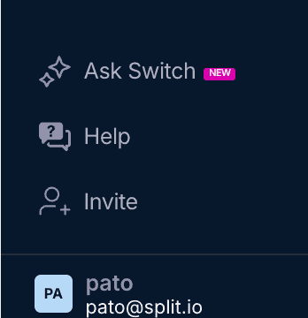

### 2025-01-08
#### Release Agent (AI Chatbot)
##### AI-Generated Summary Now Supports Follow-Up Questions
The "Switch" AI chatbot in Harness Feature Management and Experimentation (FME) has been renamed to "Release Agent" and now supports follow-up questions after you click "Summarize" in metric details.
To see the Metric summary and ask follow-up questions:
1. Drill into a metric tile on a Metrics impact dashboard and click **Summarize**.
2. After viewing the summary, type your follow-up question and click **Continue conversation in Release Agent**.
3. Continue to ask additional follow-up questions if you would like, including suggestions for next steps.

Note: the transition from "Switch" to "Release Agent" will take place gradually.  For now, you'll still see **Ask Switch** in the lower left navigation of Harness Feature Management and Experimentation:

##### Related documentation
- [Metric details and trends](https://help.split.io/hc/en-us/articles/360025376251-Metric-details-and-trends)
- [Switch AI assistant](https://help.split.io/hc/en-us/articles/21188803158157-Switch-AI-assistant)
