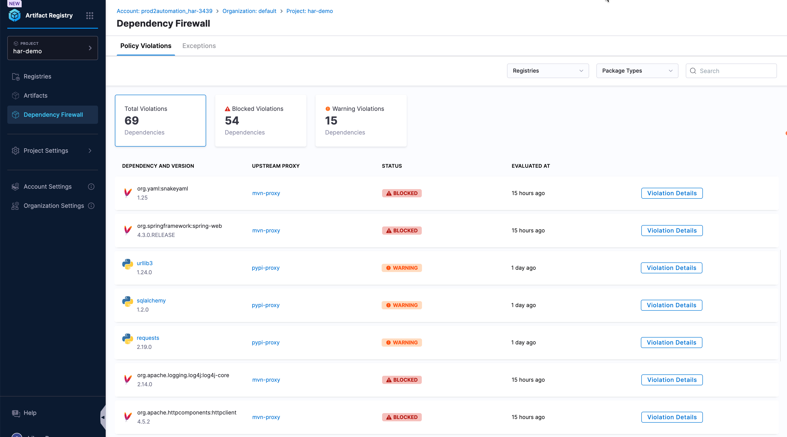
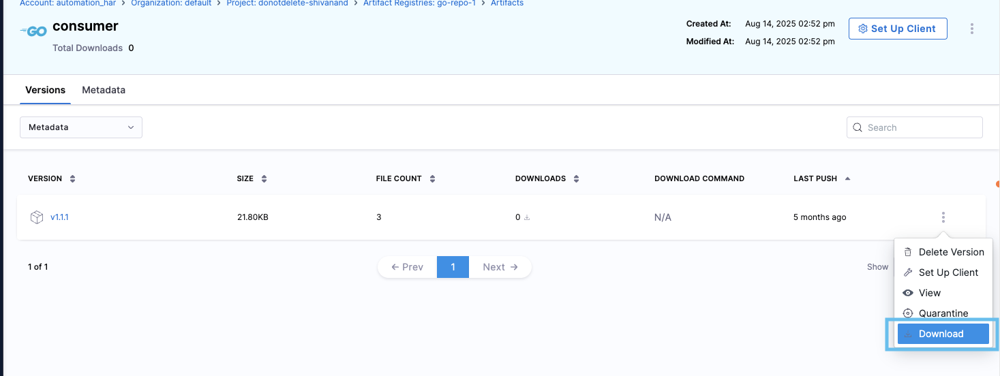

import Tabs from '@theme/Tabs';
import TabItem from '@theme/TabItem';
import ReleaseNotesSearch from '@site/src/components/ReleaseNotesSearch';

<DocsButton icon = "fa-solid fa-square-rss" text="Subscribe via RSS" link="https://developer.harness.io/release-notes/artifact-registry/rss.xml" />

The release notes describe recent changes to Harness Artifact Registry.

<ReleaseNotesSearch />

:::info About Harness Release Notes

- **Security advisories:** Harness publishes security advisories for every release. Go to the [Harness Trust Center](https://trust.harness.io/?itemUid=c41ff7d5-98e7-4d79-9594-fd8ef93a2838&source=documents_card) to request access to the security advisories.
- **More release notes:** Go to [Harness Release Notes](/release-notes) to explore all Harness release notes, including module, delegate, and Self-Managed Enterprise Edition release notes.

:::

## 📌 Release Deployment Status by Cluster

**Progressive deployment:** Harness deploys changes to Harness SaaS clusters on a progressive basis. This means that the features described in these release notes may not be immediately available in your cluster. To identify the cluster that hosts your account, go to your **Account Overview** page in Harness. In the new UI, go to **Account Settings**, **Account Details**, **General**, **Account Details**, and then **Platform Service Versions**.

## March 2026

### 2026.3.v1

#### New Features

**Maven plugin for Artifact Registry**

The **Harness Maven plugin** (`io.harness.maven:harness-maven-plugin`) lets you publish JARs, WARs, POMs, and related artifacts from your Maven build—no one-off scripts or manual uploads. It fits the standard Maven lifecycle, supports **parallel-friendly deployments** for multi-module projects, and can **enforce dependency resolution through Harness upstream proxies** so builds pull through the registries you govern.

- **Deploy from Maven**: Bind the `deploy` goal and push artifacts to Harness using the same coordinates and repositories your teams already use.
- **Credentials via environment variables**: Keep tokens out of `pom.xml` by configuring Harness registry URL and identity token through environment variables in CI and local workflows.

Learn more in the [Build plugins overview](/docs/artifact-registry/build-plugins/overview); open the **Maven Plugin** tab there for installation and configuration.

**Gradle plugin for Artifact Registry**

The **Harness Gradle plugin** (`io.harness.gradle`) hooks into `./gradlew publish`: Harness uploads artifacts to Artifact Registry in **parallel** for faster multi-module builds and reads **registry URL and credentials from environment variables** so secrets stay out of Gradle scripts and source control.

- **Drop-in Gradle workflow**: Apply the plugin in the root or subprojects and keep using your existing publish tasks.
- **Built for CI**: Matches how Gradle projects already inject registry configuration in pipelines.

Learn more in the [Build plugins overview](/docs/artifact-registry/build-plugins/overview); open the **Gradle Plugin** tab there for installation and configuration.

## February 2026

### 2026.2.v1

#### New Features

**Dependency Firewall**

We're excited to ship **Dependency Firewall** in Harness Artifact Registry—a major step forward for software supply chain security. Until now, risky or non-compliant packages could flow into your organization through upstream proxies with little gatekeeping at the registry boundary. Dependency Firewall changes that: it evaluates **every** artifact version pulled from an external source **before** it is cached in your upstream proxy registry, using the same [Policy as Code](/docs/platform/governance/policy-as-code/harness-governance-overview) and OPA-style policies you already trust elsewhere in Harness.

- **Policy at the front door:** CVSS thresholds, license rules, package age, and custom Rego policies can allow, warn on, or block versions automatically—so violations are caught when dependencies are first fetched, not after they have spread across builds.
- **Clear outcomes:** Each evaluation is **Passed**, **Warning**, or **Blocked**. In **Block** mode, non-compliant versions are never cached and cannot be downloaded or used; **Warn** mode helps you roll out policies safely while you refine rules.
- **Built for operators:** Enable the firewall on your upstream proxy, attach policy sets, pick **Block** or **Warn**, and track everything from the **Dependency Firewall** tab—no separate toolchain required.

:::note Feature flag

Dependency Firewall is behind the feature flag `HAR_DEPENDENCY_FIREWALL`. Contact [Harness Support](mailto:support@harness.io) to enable it.

:::

Learn more in the [Dependency Firewall overview](/docs/artifact-registry/dependency-firewall/overview), [enable Dependency Firewall](/docs/artifact-registry/manage-registries/configure-registry#enable-dependency-firewall) in registry configuration, [configure policies and policy sets](/docs/artifact-registry/dependency-firewall/configure-policies), and the tutorial [Implement Dependency Firewall with OPA policies](/docs/artifact-registry/tutorials/dependency-firewall-opa-policies).

**Python registry: Poetry and uv**

Harness Python registries now document first-class workflows for **[Poetry](https://python-poetry.org/)** and **[uv](https://docs.astral.sh/uv/)**—including publishing, installing, and authenticating with identity tokens—alongside existing **pip** instructions. Use the same `pkg.harness.io` endpoints and tokens as for pip; Poetry and uv integrate through explicit sources, `pyproject.toml`, and lockfiles your teams may already use.

Follow the **poetry** and **uv** tabs in the embedded guide on [Get started with Artifact Registry](/docs/artifact-registry/get-started/quickstart) (select **Python** in the format selector) for copy-ready commands.

#### Enhancements & Fixes

**Harness CLI: Dependency Firewall audit, explain, and npm client configuration**

The Harness CLI (`hc`) streamlines Artifact Registry operations for security and local client setup:

- **`hc registry fw audit`** (alias `hc registry firewall audit`): Parse lock and manifest files and evaluate dependencies in bulk against Dependency Firewall policies. Supported inputs include NPM, Java (Maven and Gradle), and **Python** files such as `requirements.txt`, `pyproject.toml`, `Pipfile.lock`, and **`poetry.lock`**.
- **`hc registry fw explain`**: Return firewall scan status (**Passed**, **BLOCKED**, or **WARN**) and details for a specific package version already present in a registry.
- **`hc registry configure npm`**: Write Harness registry URLs and authentication into `.npmrc` for default, scoped, global, or project-level npm configuration.

Learn more in [Manage artifacts and registries with the CLI](/docs/artifact-registry/artifact-registry-cli/manage-artifacts-registries): [Audit dependencies from lock files](/docs/artifact-registry/artifact-registry-cli/manage-artifacts-registries#audit-dependencies-from-lock-files), [Get firewall status for an artifact version](/docs/artifact-registry/artifact-registry-cli/manage-artifacts-registries#get-firewall-status-for-an-artifact-version), and [Configure npm client](/docs/artifact-registry/artifact-registry-cli/manage-artifacts-registries#configure-npm-client).

## January 2026

### 2026.1.v1

#### New Features

**Artifact Download from UI**

Harness Artifact Registry now supports downloading artifacts directly from the UI. You can download all versions of an artifact, specific versions, or individual files. The system prepares your download as a compressed archive and displays a status indicator at the bottom center of the page. Once ready, downloads remain available for 24 hours.

This feature works seamlessly with Docker digests and all supported artifact types, making it easy to retrieve artifacts for offline use, backup, or distribution.

Learn more about [downloading artifacts from the UI](/docs/artifact-registry/manage-artifacts/artifact-management#download-an-artifact).

**Native CI Integration for Artifact Upload**

We've introduced a new **native Upload Artifact to Harness Artifact Registry step** in Harness CI pipelines, making it easier than ever to publish build artifacts directly to Harness Artifact Registry without custom scripts or third-party plugins.

**What's new:**
- **Built-in CI step**: New "Upload Artifacts to Harness Artifact Registry" step available in all CI pipelines
- **Multi-format (non-OCI) support**: Upload artifacts in formats such as Maven JARs, npm packages, Python wheels, Conda packages, Generic artifacts, and more

This native integration streamlines your CI/CD workflows by eliminating the need for custom scripts and manual authentication setup. Simply add the step to your pipeline, configure your target registry, and let Harness handle the rest.

Learn more about the [native CI integration for Artifact Registry](/docs/artifact-registry/platform-integrations/ci-ar-integrations).

#### Enhancements & Fixes

**Enhanced CLI Capabilities for Artifact Registry**

The Harness CLI (`hc`) now includes expanded functionality for managing artifacts and registries:

- **Metadata Management**: Set, get, and delete custom metadata on registries, packages, and specific versions. Use metadata for tagging environments, tracking ownership, managing approval workflows, and maintaining compliance information.

- **Artifact Copy**: Copy specific versions of artifacts between registries within your Harness Artifact Registry, with support for artifact type specification (e.g., model, dataset).

- **Artifact Version Delete**: Delete specific versions of artifacts or all versions of an artifact. This provides granular control over artifact lifecycle management.

- **Registry Delete**: Remove entire registries from your projects through the CLI.

- **Python and NuGet Support**: Manage Python (PyPI) and NuGet packages directly from the command line.

These enhancements provide a consistent CLI experience across all supported registry types, making it easier for development teams to integrate Harness Artifact Registry into their existing workflows and automation pipelines.

Learn more about [managing artifacts and registries with the CLI](/docs/artifact-registry/artifact-registry-cli/manage-artifacts-registries).

## December 2025

### 2025.12.v1

#### New Features

**PHP Composer Registry Support**

Harness Artifact Registry now supports PHP Composer packages, providing a secure, private registry for your PHP dependencies. You can store, manage, and distribute Composer packages directly within Harness with full compatibility with the Composer package manager.

**Key benefits:**
- **Private package hosting**: Host your proprietary PHP libraries and internal packages securely
- **Upstream proxy support**: Cache packages from Packagist and other public repositories to accelerate builds and reduce external dependencies
- **Version management**: Full support for semantic versioning and package constraints

To learn more about how to use Harness Artifact Registry with PHP Composer, check out our [Composer Registry documentation](/docs/artifact-registry/get-started/quickstart/#composer).

#### Enhancements & Fixes

**Python PyPI Upstream Proxy Enhancements**

Python PyPI upstream proxy configuration now supports specifying a custom registry suffix for non-standard PyPI endpoints. This allows platform teams to integrate private PyPI repositories and enterprise artifact managers such as Artifactory, Nexus, or self-hosted PyPI mirrors that do not expose packages under the default `/simple/` path.

You can configure a remote registry URL, optionally define a custom registry suffix, and choose the appropriate authentication method. Harness transparently proxies Python packages from these upstream registries while handling authentication and package resolution.

## November 2025

### 2025.11.v2

#### New Features 

**Metadata Support for Artifacts and Registries**

Now enhance your artifact management with custom metadata! You can now attach key-value pairs to registries, artifacts, and packages, enabling better organization, searchability, and governance across your artifact ecosystem.

**Key capabilities:**
- **Multi-level metadata**: Add metadata at registry, artifact, and package (version) levels
- **Flexible filtering**: Search and filter artifacts using custom metadata attributes
- **Custom attributes**: Track ownership, environment tags, build information, security classifications, and more
- **Enhanced governance**: Maintain audit trails and compliance information with version-specific metadata

:::note
This feature is currently behind the feature flag `HAR_CUSTOM_METADATA_ENABLED`. Contact Harness Support to enable it.
::: 

To learn more about how to use Harness Artifact Registry to store and manage artifacts with custom metadata, check out our [Metadata Support for Artifacts and Registries](https://developer.harness.io/docs/artifact-registry/metadate-registry)

**Dart Registry Support**

Harness Artifact Registry now supports Dart packages with full pub.dev compatibility. You can store, manage, and distribute Dart packages directly within Harness, with complete support for versions, metadata, and immutable release behaviour.

**Key benefits:**

- **Secure, private Dart registry**: Provides a dedicated, secure registry for all your teams' Dart packages
- **Immutable versions**: Ensures immutable package versions matching pub.dev behaviour for safe, predictable builds
- **Accelerated CI/CD**: Speeds up builds by caching remote dependencies via upstream proxy, reducing external dependencies and improving reliability

To learn more about how to use Harness Artifact Registry to store and manage Dart packages, check out our [Dart Registry Quickstart guide](https://developer.harness.io/docs/artifact-registry/get-started/quickstart/#dart).

#### Enhancements & Fixes

**Download Button for Non-OCI Artifacts**

You can now directly download any non-OCI artifact (Maven, npm, PyPI, Generic, Conda, Helm charts, etc.) from the Artifact Registry UI with a single click.
Until now, retrieving individual files or packages required using CLI commands or configuring a package manager client. For many workflows: debugging, validation, quick inspections, and offline analysis, users simply want to grab the file instantly.

### 2025.11.v1

#### New Features

**Artifact Registry management via CLI**

We're thrilled to introduce comprehensive CLI support for Artifact Registry management through the new Harness CLI v1.0.0 (`hc`)! This powerful addition brings the full capabilities of Artifact Registry directly to your terminal, enabling seamless automation and developer-friendly workflows.

<DocImage
  path={require('./static/artifact-registry/reg-list.png')}
  alt="Registry List"
  title="Click to view full size image"
  width="80%"
/>

**What's new:**
- **Registry Management**: List, view, and manage your registries with intuitive commands like `hc registry list` and `hc registry get`
- **Artifact Operations**: Push, pull, and list artifacts across all your registries using `hc artifact` commands
- **Developer-Friendly Aliases**: Save time with short commands - use `hc reg` instead of `hc registry` and `hc art` instead of `hc artifact`
- **Flexible Output Formats**: Get results in JSON, YAML, or table format for easy parsing in scripts and automation pipelines
- **Cross-Project Support**: Work seamlessly across multiple projects with global flags like `--project` and `--org`

Install the new Harness CLI v1.0.0 (`hc`) and authenticate to your account to start managing your registries and artifacts from the command line. Check out our [CLI documentation](https://developer.harness.io/docs/artifact-registry/artifact-registry-cli/manage-artifacts-registries) for detailed examples and best practices.

**Conda Registry Support**

We have added a new registry type, Conda Registry support, for Python and R package management. 

**Key capabilities:**
- **Native Conda client support**: Works with `conda` and `mamba` out of the box
- **Bioconda upstream proxy**: Automatically configured to fall back to Bioconda's public repository, giving you access to thousands of packages
- **Hybrid package management**: Host your private packages while proxying public ones from Bioconda
- **Channel organization**: Organize packages into channels for better version control and distribution

Configure your Conda client to point to your Harness registry, and you're ready to go - private packages are served directly while public packages are fetched from Bioconda automatically (If some custom source is not configured).

Do refer to [Conda Registry Quickstart](https://developer.harness.io/docs/artifact-registry/get-started/quickstart#conda) for more details.

#### Enhancements & Fixes

**Upstream Proxy to aggregate multiple Artifact Registries**

We have enhanced our Artifact Registry experience by allowing it to be configured as an upstream proxy, enabling you to aggregate multiple registries into a single, unified access point. Use any Harness Artifact Registry as an upstream proxy for their respective registry.

When adding an Artifact Registry as an upstream proxy, ensure that registry doesn't have its own upstream proxies configured to avoid circular dependencies.

:::note
This feature is currently behind the feature flag `HAR_SUPPORT_LOCAL_REGISTRY_AS_UPSTREAM_PROXY`. Contact Harness Support to enable it.
:::

To know more about [Set Proxy for Registry](/docs/artifact-registry/manage-registries/configure-registry#set-proxy-for-registry)

## October 2025

### 2025.10.v1

#### Enhancements and Fixes

**Public Registry**

Users can now define the visibility of an artifact registry as **Private** or **Public**. This enhancement allows better control over access to registry contents and image pulls. 
>By default, all registries are created as **Private**.

* **Public registries** make the registry contents and images accessible to all users external to your organization.
* **Private registries** restrict both visibility and image pulls to authorized users or service accounts with valid permissions or tokens.

:::note
To enable public artifact registries, the feature flag **`PL_ALLOW_TO_SET_PUBLIC_ACCESS`** must be activated. Contact **Harness Support** to enable it. After activation, navigate to **Account Settings > Authentication** and enable **Allow public resources** to make your registry publicly accessible.
:::

<DocImage
  path={require('./static/artifact-registry/public-registry.png')}
  alt="Public Registry"
  title="Click to view full size image"
  width="80%"
/>

Check out our documentation to know more about [Creating an Artifact Registry](https://developer.harness.io/docs/artifact-registry/manage-registries/create-registry)

## September 2025

### 2025.09.v2

#### New Features

**Artifact Quarantine**

Protect your software supply chain with **Artifact Quarantine**! You can now quarantine artifacts to prevent them from being used in pipelines or pulled by users. This powerful security feature works hand-in-hand with built-in container scanning and policy enforcement.

<DocImage
  path={require('./static/artifact-registry/quarantine.png')}
  alt="Artifact Quarantine"
  title="Click to view full size image"
  width="80%"
/>

**Key Capabilities:**
* **Manual Quarantine**: Quarantine any artifact with a documented reason via the 3-dot menu
* **Automated Quarantine**: When integrated with Harness Supply Chain Security, artifacts are automatically scanned using AquaTrivy, and Security Tests policy sets can automatically quarantine artifacts based on vulnerability severity
* **Easy Management**: Remove artifacts from quarantine when they're safe to use again

This feature is available for Docker and Helm registries and provides an essential layer of protection to ensure only secure, compliant artifacts make it into your production environments.

:::note
This feature requires the feature flag **`HAR_ARTIFACT_QUARANTINE_ENABLED`**. Contact Harness Support to enable it.
:::

Learn more: [Artifact Quarantine](https://developer.harness.io/docs/artifact-registry/manage-artifacts/artifact-management#quarantine-an-artifact)

**Digest Viewing / Image Referencing**

Harness Artifact Registry now provides complete visibility into all your container images with **digest-based viewing** and flexible **tag selection**, giving you more control over how you reference and manage images.

<DocImage
  path={require('./static/artifact-registry/untagged.png')}
  alt="Untagged Images"
  title="Click to view full size image"
  width="80%"
/>

**Untagged Images Made Visible**:
Images without tags now appear clearly in the UI with an **“N/A”** label next to their digest. They remain fully pullable via their digest, so even untagged or cleaned-up images are easy to track and verify. Multi-architecture Docker and OCI images are also grouped neatly by platform, making navigation effortless.

**Flexible Tag and Digest Selection**:
You can now select a **tag or version** for all artifact types directly from the header selector. For Docker and OCI images, you can also select by **digest** to reference an immutable version.

* **Use Tags** to browse familiar labels such as `latest` or `1.25.2`.
* **Use Digests** to pinpoint a specific, unchanging image for verification or debugging.

>Deployment details appear only when a tag is selected.

This enhancement offers a clearer, more dependable way to browse, reference, and inspect your images—whether tagged, untagged, or multi-architecture.

Learn more: [Selecting by Tag](https://developer.harness.io/docs/artifact-registry/manage-artifacts/artifact-details#selecting-by-tag) | [Image Referencing](https://developer.harness.io/docs/artifact-registry/manage-artifacts/find-artifacts#image-referencing)

#### Enhancements and Fixes

**NuGet Visual Studio Integration**

We're excited to provide **Visual Studio integration** for NuGet package management! .NET developers can now configure Harness Artifact Registry as a package source directly within Visual Studio, enabling native IDE integration with secure token-based authentication. 

Configure your registry in Visual Studio and start pulling packages from Harness registries with ease.

Learn more: [Install and Use NuGet Packages](https://developer.harness.io/docs/artifact-registry/get-started/quickstart/#nuget--install-and-use-nuget-packages)

### 2025.09.v1

#### Enhancements and Fixes

- **Delete Version API**: Improved error handling for invalid non-OCI versions. Instead of returning a confusing **500 Internal Server Error**, the API now responds with a clear **404 Not Found**. This makes debugging easier and ensures a more consistent developer experience. *[AH-1302]*

- **List Versions API**: Fixed an issue where requests for unavailable images incorrectly triggered a **500 Internal Server Error**. The API now returns a proper **404 Not Found**, giving developers accurate feedback and reducing troubleshooting time. *[AH-1829]*

