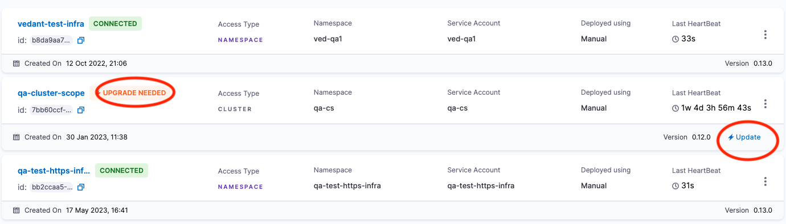

import Tabs from '@theme/Tabs';
import TabItem from '@theme/TabItem';

<DocsButton icon = "fa-solid fa-square-rss" text="Subscribe via RSS" link="https://developer.harness.io/release-notes/chaos-engineering/rss.xml" />

The release notes describe recent changes to Harness Chaos Engineering.

:::info About Harness Release Notes

* **Progressive deployment:** Harness deploys changes to Harness SaaS clusters on a progressive basis. This means the features described in these release notes may not be immediately available in your cluster. To identify the cluster that hosts your account, go to your **Account Overview** page in Harness.  In the new UI, go to **Account Settings**, **Account Details**, **General**, **Account Details**, and then **Platform Service Versions**.
* **Security advisories:** Harness publishes security advisories for every release. Go to the [Harness Trust Center](https://trust.harness.io/?itemUid=c41ff7d5-98e7-4d79-9594-fd8ef93a2838&source=documents_card) to request access to the security advisories.
* **More release notes:** Go to [Harness Release Notes](/release-notes) to explore all Harness release notes, including module, delegate, Self-Managed Enterprise Edition, and FirstGen release notes.

:::

## July 2024

### Version 1.41.1

#### Fixed issues

- Fixed the error associated with upgrading a chaos infrastructure by providing relevant permissions for the upgrade agent in the execution plane (user host/cluster). (CHAOS-5980)

### Version 1.40.1

#### New features and enhancements

- Adds a new Kubernetes pod fault, [pod IO mistake](/docs/chaos-engineering/chaos-faults/kubernetes/pod/pod-io-mistake) that causes files to read or write an incorrect value. (CHAOS-5916)

- Adds proxy support for Windows chaos infrastructure. (CHAOS-5859)

- Adds support to install Windows chaos infrastructure offline. (CHAOS-5833)

- Unifies chaos injection by introducing a dumb agent to invoke user action and pass the results of the chaos experiment to the control plane. (CHAOS-5610)

- Implements AWS FIS generic experiment that helps users execute and monitor any AWS FIS template. (CHAOS-5418)

- Converts the default health check probes to `type:inline` from `type:source` for Kubernetes infrastructure to improve the execution speed of chaos experiments. (CHAOS-4348)

#### Fixed issues

- Fixed an issue where an experiment in the `Error` state would not finish, and be in a state of infinite run timestamp. (CHAOS-5577)

### Version 1.39.11

#### Fixed issues

- Fixed an issue wherein trying to add a pre-defined experiment in Windows infrastructure was unsuccessful. (CHAOS-5863)

- Fixed an issue where the **Edit ChaosHub** action was not working with non-account type connectors. (CHAOS-5820)

- Fixed an issue where the **Linux restart** chaos fault could not parse string values. (CHAOS-5616)

## May 2024

### Version 1.38.7

#### New features and enhancements

- This release improves the advanced filter support for "headers", "methods", "queryParams", "destination_IPS", and "destination_Hosts" in the API faults. (CHAOS-5381)

- Adds the unit support (milliseconds, seconds, minutes and hours) for latency parameters in the [pod API latency](/docs/chaos-engineering/chaos-faults/kubernetes/pod/pod-api-block) faults. (CHAOS-5378)

- Adds backend to GameDay V2. (CHAOS-5138)
- Adds the following JVM chaos faults for Linux that target the JVM of a given Java process running on a Linux machine to inject faults.
    - [JVM CPU stress](/docs/chaos-engineering/chaos-faults/linux/linux-jvm-cpu-stress)
    - [JVM memory stress](/docs/chaos-engineering/chaos-faults/linux/linux-jvm-memory-stress)
    - [JVM method latency](/docs/chaos-engineering/chaos-faults/linux/linux-jvm-method-latency)
    - [JVM method exception](/docs/chaos-engineering/chaos-faults/linux/linux-jvm-method-exception)
    - [JVM modify return](/docs/chaos-engineering/chaos-faults/linux/linux-jvm-modify-return)
    - [JVM trigger GC](/docs/chaos-engineering/chaos-faults/linux/linux-jvm-trigger-gc) (CHAOS-4675)

:::danger important upgrade instructions for chaos infrastructure
- [Video tutorial to upgrade your chaos infrastructure to 1.38.x or higher](https://youtu.be/fAnsGqkcdkc)
- [Video tutorial to execute an experiment after infrastructure upgrade to 1.38.x or higher](https://youtu.be/xAu1uuaS2Ds)
- The existing APIs will work as per the norm on old and new chaos infrastructure, whereas new experiments will work only on the updated infrastructure (infrastructure version >= 1.38.0).
- Go to [frequently asked questions on optimization](/kb/chaos-engineering/chaos-engineering-faq/#kubernetes-v1-experiment-flow-optimization) to know more.
:::

- This release optimizes the experiment flow by:
    - Reading environment variables from the chaos engine.
    - Eliminating the experiment's custom resources and the corresponding steps for new experiments.
    - Eliminating the **install experiment** step.
    - Reducing the length of the YAML manifest.
    - Increasing the speed of execution of the experiment.
    - Adding all the overrides to the chaos engine.
    - Enhancing the list filter, compatible only with the new experiment template. (CHAOS-5122)

#### Fixed issues

- Fixed an issue where the compatibility check was enabled for other infrastructure types too. The overview form now preserves the state while switching between different infrastructures. (CHAOS-5614)

- Fixed an issue where ChaosGuard list APIs was not returning the **updated_by** and **created_by** fields. (CHAOS-5596)

- Fixed an issue where a user could not connect to a ChaosHub if its secret had a '-' symbol (after the deployment of ng-manager 1.33). (CHAOS-5112)

- Fixed the rendering of the **View Onboarding Progress** page. (CHAOS-5583)

- Fixed an issue where the user could not set up or create a Datadog probe. (CHAOS-5440)

- Fixed an issue where the [pod IO stress](/docs/chaos-engineering/chaos-faults/kubernetes/pod/pod-io-stress) experiment incorrectly applied stress on the helper pod instead of the target container. (CHAOS-5416)

### Version 1.37.0

#### New features and enhancements

- This release introduces the DynamoDB replication pause experiments powered by AWS FIS. These experiments improve the configuration, execution, and monitoring capabilities of the application. (CHAOS-5002)

#### Fixed issues

- Fixed an issue where the command probe multiple source probes were overridden. (CHAOS-5308)

### Version 1.36.5

#### Fixed issues

- Fixed an issue where accounts that started with an underscore could not execute a Linux chaos experiment. (CHAOS-5185)

- Fixed an issue where a chaos experiment failed when two chaos faults had the same probe (legacy) name. (CHAOS-5064)

- Fixed an issue where editing the SLO probe evaluation window resulted in an `Internal server error`. (CHAOS-5022)

- Fixed an issue in the UI where chaos experiments with the toggle option to enable (or disable) cloud secret was enabled automatically after saving the experiment. (CHAOS-4987)

## April 2024

### Version 1.35.1

#### New features and enhancements

* The node drain chaos experiment now supports selecting multiple target nodes in sequence(serial or parallel). (CHAOS-2187)

#### Fixed issues

* Linux command probes in "source" mode was failing due to a module mismatch. This is fixed now. (CHAOS-4952)

* Fixed the issue of user receiving duplicate notification after sending an event data. (CHAOS-4942)

* Resilience probe run were being filtered on incorrect runs. This is fixed now. (CHAOS-4912)

* If syntax errors were identified in a manifest after uploading it, user had to refresh the page and re-upload the YAML. This is fixed now, and users can edit the YAML without refreshing it. (CHAOS-4905)

### Version 1.34.5

#### New features and enhancements

* Adds 32-bit Windows support for Windows chaos infrastructure. (CHAOS-4792)

* Speeds up Windows chaos infrastructure installation with the help of a compressed Windows service binary. (CHAOS-4790)

* Improves the error handling mechanism of HTTP probes when sending requests to blocked or unreachable hosts, thereby making monitoring (during chaos experiments) reliable and accurate. (CHAOS-4665)

* Improves system stability and reliability during chaos testing by facilitating graceful abortion for edge cases in Windows memory hog experiment. (CHAOS-4664)

* Provides post-hook recovery support for Windows chaos experiment, which adds system stability and automatic recovery if a chaos service terminates abruptly during a experiment. (CHAOS-4663)

* Introduces global blackhole chaos support in the blackhole chaos experiments, which allows blocking all hosts from a VM, effectively isolating it from network communication. (CHAOS-4661)

* Updates ensure smooth operation of the pod API chaos and pod HTTP chaos faults in case the target pod restarts. (CHAOS-4187)

#### Fixed issues

* Resilience probes were not available for Windows experiments. This is fixed. (CHAOS-4786)

* The ChaosGuard condition blocked the chaos experiments when the application specification did not match. This is fixed. Moving forward, experiments will be blocked only if the application specification matches. (CHAOS-4772)

* While configuring the Datadog resilience probe, the UI displayed the comparator even when the user did not provide the metrics associated with the comparator during the configuration, that is, the conditional rendering was not in place. This is fixed. (CHAOS-4770)

* The "Select Probe" UI overflowed on pagination when it was in full capacity. This is fixed. (CHAOS-4725)

* When you provide a source port for the Linux network loss experiment, all the ports on the VM were targeted. This is fixed. (CHAOS-4591)

## March 2024

### Version 1.33.1

#### New features and enhancements

* The Windows blackhole chaos experiment supports graceful abort functionality, thereby providing better control and flexibility while performing the experiment. (CHAOS-4582)

### Version 1.32.1

#### New features and enhancements

* Adds `listInfrasWithExperimentStats` API to fetch the experiment statistics for the requested chaos infrastructure. The API takes a list of infrastructure IDs (infraIDs) and returns the associated experiment and experiment run count. The `listInfras` API is deprecated. (CHAOS-4417)

* Updates the `getHelmInfra` API to `getHelmInfraCommand`, and the updated API gives the command necessary to install and upgrade the chaos infrastructure using Helm. (CHAOS-4296)

* Adds conditions to the experiment name, i.e.,
    * Number of characters is not more than 47;
    * Names can contain only lowercase, numbers, and dashes;
    * Names should not start or end with a dash. (CHAOS-3749)

* Adds Helm support to install chaos infrastructure. (CHAOS-3327)

#### Fixed issues

* When a chaos experiment was cloned and the probe configuration of the cloned experiment was modified, the changes to the probe configuration were not reflected in the experiment. This issue is resolved. (CHAOS-4249)

## February 2024

### Version 1.31.2

#### New features and enhancements

* This release adds API support to install and upgrade chaos infrastructure using Helm. (CHAOS-2998)

#### Fixed issues

* Disabling a Linux resilience probe removed all chaos faults associated with the chaos experiment. It has been fixed. Now, you can bulk enable and disable a Kubernetes and a Linux infrastructure's resilience probe. (CHAOS-3849)

## January 2024

### Version 1.30.0

#### New features and enhancements

* Appropriate environment variables are added at relevant places to ensure that the self-managed platform (SMP) can be used with feature flags (FF). (CHAOS-3865)

* The [SSH chaos experiment](/docs/chaos-engineering/chaos-faults/ssh/ssh-chaos) now supports an extended termination grace period, allowing for longer execution of abort scripts. (CHAOS-3748)

* This release adds wildcard support for all entities in the [chaosguard conditons](/docs/chaos-engineering/features/chaosguard/chaosguard-concepts#1-condition). (CHAOS-3254)

#### Fixed issues

* Chaos hub icons were not visible when the hub name consisted of the '/' character. This is fixed so that a user can't create a hub with the '/' character. (CHAOS-3753)

### Version 1.29.0

#### New features and enhancements

* Improves the error messages and logs returned to the client in the API to save chaos experiments. (CHAOS-3607)

#### Fixed issues

* Linux chaos infrastructure (LCI) installer wasn't executing the script with sudo privileges, which resulted in *Failed to install linux-chaos-infrastructure* error. This issue is now resolved. (CHAOS-3724)

* Deselecting the **Show active infra** displayed the inactive infrastructures only, whereas it should display all the infrastructures. This issue is now resolved. (CHAOS-3717)

* LCI process would get killed due to a lack of memory (OOM) when a high amount of memory was specified during a memory stress fault. This issue is now resolved so that the likeliness of OOM kills during limited memory availability is reduced. (CHAOS-3469)

### Version 1.28.1

#### New features and enhancements

* Adds optimisation to utilise memory efficiently, reduce latency, and enhance server performance. (CHAOS-3581)

* Linux infrastructure is automatically versioned with the help of the API. Previously, the versions were hardcoded for every release. (CHAOS-3580)

* Adds a condition to the experiment such that a resilience probe can't be added more than once in a single fault within an experiment. The same resilience probe can be used in another fault within the same experiment, though. (CHAOS-3520)

* Adds a generic audit function that is used to generate all audit trails, thereby reducing redundancy. This generic function is customized based on the type of audit (Chaos experiment, Gameday, Chaos infrastructure, and so on). (CHAOS-3484)

* With this release, the Linux chaos infrastructure binary uses static linking instead of dynamic linking. This removes any dependency on the OS built-in programs including `glibc`. (CHAOS-3334)

* Enhanced the performance of the API (GetExperiment) that was used to fetch details of Kubernetes and Linux experiments. An optional field is added that fetches the average resilience score. (CHAOS-3218)

* Adds support for bulk-disable (disable enabled CRON schedules selected by user) and bulk-enable (enable disabled CRON schedules selected by user) CRON-scheduled experiments, with a limit of 20 experiments for every operation. (CHAOS-3174)

#### Fixed issues

* After selecting an experiment, when a user tried to select an active infrastructure for the experiment, the page would throw an error. This is fixed. (CHAOS-3585)

* Editing a Linux experiment to change the infrastructure would not update the infrastructure. This is fixed. (CHAOS-3536)

* When multiple faults are executed in parallel, faults that transitioned into an "errored" state would not reflect in the logs, whereas faults in **success** state reflected in the logs with an "errored" status. This is fixed. (CHAOS-3363)

## Previous releases

2023 releases

#### December 2023, Version 1.27.1

##### New features and enhancements

* Adds a filter to the **listWorkflow** API so that data can be filtered based on whether it is CRON-enabled or not. (CHAOS-3424)

* While selecting a chaos infrastructure to create an experiment, users can list the active infrastructures by clicking the checkbox **Show active only**. (CHAOS-3350)

* Metrics for the Dynatrace probe (**Metrics Selector** and **Entity Selector**) have been made compulsory. This ensures that the required properties are always passed while creating a Dynatrace probe. (CHAOS-3330)

* An experiment can be created against inactive chaos infrastructure(s). This was done to complement the preparatory actions in environments that require agents to be scaled down (K8s) or stopped (Linux) except during the chaos execution window. (CHAOS-3241)

* This release deprecates the `ACCESS_KEY` invalidation after a chaos infrastructure is successfully connected. Users can use the same manifest to connect to the infrastructures. (CHAOS-3164)

* Adds UI support to search conditions for selection while creating a [ChaosGuard rule](/docs/chaos-engineering/features/chaosguard/chaosguard-concepts/#2-rule). (CHAOS-2982)

* Adds support to incorporate `secretRef` and `configMapRef` with the tunables for [VMWare faults](/docs/chaos-engineering/chaos-faults/vmware). (CHAOS-2750)

* Adds support for encoding metrics queries in Dynatrace probes. These metrics are constructed and executed using the metrics (or data) explorer before the API call [POST]. (CHAOS-2852)

##### Fixed issues

* After an experiment timed out, the execution nodes would remain in the **running** state. This is fixed. (CHAOS-3094)

* Adding a probe without the `description` key broke the `addProbe` API. The API is now fixed to accept a blank string if no value is provided in the `description` or the key is missing in the API request. (CHAOS-3224)

* For probe failures, the probe success iteration ratio would show up twice in the experiment logs. This is fixed. (CHAOS-3421)

#### November 2023, Version 1.26.0

##### New features and enhancements

* Renamed three keys in the Dynatrace probe:
    - **dynatrace_endpoint** is now **endpoint**
    - **dynatrace_metrics_selector** is now **metrics_selector** and is present inside metrics
    - **dynatrace_entity_selector** is now **entity_selector** and is present inside metrics. (CHAOS-3177)

* When an SSH experiment is executed inside a VM using the SSH credentials, the experiment uses parameters to allow the chaos logic scripts to receive dynamic inputs. (CHAOS-3049)

* Field token name lengths have been reduced by modifying the Dynatrace probe schema for Kubernetes. (CHAOS-3043)

* Linux infrastructure version is displayed on the landing page that lists all the Linux infrastructure. (CHAOS-2845)

##### Fixed issues

* While editing probes, the name validation check resulted in the error "probe name not available". This is fixed. (CHAOS-3216)

* When a user creates an experiment by selecting the predefined experiments, the dropdown menu shows experiment type instead of Chaoshubs. This is fixed. (CHAOS-3193)

* HTTP Linux OnChaos probe usage halted the fault execution because the probe finished executing before the fault thread could begin the evaluation of probes, which resulted in a deadlock. This is fixed. (CHAOS-3180)

* Erroneous timestamps were displayed in the UI, which led to wrong values and headings being shown in the UI. This is fixed. (CHAOS-3178)

* Previously configured SLO probe property fields appeared empty when the user tried to edit them. This is fixed. (CHAOS-3176)

* The node selector attribute in ChaosEngine added two fields, namely key and value, instead of **key:value**. This is fixed. (CHAOS-3173)

* With changes in the image registry, the LIB_IMAGE environment variable was being overwritten by chaos-go-runner. This is fixed. (CHAOS-3172)

* Probes whose execution time exceeded 180 seconds would error out with N/A status, regardless of probeTimeout settings. This is fixed. (CHAOS-3169)

* When a GameDay was deleted, the name of a deleted GameDay would not show up in the audit event. It has been fixed. (CHAOS-3158)

* Probe details, such as verdict, status and mode were not retrieved for the correct runID and notifyID. This is fixed. (CHAOS-3144)

* An experiment would keep running in the pipeline even if it transitioned to an error status. This is fixed. (CHAOS-1985)

#### October 2023, Version 1.25.5

##### New features and enhancements

* Added a "Run now" button to the three-dot menu on the experiment dashboard. You can run cron experiments manually now. (CHAOS-3110)

* Until an experiment is saved, the "run experiment" or "enable cron" buttons are hidden. (CHAOS-3099)

* A cron enable/disable button is added to the dashboard table menu so that you can enable or disable the cron experiments from the dashboard itself. (CHAOS-3027)

* A new field, "last_executed_at", is added to the chaos experiments. This new field is updated whenever an event is received during the course of an experiment run. (CHAOS-3018)

* While creating an experiment, if a YAML file is uploaded that can't be parsed, a warning is displayed on the user interface. (CHAOS-3016)

* You can now sort experiments based on the "recently executed" and "last modified" filters in ascending and descending order. (CHAOS-2895)

* Dynatrace probes are now available on the Linux chaos infrastructure. (CHAOS-2879)

* Custom arguments/flags are added to the command for VMware stress and network faults. (CHAOS-2846)

* The pod memory hog chaos experiment provides distinction between experiments that failed (as an expected result) versus experiments that actually failed. (CHAOS-2515)

* Cron and non-cron experiment types can be identified manually or using the tooltip by hovering over individual run boxes in **resilience probes**. (CHAOS-3010)

* Added a new Cloud Foundry fault, "CF app route unbind". (CHAOS-2912)

* If a previous CRON experiment is not running or is in a queued state, such a CRON experiment can be executed on-demand. This is done by clicking **Run Experiment** button on the vertical three-dot menu on the experiment page. (CHAOS-2896)

* The pipeline manifest will be stored in the Harness repository. (CHAOS-2040)

##### Fixed issues

* The sandbox API was being called when the corresponding flag was off. This is fixed. (CHAOS-3126)

* SLO probe properties in the fault selection and probe details in the runs view UI were not being displayed. This is fixed. (CHAOS-3119)

* Added support for **SKIP_SSL_VERIFY** in readiness probes for the execution plane components. (CHAOS-3115)

* Mongo queries resulted in fetching results for deleted GameDays. This is fixed by adding a field "is_removed" to the Mongo queries. (CHAOS-3091)

* Linux chaos infrastructure did not provide JSON log output. This is fixed. (CHAOS-2989)

* The probe mode would be pre-selected as SOT by default. Now, it will be empty, and no value will be present by default. (CHAOS-2455)

* CRIO runtime would give an unknown service runtime.v1alpha2.RuntimeService error. This is fixed. (CHAOS-3019)

* When a user who does not have view access in one of the scopes (Project/Organization/Account) tried to run an experiment, they encountered a permission error. This is fixed. (CHAOS-2810)

* When no tunables were selected for a fault, the **Learn more** link did not redirect to a destination. This is fixed. (CHAOS-2973)

#### October 2023, Version 1.24.5

##### New features and enhancements

* This release adds default limits for the number of chaos probes that can be created when a chaos infrastructure is created by adding a **chaos probe** resource limit per account. (CHAOS-2880)

* This release adds a new log viewer, which includes:
    - New tab for helper pod logs.
    - Support for grouping and minimizing logs.
    - Colors for various log levels.
    - Logs can be downloaded, copied, and scrolled over.
    - Position retention when logs are manually scrolled while streaming.
    - Parsing arguments. (CHAOS-2809)

* This release adds a validation check to the template name and entry point in the YAML to match at least one template name with the entry point name. The check ensures that the visual builder shows the faults correctly. (CHAOS-2933)

* This release adds support for chaos dashboards in SMP. (CHAOS-3100)

* This release adds support for source and destination ports, isolating the ports as well as excluding them for VMware network faults. (CHAOS-2892)

* This release adds support for source and destination ports, isolating the ports as well as excluding them for Linux network faults. (CHAOS-2873)

* This release allows you to run multiple SOT or EOT probes in parallel in Kubernetes. (CHAOS-2863)

* This release supports min, max and mean values as parameters in the Dynatrace probe. (CHAOS-2853)

* This release adds the usage of sandbox network namespace for the CRI-O runtime, thereby enhancing the network faults. (CHAOS-2825)

* The format of logs has changed from JSON to **level:"" timestamp:"" out: "" args:""**. This improves the readability of logs. (CHAOS-2807)

* This release adds the probe iteration success count to the probe description. (CHAOS-2797)

* This release introduces a new fault- pod API block. This fault blocks the API based on path filtering. (CHAOS-2722)

* This release supports adding labels from the **Advanced Tune** section in the UI. (CHAOS-2612)

* This release adds an enhanced generic script injector framework that offers greater flexibility and control over your chaos experiments. It helps add chaos to target hosts using custom scripts that are passed using a ConfigMap. These scripts are executed using SSH credentials securely referenced within the ConfigMap. (CHAOS-2625)

* This release introduces a new fault- cloud foundry app stop. This fault stops a Cloud Foundry app for a fixed time period and later starts it. (CHAOS-2619)

* This release introduces a new fault- pod network rate limit. This fault determines the resilience of a Kubernetes pod under limited network bandwidth. (CHAOS-2478)

* This release reflects changes made in the chaos infrastructure images and the experiment images in their respective manifests when an image registry setting is changed. (CHAOS-2881)

* This release adds Linux stress and network fault custom arguments/flags that can be used with the **stress-ng** (stressNGFlags input) and **tc** (`netem` args input) commands, respectively. (CHAOS-2832)

##### Early access features

* This release introduces a new fault- Linux network rate limit. This fault slows down network connectivity on a Linux machine by limiting the number of network packets processed during a time period. (CHAOS-2495)

* This release optimizes the Kube API calls by allowing the Linux IFS to use Redis for caching. (CHAOS-2119)

* The tag filter in the query that fetches Linux experiments was removed so that Linux experiments can be edited. Previously, the Linux experiments could not be edited. (CHAOS-2827)

* Once an experiment was pushed to the chaos hub, every fault was displayed twice in the CSV file. This is fixed. (CHAOS-2971)

#### Fixed issues

* Attempting to delete a GameDay resulted in an internal server error. This is fixed. (CHAOS-2975)

* The cron button on the right sidebar could not be updated in real time. It has been fixed so that the button can be toggled while updating the cron schedule. (CHAOS-2904)

* Memory consumption fluctuated when the Linux memory stress fault was in action. This is fixed. (CHAOS-2806)

* If an experiment was stuck in the queued state for more than 2 hours, it would remain so indefinitely. It was fixed so that the experiment run times out if it is in the queued state for more than 2 hours. (CHAOS-2843)

* Executing parallel faults resulted in write conflicts. This is fixed by adding helper pod names as annotations and patching these names to the chaos result, thereby preventing the write conflict. (CHAOS-2834)

* The reports of chaos experiment runs were missing details such as experiment run ID, experiment end time, and chaos injection duration. The issue was fixed to reflect these details. (CHAOS-2830)

* Clicking the copy button on the infrastructure page led to rendering the details of the infrastructure. This is fixed. (CHAOS-2791)

* The probe name in the URL field broke the probe configuration tab. This is fixed by adding the URL search parameters to the URL. (CHAOS-2821)

* Clicking the Chaos Studio tab navigation would reset the states of the header and sidebar and hide some buttons. It was fixed so that the states are not reset and all buttons are visible. (CHAOS-2837)

#### October 2023, Version 1.23.5

##### New features and enhancements

* Added support for the execution of pod-delete fault against workloads which are not managed by the standard native-controllers such as deployment, statefulset and daemonset. With this change, this fault can be executed on pods managed by custom controllers. (CHAOS-2798)

* Added support for enabling and disabling schedules for cron experiments. This can be found in the right-side nav bar. (CHAOS-2731)

* Enhanced Network Chaos faults (loss/latency/corruption/duplication) to support specific source and destination ports from the network fault i.e., traffic to the defined ports will not be impacted by the chaos injection. (CHAOS-2712)

* Enhanced service kill experiments on Google Kubernetes Engine (now uses the gcloud ssh function to carry out the kill operations instead of deploying a helper pod on the targeted node). Also added support for `containerd` runtime. (CHAOS-2649)

* Added support for specifying securityContext for chaos experiment related resources via user interface under advanced configuration. As part of supporting OCP4.11+ we have also stopped appending default security context attributes runAsUser & runAsGroup into the experiment/infrastructure manifest, and instead given the users the ability to add them optionally via the UI. (CHAOS-2614)

* Added support for \<,>,\<=,>= operators as part of the comparator in HTTP Probe via User Interface. (CHAOS-2611)

* Added a download button in the Logs Tab allowing users to download the logs for the node in ".log" format for further debugging/reporting purposes. (CHAOS-2462)

* Added support for conditional logging of probe evaluation results for each iteration in the Continuous and onChaos modes via a debug field added to the probe RunProperties. (CHAOS-1515)

##### Early access features

* Resilience Probes: This feature is currently behind a feature flag named CHAOS_PROBES_ENABLED.
    - Adding support for TLS and Authorization for HTTP and PROM probes. (CHAOS-2743)
    - Fixed an issue where SLO Probes were showing Source & Command on the probe details screen. (CHAOS-2715)
    - Fixed an issue where EvaluationTimeout was showing up for all types of Resilience probes, Now it is only available for SLO Probe. (CHAOS-2710)
    - Fixed an issue where edit/delete buttons were enabled for disabled resilience probes. (CHAOS-2701)

##### Fixed issues

* Fixed an issue where after editing an experiment via YAML Editor, users were unable to save the experiment. (CHAOS-2780)

* Fixed an issue where revert-chaos was not working properly for VMware stress-based faults. (CHAOS-2777)

* Fixed RBAC issue with create GameDay button on the landing page of GameDay. (CHAOS-2692)

* Added a fix to display the appropriate user information upon performing chaos experiment operations when the user has been accorded permissions at the account level instead of at the project level. (CHAOS-1585)

* Fixed an issue in VMware experiments where aborting an experiment was not updating the chaos result properly. This is fixed by adding a wait for the result update before terminating the experiment for the abort. (CHAOS-2655)

* Fixed an issue where ImagePullSecrets were not getting propagated to helper pods. (CHAOS-2608)

#### September 2023, Version 1.22.1

##### New features and enhancements

* Experiment Run & Experiment Report has been enhanced to show more details for better auditing - (CHAOS-2606)
    - Added probe details along with description of failures, number of probes passed/failed/not-executed.
    - Added tunables for corresponding chaos faults in an experiment.
    - Project, Organization & Account Identifiers are now available in the report header itself.

* Updated `UPDATED_BY` field to show `SYSTEM` when a Chaos Resource is deleted automatically with respect to a Project/Organization/Account deletion. (CHAOS-2597)

* Enhanced the Chaos infrastructure upgrade process to automatically change to `UPGRADE_FAILED` status if the upgrade has been in progress for more than 2 hours. This will allow users to attempt an upgrade again once the upgrade has failed/timedout. (CHAOS-2575)

* Enhanced the experiment execution process to timeout a particular experiment if it has been running for more than the threshold timeout i.e. 2 hours. (CHAOS-2573)

* Enhanced the `stopOnFailure` option to change the status of an experiment to `COMPLETED_WITH_ERROR` in case of probe failure. (CHAOS-2564)

* Added a new tunable `ServiceExitType` for `vmware-service-stop` chaos fault which will allow users to choose if they want the target service to be killed gracefully or not. (CHAOS-2491)

* Added functionality to kill processes with process name in `vmware-process-kill` chaos fault. (CHAOS-2100)

* Added support for Git, GitLab, and BitBucket as native Connectors using Harness Secret Manager. (CHAOS-35)

##### Early access features

* Resilience Probes: This feature is currently behind a feature flag named `CHAOS_PROBES_ENABLED`.
    - Added support to re-fetch Probe statuses automatically under the Probes Tab in Chaos Studio. (CHAOS-2561)
    - Evaluation Timeout is now only available for SLO probe. (CHAOS-2554)
    - Added support for doing CRUD operations in Resilience probes from Chaos Studio itself. (CHAOS-2552)
    - Fixed an issue where Resource Name was not usable in K8s Resilience Probe. Adding the specific field at the API level resolved this issue. (CHAOS-2653)

##### Fixed issues

* Refreshing the chaos studio after saving was leading to unsaved changes earlier. This issue is resolved. (CHAOS-2654)

* Previously when the cron schedule was edited in YAML, there was no validation for the same in UI, which would sometimes lead to UI crash when shifting to the Schedule Tab in Visual Builder. This issue is fixed and validation has been added for both Visual and YAML editor modes. (CHAOS-2631)

#### September 2023, Version 1.21.2

##### New features and enhancements

* Upgraded `govc` binary with the latest release which fixed 14 vulnerabilities in the `chaos-go-runner` docker image. (CHAOS-2577)

* Added support for empty labels with `appkind` specified while filtering target applications for a Chaos Experiment. (CHAOS-2256)

##### Early access features

* Resilience Probes: This feature is currently behind a feature flag named `CHAOS_PROBES_ENABLED`.
    - Enhanced Chaos Studio to support older experiments with no annotation fields having Resilience probes reference. (CHAOS-2532)
    - Added support for headers in HTTP probe configured via Resilience Probes mode. (CHAOS-2505)
    - Deprecated "Retry" input in Probe configurations. Now only 1 (attempt) is supported. (CHAOS-2553)

##### Fixed issues

* Fixed ChaosHub connection API to check for already existing ChaosHub with the same name before connecting new ChaosHub. (CHAOS-2523)

* Fixed an issue where the `Save` button at the header of the `/gamedays` route is not disabled even though the user has not selected an experiment, today it is enabled by default and throws an error on click, even if the details asked of the user on the landing page are all filled. (CHAOS-2417)

#### September 2023, Version 1.20.1

##### New features and enhancements

* Added support for targeting specific ports when using API Chaos Faults via a new tunable, for example, `DESTINATION_PORTS`. (CHAOS-2475)

* Added support for HTTPs protocol in API Chaos Faults. (CHAOS-2145)

##### Early access features

* Chaos Guard: This feature is currently behind a feature flag named `CHAOS_SECURITY_GOVERNANCE`.
    - Added support for evaluation of multiple app labels when running experiments with multiple target app labels. (CHAOS-2315)

* Linux Chaos Faults: This feature is currently behind a feature flag named `CHAOS_LINUX_ENABLED`.
    - In Linux experiments, the Resilience Score was sometimes showing as 0, although only one probe amongst multiple had failed. This was happening because of incorrect propagation of the probe error, which led to its misinterpretation as an experiment error rather than a probe failure. This issue is fixed now. (CHAOS-2472)

* Resilience Probes: This feature is currently behind a feature flag named `CHAOS_PROBES_ENABLED`.
    - Enhanced mode selection drawer to show the UI according to selected mode by the users. Previously it was showing the image indicating SOT for all modes irrespective of the selected mode. (CHAOS-1997)

##### Fixed issues

* There was an issue where users were getting an error when an  experiment triggered via a pipeline failed to start and there is no notifyID created. This is fixed now. (CHAOS-2490)

* Fixed an issue where the topology settings (taint-tolerations, nodeselectors) made in the advanced configuration section during experiment construction were getting applied only to the Argo workflow pods. Now, the topology settings are propagated to Chaos Fault Pods as well. (CHAOS-2186)

#### September 2023, Version 1.19.2

##### New features and enhancements

* Added support for Authentication and HTTPs in HTTP Probes for Kubernetes chaos faults. (CHAOS-2381)

* Added support for the destination ports for the provided destination IPs and hosts in network chaos faults. (CHAOS-2336)

* Added support for authentication and TLS in Prometheus probes in Kubernetes chaos faults. (CHAOS-2295)

* Chaos Studio no longer shows ChaosHubs with no experiments/faults during experiment creation. (CHAOS-2283)

* A new option has been added to preserve or delete the chaos experiment resources with a single toggle. Experiment resources can be preserved for debugging purposes. (CHAOS-2255)

* The Docker Service Kill chaos fault was enhanced to support containerd service as well. Users can select the type of service via a new tunable (SERVICE_NAME) they want to kill. (CHAOS-2220)

* Added support for downloading an experiment run specific manifest. Now, users can download experiment run specific manifest from the right sidebar on the Execution graph page. (CHAOS-1832)

##### Early access features

* Linux Chaos Faults (This feature is currently behind a feature flag named `CHAOS_LINUX_ENABLED`)
    - Added support for targeting multiple network interfaces in network faults. (CHAOS-2349)
    - The script generated to add the Linux infrastructure had incorrect flags due to changes in terminologies. This has now been corrected to reflect updated installation flags. (CHAOS-2313)

* Resilience Probes (This feature is currently behind a feature flag named `CHAOS_PROBES_ENABLED`)
    - Users had to select the **Setup Probe** button 2 times. It should now work only with a single click. It was dependent on formik validations, which in turn was halting the functionality of handleSubmit due to incorrect Yup validations. (CHAOS-2364)
    - When using the same probes in two faults under same chaos experiment, Probe API was returning the probe two times in the second fault. This was due to probeNames being a global variable and using the same probe name multiple times was causing the name to be appended without re-initializing the variable. Scoping it down to local scope fixed this issue. (CHAOS-2452)

##### Fixed issues

* The logs for the **install chaos experiment** step were getting lost immediately post execution. This issue was occurring in the subscriber component, after the custom pods cleanup, the component was still trying to stream Kubernetes pod logs. As a fix, we have added a check to fetch the pod details and gracefully return the error if pods are not found with a proper error message. (CHAOS-2321)

* As Account Viewer, users were not able to view Chaos Dashboards. This was happening because the `getDashboards` API was missing routingID, which was failing the API calls. This is fixed now. (CHAOS-1797)

* The frontend was making unnecessary queries to the backend for listWorkflow API whenever changing experiment details via the UI. Now ChaosStep has been optimized to only query when changing selected experiment using memoization. (CHAOS-883)

#### September 2023, Version 1.18.7

##### New features and enhancements

* Added Audit Event (Update) for Chaos Infrastructures upgrades which are triggered by SYSTEM/Cron Job Upgrader Automatically. (CHAOS-2350)

* Added filter on Chaos Experiments Table for filtering experiments based on tags. (CHAOS-2133)

* Now, Users will be provided with an error if there is already one experiment existing with the same name in ChaosHub while pushing an experiment to a ChaosHub. (CHAOS-872)

* Vulnerability Enhancements - (CHAOS-2162)
    - PromQL binary has been rebuilt with latest go1.20.7 & upgraded in chaos-go-runner docker image.
    - Kubectl binary has been upgraded to v1.28.0 to reduce 2 vulnerabilities in K8s as well as chaos-go-runner docker image.
    - Argo components like workflow-controller and argo-exec have been upgraded to v3.4.10 which resolves all vulnerabilities in respective components.

##### Early access features

* Linux Chaos Faults (This feature is currently behind a feature flag named `CHAOS_LINUX_ENABLED`)
    - Enhanced fault execution logs to also include logs from commands like stress-ng, tc & dd as well. (CHAOS-2309)
    - All APIs for services with respect to Linux Chaos have been migrated from the GraphQL and GRPC apis to REST. Users upgrading to 1.18.x need to upgrade all Linux Chaos Infrastructures.

##### Fixed issues

* Fixed the faults logs getting truncated when the log size is high. It was happening because logs were having a buffer size of 2000 bytes, if the log size was higher, logs were getting truncated. As part of the fix, we made the buffer resizable and optimized the flow. (CHAOS-2257)

* The UI wasn't fully updated post the probe schema changes to support explicit units definition (s, ms). Added units for probe run properties in UI. (CHAOS-2235)

* Users were able to create different experiments with the same name, since the experiment names carry a lot of significance and they should be unique. A name validation is added whenever a new experiment is saved & users will be provided with an error if an experiment with the same name already exists. (CHAOS-2233)

#### August 2023, Version 1.17.3

##### New features and enhancements

* Added support for OpenShift configuration for deploying chaos infrastructure. This will provide you with a predefined security context constraint (SCC) that you can modify according to your needs. (CHAOS-1889)

* Enhanced the Chaos experiment execution diagram to not switch to running nodes automatically. This change ensures that you stay on a node when you click it, thus giving you the opportunity to observe its details. (CHAOS-2258)

* Enhanced the Docker service kill fault to support the `containerd` runtime. (CHAOS-2220)

* Added support for targeting applications by using only `appkind`, only `applabel`, and set-based labels. (CHAOS-2170, CHAOS-2128)

* Parallel chaos injection and revert operations at scale have been improved for multiple target pods on the same node. (CHAOS-1563)

* Previously, if you did not set the `TARGET_CONTAINER` environment variable, the fault targeted a randomly selected container. Now, if you do not set the environment variable, the fault targets all containers in the target pods. (CHAOS-1216)

* Now, Users can specify drain timeout explicitly in the node drain fault. The node-drain fault has been using the `CHAOS_DURATION` value as a timeout, leading to potential confusion and risk of failure, especially when a shorter duration is used with many pods. The expectation is that `CHAOS_DURATION` should define the unschedulable period after draining. Providing a specific drain timeout would help users better estimate the eviction time for all pods on a node, reducing errors and false negatives. (CHAOS-2185)

* Enhanced the JobCleanUpPolicy configuration to also retain helper pods when it is set to retain in ChaosEngine. (CHAOS-2273)

##### Fixed issues

* Fixed how chaos is reverted if an attempt to inject the node drain fault fails or needs to be canceled. (CHAOS-2184)

#### August 2023, Version 1.16.6

##### Fixed issues

* There was an issue where users were not getting audit events for the rules created under the Security Governance tab. This issue is fixed. (CHAOS-2259)

#### August 2023, Version 1.16.5

##### New features and enhancements

* A new feature lets users do an automated upgrade for their cluster-scope chaos infrastructures using an upgrade agent, which is deployed along with the chaos infrastructure. This also lets users do an upgrade of their chaos infrastructures on demand. (1849)

    Existing users must reconnect their chaos infrastructures to use this feature, since it is only available for new cluster-scope chaos infrastructures. Old chaos infrastructures will continue to work even if not upgraded, but upgrade will be manual for them, as it was in previous versions.

* A new feature adds support for OpenShift security contexts, and provides tunables for RunAsUser and RunAsGroup in the experiment creation step. (CHAOS-2228)

* The **App Label(s)** field in chaos fault configuration now supports a multi-select dropdown in Kubernetes experiments. This corresponds to comma-separated values in the experiment YAML. This change is backward compatible with older experiments. (CHAOS-2120)

* The UI now provides a toggle in AWS experiments to enable or disable cloud secrets. (CHAOS-2092)

##### Fixed issues

* Previously, the pipeline diagram crashed randomly when scheduling a new experiment. This happened due to the API returning an empty object for nodes. This issue is fixed. (CHAOS-2148)

* In advanced configuration for experiments and chaos infrastructures, if you add a toleration, tolerationSeconds is now optional if the toleration effect is NoSchedule. (CHAOS-1955)

* Upgraded the Argo components Workflow-Controller and Argo-Exec to version 3.4.8. This reduces the number of vulnerabilities from 227 to 26. (CHAOS-1902)

#### August 2023, Version 1.15.7

##### Fixed issues

* Audit events for pipeline-triggered experiments were not available due to a missing parameter. This issue is resolved. (CHAOS-2168)

#### July 2023, Version 1.15.6

##### New features and enhancements

* Added support for Universal Base Images (UBI) for chaos components. (CHAOS-1547)

* Added enhancement to prevent users from editing/deleting cron chaos experiments if the associated infrastructure is not active. (CHAOS-1894)

##### Fixed issues

* Fixed an issue in the GameDay details screen where the fault count for selected experiments was incorrect. (CHAOS-2052)

* Previously, user details were not appearing in audit events when using a service account for authentication. This issue is fixed by adding support for account-level service account authentication for the Chaos Module. (CHAOS-1959)

* Fixed an issue where the audit event for the summary of a GameDay run was not showing the name or ID of the associated GameDay. (CHAOS-1958)

* Fixed an issue where editing an existing experiment would directly open in the YAML builder view instead of the visual builder view. (CHAOS-1954)

* The **Create GameDay** and **Edit GameDay** buttons were displayed as active for users who did not have those permissions. This issue is fixed. (CHAOS-1795)

#### July 2023, Version 0.14.5

##### New features and enhancements

* Introduced a configuration for changing the mechanism for storing access keys and tokens in Config Maps instead of secrets on the execution plane.

    When configuring chaos infrastructure, users can now select to store access keys and tokens in Config Maps (instead of secrets) on their cluster for connections, authentication, and experiment executions.

#### June 2023, Version 0.14.1

##### New features and enhancements

* [GameDay](/docs/chaos-engineering/features/gameday/gameday-v2) is no longer behind a feature flag, and is now available to all users. (CHAOS-1964)

* The CE [integration](/docs/chaos-engineering/integrations/use-chaos-with-srm) with Harness Service Reliability Management (SRM) is no longer behind a feature flag, and is now available to all users. (CHAOS-1964)

* While upgrading a namespace-scoped chaos infrastructure, users will now be shown the command for upgrading CRDs as well. (CHAOS-1846)

* We now show all steps in the experiment details pipeline diagram. (CHAOS-1817)

    Previously when users triggered chaos experiments, the execution graph generated step nodes progressively as the experiments executed. Now, the execution graph shows all step nodes after experiments start execution. The nodes yet to start remain in a pending state.

* Previously, when users connected a ChaosHub, CE cloned the whole Github repository. This caused storage issues if the repository was very large, or users were using the same repository for multiple purposes. This is enhanced so that CE clones only a single branch provided by users. (CHAOS-1722)

* When a user deletes a project, organization, or account, CE now deletes all chaos entities associated with that project, organization, or account. (CHAOS-1143)
    * When a project is deleted, all chaos entities in that project are deleted.
    * When an organization is deleted, all chaos entities in all projects under that organization are deleted.
    * When an account is deleted, all chaos entities in all projects under that account are deleted.

* Enhanced the Chaos Experiments report to show tags for selected experiments along with sequence numbers for all associated experiment runs. (CHAOS-1777)

* Enhanced the Chaos Experiment Runs report to show a probe summary, along with a fault summary if there's a fault failure. (CHAOS-1776)

* Added support for new experiment run statuses in the **Chaos** Continuous Delivery (CD) step. (CHAOS-1210)

##### Fixed issues

* When generating a chaos infrastructure manifest that included `NodeSelectors` or `Tolerations`, there was an issue causing the first letter of key/value pairs to be capitalized. This issue is fixed. (CHAOS-1917)

* When adding or updating a step in a chaos experiment, in the Probes tab, the **Probe mode** field is now required. (CHAOS-1882)

* The **Discard** button in Chaos Studio is now disabled if there are no changes in an experiment. (CHAOS-1878)

* The stop workflow feature wasn't able to stop experiments in the case of namespace-scoped chaos infrastructures. This issue is resolved and the stop workflow now works as expected. (CHAOS-1778)

* There was an issue where if the user aborted an experiment running as part of a pipeline, the pipeline step displayed `All your faults executed without an issue`. This is fixed, and the correct details are now displayed based on the experiment execution. (CHAOS-733)

* There was an issue where a CD step was not showing parallel faults even though the selected experiment had multiple parallel experiments. This issue is fixed. (CHAOS-1208)

#### June 2023, Version 0.13.5

##### New features and enhancements

* Added a new Linux chaos fault, Disk Fill, which fills up the available disk space at a given system path for a specific duration. (CHAOS-1419)

* To help users select the right infrastructure for their use case, the Chaos Infrastructures UI screen has been enhanced to show supported faults by different chaos infrastructure categories. (CHAOS-1811)

* The database was upgraded to update the index in linuxInfrastructures collection. (CHAOS-1836)

##### Fixed issues

* The Chaos Faults screen in ChaosHub was crashing when the **Platform** field was missing in the faults metadata file. This issue is fixed. (CHAOS-1841)

#### June 2023, Version 0.13.4

##### New features and enhancements

:::warning
This release breaks backward compatibility with older chaos infrastructures. You must update chaos infrastructures and the chaosnative/go-runner image in experiment definitions. If you don't upgrade, then chaos experiments will start to fail.

To upgrade chaos infrastructures and experiments:

1. Delete old ChaosEngines, if any:

    `kubectl delete chaosengines --all -n <namespace-of-chaosinfrastructure>`

1. Upgrade the CRDs in clusters where you have deployed a chaos infrastructure:

    `kubectl apply -f https://raw.githubusercontent.com/chaosnative/hce-charts/main/hce-saas/hce-saas-crds.yaml`

1. If a chaos infrastructure indicates **UPGRADE NEEDED**, select **Update**, and then follow the instructions on your screen.

    

1. Edit the YAML definitions of existing experiments to update the chaosnative/go-runner image to version 0.13.1. Do the same for existing experiments in custom chaos hubs that may be connected to your project (not required for new expriments).

:::

* Added audit events for various GameDay operations such as create, update, etc., so that users can easily audit operations done on their GameDays. (CHAOS-1709)

* Browser tabs now show the module page name to help users switching between different tabs. (CHAOS-1683)

* The Delete Chaos Infrastructure API has been updated to allow deletion of only one infrastructure. (CHAOS-1681)

* Previously, the Last Heartbeat value was empty when chaos infrastructures were pending. Now, to prevent user confusion, this value displays N/A when chaos infrastructures are pending. (CHAOS-1666)

* Enhanced the Chaos Infrastructures table to allow routing to corresponding connectors from the Chaos Infrastructures screen. (CHAOS-1665)

* When scheduling an experiment fails for any reason, the user now sees the error when hovering over the status. (CHAOS-1574)

* Added a new advanced configuration to allow users to add annotations to all chaos pods using the UI. (CHAOS-1465)

##### Fixed issues

* Improved the UI message returned when users search for a GameDay and the search term is not found. Now the message more accurately states "No GameDay found matching the search term." (CHAOS-1717)

* Previously, users were able to complete a GameDay even when some of the associated experiments were running. This could cause issues because it's not possible to edit or abort those experiments when a GameDay is closed. Now, users must abort running experiments in a GameDay before they can close it. (CHAOS-1713)

#### May 2023, Version 0.12.1

##### New features and enhancements

* Reports can now be downloaded. (CHAOS-1615)

    * You can now download reports for experiments as well as associated experiment runs. Reports include details about target chaos infrastructure, and execution details for experiment runs.

##### Early access features

* Introduction of [Chaos dashboards](/docs/chaos-engineering/features/chaos-dashboard/overview). (CHAOS-719)
    * Two new dashboards include number of experiments and number of infrastructures by user, as well as statistics of the chaos faults that were executed.
    * This feature is currently behind a feature flag named `CHAOS_DASHBOARD_ENABLED`. Contact Harness support to enable this feature.

##### Fixed Issues

* Corrected the UI text for the Inactive and Pending states for Linux infrastructure states. (CHAOS-1633)

* Improved the UI text when there are empty search results for Kubernetes or Linux infrastructures. (CHAOS-1629)

* Corrected the UI text for Linux infrastructure screens. (CHAOS-1619)

* There was an issue where the total number of probes incorrectly came to 0 when an experiment was running in a GameDay. This is fixed. (CHAOS-1618)

* Fixed a text wrapping issue on the confirmation dialog for deleting a chaos infrastructure. (CHAOS-1578)

#### May 2023, Version 0.11.1

##### New features and enhancements

* Introduction of GameDays in HCE Module. (CHAOS-643)
    * GameDay is a methodology to execute chaos experiments in your application during a specific time period. It acts as a template to schedule and execute one or more chaos experiments within your application. For more information, go to [Run a GameDay](/docs/chaos-engineering/features/gameday/gameday-v2).

* Allow saving of experiment with inactive infrastructure. (CHAOS-1573)
    * HCE now allows you to save an experiment if the infrastructure is inactive, with the saveExperiment API.

* The search field on the experiment runs page has been updated to **Search for experiment run ID** to make it clear that it does not search on the name of the experiment run. (CHAOS-1528)

#### April 2023, Version 0.10.3

##### New features and enhancements

* **Schedule** tab to schedule cron jobs (CHAOS-710)
    * A **Schedule** tab has been added to the experiment builder page where you can select from cron and non-cron experiments, schedule a cron experiment, **Save** it, and then **Run** it. Previously, cron experiments could not be saved; they were created and run.

* **Save** button when creating, editing, and cloning an experiment (CHAOS-1409)
    * After creating, editing, or cloning an experiment, you can **Save** and then **Run** the experiment. The **Run** button is disabled for unsaved changes. Previously, the **Run** button would save and execute the experiment.

* New status `Completed_with_probe_failure` to show probe failure (CHAOS-1431)
    * When an experiment completes execution, the resilience score may be 0. This means the experiment was successful and chaos was injected into the application, but the probes failed. The `Completed_with_probe_failure` status clearly indicates probe failure.

* Number of service accounts in the YAML manifests reduced to 3 (CHAOS-1306)
    * For ease of management and configuration, the number of service accounts provided in the YAML manifest is reduced to 3 from 6.

* New access control **Execute** to execute chaos experiments (CHAOS-1279)
    * A new access control, **Execute** has been added, in addition to **View**, **Create/Edit**, and **Delete**. **Execute** allows you to execute the chaos experiments, whereas **Create/Edit** will only allow you to create a chaos experiment or edit an existing chaos experiment. The newly added access control provides granularity while working with chaos experiments.

* **Apply changes** and **Discard** buttons added to the **Experiment builder** screen
    * After specifying values for the **Target application**, **Tune faults**, and **Probes**, you need to select the **Apply changes** button to apply the changes to the experiment. Otherwise, you can choose to **Discard** the changes.

* Delete experiment confirmation notification (CHAOS-1434)
    * When you delete an experiment, a notification stating "The experiment has been deleted successfully" appears on the user interface indicating the successful deletion of the experiment.

##### Fixed issues

* When connecting to an existing chaos hub, selecting a connector from the **Organization** failed to load the page. This is fixed. (CHAOS-1456)

* When an experiment terminated with an error but the probes passed, the user interface showed the experiment as **Completed**. This is fixed. (CHAOS-1410)

#### April 2023, Version 0.9.6

##### New features and enhancements

* **Update** button to see available updates for a chaos infrastructure (CHAOS-1069)
    * This release displays an **Update** button alongside the chaos infrastructure. When you click this button, it shows if an update is available for the infrastructure.

* Clicking an experiment goes to the experiment builder page (CHAOS-995)
    * This release takes you to the **Experiment Builder** page when you click the chaos experiment, instead of showing the **Overview** page. This way, you can directly edit the chaos experiment, save it, and run it.

* Replica pods are deleted when a chaos infrastructure is disabled (CHAOS-1290)
    * This release deletes all replica pods, including the subscriber pod, when the chaos infrastructure is disabled. You can delete the pods from the user interface by clicking **Disable** which displays a set of commands you can execute on your terminal. The commands vary depending on the mode of deployment (cluster-mode or namespace-mode).

* Deploying setup on new chaos infrastructures has **'X'** and **'Done'** buttons (CHAOS-1289)
    * This release adds the **X** (Cancel) and **Done** buttons to the **Deploy the setup** page when enabling chaos on new infrastructure. The **X** button cancels the deployment of chaos on new infrastructure. The **Done** button deploys chaos on the new infrastructure.

* Message displayed when no matching infrastructure is found (CHAOS-1289)
    * This release displays an alert message that states **"No Kubernetes chaos infrastructures found"** when you search for an infrastructure in the search bar on the Kubernetes infrastructure screen and that infrastructure does not exist. Previously, when an infrastructure was not found, an empty screen used to be displayed.

* Manifest has a yml extension when enabling chaos on new infrastructure (CHAOS-1289)
    * This release downloads the manifest with the yml extension when you **Enable chaos** **On new infrastructures**, rather than with the yaml extension.

* Description field in the chaos infrastructure does not display if not populated (CHAOS-1289)
    * This release does not display the description of the chaos infrastructure on the screen if you do not enter a description while creating a chaos infrastructure. Previously, the chaos infrastructure would show the field **Description** with no contents on the screen.

* Upgrade manifest downloads the manifest with the yml extension (CHAOS-1190)
    * This release downloads the upgraded manifest file with the yml extension when you click **re-download the manifest**.

* Exceeding limit of 1,000 experiments allows scheduling chaos experiments and connecting to new (or existing) infrastructure (CHAOS-1261)
    * This release displays a message stating that the resource limits have been reached once you exceed the 1,000 experiment creation limit. You will be able to schedule chaos experiments and connect to chaos infrastructures (new and existing ones) even after you hit the limit of 1000 experiments in chaos.

* Reduced response time of the communication chaos module and other Harness services (CHAOS-1262)
    * This release reduces the response time when the chaos module communicates with other Harness services. This is because the chaos module does not use intermediate gateways for communication, but rather hits the Harness service directly.

* **All runs** screen changed to **Run history** (CHAOS-995)
    * This release has changed the **All runs** screen name to **Run history**. The **Run history** screen displays all the runs of a chaos experiment. Clicking on a specific run of the chaos experiment displays the fault executed, the status of the experiment, the status of the probes, the fault weights, and the duration of the experiment.

##### Fixed issues

* When tuning the target application, the OpenShift cluster timed out before fetching the information from your cluster. This issue is fixed. The duration of timeout has been increased. (CHAOS-1299)

* When the labels of a chaos experiment, such as **Run by** included special characters, the experiment would not run because Kubernetes does not allow special characters in the labels. This issue is fixed. The labels (which are a part of the manifest file) are encoded before sending the experiment to the cluster and decoded while presenting on the user interface. (CHAOS-1281)

#### February 2023, Version 0.8.4

##### New features and enhancements

* Polling model to communicate between chaos infrastructure and the control plane (CHAOS-644)
    * This release updates the method of communication from web socket to the polling model. This allows the chaos infrastructure to handle higher loads with better scalability.

:::note
From this release onward, chaos infrastructures will communicate with the control plane through the polling model. To allow the existing chaos infrastructure to communicate with the control plane, reconnect or upgrade the chaos infrastructure by redownloading the manifest file.
:::

* Log service integration with experiment logs (CHAOS-642)
    * This release adds logs integration into log-service. The logs generated by the chaos experiments persist in GCS even after the experiment pods are deleted from the cluster. It is important to note that only logs associated with the fault are retained. Logs for installations and clean-up steps are not retained.

* View and download the report for the runs of the chaos experiment (CHAOS-606)
    * This release allows you to view and download the report (as a PDF file) for all the runs of a chaos experiment. This helps you analyse and store the execution details of the chaos experiment.

* Chaos execution screen shows fault configuration details (CHAOS-1058)
    * This release displays the fault configuration details along with the probes and logs (previously displayed) on the **View execution details** page. The fault configuration details include the target application and fault tunables that you selected while constructing the experiment.

* Fallback view when tunables are unavailable (CHAOS-1063)
    * This release adds a fallback view when no fault tunables are available when you are constructing a chaos experiment. This fallback view displays the message "No tunables for the selected fault: fault_name.".

* Chaos configuration step in **Pipelines** shows the name of the chaos experiment (CHAOS-986)
    * This release shows the name of the experiment instead of showing the experiment Id in the chaos configuration setup step in **Pipelines**. This helps you identify experiments with ease.

* Search functionality when selecting experiments from chaos hub (CHAOS-1050)
    * This release adds search functionality when selecting an experiment template from chaos hub. You can also filter the experiments you want to view or select from the chaos hub. This allows you to select and run your experiment without searching multiple experiments.

* Chaos infrastructure manifest file extension changed to .yaml (CHAOS-1037)
    * This release changes the downloadable chaos infrastructure manifest file extension from yml to yaml.

* **Set fault weights** tab moved inside **Tune fault** tab (CHAOS-1077)
    * This release moves the **Set fault weights** tab, which was previously a separate tab, into the **Tune fault** tab. This allows you to tune the fault parameters and set fault weights in a single step rather than navigating through multiple tabs.

* Support for the GitLab connector (CHAOS-35)
    * This release introduces a new connector called the GitLab connector to connect to a chaos hub.

##### Fixed issues

* When two faults were being executed in parallel, the timestamp in the **View detailed execution** showed only for the first fault. The second fault showed an empty timestamp field. This issue is fixed. (CHAOS-1064)

* When the latest run of a chaos experiment was stopped or had not started yet, the latest run showed the message "This experiment has not been run yet". Now, it has been fixed so that the summary of a chaos experiment shows the latest runs that were successful. (CHAOS-1076)

* When the details of a chaos experiment were being filled, clicking **Cancel** would show a message "Are you sure you want to proceed?" irrespective of whether or not the fields were populated. This issue is fixed. (CHAOS-1072)

* When you tried to enable chaos on an infrastructure, clicking anywhere outside the prompt would close the chaos infrastructure selection prompt. This issue is fixed. Only by clicking the **X** button at the top does the chaos infrastructure prompt close. (CHAOS-1070)

* In **Pipeline**, in the **Resilience** tab, the text in the 'View in chaos module' button overflowed when the name of the probe was too long. This issue is fixed so that the probe name is displayed when you hover on it. (CHAOS-1044)

* In **Pipeline**, when you tried to select an experiment in the chaos experiments page, the pagination section overflowed. This issue is fixed so that the chaos experiments plage shows two buttons: **Prev** and **Next** to navigate through the pages. (CHAOS-1045)

* In chaos hubs, the number of experiments in the category tab for the chaos experiments overflowed. This issue is fixed. (CHAOS-1053)

#### February 2023, Version 0.7.3

##### Fixed issues

* When the connection between the control plane (user interface) and your cluster was broken (or closed), the chaos infrastructure displayed 'disconnected' status with the incorrect message "chaos infrastructure is already connected." Now, it has been fixed such that chaos infrastructure displays 'disconnected' status only after confirming the status of the connection using the Ping-Pong model, i.e., the control plane sends a message to the user cluster, and if the user cluster does not respond to it, the status is 'disconnected'. Consequently, the message "chaos infrastructure is disconnected" is displayed. (CHAOS-1113)

* There was no response from the chaos infrastructure when one or more pods (or replicas) of the associated components were not running. Now, it has been fixed so that the chaos infrastructure requires a minimum of one pod (replica) to be in the running state for all the required components. As a result, pod evictions caused by node shutdown or scaling operations will have no effect on the status of the chaos infrastructure. (CHAOS-1114)

:::note
This release introduces the Ping-Pong model, which requires the users to upgrade their existing chaos infrastructures to the latest version by re-downloading the chaos infrastructure manifest from the user interface and applying it to the respective cluster.
:::

#### January 2023, Version 0.7.2

##### New features and enhancements

* Resilience tab introduced on the pipeline execution screen (CHAOS-963)
    * This release adds a resilience tab, which displays the experiment results as a list of probes, their logs (descriptions), and probe status. Instead of navigating to the **View detailed execution** section of the experiment, you can now view the results of all the experiments on the pipeline execution screen.

* Support for X-API-KEY authentication (CHAOS-667)
    * This release adds support for X-API-KEY authentication for user-facing HCE APIs. This way, you can avoid using a JWT token, which gives more control over the module, and set your own custom expiration time on the X-API-KEY.

* Support for deployment on existing chaos infrastructure (CHAOS-954)
    * This release adds support for deploying your chaos infrastructures on clusters that use the existing (deployed) Harness Delegates (also known as the brownfield method of deployment). You can select the connector that points to the required delegate and other details like installation mode, service account name, and namespace, after which the YAML manifest is generated and sent over to the cluster instead of being downloaded on your system. Once the delegate receives the manifest, it deploys your chaos infrastructure on the selected cluster. Currently, you can deploy the chaos infrastructure by using only account-level delegates.

* Details of an experiment are prefilled when adding it to a chaos hub (CHAOS-989)
    * Instead of forcing you to re-enter details, this release prefills the details of the experiment that you want to add to a chaos hub. You can simply navigate to the experiment and select **Add to ChaosHub**. The resulting screen displays the name of the experiment, a description (optional), and tags (optional). You can add your experiment to the chaos hub of your choice by selecting **Save**.

* One sync retry to connect to a disconnected chaos hub (CHAOS-999)
    * A chaos hub that is disconnected does not list any faults or experiments. This release adds a feature such that when you click on a disconnected chaos hub, HCE tries to synchronize and connect to the chaos hub at least once.

* Filter chaos experiment based on target infrastructure (CHAOS-959)
    * On the **Deployment** tab, when you click on **Pipeline** and select a chaos experiment, you can filter experiments on the basis of their names. This release adds another filter so that you can view experiments on the basis of their target chaos infrastructure.

* Display an error message when URL is incorrect (CHAOS-1011)
    * If you enter an incorrect URL in your browser when viewing a chaos experiment, previously, the user interface would show a blank screen. This release displays an error message stating that the entered URL is invalid.

* The **Last updated by** field shows a user name (CHAOS-916)
    * A saved chaos experiment shows the **Resilience score**, **Last run status**, and **Last updated by** fields as **N/A**. This release updates the  **Last updated by** field with the name of the user who updated the chaos experiment most recently.

* Average resilience score shows the difference between the current and last executed resilience scores (CHAOS-916)
    * On the chaos experiments tab, the **Resilience score** field displayed the resilience score and the percentage increase in resilience score between the current and previous runs of an experiment. This release removes the percentage increase and, instead, displays the difference between the current run's and previous run's resilience score for better readability.

* The **Experiments overview** page categorizes experiments on the basis of average resilience score (CHAOS-802)
    * This release categorizes and displays all the chaos experiments on the basis of average resilience score. It also displays the number of experiments in each category. It shows three categories based on the average resilience scores of the experiments: 0 through 39, 40 through 79, and 80 through 100. This provides better insights about the chaos experiments and their resilience scores. Previously, the overview page showed only the number of experiments that passed and the number of experiments that failed.

* Every run of an experiment is clickable to view detailed execution (CHAOS-1032)
    * On the **Chaos Experiments** tab, you could see the detailed execution of an experiment's runs by clicking the three vertical dots corresponding to a run, and then clicking **View run**. In this release, you can also directly click the experiment run to view its detailed execution.

##### Fixed issues

* Searching for chaos experiments by using the search bar showed only those experiments that had been run at least once. Now, when you search for an experiment, the search results include those experiments that were aborted and experiments that were saved but not run. (CHAOS-916)
* When specifying the target application parameters through a YAML manifest, if you left some parameters empty, the user interface of the target application page would stop responding. This is fixed so that, irrespective of the values that you enter in the YAML manifest, you can change the values of the target application on the user interface. (CHAOS-970)
* In a chaos experiment, the fault library incorrectly showed fault categories and fault labels even when the hub was disconnected. The fault library persisted data from the previously selected chaos hub. This is now fixed. A disconnected chaos hub now displays the message "No faults found in the selected hub." (CHAOS-971)
* On the chaos hub screen, you could not scroll through the list of hubs from any location on the screen. This issue is now fixed by moving the scroll bar to the extreme right of the screen. (CHAOS-964)
* If you hovered over a probe, its details would overflow if they were too long. Now, it has been fixed. (CHAOS-990)
* Any increase in the number of chaos faults that you wished to view on a single page in a chaos hub would result in a blank page. Now, it has been fixed. (CHAOS-984)
* When a chaos experiment was imported into the chaos hub, it was not logged as an audit event and was not displayed on the user interface. It has been fixed. (CHAOS-779)
* If no chaos infrastructure is connected with your project, a blank screen would be displayed. Now, the message "There are no chaos infrastructures in your project." is displayed. (CHAOS-1009)
* In CRON experiments, the scheduled run time would always be shown in GMT. Now, it has been fixed to show the run time in your browser's time zone. (CHAOS-1035)
* The parameters in the YAML manifest of different runs of the same chaos experiment were inconsistent with the changes made (if any) in their respective runs. Now, it has been fixed.

2022 releases

#### December 2022, Version 0.6

##### New features and enhancements

* Optimized listWorkflow and listWorkflowRun queries in the chaos manager (CHAOS-860)
    * This release optimizes the listWorkflow and listWorkflowRun queries in the chaos manager by only fetching those experiments that the user requests, instead of loading all the experiments at once.

* Pagination on the faults and experiments screen (CHAOS-689)
    * This release adds pagination on the faults and experiment screen in chaos hub that allows you to scroll and navigate through the experiments by pages.

* Enable **Save** and **Run** buttons on the experiment builder (CHAOS-913)
    * This release enables the **Save** and **Run** buttons after you tune the application by specifying the parameters on the user interface. As a consequence, the default weight is set to 10 since the user would not move to the next step of setting fault weights.

* Experiment can be viewed during execution (CHAOS-835)
    * This release allows you to view the experiment even when it is being executed. Previously, an experiment could be viewed only after the run was complete.

* Edit chaos experiment is separated into two action components (CHAOS-685)
    * This release divides the **Edit experiment** action into two actions: **Edit Experiment** and **Clone Experiment**. The **Edit Experiment** action helps you make changes to the current (or selected) experiment. The **Clone Experiment** action helps you create a new experiment from an already existing experiment. The cloned experiment retains the same configuration as the original experiment with the ability to tune the configurations if required.

##### Fixed issues

* When a component on the user interface was missing due to incompatibilities, the page would stop responding. Now it has been fixed so that instead of the page crashing, the component field shows as empty. (CHAOS-843)
* Experiments executed and triggered by respective categories (a pipeline, a scheduled CRON job, or a user) are correctly shown. (CHAOS-800)
* When a chaos experiment contains characters such as ' ', '/', and so on, logs are correctly parsed and displayed on the screen. The execution is encoded before being sent to the control plane and decoded after being received by the user interface. (CHAOS-854)
* After deleting a chaos experiment from a particular page, the pagination is reset and only shows the available experiments. (CHAOS-923)
* When a chaos infrastructure is deleted, details on the user interface wrongly showed the infrastructure ID instead of the infrastructure name. This is now fixed. (CHAOS-952)
* When a chaos experiment was pushed to the chaos hub, only a single fault associated with the experiment was being pushed, rather than all the faults. This is now fixed. (CHAOS-973)
* When a chaos experiment was deleted, only the most recent run was deleted, and the previous runs were retained in the cluster. Now it has been fixed such that when a chaos experiment is deleted, all the runs associated with it are deleted from the cluster.
* When a chaos experiment was deleted, the fault running within the experiment was not stopped. Now it has been fixed such that, when an experiment is deleted, the chaos fault running on the Kubernetes cluster is halted, the fault is deleted, and the experiment as a whole is deleted. (CHAOS-782)
* When a chaos experiment was running, the user interface incorrectly showed probes that were still being executed as failed probes. Now it has been fixed so that the interface shows the correct status of the probes being executed. (CHAOS-911)
* The term "agent" was changed to "infrastructure". While selecting (or creating) an infrastructure, the search bar showed all available infrastructures irrespective of the search string entered by the user in the search bar. (CHAOS-920)
* When a CRON experiment was stopped by the user, the current run used to stop, but the upcoming (and subsequent) runs were not being affected by the stop. It has been fixed now so that stopping an experiment will stop the upcoming schedules as well. (CHAOS-713)

#### December 2022, Version 0.4.2

##### New features and enhancements

* Provision to update chaos hub details (CHAOS-699)
    * This release allows you to update the details (such as name, Git connector, repository name, and branch name) of a connected chaos hub.

* CDN support for static artifacts (CHAOS-600)
    * This release adds CDN support for static artifacts. CDN support reduces the latency while loading the user interface on client devices.

* Version information for Chaos Driver and Chaos Manager (CHAOS-729)
    * This release adds version numbers to **Chaos Driver** and **Chaos Manager**. Versioning the Chaos Driver and Chaos Manager enables Harness to version the corresponding endpoints (/chaos/driver/api/version for ChaosDriver and /chaos/manager/api/version for ChaosManager).

* Range filter for experiment runs in the experiment overview (CHAOS-824)
    * This release adds a range filter option in the **Experiment Runs** bar graph under **Experiment overview** that allows setting the range on the last run in the graph.

* Support for fault statuses (CHAOS-826)
    * This release adds support to show all the fault statuses in the Experiment Runs graph. In addition to the **Failed** and **Passed** fault status, faults in the **Awaited**, **Stopped**, and **N/A** states are also seen.

* Seamless upgrade
    * This release adds a manifest download button for the chaos infrastructures, to enable a seamless upgrade.

* Loaders for components and screens (CHAOS-822)
    * This release adds consistent loaders for all the components and screens in the user interface. These loaders decouple API requests and avoid blocking the rendering of the entire page due to chained API calls.

* Configurable response timeout for HTTP probes
    * This release adds a new response timeout parameter for HTTP probes in the user interface. The response timeout is in units of seconds. You can use this parameter to specify timeouts during HTTP probe health checks during chaos fault execution.

##### Fixed issues

* Enterprise chaos hub appeared in the search results irrespective of the terms searched. Now it has been fixed.
* Details of a previously connected chaos infrastructure were prefilled when connecting to a new chaos infrastructure. Now it has been fixed. (CHAOS-777)
* The **Run** button was activated even when the chaos experiment was running. Now, the button is reactivated only after the chaos experiment is complete.(CHAOS-807)
* The chaos access page shows all experiments and experiment runs instead of showing experiments that were performed within a specific time frame. (CHAOS-810, CHAOS-762)
* A cancel button and a back button have been added to the enable chaos screen. The buttons have made it easy to navigate between screens when setting up the chaos infrastructure.
* When you search for a specific chaos fault and the chaos manager cannot map this chaos fault to a chaos fault icon, the user interface previously displayed an error. Now, instead of showing the error, it silently skips the error logs. (CHAOS-814)
* The expected resilience score changed to `NaN` (not a number) when it was overridden. Now it has been fixed. (CHAOS-791)
* The resource-type field was previously not available. Now, it has been made available and you can use this field to abort a chaos experiment in the audit trail. (CHAOS-714)

#### November 2022, Version 0.2.0

##### Early access features

The Harness Chaos Engineering (HCE) module, which you can use to perform chaos experiments on your applications and infrastructure, is now available for testing. To be part of this testing, contact [Harness Support](mailto:support@harness.io). [HCE documentation](/docs/chaos-engineering) is available on the Harness Developer Hub. Harness recommends that you gain familiarity with the chaos experimentation workflow in HCE by following the instructions in [Your First Chaos Experiment Run](/docs/chaos-engineering/get-started/tutorials/first-chaos-engineering).

##### Known issues

###### Chaos hub

1. Github is the only Git provider for chaos hubs.
2. Details for an already connected chaos hub can't be updated.

###### Chaos infrastructure

1. Chaos infrastructure can't be installed through Harness Delegate.
2. Logs for chaos infrastructure can't be viewed.
3. The properties of chaos infrastructure can't be updated. You will need to provide blacklisted namespaces.
4. The properties of the environment to which the chaos infrastructure belongs can't be updated.
5. Configuring chaos infrastructure doesn't provide support for Linux and Windows.

###### Chaos experiments

1. Experiments with parallel faults can't be created.
2. Probe tunables can't be updated or edited.
3. A cron or recurring chaos experiment can't be suspended or resumed.
4. An individual fault in an experiment can't be stopped through your input.
5. A chaos experiment can't be pushed to Gitlab, Bitbucket, or Gerrit.
6. A chaos experiment can't be pushed from Azure to Got
7. SCM experiment push logs can't be audited.

###### CI Pipeline integration

1. Optional assertion for chaos step failure can't be provided during pipeline integration.
2. The chaos error type(s) can't be selected in a failure strategy.
3. Timeouts can't be defined for experiment execution.
4. Access control can't be gained for the chaos step addition.
5. Pipeline template support can't be obtained with the chaos steps.
6. The experiment execution can't be viewed from step output during the experiment run.
7. Propagation can't be aborted from chaos step to experiment execution.
8. Information about propagation can't be gained from pipeline to experiment (for audit purposes).

