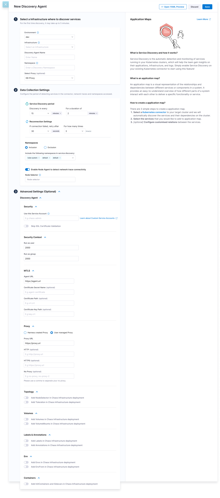
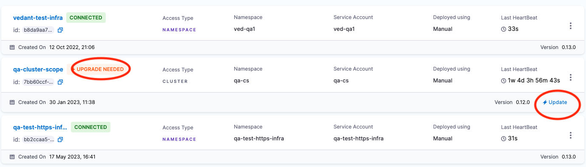

import Tabs from '@theme/Tabs';
import TabItem from '@theme/TabItem';

<DocsButton icon = "fa-solid fa-square-rss" text="Subscribe via RSS" link="https://developer.harness.io/release-notes/chaos-engineering/rss.xml" />

The release notes describe recent changes to Harness Chaos Engineering.

:::info About Harness Release Notes

* **Progressive deployment:** Harness deploys changes to Harness SaaS clusters on a progressive basis. This means the features described in these release notes may not be immediately available in your cluster. To identify the cluster that hosts your account, go to your **Account Overview** page in Harness.  In the new UI, go to **Account Settings**, **Account Details**, **General**, **Account Details**, and then **Platform Service Versions**.
* **Security advisories:** Harness publishes security advisories for every release. Go to the [Harness Trust Center](https://trust.harness.io/?itemUid=c41ff7d5-98e7-4d79-9594-fd8ef93a2838&source=documents_card) to request access to the security advisories.
* **More release notes:** Go to [Harness Release Notes](/release-notes) to explore all Harness release notes, including module, delegate, Self-Managed Enterprise Edition, and FirstGen release notes.

:::

## July 2026

### New features and enhancements

#### Version 1.94.4

Required images

Listed below are the images to download to use [image registry with Harness Delegate](https://developer.harness.io/docs/chaos-engineering/guides/image-registry).

- harness/chaos-ddcr:1.94.0
- harness/chaos-ddcr-faults:1.94.0
- harness/chaos-log-watcher:1.94.0
- harness/service-discovery-collector:0.74.0

- Added an individual service details page, so you can view the configuration, health, and associated infrastructure of a single service on a dedicated page instead of scanning the full service list.
- Added support for the Pod JVM Heap Memory fault, so you can inject heap memory pressure into JVM-based application pods and validate how they behave under constrained memory.
- Added a manual onboarding method that distinguishes between network maps and services, so you can select the correct onboarding path for each instead of relying on automatic discovery alone.
- Added validation of the existing environment ID attached to an infrastructure during single-service onboarding, so an onboarded service cannot be linked to a mismatched environment.
- Enhanced the Datadog APM probe with improved configuration and validation, so you can define Datadog APM-based health checks more reliably in your experiments.
- Added DDCR orchestration for JMeter and added JMeter component specifications to the HCE SDK, so you can run JMeter-based load and chaos workloads through the DDCR execution flow.

#### Version 1.93.0

Required images

Listed below are the images to download to use [image registry with Harness Delegate](https://developer.harness.io/docs/chaos-engineering/guides/image-registry).

- harness/chaos-ddcr:1.93.0
- harness/chaos-ddcr-faults:1.93.0
- harness/chaos-log-watcher:1.93.0
- harness/service-discovery-collector:0.73.0

- Added variables and expression support for load tests, so you can parameterize a load test with variables and reference them through expressions instead of hardcoding values. This makes a single load test reusable across environments and workloads.
- Added a Composite Load Test stage in the pipeline, with UI updates that let you configure and run multiple load tests together as part of a single stage.
- Simplified the Load Test Studio to reduce the number of steps needed to author a load test, with a clearer form layout for configuring the framework, script, image, and workload.
- Updated the built-in Locust and k6 sample load tests so the starting examples reflect current script and configuration formats.
- Added a recommendation agent that suggests relevant chaos experiments and next actions based on your services and past runs.
- Added bulk service onboarding, including a new API to onboard multiple services in a single request and the frontend to drive it. You can now onboard many services at once instead of one at a time.
- Updated the service onboarding APIs to respect the `CHAOS_RISK_SERVICES_ENABLED` feature flag, so risk service onboarding is enabled only for accounts that have the flag turned on.

#### Version 1.92.0

Required images

Listed below are the images to download to use [image registry with Harness Delegate](https://developer.harness.io/docs/chaos-engineering/guides/image-registry).

- harness/chaos-ddcr:1.92.0
- harness/chaos-ddcr-faults:1.92.0
- harness/chaos-log-watcher:1.92.0
- harness/service-discovery-collector:0.72.0

- Added k6 support for load testing, including the k6 Studio form for script, image, and UI configuration, k6 support on the load test list page and the details and execution views, and k6 load-test schema and manifest mapping
- Added load-test templates in the Local Chaos Hub, including a template authoring studio, a templates catalog, a template details drawer with inputs and script tabs, template revisioning, and the ability to create a load test from a template
- Added load-test variables management, a YAML view and builder for load tests and templates, and a run load test modal with resolved inputs and variables
- Added a metadata-driven refactor of the Load Test Studio using SchemaForm and EditableTable
- Added runtime input support for load tests in a pipeline
- Added ChaosProbe, ChaosFault, and ChaosAction template support to the Chaos pipeline step
- Added runtime values support to remote probes and actions
- Added an abort trigger when a remote resource times out

### Fixed issues

#### Version 1.94.4

- Upgraded the go-redis package in the Machine IFS and Machine IFC infrastructure components to fix CVE-2025-29923.
- Fixed multiple load-test issues reported against the acceptance criteria, improving the reliability of load-test configuration and execution.

#### Version 1.93.0

- Fixed critical and high severity vulnerabilities in `golang.org/x/crypto/ssh` and `golang.org/x/crypto/ssh/agent` used by chaos-manager
- Upgraded chaos-manager, hce-saas, machine-chaos, linux-chaos, chaos-ddcr, and chaos-ddcr-faults to Go 1.26 to pick up the latest runtime and security fixes

#### Version 1.92.0

- Fixed a permanent loader in the chaos experiment selection reference field
- Fixed a Contentful error for the help panel in QA and other environments
- Fixed K8s load tests remaining stuck in Pending when a delegate task failed
- Fixed the dropdown menu disappearing for discovered namespaces, deployment names, label selectors, and deployment kind in experiment input sets
- Fixed inaccurate ChaosGuard condition match messages shown for blocked experiments

## June 2026

### New features and enhancements

#### Version 1.91.3

Required images

Listed below are the images to download to use [image registry with Harness Delegate](https://developer.harness.io/docs/chaos-engineering/guides/image-registry).

- harness/chaos-ddcr:1.91.0
- harness/chaos-ddcr-faults:1.91.0
- harness/chaos-log-watcher:1.91.0
- harness/service-discovery-collector:0.71.0

- Added support for Linux and Windows Chaos Experiment Templates as part of the Chaos Step template in a pipeline
- Added audit trail support for the image registry, including YAML difference visualization
- Improved probe timeout, duration, and retry handling
- Added the ability to copy output variables from the timeline view node

#### Version 1.90.0

Required images

Listed below are the images to download to use [image registry with Harness Delegate](https://developer.harness.io/docs/chaos-engineering/guides/image-registry).

- harness/chaos-ddcr:1.90.0
- harness/chaos-ddcr-faults:1.90.0
- harness/chaos-log-watcher:1.90.0
- harness/service-discovery-collector:0.70.0

- Added conditional execution for faults, probes, and actions, so you can control whether each step runs based on conditions you define
- Added remote Kubernetes execution for Linux and Windows experiments. You can now run Kubernetes probes, actions, and faults against a default Kubernetes infrastructure that you set and edit on the experiment.
- Removed the legacy Prometheus, Datadog, and Dynatrace probe types from Kubernetes. If you use any of these probes, migrate to the current equivalent probe before you upgrade.

#### Version 1.89.0

Required images

Listed below are the images to download to use [image registry with Harness Delegate](https://developer.harness.io/docs/chaos-engineering/guides/image-registry).

- harness/chaos-ddcr:1.89.0
- harness/chaos-ddcr-faults:1.89.0
- harness/chaos-log-watcher:1.89.0
- harness/service-discovery-collector:0.69.0

- Added a risk insights landing page and routes in Chaos
- Added handling for Pending and Failed statuses for the helper pod
- Added propagation of the infrastructure securityContext to the experiment and helper pods
- Added propagation of DDCR resources to the experiment and helper pods
- Updated experiment execution from pipelines to use the `chaos_chaosexperiment_execute` permission. The `chaos_chaosexperiment_executepipeline` permission is deprecated and removed.
- Enabled the Download report button on the chaos subscriptions page

### Fixed issues

#### Version 1.91.3

- Fixed high-severity vulnerabilities in chaos components, including source-probe, chaos-ddcr-faults, and chaos-ddcr
- Fixed worker count not being passed when running a Kubernetes load test from the list page
- Fixed a probe taking more time than the configured timeout
- Fixed optional parameters no longer being optional when set as runtime inputs in an experiment template

#### Version 1.90.0

- Fixed high-severity vulnerabilities in the log-watcher
- Fixed load test dashboard graphs that showed gaps when DDCR dropped metric snapshots during transient gateway failures
- Fixed the missing action icon and title on the input set screen shown when you run an experiment
- Fixed missing tooltips in the advanced configuration options during chaos onboarding

#### Version 1.89.0

- Fixed an incorrect error message shown for permission errors
- Fixed missing support for extra volume mounts and extra volumes in background processor (bg-processor) jobs
- Fixed the experiment report for Linux and Windows not showing environment details

## May 2026

### New features and enhancements

#### Version 1.88.0

Required images

Listed below are the images to download to use [image registry with Harness Delegate](https://developer.harness.io/docs/chaos-engineering/guides/image-registry).

- harness/chaos-ddcr:1.88.0
- harness/chaos-ddcr-faults:1.88.0
- harness/chaos-log-watcher:1.88.0
- harness/service-discovery-collector:0.68.0

- Added filtering support for chaos experiment list in REST API
- Added support for editing step names in Chaos Studio
- Added UI support for runtime input for connector
- Updated icon for Windows infrastructure under ChaosGuard condition to Windows
- Updated Chaos Hub filter to use pagination under the Chaos Experiment template selector modal
- Removed expanded details and dropdown icon from the runs page
- Deprecated Chaos GameDays
- Optimized timeline view to better support backend's estimatedTime
- Patched CVEs across chaos images, including source-probe, smp-chaos-web, smp-chaos-manager, smp-chaos-linux-infra-server, smp-chaos-linux-infra-controller, smp-chaos-k8s-ifs, chaos-machine-ifs, chaos-machine-ifc, chaos-log-watcher, and chaos-ddcr-faults

#### Version 1.87.0

Required images

Listed below are the images to download to use [image registry with Harness Delegate](https://developer.harness.io/docs/chaos-engineering/guides/image-registry).

- harness/chaos-ddcr:1.87.0
- harness/chaos-ddcr-faults:1.87.0
- harness/chaos-log-watcher:1.87.0
- harness/service-discovery-collector:0.67.0

- Added NOT_EQUAL_TO operator support for namespace label selectors in ChaosGuard
- Added tag-based filters to the list DR Tests screen
- Added a resources section inside the Kubernetes infrastructure view
- Added search bar for input sets in modal and input sets screens under chaos experiments
- Added stage type filter to the list pipeline API
- Added support for both file and text in secret selection for the secret field
- Added probe chain logic in probes
- Moved image registry to the settings/chaos/image-registry route
- Synced table layouts across all listing screens

#### Version 1.86.0

Required images

Listed below are the images to download to use [image registry with Harness Delegate](https://developer.harness.io/docs/chaos-engineering/guides/image-registry).

- harness/chaos-ddcr:1.86.0
- harness/chaos-ddcr-faults:1.86.0
- harness/chaos-log-watcher:1.86.0
- harness/service-discovery-collector:0.66.0

- Chaos NG experience features are now generally available (GA)
- Added support for user-defined load args and extra Locust CLI args on K8s load tests, with the Harness Locust plugin now mounted via a dedicated ConfigMap at a fixed path outside the user directory
- Added support for passing env variables for helper pods
- Added support for errorResponse in timeline view when an experiment errors out
- Added support for user-based filters in List Chaos Experiments API and search filter in input sets API
- Added support for setting variables from account, org, and project scope as expressions for probe action and template runtime values
- Added three-dot menu, audit events, and ACL permissions for DR Test resources
- Added support for output variables in chaos resources

### Fixed issues

#### Version 1.88.0

- Fixed experiment status filter not working on the V3 list experiment API
- Fixed Chaos Experiment YAML unexpected character issue
- Fixed Composite load test date error in pipelines
- Fixed chaos experiment getting stuck in running state when the pod could not come up in the target infrastructure
- Fixed pod-autoscaler fault to validate that the provided target exists
- Fixed issue where some users were unable to access the subscriptions page

#### Version 1.87.0

- Fixed line re-rendering caused by line clamping when commands are long
- Fixed Base64 encoding failure for non-Latin1 characters in Locust file upload
- Fixed unverified probe allowed case in ChaosGuard

#### Version 1.86.0

- Cleared unused feature flags from chaos components

### Deprecation notices

#### Version 1.86.0

:::warning Important deprecations in this release
This release completes the transition to the new Chaos Engineering experience. The legacy experience is now permanently retired. Review the changes below and the recommended actions to ensure a smooth transition for your teams.

**Git-based Chaos Hubs removed.** The Git-based Chaos Hubs feature has been fully removed. This includes the side navigation entry for Chaos Hubs, browsing or selecting faults from a hub, predefined experiments, and all "Push to Chaos Hub" actions from experiments and probes. To continue sharing and managing probes and faults across your organization, use **Templates** from new **Chaos Hubs** under settings instead.

**Legacy infrastructure experiments are now read-only.** Experiments associated with any of the following legacy infrastructure types will now open in read-only mode in the Chaos Studio:
- Kubernetes V1 (Dedicated Chaos Infrastructure)
- Linux Chaos Infrastructure below version 1.72.2
- Machine Chaos Infrastructure below version 1.66.0

You can still execute these experiments, view run history, access reports, and download manifests. However, you can no longer edit the experiment configuration, modify probes or faults, or save YAML changes. A deprecation banner is displayed on the Overview, Builder, and Schedule tabs for affected experiments.

**Creation of Kubernetes Dedicated Chaos Infrastructure (V1) disabled.** You can no longer create new Kubernetes (Dedicated Chaos Infrastructure) environments. Existing V1 infrastructures continue to operate normally. For all new Kubernetes onboarding, use the **Kubernetes (Harness Delegate)** infrastructure type.

**SLO probe type removed for new Kubernetes probes.** SLO probe is no longer available as an option when creating a new resilience probe for Kubernetes. Any existing SLO probes remain unaffected.

**Additional UI changes:**
- The "Use legacy chaos infrastructure" toggle has been removed from the experiment infrastructure selector.
- The legacy Visual Builder has been replaced by the V2 visual builder on the Builder tab.
- The inline "Add new probes" prompt and "Change mode" action inside the fault configuration drawer have been removed.
- Navigation breadcrumbs for Application Maps and Onboarding are now consolidated under **Resilience Management**.

**What is not changing:**
- All existing experiments, probes, infrastructures, application maps, reports, schedules, run history, input sets, DR tests, load tests, and pipeline integrations continue to work as expected.
- Running, stopping, cloning, downloading, and reporting on experiments remains the same.
- All RBAC permissions are unchanged.

:::

:::info Recommended actions
1. **Migrate legacy infrastructure experiments.** Recreate any legacy experiment that you still need on a current infrastructure (Kubernetes V2, Linux, or Windows). Existing legacy experiments will continue to run but cannot be edited.
2. **Transition from git-backed Chaos Hubs.** Move any custom probes or faults previously maintained in a Chaos Hub to the Resilience Probes and Experiment Templates workflow.
3. **Use Kubernetes (Harness Delegate) for new infrastructure.** All new Kubernetes infrastructure must be created using the Harness Delegate (V2) path.
:::

## April 2026

### New features and enhancements

#### Version 1.85.3

Required images

Listed below are the images to download to use [image registry with Harness Delegate](https://developer.harness.io/docs/chaos-engineering/guides/image-registry).

- harness/chaos-ddcr:1.85.0
- harness/chaos-ddcr-faults:1.85.0
- harness/chaos-log-watcher:1.85.0
- harness/service-discovery-collector:0.65.0

- Added support for output variables in timeline view
- Updated DR Tests listing page columns and filters
- Migrated embedding model from text-embedding-ada-002 to text-embedding-3-small
- Probes and actions imported as reference are no longer editable and now redirect to the referenced template
- Updated sorting filter for custom faults to "Last Modified (New to Old)"
- Added support for hyphens inside probe conditions
- Display the "Show Logs" button when an experiment is stuck in pending state
- Added filters, search and sort to list DR Tests

#### Version 1.84.2

Required images

Listed below are the images to download to use [image registry with Harness Delegate](https://developer.harness.io/docs/chaos-engineering/guides/image-registry).

- harness/chaos-ddcr:1.84.0
- harness/chaos-ddcr-faults:1.84.0
- harness/chaos-log-watcher:1.84.0
- harness/service-discovery-collector:0.64.0

- Added namespace labels filters inside the ChaosGuard condition
- Optimized LLM calls used for recommendations by processing requests in chunks instead of individual calls, improving overall performance and reducing latency
- Updated the default sorting filter to "Last Updated (New to Old)" on all infrastructure list tables
- Rendering improvements in probes and actions details page
- Added support for Docker labels-based chaos injection on ECS in-vm SSM chaos

#### Version 1.83.4

Required images

Listed below are the images to download to use [image registry with Harness Delegate](https://developer.harness.io/docs/chaos-engineering/guides/image-registry).

- harness/chaos-ddcr:1.83.0
- harness/chaos-ddcr-faults:1.83.0
- harness/chaos-log-watcher:1.83.0
- harness/service-discovery-collector:0.63.1

- Added experiment run report to UI
- Added support to read from project, org and account scope variables in expression
- Removed "Show Logs" option for Linux/Windows and K8s v1 infra
- Added live logging and error handling for load execution in the backend
- Tabbed structure for probe and action details pages

#### Version 1.82.1

Required images

Listed below are the images to download to use [image registry with Harness Delegate](https://developer.harness.io/docs/chaos-engineering/guides/image-registry).

- harness/chaos-ddcr:1.82.0
- harness/chaos-ddcr-faults:1.82.0
- harness/chaos-log-watcher:1.82.0
- harness/service-discovery-collector:0.62.0

- Added support for viewing Harness Delegate logs and DDCI logs directly in the logs view, with a new LogsView integrated into the timeline view for improved observability during experiment runs
- Added support for fault deprecation via Enterprise Hub Sync, allowing deprecated faults to be managed centrally through the enterprise ChaosHub
- Refactored report generation to a unified data extraction pipeline and added an API to return report data as JSON
- Added fallback mechanism to list Java PID for running JVM faults, improving reliability when the default discovery method is unavailable

#### Version 1.81.0

Required images

Listed below are the images to download to use [image registry with Harness Delegate](https://developer.harness.io/docs/chaos-engineering/guides/image-registry).

- harness/chaos-ddcr:1.81.0
- harness/chaos-ddcr-faults:1.81.0
- harness/chaos-log-watcher:1.81.0
- harness/service-discovery-collector:0.61.0

- Added enforcement of the load-enabled flag from installation to execution, ensuring load tests run only when explicitly enabled. Execution is now blocked with a clear error if load support is not configured, improving reliability and validation
- Added variables in the side nav items for experiments similar to pipeline variables
- Fixed node spanning issues in Chaos Studio Graph
- Added new infra_id index to chaosExperimentRuns and chaosExperiments to prevent execution context deadline exceeding
- Migrated execution plane components to Rapidfort

### Fixed issues

#### Version 1.85.3

- Fixed probes/actions templates filtering while constructing chaos experiment template for K8s v2

#### Version 1.84.2

- Fixed CMD probes returning the complete source specification instead of a stringified version of the spec. Enhanced the `ConvertRevisionToProbeRequest` function to correctly handle copying of properties from `KubernetesCMDProperties` and `LinuxCMDProperties` to the command probe template
- Fixed the Windows Chaos Infrastructure CLI install script not including user-configured values for log file max age. The install script now correctly appends the `-ExperimentLogFileMaxAgeDays` flag to the generated CLI command when users modify the value from its default in the setup wizard

#### Version 1.83.4

- Fixed an issue where the total faults count in the experiment run report was not correct. Users will see the correct fault count now in their experiment run report
- Fixed log in service discovery

#### Version 1.82.1

- Fixed an issue where creating a fault with an org-level fault template as reference was failing when the feature flag was enabled

#### Version 1.81.0

- Fixed inputs not getting fetched when adding a custom fault under DR stage, where the API was failing

## March 2026

### New features and enhancements

#### Version 1.80.3

Required images

Listed below are the images to download to use [image registry with Harness Delegate](https://developer.harness.io/docs/chaos-engineering/guides/image-registry).

- harness/chaos-ddcr:1.80.0
- harness/chaos-ddcr-faults:1.80.0
- harness/chaos-log-watcher:1.80.0
- harness/service-discovery-collector:0.60.0

- Added backend support for expressions in experiment and experiment template
- Added UI support for Splunk observability probe in chaos
- Merged CHAOS_LINUX_MIGRATION feature flag with CHAOS_NG_EXPERIENCE
- Updated linux legacy version to 1.72.2 from 1.72.0

#### Version 1.79.4

Required images

Listed below are the images to download to use [image registry with Harness Delegate](https://developer.harness.io/docs/chaos-engineering/guides/image-registry).

- harness/chaos-ddcr:1.79.1
- harness/chaos-ddcr-faults:1.79.0
- harness/chaos-log-watcher:1.79.0
- harness/service-discovery-collector:0.59.0

- Introduced user defined variables and utility functions with CRUD support for faults, templates, probes, and actions
- Added the iterations runProperty support inside the chaos actions
- Added load test integration with machine infra and machine-chaos IFS integration with load test manager
- Migrated APIs from mux to gin
- Added tooltips for APM Probes (APM Type, Connector in Overview, Type, Comparison Criteria, Value in Probe Properties)
- Discovery Graph Enhancement: highlight connection of selected service

#### Version 1.78.1

Required images

Listed below are the images to download to use [image registry with Harness Delegate](https://developer.harness.io/docs/chaos-engineering/guides/image-registry).

- harness/chaos-ddcr:1.78.0
- harness/chaos-ddcr-faults:1.78.0
- harness/chaos-log-watcher:1.78.0
- harness/service-discovery-collector:0.58.0

- Updated chaos module banner to reflect module name change
- Added support for Secret, Connector, and `<+input>` field renderers in details for action and probes
- Added the native windows network chaos faults in machine chaos
- User can clone a load test using the three dot menu

#### Version 1.77.3

Required images

Listed below are the images to download to use [image registry with Harness Delegate](https://developer.harness.io/docs/chaos-engineering/guides/image-registry).

- harness/chaos-ddcr:1.77.0
- harness/chaos-ddcr-faults:1.77.0
- harness/chaos-log-watcher:1.77.0
- harness/service-discovery-collector:0.57.0

- Migrated Action and Probe Variables to Inputs under Chaos Studio
- Added egress rules support for ecs network restrict fault for specific rule
- Added linux chaos faults (network, API, JVM, process, service, DNS, disk fill) in machine chaos and its templates in hub
- Updated ECS Fargate CPU/Memory Sidecar to Use Multi-Arch DDCR Image
- Added Disaster Recovery (DR) component support with new entity, APIs (DRTest run, getVariables, DRComponentNodes CRUD), and DDCR execution enhancements
- Added permission to mitmdump in the install script

### Fixed issues

#### Version 1.80.3

- Fixed subscription page not working by updating the authentication token to call the internal API to validate support user
- Fixed fault template create, update, and fault import as local copy for variable support

#### Version 1.79.4

- Fixed a UI issue where PM times were incorrectly displayed as AM when saving cron schedules

#### Version 1.78.1

- Fixed update for variables in probes/actions/templates not working
- Fixed UI Infra Creation - Unable to use Environment at Org or Account scope for Chaos Infra
- Fixed Variables to Input migration issues

#### Version 1.77.3

- Fixes the issue with the load task stuck in the Pending state, and the infrastructure not receiving the load task request

## February 2026

### New features and enhancements

#### Version 1.76.0

Required images

Listed below are the images to download to use [image registry with Harness Delegate](https://developer.harness.io/docs/chaos-engineering/guides/image-registry).

- harness/chaos-ddcr:1.76.0
- harness/chaos-ddcr-faults:1.76.0
- harness/chaos-log-watcher:1.76.0
- harness/service-discovery-collector:0.56.0

- Added live logging support for linux v2 and windows v2 infrastructure
- Added UI support for experiment templates for Windows and Linux infrastructure
- Added Resource Selector for probe, action, faults in chaos module
- Added new submodule routes behind feature flags in chaos web
- Added changes in linux infrastructure and infrastructure server to support load tests
- Updated go-billing package for flex licensing to fix memory leak

#### Version 1.75.5

Required images

Listed below are the images to download to use [image registry with Harness Delegate](https://developer.harness.io/docs/chaos-engineering/guides/image-registry).

- harness/chaos-ddcr:1.75.0
- harness/chaos-ddcr-faults:1.75.0
- harness/chaos-log-watcher:1.75.1
- harness/service-discovery-collector:0.55.0

- Upgraded base image for Chaos components to RapidFort

#### Version 1.74.1

Required images

Listed below are the images to download to use [image registry with Harness Delegate](https://developer.harness.io/docs/chaos-engineering/guides/image-registry).

- harness/chaos-ddcr:1.74.1
- harness/chaos-ddcr-faults:1.74.0
- harness/chaos-log-watcher:1.74.0
- harness/service-discovery-collector:0.54.0

- Updated Overview Page in chaos to incorporate Resilience Testing and YT videos
- Added Risk UI present in the project, org and account level scopes
- Added Resilience Risk backend and DB schema with the new db approach
- Moved application maps to chaos testing and added banner for simplified nav
- Added aks-node-down fault
- Added Experiment Timeline Builder with options menu by hovering over existing node
- Added initial setup for load test

### Fixed issues

#### Version 1.76.0

- Fixed HSM secret mechanism in backend for SecretText case for faults - redis/vmware (password)
- Fixed ACL permission gaps and missing UI error handling across UI/API in Chaos module
- Implemented start/stop polling control on the onboarding status query. When the user reaches the "Create Application Maps" step, polling is automatically paused so the Network Map table remains stable for interaction (including opening menus and deleting maps). Polling resumes when the user navigates away from the step or advances to the next onboarding phase

#### Version 1.75.5

- Fixes AZ Blackhole target selection to cause chaos on all the derived subnets
- Fixed Experiment Inputs Not Visible in the Chaos Step

## January 2026

### New features and enhancements

#### Version 1.73.1

Required images

Listed below are the images to download to use [image registry with Harness Delegate](https://developer.harness.io/docs/chaos-engineering/guides/image-registry).

- harness/chaos-ddcr:1.73.0
- harness/chaos-ddcr-faults:1.73.0
- harness/chaos-log-watcher:1.73.0
- harness/service-discovery-collector:0.53.0

- Migrated to new DB interface for fault template and experiment template
- Added common db impl to remove duplicate code
- Created hierarchy_lookup table for chaos
- Updated chaos module license rollover period to 365 days in subscriptions doc page
- Migrated azure based faults from track1 sdk to track2 sdk version
- Added support for resource groups for chaos probes and actions in chaos web
- Added support for resource groups for chaos experiments in chaos web

#### Version 1.72.7

Required images

Listed below are the images to download to use [image registry with Harness Delegate](https://developer.harness.io/docs/chaos-engineering/guides/image-registry).

- harness/chaos-ddcr:1.72.0
- harness/chaos-ddcr-faults:1.72.0
- harness/chaos-log-watcher:1.72.0
- harness/service-discovery-collector:0.52.0

- Added the windows command probe support to v1beta1 experiment type
- Added runtime input support for metrics queries in APM probes
- Added support for chaos template in step template creation
- Added the harness as event source for the datadog annotation event action
- Added the HSM secret support to environment variables of Probe and Action
- Added Whitelist ssh filter for the aws-ec2-network-chaos

#### Version 1.71.3

Required images

Listed below are the images to download to use [image registry with Harness Delegate](https://developer.harness.io/docs/chaos-engineering/guides/image-registry).

- harness/chaos-ddcr:1.71.0
- harness/chaos-ddcr-faults:1.71.0
- harness/chaos-log-watcher:1.71.0
- harness/service-discovery-collector:0.51.0

- Added support for download of experiment manifest via get APIs instead of list APIs
- Removed usage of token and other keys from localStorage for CHAOS mfe
- Upgraded crictl in ddcr-faults image to fix CVE-GO-2025-3749
- Added support for Container Action & Container Probes allowing users to get complete flexibility to provide all pod specific configurations for the required operations in a cluster
- Improved handling of pod statuses during container probe execution. The logic now correctly checks for various pod states (e.g., running, succeeded, failed) and provides detailed error messages when failures occur

### Fixed issues

#### Version 1.73.1

- Fixed container probe is erroring out incase of failed condition
- Fixed apm probe template creation
- Fixed helper annotation issue for helper daemonset pods
- Fixed RESILIENCE SCORE and RESILIENCE COVERAGE not updating in application maps with v1beta1 experiments. The fix introduces enhancements to the chaos experiment pipeline by adding logic to update the target network map and target services, thereby improving resiliency coverage for v1beta1 experiments
- Fixed tune fault functionality broken in beta1 experiments. All fault tunables are working correctly
- Fixed JVM experiment not respecting JAVA_HOME setting set on the spec. Fixed JVM chaos experiments to support custom JavaHome paths - experiments now succeed when java is not in the system PATH but JavaHome is specified in the experiment configuration
- Fixed API not sending updated details in response when updating metadata of a fault template

#### Version 1.72.7

- Fixed Node Network faults not affecting the network connectivity of the nodes, it was only affecting the helper pod where the tc command is executed
- Fixed issue with Prometheus APM Probe not adding TLS Configuration during experiment execution
- Fixed Chaos step checks api returning 500 error when pipeline stage has parallel steps or string type res score
- Fixed New Relic Connector ID derivation while execution
- Fixed issue with template preview for org and account scoped template in project scope template
- Fixed the raise condition of datadog metric calculation where Datadog Probe succeeds when it shouldn't

#### Version 1.71.3

- Fixed probe details drawer breaking when probe is having huge details in Resilience Tab under pipelines

## Previous releases

2025 releases

#### December 2025

##### Version 1.70.4

Required images

Listed below are the images to download to use [image registry with Harness Delegate](https://developer.harness.io/docs/chaos-engineering/guides/image-registry).

- harness/chaos-ddcr:1.70.0
- harness/chaos-ddcr-faults:1.70.1
- harness/chaos-log-watcher:1.70.0
- harness/service-discovery-collector:0.50.0

###### New Features and Enhancements

- Added Kafka exception and latency faults in JVM faults
- Added changes to Chaos Experiment Selection Drawer in Pipeline to support chaos templates
- Added support for importing experiment as reference
- Added new statuses for Chaos manager notification triggers
- Removed the "Enabled" text on the probe resource in Probes page. The probes status on the side of each row has been removed, you can find it beside the name as separate column

###### Fixed Issues

- Fixed issue with the target application validation for application chaos
- Fixed issue where there's no resilience score, but in the graph it shows 100, and resilience score shows -1%
- Fixed "Please select chaos infra" warning showing even after we have selected the infra
- Fixed issue when clicking on any radio button while configuring onboarding screen, it always scrolls screen to top by adding `contain: layout` to `.bp3-form-group`

##### Version 1.69.6

Required images

Listed below are the images to download to use [image registry with Harness Delegate](https://developer.harness.io/docs/chaos-engineering/guides/image-registry).

- harness/chaos-ddcr:1.69.0
- harness/chaos-ddcr-faults:1.69.0
- harness/chaos-log-watcher:1.69.0
- harness/service-discovery-collector:0.49.0

###### New Features and Enhancements

- Added Datadog annotation action support for custom actions
- Added bulk ignore support for chaos recommendations
- Added Grafana Events support in custom actions
- Implemented bulk operation functionality for chaos recommendations and resource tables
- Added tooltips to various categories of custom services
- Addressed vulnerabilities in Linux source-probe
- Added support for importing faults as reference

###### Fixed Issues

- Fixed Type filter not working on get fault Templates API when trying to import a fault template
- Fixed experiments getting stuck in Chaos-Manager in 1.68.x release. The change modifies the `name` parameter from being extracted as a path parameter to a query parameter in the `ExperimentExecutionNodeDetails` function. This adjustment is intended to fix issues with DDCI calls, ensuring that the parameters are correctly processed in the API handler
- Fixed actions and probe update when no variables are sent. This fix addresses a bug related to the handling of nil cases in action variables within the UpdateAction function. The previous implementation included a conditional check for nil variables, which has been removed to ensure that the variables are always appended to the updatedAction regardless of their state
- Fixed DDCI manifest-generation for older k8s version
- Updated count of chaos recommendations to only reflect pending recommendations
- Fixed issue where during CD onboarding, Infrastructure View Progress was not opening in new tab

#### November 2025

##### Version 1.68.5

Required images

Listed below are the images to download to use [image registry with Harness Delegate](https://developer.harness.io/docs/chaos-engineering/guides/image-registry).

- harness/chaos-ddcr:1.68.1
- harness/chaos-ddcr-faults:1.68.2
- harness/chaos-log-watcher:1.68.0
- harness/service-discovery-collector:0.48.1

###### New Features and Enhancements

- Added comprehensive infrastructure management UI with new wizards for creating Kubernetes and Machine chaos infras (Container, Linux, Windows, CloudFoundry), list pages with dedicated tabs for each infra type, and edit/detail views with modern designs
- Added Probe verification support for Linux and Windows infrastructure
- Added support for advanced config when onboarding pipeline from CD Resilience Step
-  Added support for k8s based services including node, pod, and workload, along with 'Other' Service option in custom services agent
- Added filter and sort functionality for both k8s v1 and v2 apis with support for multiple environmentIDs filter
- Added skeleton loader to timeline view for better loading experience
- Added ability to use templates from Experiment Builder Page

###### Fixed Issues

- Fixed Chaos Guard not working as expected on Safari browsers where configuring freeze windows and time windows would fail. Time window and freeze window configurations now work correctly on Safari with proper date and time selections saved and displayed across all browsers
- Fixed ChaosGuard UI issues including tags not being visible on hover (now shown in popover), UI breaking while selecting conditions in rules (improved pagination), and YAML view coming blank before saving
- Fixed Ask AI not working for questions about windows/linux chaos infrastructures by adding relevant examples in ChaosGuard AI
- Fixed label issue for Harness infra on Chaos-guard-conditions form page
- Fixed issue where REST APIs were returning data even when providing -1 as page/limit value by adding validation for page/limit parameters in all REST APIs
- Fixed issue where deleting a fault from its details page would take users to a blank page
- Fixed issue where setting only few of tunables under Authentication Tab when creating experiment with a fault would store others as `undefined`
- Fixed issue where creating experiment template at org/account level with authentication variables would fail with missing identifier errors
- Fixed Force parameter being interpreted as runtime argument
- Fixed import enterprise fault not working properly

#### October 2025

##### Version 1.67.0

Required images

Listed below are the images to download to use [image registry with Harness Delegate](https://developer.harness.io/docs/chaos-engineering/guides/image-registry).

- harness/chaos-ddcr:1.67.0
- harness/chaos-ddcr-faults:1.67.1
- harness/chaos-log-watcher:1.67.0
- harness/service-discovery-collector:0.47.0

###### New Features and Enhancements

- Introduced file-based secret authentication for GCP VM Service Kill using service account JSON itself
- Added support for ECS agent stop chaos fault for Kubernetes HD
- Added support for ECS task stop chaos fault for Kubernetes HD
- Enhanced chaos-agent with proxy support for installing dependencies, GLIBC_2.32 compatibility for EC2 SSM chaos, and fallback to app.harness.io for binary installation
- Added support for advance configuration for Chaos onboarding in CD pipeline
- Added backend validation for the secrets.getValue representation for the APM Probes
- Added sorting support to listInfrastructure APIs
- Added backward compatibility support for both v1alpha1 & v1beta1 in windows infra
- Updated Pipeline pages to refer to Chaos Agent
- Omitted deleted probes from experiment run details under Resilience Tests Tab
- Enhanced parsing logic for faultSpec to avoid sending null data
- Added backend validation to restrict the experiment creation when no fault defined inside the experiment
- Added support for re-onboarding of chaos experiment in pipeline
- Disabled GraphQL introspection
- Added AIEnabled toggle option in advance setting of onboarding
- Updated command source probe to use the fault-service account
- Added MTLS support to the API chaos faults
- Added Pipeline Run support for windows v1beta1 experiments
- Removed the image, imagePullPolicy and other unrelated fields from windows faults spec
- Added support for GCP monitoring APM Probe
- Moved Chaos Guard to Project Settings with better user experience and optimized REST API support

###### Fixed Issues

- Fixed Command Probe issue where marking an environment variable as runtime input would set its runtime variable name as "VALUE" instead of the key/name of the environment variable. This prevented users from setting multiple runtime environment variables inside the chaos studio. The key/name of the environment variable is now correctly used as the name of the runtime input variable
- Fixed Probe Executions not showing executions for K8s V1 experiments run. The logic now appends recent runs from the v1 experiment list to the existing recent runs, ensuring a comprehensive view of the latest probe activities
- Fixed Experiment Count In Application Map. The logic for managing the experiment count in application map during deletion has been refined to ensure accurate tracking and decrementing of associated resources
- Fixed issue where providing volumes/mounts/labels/envs/initContainers from onboarding screen on overview page was not taking effect. Added the new fields in API
- Fixed Chaos Guard condition not showing probe verification value
- Fixed internal watcher filter source for the probes inside recommendations page
- Fixed plain_text/encrypted toggle option to show only for Kubernetes HTTP Probe
- Fixed issue where entity details would disappear from existing experiment runs after an experiment was updated and certain components were removed. Experiment runs will now continue to show all relevant details even if the experiment configuration changes later
- Fixed crash in chaos-web when no fault details are available. In cases where a fault is completely templatized or is a custom fault with no tunables, the details tab inside the timeline view would crash. An appropriate error/acknowledged message is now shown

#### September 2025

##### Version 1.66.8

Required images

Listed below are the images to download to use [image registry with Harness Delegate](https://developer.harness.io/docs/chaos-engineering/guides/image-registry).

- harness/chaos-ddcr:1.66.1
- harness/chaos-ddcr-faults:1.66.2
- harness/chaos-log-watcher:1.66.0
- harness/service-discovery-collector:0.46.0

###### New Features and Enhancements

- Added support for cgroup v2 in AWS ECS container chaos with backward compatibility with cgroup v1 enabling chaos experiments on modern container runtimes that use cgroup v2 while ensuring smooth operation across environments still using cgroup v1
- Added VMware Windows disk stress chaos fault in k8s-v2 using DDCR
- Enhanced error details to be highlighted and shown by default
- Added hotfix with the ECS Container chaos fixes
- Updated ChaosResiliencyCard in pipeline to use new resilience score color and logic
- Migrated cypress pipeline to use k8s connector instead of harness cloud
- Added variables in probe and action template manifest
- Added capability to run with readOnlyRootFilesystem: true for chaos-web
- Added functionality to run vmware stress faults with non-sudo user
- Updated tooltip for Probe and Fault Auth fields for HSM support
- Moved Username and Host to the Auth section inside the SSH fault
- Enhanced error handling in ddcr gracefully when faults execution failed
- Added authEnabled field inside the faultRef of experiment
- Added Authentication tab inside the faults based on FaultAuthentication category
- Added HSM support to the faults
- Added Select pipeline modal in chaos module with decent filters
- Added UI changes for NewRelic Probe support

###### Fixed Issues

- Fixed Secret Support/Authentication Tab not coming when adding Fault Templates under Template Studio by calling the submit function directly and adding logic to catch clearing of secret input fields when they remove the value from formik
- Fixed Redis REDIS_TLS_SECRET not getting saved by calling the submit function directly and adding logic to catch clearing of secret input fields when they remove the value from formik
- Fixed Node Restart where none of username/secret was getting saved by calling the submit function directly and adding logic to catch clearing of secret input fields when they remove the value from formik
- Fixed SSH Faults Issues by calling the submit function directly and adding logic to catch clearing of secret input fields when they remove the value from formik
- Fixed Azure Secret not getting saved by calling the submit function directly and adding logic to catch clearing of secret input fields when they remove the value from formik
- Fixed VMWare Fault Secret/Authentication Issues by calling the submit function directly and adding logic to catch clearing of secret input fields when they remove the value from formik
- Fixed AWS Secret as well ARN for AWS both not getting saved as part for Auth Tab by calling the submit function directly and adding logic to catch clearing of secret input fields when they remove the value from formik
- Fixed Fault Authentication tooltip showing content for tunables by adding tooltip for fault auth
- Fixed SLO Probe not being removed when NG Exp feature flag is enabled where SLO probe will not be available when CHAOS_NG_EXPERIENCE flag is enabled but editing of pre-created slo probes will be supported
- Fixed Import Probe as reference for OOTB probe not working by adjusting the logic for determining whether a probe or action is imported, ensuring that the correct references are used throughout the codebase
- Fixed being able to run experiments that have inputs as runtime when clicking on run button present in 3 dot buttons in exp table page by properly handling runtime variable collection and implementing consistent execution flow across all UI components
- Fixed not being able to abort experiment when it is in queued state
- Fixed cleanupPolicy being empty in manifest when launching an experiment from an experiment template by adding logic to add cleanupPolicy while creating experiment from experiment template
- Fixed none of the filters working on fault template drawer when creating experiment template
- Fixed being able to save an experiment with non-existing infrastructure ID in windows experiment manifest by adding all infrastructure existence validation from the windows manifest
- Fixed removing a probe which was added multiple times in a windows experiment removing all instances of probe from fault during editing or cloning where only the intended probe is now deleted
- Fixed pipeline recommendations for CD services discovered in different project
- Fixed fault_forge and nsexec links in litmus-go
- Fixed high vulnerabilities in ddcr-faults docker image
- Fixed vulnerabilities in ddcr
- Fixed Experiment status based on the fault, probe and action statuses
- Fixed experiment resilience score for erroneous experiments

##### Version 1.65.12

Required images

Listed below are the images to download to use [image registry with Harness Delegate](https://developer.harness.io/docs/chaos-engineering/guides/image-registry).

- harness/chaos-ddcr:1.65.0
- harness/chaos-log-watcher:1.65.0
- harness/service-discovery-collector:0.45.0
- harness/chaos-ddcr-faults:1.65.0

###### New Features and Enhancements

- Enhanced fault template list page to have correct data in project settings by correcting the endpoint API calls from hubs/faults to /faulttemplates
- Added field in list fault templates API to return the count of fault templates in all categories
- Removed "Kubernetes" option from Fault template creation modal as Fault template is only supported for "Kubernetes (Harness Infrastructure)"
- Enhanced local APIs to use open API client for ng-manager and cg-manager
- Added permissions and permission links for faults which can be viewed on detail page
- Reverted changes to rename chaosActionTemplates package name
- Added Experiment Template frontend with CRUD and launch experiment functionality with intuitive UX
- Added API to support launch experiment feature
- Updated action template and probe template APIs
- Added launch experiment button to create an experiment from a template
- Added support for Dashboard in unified view for Chaos Module
- Added statusCheckTimeout support for v1beta1 templates
- Added logic to remove secret volume mount on GCP vm-stop (by id/label) faults if CLOUD_SECRET_NAME env is absent
- Added CHAOS_CMD_PROBE_SOURCE_MODE_ENABLED flag in harness-core-ui and hce-saas
- Replaced the existing resilience tab with the newly implemented resilience tests tab
- Fixed update probe API call in frontend to support probe and actions templates
- Added UI changes for delete chaos-hub where users can delete custom chaos hubs with no children (probes, faults, action)
- Updated infras on updating a chaos fault
- Added default destination ports in API chaos faults
- Created fault, probe and action drawers for experiment template
- Created Experiment template yaml service and schema
- Added VMWare powerOff by Name Fault
- Added missing RBAC permissions for node-drain faults
- Added control for Linux source probe support with feature flag
- Added pipeline recommendations behind feature flag and handled recommendations on pipeline deletions
- Standardized empty states for tables, tabular and card lists for chaos
- Added validation that if target input is available, then at least one of "kind", "namespace", "name", "label" should be provided
- Added experiment template schema
- Added support for Merk POV Execution and Enablement
- Added logwatcher streaming support for daemonset helper
- Refactored Chaos Studio to centralize all state for template support with major data layer refactoring, greatly reducing bugs/usability issues
- Added Experiment template list page on chaos hub in all scopes with details drawer
- Enhanced AZ Blackhole fault to remove ACLs for specific subnet in a Zone (within the VPC) using SUBNET_IDS or SUBNET_TAG as filter
- Added Pipeline to automate packaging of linux offline installer
- Added VMWare Power Off Experiment In Chaos V2 with VMWare PowerOff chaos in DDCR
- Enhanced API chaos faults to print the logs of the mitmproxy
- Enhanced DDCR to handle nil pointer exceptions
- Added Probe Certification feature to avoid gamification of Experiment Resilience Score
- Added auto-population of resources in ChaosGuard Conditions Wizard
- Added delete experiment template functionality with delete button
- Added delete experiment template API
- Added update experiment template UI with edit flow
- Added List and get Experiment template and revision UI
- Added Create Experiment template UI
- Added Create Experiment template API
- Added DB schema and index for experiment template
- Removed Image registry feature flag from Chaos-manager
- Added UI Tasks for HSM support for Chaos

###### Fixed Issues

- Fixed incorrect experiment runs count and faultTemplate count
- Fixed GetExperiment returning null due to missing manifest apiVersion check
- Fixed CVE-2025-22868 security vulnerability in chaos-manager
- Fixed probe environment variables name and value not being properly displayed under probe details section in UI after import
- Fixed scoping issue for launch experiment API
- Fixed API call for ApplicationDetails for Target App Tab not being called for template studio
- Fixed get and list API for chaos experiment where infra id is empty
- Fixed AI recommendation banner having padding issue when Experiment_list feature flag is enabled where left-right padding will be present for recommendation banner on new list page
- Fixed authentication validation error when trying to create http probe template without auth where authType cannot be empty
- Fixed non-cron option not being selected by default in schedule tab when editing an existing non-cron v1beta1 or v1alpha1 experiment
- Fixed descriptions for fault templates not coming as formatted where bullet points are now properly respected
- Fixed authentication not being a required field while configuring http probe template
- Fixed Target App details Tab not coming up when adding a fault template while configuring an experiment template
- Fixed project dropdown showing projects from other orgs when launching an experiment from org level chaoshub
- Fixed chaos infrastructure selection input being enabled before project is selected
- Fixed "Launch Experiment" label to "Create Experiment" for better clarity
- Fixed Advance Options not being available for k8sv2 when editing an existing experiment
- Fixed infrastructure required field error even though infrastructure is already selected when launching experiment
- Fixed unknown action templates being listed even though there are no action templates in selected chaoshub
- Fixed unknown probe templates being listed even though there are no probe templates in selected chaoshub
- Fixed incorrect count of fault/experiment templates showing by default as 3 & 2 even though it's an empty chaoshub
- Fixed Infrastructure Type missing on experiment template
- Fixed error for child entities when trying to update an existing experiment template
- Fixed option to add experiment template to Enterprise-Chaoshub being available inappropriately
- Fixed enterprise probes showing custom probes instead of OOTB probes when trying to select probe templates
- Fixed Empty Experiment Templates Tab showing text wrt Fault Templates
- Fixed Probe Template Type filter not working under probe template selection drawer
- Fixed Action Template Type filter not working in Action Template selection drawer
- Fixed options to add probes/faults/actions showing texts wrt resource and not templates
- Fixed Template Builder showing options wrt "add a probe/action/fault" & not "add a probe/action/fault template"
- Fixed Overview Tab under Experiment Template construction page showing "Version" input inappropriately
- Fixed GetProbesInExperiment API giving 500 error when experiment manifest is not found
- Fixed "Open template in New tab" button of referenced probe redirecting to probe template name instead of identity
- Fixed Linux IFC restarting in Prod0 under edge case where task definition would delete while event orchestration is still underway
- Fixed experiment description box having misaligned text upon hover
- Fixed experiment showing Queued status in execution view though history indicates stopped OR timed-out
- Fixed unable to configure properties as part of edit operation on actions
- Fixed wrong import icon used on Import Button in Probes & Action
- Fixed error and blank screen when trying to edit an experiment after deleting chaos infrastructure
- Fixed Fault Type filter not clearing on press of remove button on ImportFaultDrawer
- Fixed experiment manifest of windows experiment containing unused labels
- Fixed experiment manifest for linux containing unused label "type: standalone_workflow"
- Fixed probes status/data not coming correctly under execution view for windows experiments
- Fixed custom script action giving error "delay action inputs is nil" when running
- Fixed input validation on duration input for probes not working/available
- Fixed Target Label or Target Name Runtime Input not updating to Fixed Value with empty string
- Fixed descriptions for faults not coming as formatted where bullet points are now respected
- Fixed Infrastructure Type for default probe created via onboarding showing "k8sV2" & execution history not coming
- Fixed "Chaos Infrastructure disabled successfully" message when removing/deleting an application map
- Fixed configuration labels referring to all as "chaos infrastructure" instead of "discovery agent" for discovery agent
- Fixed Infrastructures screen showing "ACCESS_TYPE" keys as empty values for Chaos V2
- Fixed headers not being visible on probes details screen for http probes
- Fixed custom action having envs showing visual representation as "[object, object]"
- Fixed type dropdown not showing APM probe type when importing probes
- Fixed placeholders for metricsSelector/EntitiySelector under APM probe created with Dynatrace connector showing message wrt prometheus
- Fixed http-probe template (k8s) headers not being visible in UI mode but available in YAML
- Fixed Edit template button getting mis-aligned when action name is too long
- Fixed Env for custom script action not being visible in UI mode but available in YAML
- Fixed Cross button getting mis-aligned when there is an error in form while creating action template
- Fixed Import/Export Chaoshub being disabled on ChaosHub
- Fixed custom fault not showing run count and execution history even after running experiment
- Fixed missing icons in kubernetes hd card which was misleading
- Fixed updating a non-existent action not resulting in an error
- Fixed deleting a non-existing action not resulting in an error

#### August 2025

##### Version 1.64.14

Required images

Listed below are the images to download to use [image registry with Harness Delegate](https://developer.harness.io/docs/chaos-engineering/guides/image-registry).

- harness/chaos-ddcr:1.64.1
- harness/chaos-log-watcher:1.64.1
- harness/service-discovery-collector:0.44.0
- harness/chaos-ddcr-faults:1.64.3

###### New Features and Enhancements

- Added in-house logic for windows memory stress and removed Testlimit dependency for better performance and reliability
- Added resource access restrict support to 1.64 with cherry-pick changes
- Added UI changes to migrate recommendation into separate tab for better organization
- Added support for outbound traffic in resource access restrict functionality
- Enhanced probes to execute in parallel mode even if duration is provided
- Added logic to derive autopilot enabled or disabled from helper pod ownerRef
- Added packaging of all dependencies and binaries into a single installable archive for online and offline installation
- Added auto pilot support for chaos infra and onboarding from frontend
- Added ability to clear inputs for a fault once provided in Chaos Studio
- Added changes for ddcr-faults-dual-binary support
- Updated frontend nginx configuration
- Upgraded AWS V2 SDK to support the V2 AWS faults with IRSA
- Added Resilience tab fixes for v1beta1 experiments
- Added hce-sdk changes to add environment variables in custom action scripts
- Added dual (pod and daemonset) mode support in ddcr-faults
- Enhanced mongo queries and added indexes for chaosFaults collections for better performance
- Added permissions and links in chaosFaults and chaosFaultTemplates collections
- Added support for generation of AI recommendations for the v1beta1 schema
- Changed icon of AI related items from co-pilot to standard AI icon
- Made the duration input for probes as FIXED VALUE until runtime support is implemented
- Updated `CHAOS_ECS_ENABLED` flag to the new name `CHAOS_CONTAINER_ENABLED` in the `CHAOS_MANAGER`
- Added support to run experiment with fault resource including v1alpha1
- Added infraType to path params for getMachineInfraDetails API and added infra name to the deleteMachineInfra API response
- Added support for providing environment variables in custom script action in UI
- Added support for generation of v1beta1 experiment manifests via Onboarding to support timeline view in execution
- Enhanced chaos experiment DB schema to include reference of used faults

###### Fixed Issues

- Fixed AI recommendation banner having padding issue when Experiment_list feature flag is enabled where left-right padding will be present for recommendation banner on new list page
- Fixed source filter not working in recommendations API
- Fixed execution details being blank on blocked chaos experiment
- Fixed audit event for Run recommendations API
- Fixed status under executionData of V1Beta1 experiments remaining always Queued by enhancing the execution data management for version v1beta1 and updating the status within the execution data structure
- Fixed openSSL dependency for wkhtmltopdf binary in chaos-manager
- Fixed chaos v2 experiment configured as cron returning wrong workflowType as "experiment_v2" instead of cron by correcting the handling of cron scheduling types during experiment updates
- Fixed probe search not listing probes imported as reference by fixing the probe name filtering logic to ensure it correctly matches the intended probe names
- Fixed update conflicts when adding multiple entities (fault/probes/actions) in parallel in an experiment by implementing a new RetryTransaction function to encapsulate MongoDB transactions with automatic retries for write conflicts
- Fixed step duration showing end time even though the step is still in progress where the shown value remained constant (same as start time) while running
- Fixed not being able to scroll YAML editor of Spec under Timeline View
- Fixed Target Application Details being visible for faults which don't have target details in Timeline View
- Fixed activity usage not getting updated for v1beta1 related services/experiments by adding logic to capture target services for beta1 experiments
- Fixed cmd probes not importing environment variables for linux and windows type of http probe
- Fixed probe or action imported as reference returning empty manifest API by adding manifest details while fetching data from template reference
- Fixed probe/action import not getting description from the referred template by adding description from template during import if not provided by user
- Fixed apiTokenSecretName coming as empty string for linux dynatrace probe under YAML
- Fixed not being able to scroll to env values while configuring k8s cmd probe template when source is enabled
- Fixed error when creating a probe template under a chaoshub having same identity as other probe in different chaoshub by updating the create operation to consider hub reference
- Fixed error when creating an action having same identity as any other action but in a different chaoshub by updating the create operation to consider hub reference
- Fixed fault selection drawer and modal for custom fault creation using "agent" terminology by adding agent type name in the fault Selection subtitle for clarity
- Fixed input validations not working on fault template creation modal where empty array/array elements will not be allowed from the UI
- Fixed fault template under chaoshub keeping loading and giving "internal server error" by defaulting api revision to v1
- Fixed ProbeTemplates template creation succeeding with non-existent hub ref by adding `validateActionTemplateCreation` and `validateProbeTemplateCreation` methods to ensure that the specified hub exists and that the template identity is unique
- Fixed cron scheduling for experiments not working where multiple experiments targeting same network map was causing write conflict errors by adding a retry mechanism
- Fixed empty args being allowed during action creation
- Fixed not being able to run VMware experiments by passing vCenter credentials as secret
- Fixed "Completed with probe Error" status not coming when a probe failed due to genuine reason by updating status logic for execution data
- Fixed HTTP Probe summary text indicating success but actual probe execution reflecting error (connection refused) by adding http "connection refused" as a failure instead of an error for probes
- Fixed creating a probe or action with a duplicate name resulting in "Internal Server Error" by updating error messages to provide clearer feedback instead of generic internal server error messages
- Fixed creating an action with an existing id or name failing with "Internal Server Error" by updating error messages to provide clearer feedback instead of generic internal server error messages
- Fixed not being able to delete tag filters from Probe list page filters where probe filter tags can now be deleted
- Fixed SLO probe evaluation start and end time not getting saved by fixing the issue with evaluation window not showing up in SLO Probe

#### July 2025

##### Version 1.63.7

Required images

Listed below are the images to download to use [image registry with Harness Delegate](https://developer.harness.io/docs/chaos-engineering/guides/image-registry).

- harness/chaos-ddcr:1.63.3
- harness/chaos-log-watcher:1.63.0
- harness/service-discovery-collector:0.43.1
- harness/chaos-ddcr-faults:1.63.3

###### New Features and Enhancements

- Enhanced and simplified image registry support for experiment v1 and v1alpha1 images
- Added support for "Complete with probe error" status on timeline view screen
- Added recent execution details for both probes and actions in the database schema, allowing for better tracking and management of execution history
- Added UI/UX support for windows command probe using windows infrastructure
- Added support for "INTERRUPTED" status for probes in probes screen as well as timeline view screen
- Enhanced experiment result display to show "CompletedWithProbeFailure" when probe failed
- Added support for import probe as a reference in UI
- Added targets support to the timeline view
- Added support for running windows process kill fault on windows infrastructure using SYSTEM user
- Added support for node faults on GKE Autopilot
- Enhanced healthcheck support to pod-io-stress fault
- Added name sorting support for Experiment list
- Added ENV support to the inline command probe for both backend and UI
- Added OOTB probes as inline command probes for kubernetes infrastructure
- Enhanced UI to surface Common Kubernetes Errors (ImagePullBackOff, Evicted, OutOfCpu) for Kubernetes Infrastructure

###### Fixed Issues

- Fixed gameday execution error when trying to run a gameday with same ID as another gameday in different project due to missing identifiers in query filters
- Fixed chaos license page not being accessible in production environments where subscriptions page was crashing when refreshed
- Fixed list probes API not working for older probes/experiments and panicking due to user details not being available by adding nil check for user details in recent probe execution details
- Fixed multiple probes getting selected upon using import probe in Local Hub
- Fixed error in CMD probe when Float data type is provided and value is a runtime input where selecting Runtime Input for Comparator Value was throwing a type validation error
- Fixed inputs being duplicated for a given probe pulled at various points in an experiment by fixing the support for multiple probes/actions inside one experiment
- Fixed not being able to abort experiments in production environments
- Fixed action and probe search filtering not working in Chaos Studio by updating parameter names for clarity where actionType has been changed to entityType and infrastructureType has been simplified to infraType
- Fixed Local Hub showing 0 faults and 0 actions although fault and action templates exist within the hub by updating the mongo query to fetch the count of chaos hub resources
- Fixed Timeline View showing action name instead of the type (Delay/Custom Script) by adding a new field Type to the ActionData struct within the execution data
- Fixed input validation issues in DataDog/Dynatrace probes in both linux/k8s when providing runtime inputs where support for runtime inputs in time frame and test type field was broken
- Fixed V2 experiments showing status and type as empty strings and showing error in YAML UI by updating the hce-sdk to allow for optional fields in the experiment manifest
- Fixed Resilience Score coming as 0 even though all probes passed by correcting the calculation of the resiliency score to ensure accurate scoring based on the status of chaos execution nodes
- Fixed Custom Script Action argument being a mandatory field when it should be optional as commands may not have arguments necessarily
- Fixed probe status being reported as failed on abort when it should be N/A or Pending by updating probe status to be Stopped or Skipped on experiment abort
- Fixed Timeline View experiments keeping running indefinitely by ignoring the DDCR pod from the target pod selection
- Fixed pod-delete fault being randomly reported as Error even though it succeeded by resolving the issue where the fault status was incorrectly reported
- Fixed target not showing in the timeline view representation of the fault by adding target details to the fault data structure
- Fixed Actions "Stop on Failure" radio button not being applicable
- Fixed empty cards for fixed inputs in the experiment inputsets page in Chaos Studio

#### June 2025

##### Version 1.62.11

Required images

Listed below are the images to download to use [image registry with Harness Delegate](https://developer.harness.io/docs/chaos-engineering/guides/image-registry).

- harness/chaos-ddcr:1.62.4
- harness/chaos-log-watcher:1.62.1
- harness/service-discovery-collector:0.42.1
- harness/chaos-ddcr-faults:1.62.2

###### What's New

##### New Chaos Experiments

- VPC Route Misconfiguration for AWS - Simulate network connectivity issues by disrupting connections to Transit Gateway, NAT Gateway, or VPC Peering connections.
- Windows Memory Stress Experiments - Run memory stress tests on Windows systems without requiring administrator privileges.
- AWS Windows Chaos Experiments - Execute chaos experiments on Windows EC2 instances using AWS Systems Manager.
- Linux Experiments with Non-Root Users - Install and run chaos experiments on Linux systems without root access (limited fault selection available).

##### Enhanced User Experience

- Redesigned Experiments Page - Cleaner, more intuitive interface for managing your chaos experiments.
- Improved Timeline View - Better visualization of experiment execution with support for new probes, actions, and faults.
- Enhanced Chaos Studio - New properties and variables tabs for easier probe and action configuration.
- Action Management - Dedicated details screen for managing standalone actions.
- Permission Indicators - Visual indicators on fault cards showing basic or advanced permission requirements with helpful tooltips.

##### Platform Improvements

- APM Probe Integration - Monitor application performance during chaos experiments with Application Performance Monitoring probes.
- Parallel Linux Experiments - Run multiple chaos experiments simultaneously on Linux infrastructure in SaaS environments.
- Vanity URLs - Support for vanity URLs across chaos management services.
- Enhanced Experiment Construction - Streamlined process for creating experiments with experiment-level probes, actions, and templates.
- Unified Validation - Consistent schema validation across all infrastructure types supporting experiment-level probes.

###### Improvements and Bug Fixes

##### Timeline and Execution

- Fixed experiment status not updating correctly when experiments fail
- Improved timeline view to properly display skipped and error nodes with accurate duration
- Resolved missing data issues in timeline execution details
- Fixed experiment execution getting stuck in queued state

##### User Interface

- Fixed dropdown pagination controls not working properly
- Improved error messaging to show clearer descriptions instead of technical error codes
- Resolved display issues with Windows infrastructure troubleshooting commands
- Fixed various UI components for better user experience

##### API and Data Management

- Improved API responses for experiment lists, faults, probes, and actions
- Fixed data counting issues in Local Hub and Chaos Hub
- Enhanced authentication handling to prevent unnecessary impersonation data
- Improved schema handling for better compatibility
- Added restriction in backend to prevent the deletion of default kubernetes system probe via API.

##### Infrastructure and Performance

- Fixed vulnerabilities by upgrading `jwt` and `ff-go-sdk` go packages in all chaos components.

#### May 2025

##### Version 1.61.11

Required images

Listed below are the images to download to use image registry with Harness Delegate.

- harness/chaos-ddcr:1.61.1
- harness/chaos-log-watcher:1.61.1
- harness/service-discovery-collector:0.41.0
- harness/chaos-ddcr-faults:1.61.2

###### What's New

##### Enhanced Platform Support
* **Istio and Virtual Services Support** - All SMP services now fully support Istio service mesh and virtual services for better network management and traffic routing.

##### APM Monitoring Improvements
* **Splunk Observability Integration** - Added Splunk Observability support for APM probes, expanding monitoring capabilities during chaos experiments.

* **AppDynamics Comparator Support** - Enhanced APM probes with comparator functionality for AppDynamics connector, enabling better threshold-based monitoring.

* **APM Probe Details View** - Improved experiment execution page to display APM probe properties and details for better visibility.

##### Experiment Management
* **BYOC (Bring Your Own Container) Enhancements** - Added runtime input support and improved user experience for custom container-based chaos experiments.

* **Kubernetes V2 Beta1 Support** - Added versioning support for Experiment Factory with new experiment schema for Kubernetes v2 beta1 manifests.

* **Custom URLs Support** - Enhanced chaos management services with vanity URL support for better branding and accessibility.

##### Backend and Infrastructure

* **Improved ChaosGuard** - Fixed YAML mode issues for ChaosGuard conditions in Linux and Windows infrastructures.

##### Improvements and Bug Fixes

###### Experiment Creation and Validation
* **Fixed YAML Validation Issues** - Resolved problems where unrelated errors would block experiment creation and saving when using blank canvas or YAML upload methods.

* **Enhanced Linux Experiment Execution** - Fixed execution issues in Linux environments by updating TaskDefinition CRD charts with required response body fields.

##### Probe Management and Validation
* **Command Probe Fixes** - Resolved multiple issues with Kubernetes CMD probes including source attribute handling and editing functionality.

* **Dynatrace Probe Improvements** - Fixed probe creation issues and added proper validation for numerical values in Float type comparisons.

* **Prometheus Probe Validation** - Added mandatory validation for query and query path fields to ensure proper probe configuration.

* **APM Probe Display** - Fixed issues where APM probe properties weren't showing correctly on experiment execution pages.

* **Bulk Probe Operations** - Improved bulk disable functionality for probes with better error handling and logging.

##### Platform Stability
* **Windows Build Improvements** - Resolved Windows-specific build issues for better cross-platform compatibility.

* **Helm Chart Updates** - Fixed missing Kubernetes event watcher image references in Helm charts.

* **Pod Status Monitoring** - Enhanced pod-delete fault to properly check status for all affected pods.

* **TLS Configuration** - Improved handling of empty TLS configuration objects for APM probes.

#### April 2025

##### Version 1.59.0

Required images

Listed below are the images to download to use [image registry with Harness Delegate](https://developer.harness.io/docs/chaos-engineering/guides/image-registry).

- harness/chaos-ddcr:1.59.0
- harness/chaos-log-watcher:1.59.0
- harness/service-discovery-collector:0.39.0
- harness/chaos-ddcr-faults:1.59.0

###### New features and enhancements

- Added support for Windows CPU stress on Windows dual socket servers.
- Adds support for dynamic updates in Active Discovery and the Application Map after each discovery run—new services are added, removed services are marked accordingly, and resources from newly excluded namespaces are hidden, with their services shown as removed if referenced in the Application Map.
- Added Windows global blackhole experiment to cause global blackhole chaos on a Windows VM.

###### Fixed issues

- Fixed an issue that was causing runtime input-based fault additions to fail in Kubernetes (Harness Infrastructure) experiments when using a private image registry with a secret. The system now correctly handles secrets during fault creation in these scenarios.

- Added an index on the `environment_id` field to improve query performance and reduce latency for operations involving environment-specific data.

- Updated the title header on the Getting Started page from a question format ("Create Chaos Experiments on your ______?") to a clear statement: "Create Chaos Experiments on your Infrastructure" for better readability and user experience.

- Resolved a goroutine leak in chaos-manager by properly closing response bodies, preventing memory spikes and unbounded memory usage.

- Corrected the experiment count display in Bulk Run on HCE-SaaS UI by replacing the hardcoded value with a dynamic variable to reflect the actual number of selected experiments.

#### March 2025

##### Version 1.57.2

Required images

Listed below are the images to download to use [image registry with Harness Delegate](https://developer.harness.io/docs/chaos-engineering/guides/image-registry).

- harness/chaos-ddcr:1.57.0
- harness/chaos-log-watcher:1.57.0
- harness/service-discovery-collector:0.37.1
- docker.io/harness/chaos-ddcr-faults:1.57.0

###### New features and enhancements

- Replaces the large text blocks in the pod details and probes tabs with concise tooltips and "Learn More" links, directing users to relevant content in the Harness Developer Hub for improved readability and navigation.

- Adds support for targeting multiple keys in the [Linux Redis Cache Expire](/docs/chaos-engineering/faults/chaos-faults/linux/redis-cache-expire) and [Kubernetes Redis Cache Expire](/docs/chaos-engineering/faults/chaos-faults/kubernetes/pod/redis-cache-expire) faults.

###### Fixed issues

- Fixed an issue where services were not appearing on the application map in the Chaos module when the discovery agent was created through the Discovery page.

- Fixed scrolling issue with the ChaosHubs side navigation bar.

- Resolved an issue with the timeline view for an experiment with multiple probes, which showed incorrect probe information when user clicked any probe.

- Resolved an issue in the experiment timeline view where all timestamps were unnecessarily converted to Unix milliseconds, even when already in Unix millisecond format.

#### February 2025

##### Version 1.56.3

Required images

Listed below are the images to download to use [image registry with Harness Delegate](https://developer.harness.io/docs/chaos-engineering/guides/image-registry).

- harness/chaos-ddcr:1.56.0
- harness/chaos-log-watcher:1.56.0
- harness/service-discovery-collector:0.36.0
- docker.io/harness/chaos-ddcr-faults:1.56.0

###### New features and enhancements

- Running timeline view in the **Execution View**: You can track the real-time execution of chaos experiments for improved visibility.

- **Improved chaos infrastructure search navigation**: Searching for chaos infrastructure from the **Chaos Experiment** page now includes a search bar in the list view, making navigation easier when dealing with multiple entities.

###### Fixed issues

- Fixed issue that prevented auto-creation of experiments with unsupported kinds.

- Linux Dynatrace probe details did not appear correctly during creation. This issue has been fixed.

- Fixed caching issue when selecting chaos faults in Chaos Studio.

- Resolved ChaosGuard failure for non-Kubernetes experiments.

- Fix typo in category for template validation.

##### Version 1.55.1

Required images

Listed below are the images to download to use [image registry with Harness Delegate](https://developer.harness.io/docs/chaos-engineering/guides/image-registry).

- harness/chaos-ddcr:1.55.0
- harness/chaos-log-watcher:1.55.0
- harness/service-discovery-collector:0.35.0
- docker.io/harness/chaos-ddcr-faults:1.55.0

###### New features and enhancements

- Modifies the Chaos Select Pipeline component to accept additional resources as properties and support allowed infrastructure types.

###### Fixed issues

- Fixed an issue where the Kubernetes chaos infrastructure was being auto-selected even when other infrastructure types were enabled.
- Updated the `useGetChaosExperimentStats` API to support project and account-scoped data retrieval.

##### Version 1.54.0

Required images

Listed below are the images to download to use [image registry with Harness Delegate](https://developer.harness.io/docs/chaos-engineering/guides/image-registry).

- harness/chaos-ddcr:1.54.0
- harness/chaos-log-watcher:1.54.0
- harness/service-discovery-collector:0.34.0
- docker.io/harness/chaos-ddcr-faults:1.54.0

###### New features and enhancements

- Upgrades the base image for all chaos services from `UBI-8` to `UBI-9` to resolve vulnerabilities.

- Supports using a chaos fault template with boolean values.

- Supports including a templated fault for an experiment that is part of an application map.

###### Fixed issues

- Fixed the issue where clicking a Kubernetes Harness Infrastructure from the Experiments table threw a 400 (Bad request) error.

- Fixed an issue where Kubernetes API, HTTP, and network faults failed due to a malfunctioning container ID derivation command in the customer's Docker environment. This has been resolved by allowing user-defined input for the command pattern.

#### January 2025

##### Version 1.53.1

Required images

Listed below are the images to download to use [image registry with Harness Delegate](/docs/chaos-engineering/guides/image-registry).

- harness/chaos-ddcr:1.53.0
- harness/chaos-log-watcher:1.53.0
- harness/service-discovery-collector:0.33.0
- docker.io/harness/chaos-ddcr-faults:1.53.0

###### New features and enhancements

- Upgrades all Go Services to use Go 1.23 to address the vulnerabilities.

- Upgrades all the third-party binaries like `kubectl`, `crictl` and `gcloud` to the latest versions to resolve the vulnerabilities.

- Introduces support for specifying **Transaction Percentage** in DNS chaos faults.

##### Version 1.52.3

- **New videos**: [Pod Network Rate Limit](https://youtu.be/01efVOyFGl8?si=FQKWhVgdUJ0889fj), [Pod API Modify Header](https://youtu.be/sIkUxtnQY_o?si=ApWs_Opx2x27SkLj), [Pod IO Attribute Override](https://youtu.be/chk5K754J_4?si=pmzAgnpmHJC0f3Oz), [Pod API Block](https://youtu.be/Cg5gbfFrJQs?si=KueFmRJ6k8Ji4kbS), [Pod API Modify Body](https://youtu.be/Dbr_KwfTxps?si=-aHOmAr5onrFq6Zy). Adds a [playlist](https://www.youtube.com/playlist?list=PLXsYHFsLmqf0fgHoZANmwGB1tSQka5kDV) with Kubernetes Pod Chaos experiments.

###### Fixed issues

- Fixed the issue where fault templates were not working without enabling the feature flag associated with it.

- Fixed the issue where automatic experiment creation was unable to create the required number of experiments in **Advanced/Maximum** mode.

2024 releases 

#### December 2024, Version 1.50.3

##### New features and enhancements

- Adds support for [configuring image registries at multiple scopes](/docs/chaos-engineering/guides/image-registry), such as Project, Account, Organization, and Infrastructure levels. These settings can be automatically inherited by lower levels, but if the "override allowed" option is enabled at the parent level, lower levels can modify or override these configurations. It is behind the feature flag `CHAOS_IMAGEREGISTRY_DEV`.

##### Fixed issues

- Fixed an issue where ChaosGuard was not evaluating correctly after adding support for environments.

- Fixed an issue where the Pod API modify header fault failed to function as expected when the header value was set to '/'.

#### November 2024, Version 1.49.1

##### New features and enhancements

- Extends ChaosGuard conditions for node-level chaos experiments.

- Adds advanced settings to the UI for the "edit infrastructure" page.

    

    
 View advanced setting screen 

        

    

- Adds local and UTC times in the cron schedule next run.

##### Fixed issues

- Fixed the cron experiment execution that was not working with Linux and Windows infrastructure

- Fixed the issue of **Visual** and **YAML** tabs overlapping while trying to toggle between them in the **Condition Editor** in ChaosGuard.

#### November 2024, Version 1.48.0

##### New features and enhancements

- Adds a pre-check to the Windows global blackhole experiment to verify if the firewall is enabled for the target Windows VM. If not, the `ENABLE_FIREWALL` tunable is set, which, by default, enables the firewall.

- Introduces the Windows disk fill chaos experiment, supported by Windows chaos infrastructure.

##### Fixed issues

- Fixed the input mechanism for specifying multiple zones for CLB AZ down chaos fault, now allowing comma-separated values for multiple inputs.

- Fixed an issue with the bulk update experiment selection checkbox not de-selecting after updating a cron job.

- Fixed the error occurring when performing multiple actions on experiments, such as pushing to a custom ChaosHub, adding to GameDay, and executing the experiments consecutively.

- Fixed the UI issue that prevented a GameDay execution after the stakeholder approval.

- Fixed the issue where the **Application Maps** drawer was not displayed on the first page due to pagination issues.

- Fixed the visibility issue of the status display for the Enterprise ChaosHub in dark mode.

- Fixed the issue where two continuous command probes with a short polling duration could not execute in Linux infrastructure.

#### October 2024, Version 1.47.0

##### New features and enhancements

- Adds support to explicitly define the log watcher sidecar for chaos experiment manifest that use Harness Delegate.

- Adds support to explicitly define the log watcher sidecar for chaos experiment manifest that use a dedicated chaos infrastructure.

- Adds an updated UI for ChaosGuard to show dedicated chaos infrastructure, Harness Delegate, Linux and Windows chaos infrastructure. It also provides a modal each for application map and service discovery, respectively.

- Adds support for live log streams for helper pods when executing an experiment that uses Harness Delegate.

- Adds self-signed and trusted CA certificates for API chaos experiments.

- Adds the functionality to block all inbound rules for Windows global blackhole chaos.

##### Fixed issues

- Fixed an issue where the list of infrastructure supported by Harness Delegate showed deleted infrastructure.

- Fixed an issue where the image registry was unable to automatically reload the experiment manifest when creating a chaos experiment.

- Fixed an issue in the image registry where selecting the **ignore** option from the UI would override values from backend.

- Fixed the issue where the experiment schedule type was not being updated when it was changed from non-cron to cron type.

#### September 2024, Version 1.45.5

##### Fixed issues

- Fixed the issue where chaos infrastructure created with the help of a sandbox showed "Supported by a Harness Delegate".

- Fixed the issue where selecting an infrastructure to create ChaosGuard crashed. Now, the page lists the chaos infrastructure based on the type of infrastructure you select (Delegate-enabled or dedicated infrastructure enabled).

- Fixed the issue of discrepancy between the number of probes in the UI and backend.

#### August 2024, Version 1.44.3

##### New features and enhancements

- Enables the global blackhole chaos to block inbound traffic.

##### Fixed issues

- CPU utilization increased due to continuously executing clean up tasks. This issue has been fixed by adding a sleep operation that runs after every "remove" operation and optimizes overall CPU performance.

#### July 2024, Version 1.43.3

##### New features and enhancements

- Crictl binary is upgraded from 1.29.0 to 1.31.0 to fix 3 vulnerabilities.

- Updated the status code in the `experiment-stats` page to return status code 403 instead of 401 due to the changes around support groups. 401 status code indicates that a user logged out whereas to display an error, status code 403 is used.

- Adds support for live logs for Linux and Windows.

- Adds **Probe Properties** tab on the UI in ChaosHub to show details about the probe selected.

##### Fixed issues

- Fixed issue where GameDay was not available to users at the project level but was available at the account/organization level who had administrator access.

- Fixed the Windows memory hog experiment when installed using the offline installer.

- Fixed an issue where the Resilience Probes page showed **internal system error** in prod1.

- Fixed an issue where the Resilience Probe index was out of bound for GameDay experiments that did not have any probes.

- Fixed the issue where Cloud Foundry app JVM CPU stress fault didn't have YAML validation in Linux.

- Fixed an issue where the documents were being updated even though no changes were needed.

- Fixed an incorrect syntax in the `kubectl watch` command in the UI.

#### July 2024, Version 1.41.1

##### Fixed issues

- Fixed the error associated with upgrading a chaos infrastructure by providing relevant permissions for the upgrade agent in the execution plane (user host/cluster).

#### July 2024, Version 1.40.1

##### New features and enhancements

- Adds a new Kubernetes pod fault, [pod IO mistake](/docs/chaos-engineering/faults/chaos-faults/kubernetes/pod/pod-io-mistake) that causes files to read or write an incorrect value.

- Adds proxy support for Windows chaos infrastructure.

- Adds support to install Windows chaos infrastructure offline.

- Unifies chaos injection by introducing a dumb agent to invoke user action and pass the results of the chaos experiment to the control plane.

- Implements AWS FIS generic experiment that helps users execute and monitor any AWS FIS template.

- Converts the default health check probes to `type:inline` from `type:source` for Kubernetes infrastructure to improve the execution speed of chaos experiments.

##### Fixed issues

- CPU utilization increased due to continuously executing clean up tasks. This issue has been fixed by adding a sleep operation that runs after every remove operation and optimizes overall CPU performance.

- Fixed an issue where an experiment in the `Error` state would not finish, and be in a state of infinite run timestamp.

#### July 2024, Version 1.39.11

##### Fixed issues

- Fixed an issue wherein trying to add a pre-defined experiment in Windows infrastructure was unsuccessful.

- Fixed an issue where the **Edit ChaosHub** action was not working with non-account type connectors.

- Fixed an issue where the **Linux restart** chaos fault could not parse string values.

#### May 2024, Version 1.38.7

##### New features and enhancements

- This release provides support to install chaos infrastructure using Delegates, and this is known as DDCI (Delegate-Driven Chaos Infrastructure).

- This release improves the advanced filter support for "headers", "methods", "queryParams", "destination_IPS", and "destination_Hosts" in the API faults.

- Adds the unit support (milliseconds, seconds, minutes and hours) for latency parameters in the [pod API latency](/docs/chaos-engineering/faults/chaos-faults/kubernetes/pod/pod-api-block) faults.

- Adds backend to GameDay.
- Adds the following JVM chaos faults for Linux that target the JVM of a given Java process running on a Linux machine to inject faults.
    - [JVM CPU stress](/docs/chaos-engineering/faults/chaos-faults/linux/linux-jvm-cpu-stress)
    - [JVM memory stress](/docs/chaos-engineering/faults/chaos-faults/linux/linux-jvm-memory-stress)
    - [JVM method latency](/docs/chaos-engineering/faults/chaos-faults/linux/linux-jvm-method-latency)
    - [JVM method exception](/docs/chaos-engineering/faults/chaos-faults/linux/linux-jvm-method-exception)
    - [JVM modify return](/docs/chaos-engineering/faults/chaos-faults/linux/linux-jvm-modify-return)
    - [JVM trigger GC](/docs/chaos-engineering/faults/chaos-faults/linux/linux-jvm-trigger-gc)

:::danger important upgrade instructions for chaos infrastructure
- [Video tutorial to upgrade your chaos infrastructure to 1.38.x or higher](https://youtu.be/fAnsGqkcdkc)
- [Video tutorial to execute an experiment after infrastructure upgrade to 1.38.x or higher](https://youtu.be/xAu1uuaS2Ds)
- The existing APIs will work as per the norm on old and new chaos infrastructure, whereas new experiments will work only on the updated infrastructure (infrastructure version >= 1.38.0).
- Go to [frequently asked questions on optimization](/docs/chaos-engineering/resources/faqs#kubernetes-experiment-flow-optimization) to know more.
:::

- This release optimizes the experiment flow by:
    - Reading environment variables from the chaos engine.
    - Eliminating the experiment's custom resources and the corresponding steps for new experiments.
    - Eliminating the **install experiment** step.
    - Reducing the length of the YAML manifest.
    - Increasing the speed of execution of the experiment.
    - Adding all the overrides to the chaos engine.
    - Enhancing the list filter, compatible only with the new experiment template.

##### Fixed issues

- Fixed an issue where the compatibility check was enabled for other infrastructure types too. The overview form now preserves the state while switching between different infrastructures.

- Fixed an issue where ChaosGuard list APIs was not returning the **updated_by** and **created_by** fields.

- Fixed an issue where a user could not connect to a ChaosHub if its secret had a '-' symbol (after the deployment of ng-manager 1.33).

- Fixed the rendering of the **View Onboarding Progress** page.

- Fixed an issue where the user could not set up or create a Datadog probe.

- Fixed an issue where the [pod IO stress](/docs/chaos-engineering/faults/chaos-faults/kubernetes/pod/pod-io-stress) experiment incorrectly applied stress on the helper pod instead of the target container.

#### May 2024, Version 1.37.0

##### New features and enhancements

- This release introduces the DynamoDB replication pause experiments powered by AWS FIS. These experiments improve the configuration, execution, and monitoring capabilities of the application.

##### Fixed issues

- Fixed an issue where the command probe multiple source probes were overridden.

#### May 2024, Version 1.36.5

##### Fixed issues

- Fixed an issue where accounts that started with an underscore could not execute a Linux chaos experiment.

- Fixed an issue where a chaos experiment failed when two chaos faults had the same probe (legacy) name.

- Fixed an issue where editing the SLO probe evaluation window resulted in an `Internal server error`.

- Fixed an issue in the UI where chaos experiments with the toggle option to enable (or disable) cloud secret was enabled automatically after saving the experiment.

#### April 2024, Version 1.35.1

##### New features and enhancements

* The node drain chaos experiment now supports selecting multiple target nodes in sequence(serial or parallel).

##### Fixed issues

* Linux command probes in "source" mode was failing due to a module mismatch. This is fixed now.

* Fixed the issue of user receiving duplicate notification after sending an event data.

* Resilience probe run were being filtered on incorrect runs. This is fixed now.

* If syntax errors were identified in a manifest after uploading it, user had to refresh the page and re-upload the YAML. This is fixed now, and users can edit the YAML without refreshing it.

#### April 2024, Version 1.34.5

##### New features and enhancements

* Adds 32-bit Windows support for Windows chaos infrastructure.

* Speeds up Windows chaos infrastructure installation with the help of a compressed Windows service binary.

* Improves the error handling mechanism of HTTP probes when sending requests to blocked or unreachable hosts, thereby making monitoring (during chaos experiments) reliable and accurate.

* Improves system stability and reliability during chaos testing by facilitating graceful abortion for edge cases in Windows memory hog experiment.

* Provides post-hook recovery support for Windows chaos experiment, which adds system stability and automatic recovery if a chaos service terminates abruptly during a experiment.

* Introduces global blackhole chaos support in the blackhole chaos experiments, which allows blocking all hosts from a VM, effectively isolating it from network communication.

* Updates ensure smooth operation of the pod API chaos and pod HTTP chaos faults in case the target pod restarts.

##### Fixed issues

* Resilience probes were not available for Windows experiments. This is fixed.

* The ChaosGuard condition blocked the chaos experiments when the application specification did not match. This is fixed. Moving forward, experiments will be blocked only if the application specification matches.

* While configuring the Datadog resilience probe, the UI displayed the comparator even when the user did not provide the metrics associated with the comparator during the configuration, that is, the conditional rendering was not in place. This is fixed.

* The "Select Probe" UI overflowed on pagination when it was in full capacity. This is fixed.

* When you provide a source port for the Linux network loss experiment, all the ports on the VM were targeted. This is fixed.

#### March 2024, Version 1.33.1

##### New features and enhancements

* The Windows blackhole chaos experiment supports graceful abort functionality, thereby providing better control and flexibility while performing the experiment.

#### March 2024, Version 1.32.1

##### New features and enhancements

* Adds `listInfrasWithExperimentStats` API to fetch the experiment statistics for the requested chaos infrastructure. The API takes a list of infrastructure IDs (infraIDs) and returns the associated experiment and experiment run count. The `listInfras` API is deprecated.

* Updates the `getHelmInfra` API to `getHelmInfraCommand`, and the updated API gives the command necessary to install and upgrade the chaos infrastructure using Helm.

* Adds conditions to the experiment name, i.e.,
    * Number of characters is not more than 47;
    * Names can contain only lowercase, numbers, and dashes;
    * Names should not start or end with a dash.

* Adds Helm support to install chaos infrastructure.

##### Fixed issues

* When a chaos experiment was cloned and the probe configuration of the cloned experiment was modified, the changes to the probe configuration were not reflected in the experiment. This issue is resolved.

#### February 2024, Version 1.31.2

##### New features and enhancements

* This release adds API support to install and upgrade chaos infrastructure using Helm.

##### Fixed issues

* Disabling a Linux resilience probe removed all chaos faults associated with the chaos experiment. It has been fixed. Now, you can bulk enable and disable a Kubernetes and a Linux infrastructure's resilience probe.

#### January 2024, Version 1.30.0

##### New features and enhancements

* Appropriate environment variables are added at relevant places to ensure that the self-managed platform (SMP) can be used with feature flags (FF).

* The [SSH chaos experiment](/docs/chaos-engineering/faults/chaos-faults/ssh/ssh-chaos) now supports an extended termination grace period, allowing for longer execution of abort scripts.

* This release adds wildcard support for all entities in the [chaosguard conditons](/docs/chaos-engineering/guides/governance/governance-in-execution).

##### Fixed issues

* Chaos hub icons were not visible when the hub name consisted of the '/' character. This is fixed so that a user can't create a hub with the '/' character.

#### January 2024, Version 1.29.0

##### New features and enhancements

* Improves the error messages and logs returned to the client in the API to save chaos experiments.

##### Fixed issues

* Linux chaos infrastructure (LCI) installer wasn't executing the script with sudo privileges, which resulted in *Failed to install linux-chaos-infrastructure* error. This issue is now resolved.

* Deselecting the **Show active infra** displayed the inactive infrastructures only, whereas it should display all the infrastructures. This issue is now resolved.

* LCI process would get killed due to a lack of memory (OOM) when a high amount of memory was specified during a memory stress fault. This issue is now resolved so that the likeliness of OOM kills during limited memory availability is reduced.

#### January 2024, Version 1.28.1

##### New features and enhancements

* Adds optimisation to utilise memory efficiently, reduce latency, and enhance server performance.

* Linux infrastructure is automatically versioned with the help of the API. Previously, the versions were hardcoded for every release.

* Adds a condition to the experiment such that a resilience probe can't be added more than once in a single fault within an experiment. The same resilience probe can be used in another fault within the same experiment, though.

* Adds a generic audit function that is used to generate all audit trails, thereby reducing redundancy. This generic function is customized based on the type of audit (Chaos experiment, Gameday, Chaos infrastructure, and so on).

* With this release, the Linux chaos infrastructure binary uses static linking instead of dynamic linking. This removes any dependency on the OS built-in programs including `glibc`.

* Enhanced the performance of the API (GetExperiment) that was used to fetch details of Kubernetes and Linux experiments. An optional field is added that fetches the average resilience score.

* Adds support for bulk-disable (disable enabled CRON schedules selected by user) and bulk-enable (enable disabled CRON schedules selected by user) CRON-scheduled experiments, with a limit of 20 experiments for every operation.

##### Fixed issues

* After selecting an experiment, when a user tried to select an active infrastructure for the experiment, the page would throw an error. This is fixed.

* Editing a Linux experiment to change the infrastructure would not update the infrastructure. This is fixed.

* When multiple faults are executed in parallel, faults that transitioned into an "errored" state would not reflect in the logs, whereas faults in **success** state reflected in the logs with an "errored" status. This is fixed.

2023 releases

#### December 2023, Version 1.27.1

##### New features and enhancements

* Adds a filter to the **listWorkflow** API so that data can be filtered based on whether it is CRON-enabled or not.

* While selecting a chaos infrastructure to create an experiment, users can list the active infrastructures by clicking the checkbox **Show active only**.

* Metrics for the Dynatrace probe (**Metrics Selector** and **Entity Selector**) have been made compulsory. This ensures that the required properties are always passed while creating a Dynatrace probe.

* An experiment can be created against inactive chaos infrastructure(s). This was done to complement the preparatory actions in environments that require agents to be scaled down (K8s) or stopped (Linux) except during the chaos execution window.

* This release deprecates the `ACCESS_KEY` invalidation after a chaos infrastructure is successfully connected. Users can use the same manifest to connect to the infrastructures.

* Adds UI support to search conditions for selection while creating a [ChaosGuard rule](/docs/chaos-engineering/guides/governance/governance-in-execution).

* Adds support to incorporate `secretRef` and `configMapRef` with the tunables for [VMWare faults](/docs/chaos-engineering/faults/chaos-faults/vmware).

* Adds support for encoding metrics queries in Dynatrace probes. These metrics are constructed and executed using the metrics (or data) explorer before the API call [POST].

##### Fixed issues

* After an experiment timed out, the execution nodes would remain in the **running** state. This is fixed.

* Adding a probe without the `description` key broke the `addProbe` API. The API is now fixed to accept a blank string if no value is provided in the `description` or the key is missing in the API request.

* For probe failures, the probe success iteration ratio would show up twice in the experiment logs. This is fixed.

#### November 2023, Version 1.26.0

##### New features and enhancements

* Renamed three keys in the Dynatrace probe:
    - **dynatrace_endpoint** is now **endpoint**
    - **dynatrace_metrics_selector** is now **metrics_selector** and is present inside metrics
    - **dynatrace_entity_selector** is now **entity_selector** and is present inside metrics.

* When an SSH experiment is executed inside a VM using the SSH credentials, the experiment uses parameters to allow the chaos logic scripts to receive dynamic inputs.

* Field token name lengths have been reduced by modifying the Dynatrace probe schema for Kubernetes.

* Linux infrastructure version is displayed on the landing page that lists all the Linux infrastructure.

##### Fixed issues

* While editing probes, the name validation check resulted in the error "probe name not available". This is fixed.

* When a user creates an experiment by selecting the predefined experiments, the dropdown menu shows experiment type instead of Chaoshubs. This is fixed.

* HTTP Linux OnChaos probe usage halted the fault execution because the probe finished executing before the fault thread could begin the evaluation of probes, which resulted in a deadlock. This is fixed.

* Erroneous timestamps were displayed in the UI, which led to wrong values and headings being shown in the UI. This is fixed.

* Previously configured SLO probe property fields appeared empty when the user tried to edit them. This is fixed.

* The node selector attribute in ChaosEngine added two fields, namely key and value, instead of **key:value**. This is fixed.

* With changes in the image registry, the LIB_IMAGE environment variable was being overwritten by chaos-go-runner. This is fixed.

* Probes whose execution time exceeded 180 seconds would error out with N/A status, regardless of probeTimeout settings. This is fixed.

* When a GameDay was deleted, the name of a deleted GameDay would not show up in the audit event. It has been fixed.

* Probe details, such as verdict, status and mode were not retrieved for the correct runID and notifyID. This is fixed.

* An experiment would keep running in the pipeline even if it transitioned to an error status. This is fixed.

#### October 2023, Version 1.25.5

##### New features and enhancements

* Added a "Run now" button to the three-dot menu on the experiment dashboard. You can run cron experiments manually now.

* Until an experiment is saved, the "run experiment" or "enable cron" buttons are hidden.

* A cron enable/disable button is added to the dashboard table menu so that you can enable or disable the cron experiments from the dashboard itself.

* A new field, "last_executed_at", is added to the chaos experiments. This new field is updated whenever an event is received during the course of an experiment run.

* While creating an experiment, if a YAML file is uploaded that can't be parsed, a warning is displayed on the user interface.

* You can now sort experiments based on the "recently executed" and "last modified" filters in ascending and descending order.

* Dynatrace probes are now available on the Linux chaos infrastructure.

* Custom arguments/flags are added to the command for VMware stress and network faults.

* The pod memory hog chaos experiment provides distinction between experiments that failed (as an expected result) versus experiments that actually failed.

* Cron and non-cron experiment types can be identified manually or using the tooltip by hovering over individual run boxes in **resilience probes**.

* Added a new Cloud Foundry fault, "CF app route unbind".

* If a previous CRON experiment is not running or is in a queued state, such a CRON experiment can be executed on-demand. This is done by clicking **Run Experiment** button on the vertical three-dot menu on the experiment page.

* The pipeline manifest will be stored in the Harness repository.

##### Fixed issues

* The sandbox API was being called when the corresponding flag was off. This is fixed.

* SLO probe properties in the fault selection and probe details in the runs view UI were not being displayed. This is fixed.

* Added support for **SKIP_SSL_VERIFY** in readiness probes for the execution plane components.

* Mongo queries resulted in fetching results for deleted GameDays. This is fixed by adding a field "is_removed" to the Mongo queries.

* Linux chaos infrastructure did not provide JSON log output. This is fixed.

* The probe mode would be pre-selected as SOT by default. Now, it will be empty, and no value will be present by default.

* CRIO runtime would give an unknown service runtime.v1alpha2.RuntimeService error. This is fixed.

* When a user who does not have view access in one of the scopes (Project/Organization/Account) tried to run an experiment, they encountered a permission error. This is fixed.

* When no tunables were selected for a fault, the **Learn more** link did not redirect to a destination. This is fixed.

#### October 2023, Version 1.24.5

##### New features and enhancements

* This release adds default limits for the number of chaos probes that can be created when a chaos infrastructure is created by adding a **chaos probe** resource limit per account.

* This release adds a new log viewer, which includes:
    - New tab for helper pod logs.
    - Support for grouping and minimizing logs.
    - Colors for various log levels.
    - Logs can be downloaded, copied, and scrolled over.
    - Position retention when logs are manually scrolled while streaming.
    - Parsing arguments.

* This release adds a validation check to the template name and entry point in the YAML to match at least one template name with the entry point name. The check ensures that the visual builder shows the faults correctly.

* This release adds support for chaos dashboards in SMP.

* This release adds support for source and destination ports, isolating the ports as well as excluding them for VMware network faults.

* This release adds support for source and destination ports, isolating the ports as well as excluding them for Linux network faults.

* This release allows you to run multiple SOT or EOT probes in parallel in Kubernetes.

* This release supports min, max and mean values as parameters in the Dynatrace probe.

* This release adds the usage of sandbox network namespace for the CRI-O runtime, thereby enhancing the network faults.

* The format of logs has changed from JSON to **level:"" timestamp:"" out: "" args:""**. This improves the readability of logs.

* This release adds the probe iteration success count to the probe description.

* This release introduces a new fault- pod API block. This fault blocks the API based on path filtering.

* This release supports adding labels from the **Advanced Tune** section in the UI.

* This release adds an enhanced generic script injector framework that offers greater flexibility and control over your chaos experiments. It helps add chaos to target hosts using custom scripts that are passed using a ConfigMap. These scripts are executed using SSH credentials securely referenced within the ConfigMap.

* This release introduces a new fault- cloud foundry app stop. This fault stops a Cloud Foundry app for a fixed time period and later starts it.

* This release introduces a new fault- pod network rate limit. This fault determines the resilience of a Kubernetes pod under limited network bandwidth.

* This release reflects changes made in the chaos infrastructure images and the experiment images in their respective manifests when an image registry setting is changed.

* This release adds Linux stress and network fault custom arguments/flags that can be used with the **stress-ng** (stressNGFlags input) and **tc** (`netem` args input) commands, respectively.

##### Early access features

* This release introduces a new fault- Linux network rate limit. This fault slows down network connectivity on a Linux machine by limiting the number of network packets processed during a time period.

* This release optimizes the Kube API calls by allowing the Linux IFS to use Redis for caching.

* The tag filter in the query that fetches Linux experiments was removed so that Linux experiments can be edited. Previously, the Linux experiments could not be edited.

* Once an experiment was pushed to the chaos hub, every fault was displayed twice in the CSV file. This is fixed.

#### Fixed issues

* Attempting to delete a GameDay resulted in an internal server error. This is fixed.

* The cron button on the right sidebar could not be updated in real time. It has been fixed so that the button can be toggled while updating the cron schedule.

* Memory consumption fluctuated when the Linux memory stress fault was in action. This is fixed.

* If an experiment was stuck in the queued state for more than 2 hours, it would remain so indefinitely. It was fixed so that the experiment run times out if it is in the queued state for more than 2 hours.

* Executing parallel faults resulted in write conflicts. This is fixed by adding helper pod names as annotations and patching these names to the chaos result, thereby preventing the write conflict.

* The reports of chaos experiment runs were missing details such as experiment run ID, experiment end time, and chaos injection duration. The issue was fixed to reflect these details.

* Clicking the copy button on the infrastructure page led to rendering the details of the infrastructure. This is fixed.

* The probe name in the URL field broke the probe configuration tab. This is fixed by adding the URL search parameters to the URL.

* Clicking the Chaos Studio tab navigation would reset the states of the header and sidebar and hide some buttons. It was fixed so that the states are not reset and all buttons are visible.

#### October 2023, Version 1.23.5

##### New features and enhancements

* Added support for the execution of pod-delete fault against workloads which are not managed by the standard native-controllers such as deployment, statefulset and daemonset. With this change, this fault can be executed on pods managed by custom controllers.

* Added support for enabling and disabling schedules for cron experiments. This can be found in the right-side nav bar.

* Enhanced Network Chaos faults (loss/latency/corruption/duplication) to support specific source and destination ports from the network fault i.e., traffic to the defined ports will not be impacted by the chaos injection.

* Enhanced service kill experiments on Google Kubernetes Engine (now uses the gcloud ssh function to carry out the kill operations instead of deploying a helper pod on the targeted node). Also added support for `containerd` runtime.

* Added support for specifying securityContext for chaos experiment related resources via user interface under advanced configuration. As part of supporting OCP4.11+ we have also stopped appending default security context attributes runAsUser & runAsGroup into the experiment/infrastructure manifest, and instead given the users the ability to add them optionally via the UI.

* Added support for \<,>,\<=,>= operators as part of the comparator in HTTP Probe via User Interface.

* Added a download button in the Logs Tab allowing users to download the logs for the node in ".log" format for further debugging/reporting purposes.

* Added support for conditional logging of probe evaluation results for each iteration in the Continuous and onChaos modes via a debug field added to the probe RunProperties.

##### Early access features

* Resilience Probes: This feature is currently behind a feature flag named CHAOS_PROBES_ENABLED.
    - Adding support for TLS and Authorization for HTTP and PROM probes.
    - Fixed an issue where SLO Probes were showing Source & Command on the probe details screen.
    - Fixed an issue where EvaluationTimeout was showing up for all types of Resilience probes, Now it is only available for SLO Probe.
    - Fixed an issue where edit/delete buttons were enabled for disabled resilience probes.

##### Fixed issues

* Fixed an issue where after editing an experiment via YAML Editor, users were unable to save the experiment.

* Fixed an issue where revert-chaos was not working properly for VMware stress-based faults.

* Fixed RBAC issue with create GameDay button on the landing page of GameDay.

* Added a fix to display the appropriate user information upon performing chaos experiment operations when the user has been accorded permissions at the account level instead of at the project level.

* Fixed an issue in VMware experiments where aborting an experiment was not updating the chaos result properly. This is fixed by adding a wait for the result update before terminating the experiment for the abort.

* Fixed an issue where ImagePullSecrets were not getting propagated to helper pods.

#### September 2023, Version 1.22.1

##### New features and enhancements

* Experiment Run & Experiment Report has been enhanced to show more details for better auditing -
    - Added probe details along with description of failures, number of probes passed/failed/not-executed.
    - Added tunables for corresponding chaos faults in an experiment.
    - Project, Organization & Account Identifiers are now available in the report header itself.

* Updated `UPDATED_BY` field to show `SYSTEM` when a Chaos Resource is deleted automatically with respect to a Project/Organization/Account deletion.

* Enhanced the Chaos infrastructure upgrade process to automatically change to `UPGRADE_FAILED` status if the upgrade has been in progress for more than 2 hours. This will allow users to attempt an upgrade again once the upgrade has failed/timedout.

* Enhanced the experiment execution process to timeout a particular experiment if it has been running for more than the threshold timeout i.e. 2 hours.

* Enhanced the `stopOnFailure` option to change the status of an experiment to `COMPLETED_WITH_ERROR` in case of probe failure.

* Added a new tunable `ServiceExitType` for `vmware-service-stop` chaos fault which will allow users to choose if they want the target service to be killed gracefully or not.

* Added functionality to kill processes with process name in `vmware-process-kill` chaos fault.

* Added support for Git, GitLab, and BitBucket as native Connectors using Harness Secret Manager.

##### Early access features

* Resilience Probes: This feature is currently behind a feature flag named `CHAOS_PROBES_ENABLED`.
    - Added support to re-fetch Probe statuses automatically under the Probes Tab in Chaos Studio.
    - Evaluation Timeout is now only available for SLO probe.
    - Added support for doing CRUD operations in Resilience probes from Chaos Studio itself.
    - Fixed an issue where Resource Name was not usable in K8s Resilience Probe. Adding the specific field at the API level resolved this issue.

##### Fixed issues

* Refreshing the chaos studio after saving was leading to unsaved changes earlier. This issue is resolved.

* Previously when the cron schedule was edited in YAML, there was no validation for the same in UI, which would sometimes lead to UI crash when shifting to the Schedule Tab in Visual Builder. This issue is fixed and validation has been added for both Visual and YAML editor modes.

#### September 2023, Version 1.21.2

##### New features and enhancements

* Upgraded `govc` binary with the latest release which fixed 14 vulnerabilities in the `chaos-go-runner` docker image.

* Added support for empty labels with `appkind` specified while filtering target applications for a Chaos Experiment.

##### Early access features

* Resilience Probes: This feature is currently behind a feature flag named `CHAOS_PROBES_ENABLED`.
    - Enhanced Chaos Studio to support older experiments with no annotation fields having Resilience probes reference.
    - Added support for headers in HTTP probe configured via Resilience Probes mode.
    - Deprecated "Retry" input in Probe configurations. Now only 1 (attempt) is supported.

##### Fixed issues

* Fixed ChaosHub connection API to check for already existing ChaosHub with the same name before connecting new ChaosHub.

* Fixed an issue where the `Save` button at the header of the `/gamedays` route is not disabled even though the user has not selected an experiment, today it is enabled by default and throws an error on click, even if the details asked of the user on the landing page are all filled.

#### September 2023, Version 1.20.1

##### New features and enhancements

* Added support for targeting specific ports when using API Chaos Faults via a new tunable, for example, `DESTINATION_PORTS`.

* Added support for HTTPs protocol in API Chaos Faults.

##### Early access features

* Chaos Guard: This feature is currently behind a feature flag named `CHAOS_SECURITY_GOVERNANCE`.
    - Added support for evaluation of multiple app labels when running experiments with multiple target app labels.

* Linux Chaos Faults: This feature is currently behind a feature flag named `CHAOS_LINUX_ENABLED`.
    - In Linux experiments, the Resilience Score was sometimes showing as 0, although only one probe amongst multiple had failed. This was happening because of incorrect propagation of the probe error, which led to its misinterpretation as an experiment error rather than a probe failure. This issue is fixed now.

* Resilience Probes: This feature is currently behind a feature flag named `CHAOS_PROBES_ENABLED`.
    - Enhanced mode selection drawer to show the UI according to selected mode by the users. Previously it was showing the image indicating SOT for all modes irrespective of the selected mode.

##### Fixed issues

* There was an issue where users were getting an error when an  experiment triggered via a pipeline failed to start and there is no notifyID created. This is fixed now.

* Fixed an issue where the topology settings (taint-tolerations, nodeselectors) made in the advanced configuration section during experiment construction were getting applied only to the Argo workflow pods. Now, the topology settings are propagated to Chaos Fault Pods as well.

#### September 2023, Version 1.19.2

##### New features and enhancements

* Added support for Authentication and HTTPs in HTTP Probes for Kubernetes chaos faults.

* Added support for the destination ports for the provided destination IPs and hosts in network chaos faults.

* Added support for authentication and TLS in Prometheus probes in Kubernetes chaos faults.

* Chaos Studio no longer shows ChaosHubs with no experiments/faults during experiment creation.

* A new option has been added to preserve or delete the chaos experiment resources with a single toggle. Experiment resources can be preserved for debugging purposes.

* The Docker Service Kill chaos fault was enhanced to support containerd service as well. Users can select the type of service via a new tunable (SERVICE_NAME) they want to kill.

* Added support for downloading an experiment run specific manifest. Now, users can download experiment run specific manifest from the right sidebar on the Execution graph page.

##### Early access features

* Linux Chaos Faults (This feature is currently behind a feature flag named `CHAOS_LINUX_ENABLED`)
    - Added support for targeting multiple network interfaces in network faults.
    - The script generated to add the Linux infrastructure had incorrect flags due to changes in terminologies. This has now been corrected to reflect updated installation flags.

* Resilience Probes (This feature is currently behind a feature flag named `CHAOS_PROBES_ENABLED`)
    - Users had to select the **Setup Probe** button 2 times. It should now work only with a single click. It was dependent on formik validations, which in turn was halting the functionality of handleSubmit due to incorrect Yup validations.
    - When using the same probes in two faults under same chaos experiment, Probe API was returning the probe two times in the second fault. This was due to probeNames being a global variable and using the same probe name multiple times was causing the name to be appended without re-initializing the variable. Scoping it down to local scope fixed this issue.

##### Fixed issues

* The logs for the **install chaos experiment** step were getting lost immediately post execution. This issue was occurring in the subscriber component, after the custom pods cleanup, the component was still trying to stream Kubernetes pod logs. As a fix, we have added a check to fetch the pod details and gracefully return the error if pods are not found with a proper error message.

* As Account Viewer, users were not able to view Chaos Dashboards. This was happening because the `getDashboards` API was missing routingID, which was failing the API calls. This is fixed now.

* The frontend was making unnecessary queries to the backend for listWorkflow API whenever changing experiment details via the UI. Now ChaosStep has been optimized to only query when changing selected experiment using memoization.

#### September 2023, Version 1.18.7

##### New features and enhancements

* Added Audit Event (Update) for Chaos Infrastructures upgrades which are triggered by SYSTEM/Cron Job Upgrader Automatically.

* Added filter on Chaos Experiments Table for filtering experiments based on tags.

* Now, Users will be provided with an error if there is already one experiment existing with the same name in ChaosHub while pushing an experiment to a ChaosHub.

* Vulnerability Enhancements -
    - PromQL binary has been rebuilt with latest go1.20.7 & upgraded in chaos-go-runner docker image.
    - Kubectl binary has been upgraded to v1.28.0 to reduce 2 vulnerabilities in K8s as well as chaos-go-runner docker image.
    - Argo components like workflow-controller and argo-exec have been upgraded to v3.4.10 which resolves all vulnerabilities in respective components.

##### Early access features

* Linux Chaos Faults (This feature is currently behind a feature flag named `CHAOS_LINUX_ENABLED`)
    - Enhanced fault execution logs to also include logs from commands like stress-ng, tc & dd as well.
    - All APIs for services with respect to Linux Chaos have been migrated from the GraphQL and GRPC apis to REST. Users upgrading to 1.18.x need to upgrade all Linux Chaos Infrastructures.

##### Fixed issues

* Fixed the faults logs getting truncated when the log size is high. It was happening because logs were having a buffer size of 2000 bytes, if the log size was higher, logs were getting truncated. As part of the fix, we made the buffer resizable and optimized the flow.

* The UI wasn't fully updated post the probe schema changes to support explicit units definition (s, ms). Added units for probe run properties in UI.

* Users were able to create different experiments with the same name, since the experiment names carry a lot of significance and they should be unique. A name validation is added whenever a new experiment is saved & users will be provided with an error if an experiment with the same name already exists.

#### August 2023, Version 1.17.3

##### New features and enhancements

* Added support for OpenShift configuration for deploying chaos infrastructure. This will provide you with a predefined security context constraint (SCC) that you can modify according to your needs.

* Enhanced the Chaos experiment execution diagram to not switch to running nodes automatically. This change ensures that you stay on a node when you click it, thus giving you the opportunity to observe its details.

* Enhanced the Docker service kill fault to support the `containerd` runtime.

* Added support for targeting applications by using only `appkind`, only `applabel`, and set-based labels.

* Parallel chaos injection and revert operations at scale have been improved for multiple target pods on the same node.

* Previously, if you did not set the `TARGET_CONTAINER` environment variable, the fault targeted a randomly selected container. Now, if you do not set the environment variable, the fault targets all containers in the target pods.

* Now, Users can specify drain timeout explicitly in the node drain fault. The node-drain fault has been using the `CHAOS_DURATION` value as a timeout, leading to potential confusion and risk of failure, especially when a shorter duration is used with many pods. The expectation is that `CHAOS_DURATION` should define the unschedulable period after draining. Providing a specific drain timeout would help users better estimate the eviction time for all pods on a node, reducing errors and false negatives.

* Enhanced the JobCleanUpPolicy configuration to also retain helper pods when it is set to retain in ChaosEngine.

##### Fixed issues

* Fixed how chaos is reverted if an attempt to inject the node drain fault fails or needs to be canceled.

#### August 2023, Version 1.16.6

##### Fixed issues

* There was an issue where users were not getting audit events for the rules created under the Security Governance tab. This issue is fixed.

#### August 2023, Version 1.16.5

##### New features and enhancements

* A new feature lets users do an automated upgrade for their cluster-scope chaos infrastructures using an upgrade agent, which is deployed along with the chaos infrastructure. This also lets users do an upgrade of their chaos infrastructures on demand. (1849)

    Existing users must reconnect their chaos infrastructures to use this feature, since it is only available for new cluster-scope chaos infrastructures. Old chaos infrastructures will continue to work even if not upgraded, but upgrade will be manual for them, as it was in previous versions.

* A new feature adds support for OpenShift security contexts, and provides tunables for RunAsUser and RunAsGroup in the experiment creation step.

* The **App Label(s)** field in chaos fault configuration now supports a multi-select dropdown in Kubernetes experiments. This corresponds to comma-separated values in the experiment YAML. This change is backward compatible with older experiments.

* The UI now provides a toggle in AWS experiments to enable or disable cloud secrets.

##### Fixed issues

* Previously, the pipeline diagram crashed randomly when scheduling a new experiment. This happened due to the API returning an empty object for nodes. This issue is fixed.

* In advanced configuration for experiments and chaos infrastructures, if you add a toleration, tolerationSeconds is now optional if the toleration effect is NoSchedule.

* Upgraded the Argo components Workflow-Controller and Argo-Exec to version 3.4.8. This reduces the number of vulnerabilities from 227 to 26.

#### August 2023, Version 1.15.7

##### Fixed issues

* Audit events for pipeline-triggered experiments were not available due to a missing parameter. This issue is resolved.

#### July 2023, Version 1.15.6

##### New features and enhancements

* Added support for Universal Base Images (UBI) for chaos components.

* Added enhancement to prevent users from editing/deleting cron chaos experiments if the associated infrastructure is not active.

##### Fixed issues

* Fixed an issue in the GameDay details screen where the fault count for selected experiments was incorrect.

* Previously, user details were not appearing in audit events when using a service account for authentication. This issue is fixed by adding support for account-level service account authentication for the Chaos Module.

* Fixed an issue where the audit event for the summary of a GameDay run was not showing the name or ID of the associated GameDay.

* Fixed an issue where editing an existing experiment would directly open in the YAML builder view instead of the visual builder view.

* The **Create GameDay** and **Edit GameDay** buttons were displayed as active for users who did not have those permissions. This issue is fixed.

#### July 2023, Version 0.14.5

##### New features and enhancements

* Introduced a configuration for changing the mechanism for storing access keys and tokens in Config Maps instead of secrets on the execution plane.

    When configuring chaos infrastructure, users can now select to store access keys and tokens in Config Maps (instead of secrets) on their cluster for connections, authentication, and experiment executions.

#### June 2023, Version 0.14.1

##### New features and enhancements

* [GameDay](/docs/chaos-engineering/guides/gamedays) is no longer behind a feature flag, and is now available to all users.

* The CE [integration](/docs/chaos-engineering/overview) with Harness Service Reliability Management (SRM) is no longer behind a feature flag, and is now available to all users.

* While upgrading a namespace-scoped chaos infrastructure, users will now be shown the command for upgrading CRDs as well.

* We now show all steps in the experiment details pipeline diagram.

    Previously when users triggered chaos experiments, the execution graph generated step nodes progressively as the experiments executed. Now, the execution graph shows all step nodes after experiments start execution. The nodes yet to start remain in a pending state.

* Previously, when users connected a ChaosHub, CE cloned the whole Github repository. This caused storage issues if the repository was very large, or users were using the same repository for multiple purposes. This is enhanced so that CE clones only a single branch provided by users.

* When a user deletes a project, organization, or account, CE now deletes all chaos entities associated with that project, organization, or account.
    * When a project is deleted, all chaos entities in that project are deleted.
    * When an organization is deleted, all chaos entities in all projects under that organization are deleted.
    * When an account is deleted, all chaos entities in all projects under that account are deleted.

* Enhanced the Chaos Experiments report to show tags for selected experiments along with sequence numbers for all associated experiment runs.

* Enhanced the Chaos Experiment Runs report to show a probe summary, along with a fault summary if there's a fault failure.

* Added support for new experiment run statuses in the **Chaos** Continuous Delivery (CD) step.

##### Fixed issues

* When generating a chaos infrastructure manifest that included `NodeSelectors` or `Tolerations`, there was an issue causing the first letter of key/value pairs to be capitalized. This issue is fixed.

* When adding or updating a step in a chaos experiment, in the Probes tab, the **Probe mode** field is now required.

* The **Discard** button in Chaos Studio is now disabled if there are no changes in an experiment.

* The stop workflow feature wasn't able to stop experiments in the case of namespace-scoped chaos infrastructures. This issue is resolved and the stop workflow now works as expected.

* There was an issue where if the user aborted an experiment running as part of a pipeline, the pipeline step displayed `All your faults executed without an issue`. This is fixed, and the correct details are now displayed based on the experiment execution.

* There was an issue where a CD step was not showing parallel faults even though the selected experiment had multiple parallel experiments. This issue is fixed.

#### June 2023, Version 0.13.5

##### New features and enhancements

* Added a new Linux chaos fault, Disk Fill, which fills up the available disk space at a given system path for a specific duration.

* To help users select the right infrastructure for their use case, the Chaos Infrastructures UI screen has been enhanced to show supported faults by different chaos infrastructure categories.

* The database was upgraded to update the index in linuxInfrastructures collection.

##### Fixed issues

* The Chaos Faults screen in ChaosHub was crashing when the **Platform** field was missing in the faults metadata file. This issue is fixed.

#### June 2023, Version 0.13.4

##### New features and enhancements

:::warning
This release breaks backward compatibility with older chaos infrastructures. You must update chaos infrastructures and the chaosnative/go-runner image in experiment definitions. If you don't upgrade, then chaos experiments will start to fail.

To upgrade chaos infrastructures and experiments:

1. Delete old ChaosEngines, if any:

    `kubectl delete chaosengines --all -n <namespace-of-chaosinfrastructure>`

1. Upgrade the CRDs in clusters where you have deployed a chaos infrastructure:

    `kubectl apply -f https://raw.githubusercontent.com/chaosnative/hce-charts/main/hce-saas/hce-saas-crds.yaml`

1. If a chaos infrastructure indicates **UPGRADE NEEDED**, select **Update**, and then follow the instructions on your screen.

    

1. Edit the YAML definitions of existing experiments to update the chaosnative/go-runner image to version 0.13.1. Do the same for existing experiments in custom chaos hubs that may be connected to your project (not required for new expriments).

:::

* Added audit events for various GameDay operations such as create, update, etc., so that users can easily audit operations done on their GameDays.

* Browser tabs now show the module page name to help users switching between different tabs.

* The Delete Chaos Infrastructure API has been updated to allow deletion of only one infrastructure.

* Previously, the Last Heartbeat value was empty when chaos infrastructures were pending. Now, to prevent user confusion, this value displays N/A when chaos infrastructures are pending.

* Enhanced the Chaos Infrastructures table to allow routing to corresponding connectors from the Chaos Infrastructures screen.

* When scheduling an experiment fails for any reason, the user now sees the error when hovering over the status.

* Added a new advanced configuration to allow users to add annotations to all chaos pods using the UI.

##### Fixed issues

* Improved the UI message returned when users search for a GameDay and the search term is not found. Now the message more accurately states "No GameDay found matching the search term."

* Previously, users were able to complete a GameDay even when some of the associated experiments were running. This could cause issues because it's not possible to edit or abort those experiments when a GameDay is closed. Now, users must abort running experiments in a GameDay before they can close it.

#### May 2023, Version 0.12.1

##### New features and enhancements

* Reports can now be downloaded.

    * You can now download reports for experiments as well as associated experiment runs. Reports include details about target chaos infrastructure, and execution details for experiment runs.

##### Early access features

* Introduction of [Chaos dashboards](/docs/resilience-testing/chaos-testing/dashboards/custom-dashboards).
    * Two new dashboards include number of experiments and number of infrastructures by user, as well as statistics of the chaos faults that were executed.
    * This feature is currently behind a feature flag named `CHAOS_DASHBOARD_ENABLED`. Contact Harness support to enable this feature.

##### Fixed Issues

* Corrected the UI text for the Inactive and Pending states for Linux infrastructure states.

* Improved the UI text when there are empty search results for Kubernetes or Linux infrastructures.

* Corrected the UI text for Linux infrastructure screens.

* There was an issue where the total number of probes incorrectly came to 0 when an experiment was running in a GameDay. This is fixed.

* Fixed a text wrapping issue on the confirmation dialog for deleting a chaos infrastructure.

#### May 2023, Version 0.11.1

##### New features and enhancements

* Introduction of GameDays in HCE Module.
    * GameDay is a methodology to execute chaos experiments in your application during a specific time period. It acts as a template to schedule and execute one or more chaos experiments within your application. For more information, go to [Run a GameDay](/docs/chaos-engineering/guides/gamedays).

* Allow saving of experiment with inactive infrastructure.
    * HCE now allows you to save an experiment if the infrastructure is inactive, with the saveExperiment API.

* The search field on the experiment runs page has been updated to **Search for experiment run ID** to make it clear that it does not search on the name of the experiment run.

#### April 2023, Version 0.10.3

##### New features and enhancements

* **Schedule** tab to schedule cron jobs
    * A **Schedule** tab has been added to the experiment builder page where you can select from cron and non-cron experiments, schedule a cron experiment, **Save** it, and then **Run** it. Previously, cron experiments could not be saved; they were created and run.

* **Save** button when creating, editing, and cloning an experiment
    * After creating, editing, or cloning an experiment, you can **Save** and then **Run** the experiment. The **Run** button is disabled for unsaved changes. Previously, the **Run** button would save and execute the experiment.

* New status `Completed_with_probe_failure` to show probe failure
    * When an experiment completes execution, the resilience score may be 0. This means the experiment was successful and chaos was injected into the application, but the probes failed. The `Completed_with_probe_failure` status clearly indicates probe failure.

* Number of service accounts in the YAML manifests reduced to 3
    * For ease of management and configuration, the number of service accounts provided in the YAML manifest is reduced to 3 from 6.

* New access control **Execute** to execute chaos experiments
    * A new access control, **Execute** has been added, in addition to **View**, **Create/Edit**, and **Delete**. **Execute** allows you to execute the chaos experiments, whereas **Create/Edit** will only allow you to create a chaos experiment or edit an existing chaos experiment. The newly added access control provides granularity while working with chaos experiments.

* **Apply changes** and **Discard** buttons added to the **Experiment builder** screen
    * After specifying values for the **Target application**, **Tune faults**, and **Probes**, you need to select the **Apply changes** button to apply the changes to the experiment. Otherwise, you can choose to **Discard** the changes.

* Delete experiment confirmation notification
    * When you delete an experiment, a notification stating "The experiment has been deleted successfully" appears on the user interface indicating the successful deletion of the experiment.

##### Fixed issues

* When connecting to an existing chaos hub, selecting a connector from the **Organization** failed to load the page. This is fixed.

* When an experiment terminated with an error but the probes passed, the user interface showed the experiment as **Completed**. This is fixed.

#### April 2023, Version 0.9.6

##### New features and enhancements

* **Update** button to see available updates for a chaos infrastructure
    * This release displays an **Update** button alongside the chaos infrastructure. When you click this button, it shows if an update is available for the infrastructure.

* Clicking an experiment goes to the experiment builder page
    * This release takes you to the **Experiment Builder** page when you click the chaos experiment, instead of showing the **Overview** page. This way, you can directly edit the chaos experiment, save it, and run it.

* Replica pods are deleted when a chaos infrastructure is disabled
    * This release deletes all replica pods, including the subscriber pod, when the chaos infrastructure is disabled. You can delete the pods from the user interface by clicking **Disable** which displays a set of commands you can execute on your terminal. The commands vary depending on the mode of deployment (cluster-mode or namespace-mode).

* Deploying setup on new chaos infrastructures has **'X'** and **'Done'** buttons
    * This release adds the **X** (Cancel) and **Done** buttons to the **Deploy the setup** page when enabling chaos on new infrastructure. The **X** button cancels the deployment of chaos on new infrastructure. The **Done** button deploys chaos on the new infrastructure.

* Message displayed when no matching infrastructure is found
    * This release displays an alert message that states **"No Kubernetes chaos infrastructures found"** when you search for an infrastructure in the search bar on the Kubernetes infrastructure screen and that infrastructure does not exist. Previously, when an infrastructure was not found, an empty screen used to be displayed.

* Manifest has a yml extension when enabling chaos on new infrastructure
    * This release downloads the manifest with the yml extension when you **Enable chaos** **On new infrastructures**, rather than with the yaml extension.

* Description field in the chaos infrastructure does not display if not populated
    * This release does not display the description of the chaos infrastructure on the screen if you do not enter a description while creating a chaos infrastructure. Previously, the chaos infrastructure would show the field **Description** with no contents on the screen.

* Upgrade manifest downloads the manifest with the yml extension
    * This release downloads the upgraded manifest file with the yml extension when you click **re-download the manifest**.

* Exceeding limit of 1,000 experiments allows scheduling chaos experiments and connecting to new (or existing) infrastructure
    * This release displays a message stating that the resource limits have been reached once you exceed the 1,000 experiment creation limit. You will be able to schedule chaos experiments and connect to chaos infrastructures (new and existing ones) even after you hit the limit of 1000 experiments in chaos.

* Reduced response time of the communication chaos module and other Harness services
    * This release reduces the response time when the chaos module communicates with other Harness services. This is because the chaos module does not use intermediate gateways for communication, but rather hits the Harness service directly.

* **All runs** screen changed to **Run history**
    * This release has changed the **All runs** screen name to **Run history**. The **Run history** screen displays all the runs of a chaos experiment. Clicking on a specific run of the chaos experiment displays the fault executed, the status of the experiment, the status of the probes, the fault weights, and the duration of the experiment.

##### Fixed issues

* When tuning the target application, the OpenShift cluster timed out before fetching the information from your cluster. This issue is fixed. The duration of timeout has been increased.

* When the labels of a chaos experiment, such as **Run by** included special characters, the experiment would not run because Kubernetes does not allow special characters in the labels. This issue is fixed. The labels (which are a part of the manifest file) are encoded before sending the experiment to the cluster and decoded while presenting on the user interface.

#### February 2023, Version 0.8.4

##### New features and enhancements

* Polling model to communicate between chaos infrastructure and the control plane
    * This release updates the method of communication from web socket to the polling model. This allows the chaos infrastructure to handle higher loads with better scalability.

:::note
From this release onward, chaos infrastructures will communicate with the control plane through the polling model. To allow the existing chaos infrastructure to communicate with the control plane, reconnect or upgrade the chaos infrastructure by redownloading the manifest file.
:::

* Log service integration with experiment logs
    * This release adds logs integration into log-service. The logs generated by the chaos experiments persist in GCS even after the experiment pods are deleted from the cluster. It is important to note that only logs associated with the fault are retained. Logs for installations and clean-up steps are not retained.

* View and download the report for the runs of the chaos experiment
    * This release allows you to view and download the report (as a PDF file) for all the runs of a chaos experiment. This helps you analyse and store the execution details of the chaos experiment.

* Chaos execution screen shows fault configuration details
    * This release displays the fault configuration details along with the probes and logs (previously displayed) on the **View execution details** page. The fault configuration details include the target application and fault tunables that you selected while constructing the experiment.

* Fallback view when tunables are unavailable
    * This release adds a fallback view when no fault tunables are available when you are constructing a chaos experiment. This fallback view displays the message "No tunables for the selected fault: fault_name.".

* Chaos configuration step in **Pipelines** shows the name of the chaos experiment
    * This release shows the name of the experiment instead of showing the experiment Id in the chaos configuration setup step in **Pipelines**. This helps you identify experiments with ease.

* Search functionality when selecting experiments from chaos hub
    * This release adds search functionality when selecting an experiment template from chaos hub. You can also filter the experiments you want to view or select from the chaos hub. This allows you to select and run your experiment without searching multiple experiments.

* Chaos infrastructure manifest file extension changed to .yaml
    * This release changes the downloadable chaos infrastructure manifest file extension from yml to yaml.

* **Set fault weights** tab moved inside **Tune fault** tab
    * This release moves the **Set fault weights** tab, which was previously a separate tab, into the **Tune fault** tab. This allows you to tune the fault parameters and set fault weights in a single step rather than navigating through multiple tabs.

* Support for the GitLab connector
    * This release introduces a new connector called the GitLab connector to connect to a chaos hub.

##### Fixed issues

* When two faults were being executed in parallel, the timestamp in the **View detailed execution** showed only for the first fault. The second fault showed an empty timestamp field. This issue is fixed.

* When the latest run of a chaos experiment was stopped or had not started yet, the latest run showed the message "This experiment has not been run yet". Now, it has been fixed so that the summary of a chaos experiment shows the latest runs that were successful.

* When the details of a chaos experiment were being filled, clicking **Cancel** would show a message "Are you sure you want to proceed?" irrespective of whether or not the fields were populated. This issue is fixed.

* When you tried to enable chaos on an infrastructure, clicking anywhere outside the prompt would close the chaos infrastructure selection prompt. This issue is fixed. Only by clicking the **X** button at the top does the chaos infrastructure prompt close.

* In **Pipeline**, in the **Resilience** tab, the text in the 'View in chaos module' button overflowed when the name of the probe was too long. This issue is fixed so that the probe name is displayed when you hover on it.

* In **Pipeline**, when you tried to select an experiment in the chaos experiments page, the pagination section overflowed. This issue is fixed so that the chaos experiments plage shows two buttons: **Prev** and **Next** to navigate through the pages.

* In chaos hubs, the number of experiments in the category tab for the chaos experiments overflowed. This issue is fixed.

#### February 2023, Version 0.7.3

##### Fixed issues

* When the connection between the control plane (user interface) and your cluster was broken (or closed), the chaos infrastructure displayed 'disconnected' status with the incorrect message "chaos infrastructure is already connected." Now, it has been fixed such that chaos infrastructure displays 'disconnected' status only after confirming the status of the connection using the Ping-Pong model, i.e., the control plane sends a message to the user cluster, and if the user cluster does not respond to it, the status is 'disconnected'. Consequently, the message "chaos infrastructure is disconnected" is displayed.

* There was no response from the chaos infrastructure when one or more pods (or replicas) of the associated components were not running. Now, it has been fixed so that the chaos infrastructure requires a minimum of one pod (replica) to be in the running state for all the required components. As a result, pod evictions caused by node shutdown or scaling operations will have no effect on the status of the chaos infrastructure.

:::note
This release introduces the Ping-Pong model, which requires the users to upgrade their existing chaos infrastructures to the latest version by re-downloading the chaos infrastructure manifest from the user interface and applying it to the respective cluster.
:::

#### January 2023, Version 0.7.2

##### New features and enhancements

* Resilience tab introduced on the pipeline execution screen
    * This release adds a resilience tab, which displays the experiment results as a list of probes, their logs (descriptions), and probe status. Instead of navigating to the **View detailed execution** section of the experiment, you can now view the results of all the experiments on the pipeline execution screen.

* Support for X-API-KEY authentication
    * This release adds support for X-API-KEY authentication for user-facing HCE APIs. This way, you can avoid using a JWT token, which gives more control over the module, and set your own custom expiration time on the X-API-KEY.

* Support for deployment on existing chaos infrastructure
    * This release adds support for deploying your chaos infrastructures on clusters that use the existing (deployed) Harness Delegates (also known as the brownfield method of deployment). You can select the connector that points to the required delegate and other details like installation mode, service account name, and namespace, after which the YAML manifest is generated and sent over to the cluster instead of being downloaded on your system. Once the delegate receives the manifest, it deploys your chaos infrastructure on the selected cluster. Currently, you can deploy the chaos infrastructure by using only account-level delegates.

* Details of an experiment are prefilled when adding it to a chaos hub
    * Instead of forcing you to re-enter details, this release prefills the details of the experiment that you want to add to a chaos hub. You can simply navigate to the experiment and select **Add to ChaosHub**. The resulting screen displays the name of the experiment, a description (optional), and tags (optional). You can add your experiment to the chaos hub of your choice by selecting **Save**.

* One sync retry to connect to a disconnected chaos hub
    * A chaos hub that is disconnected does not list any faults or experiments. This release adds a feature such that when you click on a disconnected chaos hub, HCE tries to synchronize and connect to the chaos hub at least once.

* Filter chaos experiment based on target infrastructure
    * On the **Deployment** tab, when you click on **Pipeline** and select a chaos experiment, you can filter experiments on the basis of their names. This release adds another filter so that you can view experiments on the basis of their target chaos infrastructure.

* Display an error message when URL is incorrect
    * If you enter an incorrect URL in your browser when viewing a chaos experiment, previously, the user interface would show a blank screen. This release displays an error message stating that the entered URL is invalid.

* The **Last updated by** field shows a user name
    * A saved chaos experiment shows the **Resilience score**, **Last run status**, and **Last updated by** fields as **N/A**. This release updates the  **Last updated by** field with the name of the user who updated the chaos experiment most recently.

* Average resilience score shows the difference between the current and last executed resilience scores
    * On the chaos experiments tab, the **Resilience score** field displayed the resilience score and the percentage increase in resilience score between the current and previous runs of an experiment. This release removes the percentage increase and, instead, displays the difference between the current run's and previous run's resilience score for better readability.

* The **Experiments overview** page categorizes experiments on the basis of average resilience score
    * This release categorizes and displays all the chaos experiments on the basis of average resilience score. It also displays the number of experiments in each category. It shows three categories based on the average resilience scores of the experiments: 0 through 39, 40 through 79, and 80 through 100. This provides better insights about the chaos experiments and their resilience scores. Previously, the overview page showed only the number of experiments that passed and the number of experiments that failed.

* Every run of an experiment is clickable to view detailed execution
    * On the **Chaos Experiments** tab, you could see the detailed execution of an experiment's runs by clicking the three vertical dots corresponding to a run, and then clicking **View run**. In this release, you can also directly click the experiment run to view its detailed execution.

##### Fixed issues

* Searching for chaos experiments by using the search bar showed only those experiments that had been run at least once. Now, when you search for an experiment, the search results include those experiments that were aborted and experiments that were saved but not run.
* When specifying the target application parameters through a YAML manifest, if you left some parameters empty, the user interface of the target application page would stop responding. This is fixed so that, irrespective of the values that you enter in the YAML manifest, you can change the values of the target application on the user interface.
* In a chaos experiment, the fault library incorrectly showed fault categories and fault labels even when the hub was disconnected. The fault library persisted data from the previously selected chaos hub. This is now fixed. A disconnected chaos hub now displays the message "No faults found in the selected hub."
* On the chaos hub screen, you could not scroll through the list of hubs from any location on the screen. This issue is now fixed by moving the scroll bar to the extreme right of the screen.
* If you hovered over a probe, its details would overflow if they were too long. Now, it has been fixed.
* Any increase in the number of chaos faults that you wished to view on a single page in a chaos hub would result in a blank page. Now, it has been fixed.
* When a chaos experiment was imported into the chaos hub, it was not logged as an audit event and was not displayed on the user interface. It has been fixed.
* If no chaos infrastructure is connected with your project, a blank screen would be displayed. Now, the message "There are no chaos infrastructures in your project." is displayed.
* In CRON experiments, the scheduled run time would always be shown in GMT. Now, it has been fixed to show the run time in your browser's time zone.
* The parameters in the YAML manifest of different runs of the same chaos experiment were inconsistent with the changes made (if any) in their respective runs. Now, it has been fixed.

2022 releases

#### December 2022, Version 0.6

##### New features and enhancements

* Optimized listWorkflow and listWorkflowRun queries in the chaos manager
    * This release optimizes the listWorkflow and listWorkflowRun queries in the chaos manager by only fetching those experiments that the user requests, instead of loading all the experiments at once.

* Pagination on the faults and experiments screen
    * This release adds pagination on the faults and experiment screen in chaos hub that allows you to scroll and navigate through the experiments by pages.

* Enable **Save** and **Run** buttons on the experiment builder
    * This release enables the **Save** and **Run** buttons after you tune the application by specifying the parameters on the user interface. As a consequence, the default weight is set to 10 since the user would not move to the next step of setting fault weights.

* Experiment can be viewed during execution
    * This release allows you to view the experiment even when it is being executed. Previously, an experiment could be viewed only after the run was complete.

* Edit chaos experiment is separated into two action components
    * This release divides the **Edit experiment** action into two actions: **Edit Experiment** and **Clone Experiment**. The **Edit Experiment** action helps you make changes to the current (or selected) experiment. The **Clone Experiment** action helps you create a new experiment from an already existing experiment. The cloned experiment retains the same configuration as the original experiment with the ability to tune the configurations if required.

##### Fixed issues

* When a component on the user interface was missing due to incompatibilities, the page would stop responding. Now it has been fixed so that instead of the page crashing, the component field shows as empty.
* Experiments executed and triggered by respective categories (a pipeline, a scheduled CRON job, or a user) are correctly shown.
* When a chaos experiment contains characters such as ' ', '/', and so on, logs are correctly parsed and displayed on the screen. The execution is encoded before being sent to the control plane and decoded after being received by the user interface.
* After deleting a chaos experiment from a particular page, the pagination is reset and only shows the available experiments.
* When a chaos infrastructure is deleted, details on the user interface wrongly showed the infrastructure ID instead of the infrastructure name. This is now fixed.
* When a chaos experiment was pushed to the chaos hub, only a single fault associated with the experiment was being pushed, rather than all the faults. This is now fixed.
* When a chaos experiment was deleted, only the most recent run was deleted, and the previous runs were retained in the cluster. Now it has been fixed such that when a chaos experiment is deleted, all the runs associated with it are deleted from the cluster.
* When a chaos experiment was deleted, the fault running within the experiment was not stopped. Now it has been fixed such that, when an experiment is deleted, the chaos fault running on the Kubernetes cluster is halted, the fault is deleted, and the experiment as a whole is deleted.
* When a chaos experiment was running, the user interface incorrectly showed probes that were still being executed as failed probes. Now it has been fixed so that the interface shows the correct status of the probes being executed.
* The term "agent" was changed to "infrastructure". While selecting (or creating) an infrastructure, the search bar showed all available infrastructures irrespective of the search string entered by the user in the search bar.
* When a CRON experiment was stopped by the user, the current run used to stop, but the upcoming (and subsequent) runs were not being affected by the stop. It has been fixed now so that stopping an experiment will stop the upcoming schedules as well.

#### December 2022, Version 0.4.2

##### New features and enhancements

* Provision to update chaos hub details
    * This release allows you to update the details (such as name, Git connector, repository name, and branch name) of a connected chaos hub.

* CDN support for static artifacts
    * This release adds CDN support for static artifacts. CDN support reduces the latency while loading the user interface on client devices.

* Version information for Chaos Driver and Chaos Manager
    * This release adds version numbers to **Chaos Driver** and **Chaos Manager**. Versioning the Chaos Driver and Chaos Manager enables Harness to version the corresponding endpoints (/chaos/driver/api/version for ChaosDriver and /chaos/manager/api/version for ChaosManager).

* Range filter for experiment runs in the experiment overview
    * This release adds a range filter option in the **Experiment Runs** bar graph under **Experiment overview** that allows setting the range on the last run in the graph.

* Support for fault statuses
    * This release adds support to show all the fault statuses in the Experiment Runs graph. In addition to the **Failed** and **Passed** fault status, faults in the **Awaited**, **Stopped**, and **N/A** states are also seen.

* Seamless upgrade
    * This release adds a manifest download button for the chaos infrastructures, to enable a seamless upgrade.

* Loaders for components and screens
    * This release adds consistent loaders for all the components and screens in the user interface. These loaders decouple API requests and avoid blocking the rendering of the entire page due to chained API calls.

* Configurable response timeout for HTTP probes
    * This release adds a new response timeout parameter for HTTP probes in the user interface. The response timeout is in units of seconds. You can use this parameter to specify timeouts during HTTP probe health checks during chaos fault execution.

##### Fixed issues

* Enterprise chaos hub appeared in the search results irrespective of the terms searched. Now it has been fixed.
* Details of a previously connected chaos infrastructure were prefilled when connecting to a new chaos infrastructure. Now it has been fixed.
* The **Run** button was activated even when the chaos experiment was running. Now, the button is reactivated only after the chaos experiment is complete.
* The chaos access page shows all experiments and experiment runs instead of showing experiments that were performed within a specific time frame.
* A cancel button and a back button have been added to the enable chaos screen. The buttons have made it easy to navigate between screens when setting up the chaos infrastructure.
* When you search for a specific chaos fault and the chaos manager cannot map this chaos fault to a chaos fault icon, the user interface previously displayed an error. Now, instead of showing the error, it silently skips the error logs.
* The expected resilience score changed to `NaN` (not a number) when it was overridden. Now it has been fixed.
* The resource-type field was previously not available. Now, it has been made available and you can use this field to abort a chaos experiment in the audit trail.

#### November 2022, Version 0.2.0

##### Early access features

The Harness Chaos Engineering (HCE) module, which you can use to perform chaos experiments on your applications and infrastructure, is now available for testing. To be part of this testing, contact [Harness Support](mailto:support@harness.io). [HCE documentation](/docs/chaos-engineering) is available on the Harness Developer Hub. Harness recommends that you gain familiarity with the chaos experimentation workflow in HCE by following the instructions in [Your First Chaos Experiment Run](/docs/chaos-engineering/quickstart).

##### Known issues

###### Chaos hub

1. Github is the only Git provider for chaos hubs.
2. Details for an already connected chaos hub can't be updated.

###### Chaos infrastructure

1. Chaos infrastructure can't be installed through Harness Delegate.
2. Logs for chaos infrastructure can't be viewed.
3. The properties of chaos infrastructure can't be updated. You will need to provide blacklisted namespaces.
4. The properties of the environment to which the chaos infrastructure belongs can't be updated.
5. Configuring chaos infrastructure doesn't provide support for Linux and Windows.

###### Chaos experiments

1. Experiments with parallel faults can't be created.
2. Probe tunables can't be updated or edited.
3. A cron or recurring chaos experiment can't be suspended or resumed.
4. An individual fault in an experiment can't be stopped through your input.
5. A chaos experiment can't be pushed to Gitlab, Bitbucket, or Gerrit.
6. A chaos experiment can't be pushed from Azure to Got
7. SCM experiment push logs can't be audited.

###### CI Pipeline integration

1. Optional assertion for chaos step failure can't be provided during pipeline integration.
2. The chaos error type(s) can't be selected in a failure strategy.
3. Timeouts can't be defined for experiment execution.
4. Access control can't be gained for the chaos step addition.
5. Pipeline template support can't be obtained with the chaos steps.
6. The experiment execution can't be viewed from step output during the experiment run.
7. Propagation can't be aborted from chaos step to experiment execution.
8. Information about propagation can't be gained from pipeline to experiment (for audit purposes).

