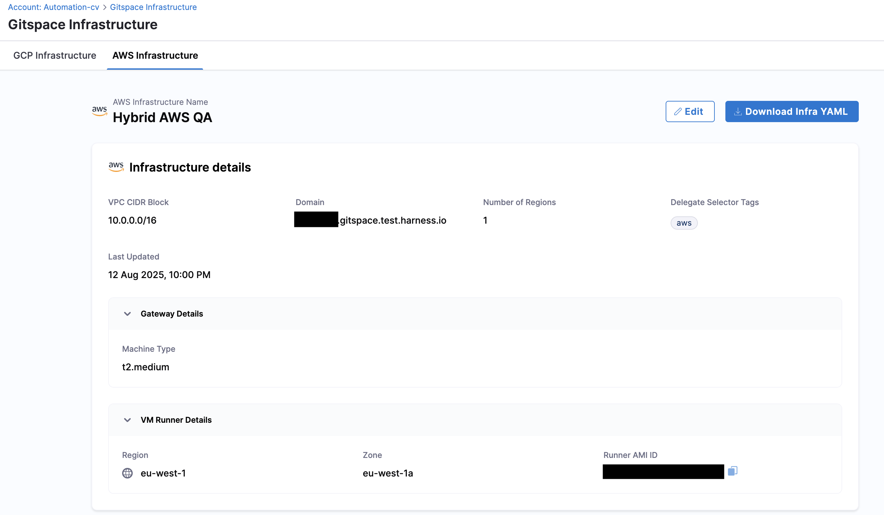

<DocsButton icon = "fa-solid fa-square-rss" text="Subscribe via RSS" link="https://developer.harness.io/release-notes/cloud-developer-environment/rss.xml" />

Review the notes below for details about recent changes to **Harness Cloud Development Environments**.

:::info About Harness Release Notes

- **Progressive deployment:** Harness deploys changes to Harness SaaS clusters on a progressive basis. This means that the features described in these release notes may not be immediately available in your cluster. To identify the cluster that hosts your account, go to your **Account Overview** page in Harness. In the new UI, go to **Account Settings**, **Account Details**, **General**, **Account Details**, and then **Platform Service Versions**.
- **Security advisories:** Harness publishes security advisories for every release. Go to the [Harness Trust Center](https://trust.harness.io/?itemUid=c41ff7d5-98e7-4d79-9594-fd8ef93a2838&source=documents_card) to request access to the security advisories.
- **More release notes:** Go to [Harness Release Notes](/release-notes) to explore all Harness release notes, including module, delegate, Self-Managed Enterprise Edition, and FirstGen release notes.

:::

## August - [2025.08.v1]

With the last release, we introduced **Self-Hosted Gitspaces**. This release builds on that foundation with several key new features for Harness Gitspaces. Let’s dive into the details.

---

### ⭐️ [New Feature] AWS Support for Self-Hosted Gitspaces
👉 [Read more about this feature](/docs/cloud-development-environments/self-hosted-gitspaces/steps)

We’re excited to announce **AWS cloud infrastructure** support for Harness Self-Hosted Gitspaces. This milestone brings greater flexibility and control, enabling you to create and host Gitspaces within **your own AWS Cloud Infrastructure**. This not only provides you with greater control over your Gitspaces, but also provides an **extra layer of security** over your infrastructure and source code data.

To [get started](/docs/cloud-development-environments/self-hosted-gitspaces/steps), configure your AWS cloud infrastructure in Harness, set up the Terraform module to provision required AWS resources, and install the VM Runner and Delegate on your AWS VM instance. You’ll then be able to create and manage Gitspaces within your own AWS infrastructure.

---

### ⭐️ [New Feature] Access Control - RBAC for CDE
👉 [Read more about this feature](/docs/cloud-development-environments/rbac)

This release introduces **RBAC for CDE (Role-Based Access Control)**. RBAC lets you control who can view, access, and modify resources across different scopes. By defining roles and resource groups, you ensure that only authorized users can act on CDE resources, adding an additional layer of security and compliance.

CDE RBAC supports the following resources: 
| **Resource**   | **Permissions**                                                           | **Account Scope** | **Org Scope** | **Project Scope** | **Notes**                                                                                          |
| -------------- | ------------------------------------------------------------------------- | ----------------- | ------------- | ----------------- | -------------------------------------------------------------------------------------------------- |
| **Gitspaces**    | <ul><li>View</li><li>Create/Edit</li><li>Delete</li><li>Execute</li></ul>                 | ✅                 | ✅             | ✅                 | Created at **project scope**; managed across all scopes. |
| **Infrastructure Providers**  | <ul><li>View</li><li>Edit</li><li>Delete</li></ul> | ✅                 | ✅             | ✅                 | Configured at **account scope**; accessible across all scopes.                                  |

---

### ⭐️ [New Feature] Gitspace Admin Settings 
👉 [Read more about this feature](/docs/cloud-development-environments/admin-settings)

We’re introducing **Gitspace Admin Settings**, which allow you to customize Gitspaces to align with your organization’s standards and policies. These settings provide fine-grained control over:

- **Git Providers** – Manage which Git providers are available for creating Gitspaces.
- **Code Editors** – Control which code editors are available to users.
- **Cloud Regions & Machine Types** – Define the infrastructure regions and machine types available.
- **Gitspace Images** – Restrict which container images can be used to spin up Gitspaces.

---

### ⭐️ [New Feature] Reset Support in Gitspaces
👉 [Read more about this feature](/docs/cloud-development-environments/manage-gitspaces/reset-gitspaces)

This feature enables you to **reset a Gitspace**, reverting it to the latest configuration from the source. Resetting ensures your Gitspace reflects the most recent configuration or infrastructure changes while preserving your home directory data.

---

### ⭐️ [New Feature] Custom Machine Image Support for Self-Hosted Gitspaces
👉 [Read more about this feature](/docs/cloud-development-environments/self-hosted-gitspaces/steps/gitspace-infra-ui)

You can now configure custom machine images for Self-Hosted Gitspaces. This feature allows you to:

- Use a **custom machine image** for your **infrastructure gateway**.
- Configure a **custom image** for the **VM Runner**.
- Provide a **custom machine image** for your **Gitspaces machine**.

When configuring infrastructure, you can directly specify a custom machine image (GCP) or custom AMI ID (AWS).

---

### ⭐️ [New Feature] On-Prem Git Providers Support
👉 [Read more about this feature](/docs/cloud-development-environments/git-providers/on-prem-providers)

Harness Gitspaces now support **on-prem Git providers**. With this capability, you can spin up Gitspaces using source code repositories hosted within your own infrastructure. This provides an added layer of security and control over your source code and metadata and ensures your data never leaves your server and infrastructure.

---

## 🚀 Releasing Self-Hosted Gitspaces — July \[2025.07.v1]

### Introducing Harness Self-Hosted Gitspaces

We’re thrilled and excited to announce the **release of Harness Self-Hosted Gitspaces** — a big step forward in improving developer experience and productivity at enterprise scale.

Self-Hosted Gitspaces are on-demand, remote cloud development environments hosted within your **organization’s own infrastructure**. These environments come **pre-configured for instant coding** and provide an **extra layer of security** by giving you full control over infrastructure and data. This helps reduce the risk of external data exposure and ensures your source code isn’t cached or accessed by third-party cloud services.
Read more about **[Self-Hosted Gitspaces](/docs/cloud-development-environments/introduction/self-hosted)**.

<iframe width="560" height="315" src="https://www.youtube.com/embed/7QNpTR7mRXI?si=viZp8kQyGrPjE5-n" title="YouTube video player" frameborder="0" allow="accelerometer; autoplay; clipboard-write; encrypted-media; gyroscope; picture-in-picture; web-share" referrerpolicy="strict-origin-when-cross-origin" allowfullscreen></iframe>

### Why Self-Hosted?

Local development environments often create more problems than they solve — inconsistent setups, endless configuration hours, security and compliance risks, and the list goes on.
Harness Hosted Cloud Development Environments solve these challenges by delivering speed and simplicity to developers.

Harness-Hosted Gitspaces are fully managed by Harness and reduce setup complexity for end users.
However, as organizations grow and adopt stricter security and compliance standards, Harness-Hosted Gitspaces can pose some enterprise-level challenges:

* **Security & Data Sovereignty**: Lack of full control over source code and developer data.
* **Customization Limitations**: Hosted solutions may not support deep customization of tooling and environment setup.
* **Latency Issues**: Fixed hosted regions can lead to performance issues for globally distributed teams.

In contrast, Self-Hosted Gitspaces solve these challenges by offering complete infrastructure and data control. 

Read more about the different **[Use Cases of Self-Hosted Gitspaces](/docs/cloud-development-environments/introduction/self-hosted#self-hosted-vs-harness-hosted-gitspaces)**.

### Get Started

Refer to **[Configuring Self Hosted Gitspaces](/docs/cloud-development-environments/self-hosted-gitspaces/steps)** to get started with setting up Self-Hosted Gitspaces. If you’re interested, here’s what you need to do:

1. **Go Through the Prerequisites and Fundamentals**: Before you begin, it’s important to understand the **underlying architecture** and **concepts of Self-Hosted Gitspaces**.

   * 🔗 [Self-Hosted Gitspaces Architecture](/docs/cloud-development-environments/deep-dive-into-gitspaces/self-hosted-architecture)
   * 🔗 [Key Concepts](/docs/cloud-development-environments/self-hosted-gitspaces/fundamentals)

2. **Configure Gitspace Infrastructure via Harness UI**: Start by configuring your **Gitspace infrastructure in the Harness UI**. This lets you input your infrastructure details, which will be referenced later during provisioning.

   * 🔗 [Configure Gitspace Infrastructure via Harness UI](/docs/cloud-development-environments/self-hosted-gitspaces/steps/gitspace-infra-ui)

3. **Configure and Set Up the Terraform Module**: Once the infrastructure is configured in the UI, initialize and use the **Harness Gitspaces Terraform Module**. This module will create all required GCP infrastructure and set up VM instances for the CDE Gateway.

   * 🔗 [Set Up Terraform Module](/docs/cloud-development-environments/self-hosted-gitspaces/steps/gitspace-infra-terraform)

4. **Set Up Runner and Install Delegate**: After provisioning, install the **VM Runner and Delegate** on your GCP VM instance. This ensures the Harness Control Plane can establish a connection with your infrastructure to create and manage Gitspaces.

   * 🔗 [Set Up Runner and Install Delegate](/docs/cloud-development-environments/self-hosted-gitspaces/steps/runner-delegate)

5. **Create Machines & Gitspaces**: Once everything is set up, you can start **creating machines** and **Gitspaces** directly.

   * 🔗 [Create and Manage Machines](/docs/cloud-development-environments/self-hosted-gitspaces/steps/manage-self-hosted)

### What’s Coming Next?

We have a lot of exciting features on the way:

* AWS infrastructure support for Self-Hosted Gitspaces
* RBAC for admin functionality
* Admin-controlled features to manage Gitspaces access
* Support for custom machine images
* …and many more!

✨ Stay tuned for our next release - happening soon!
