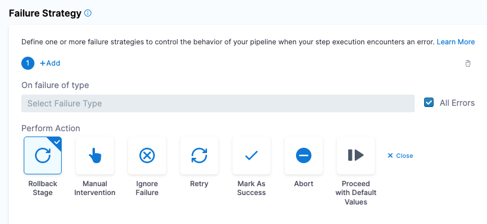
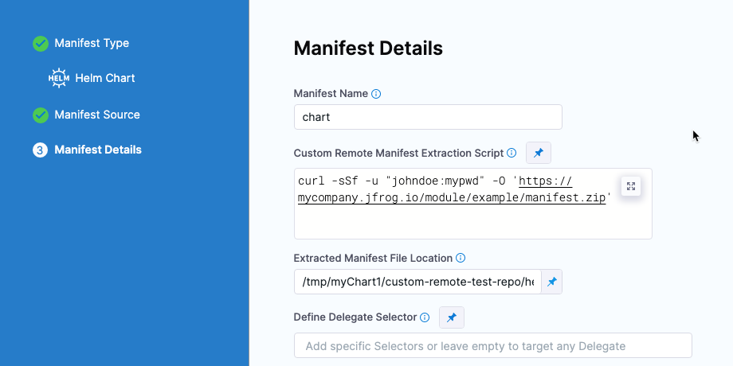
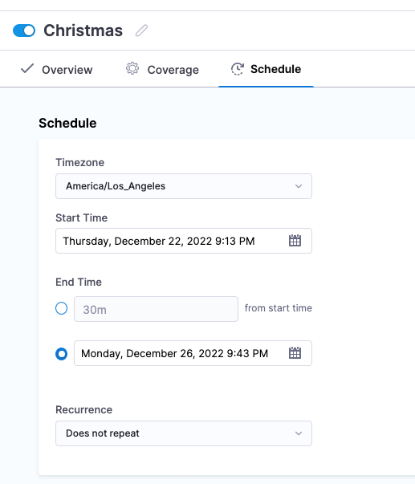
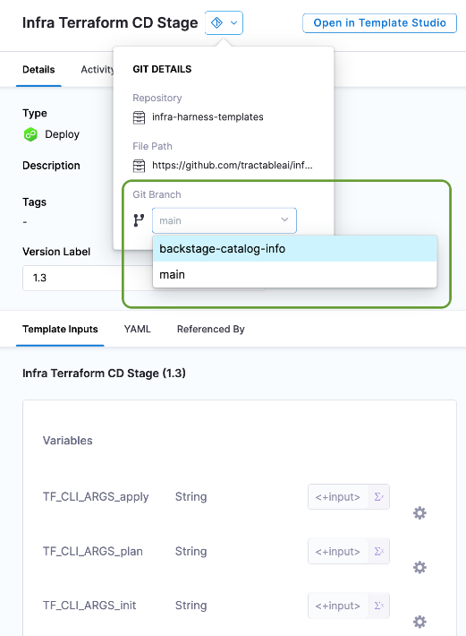
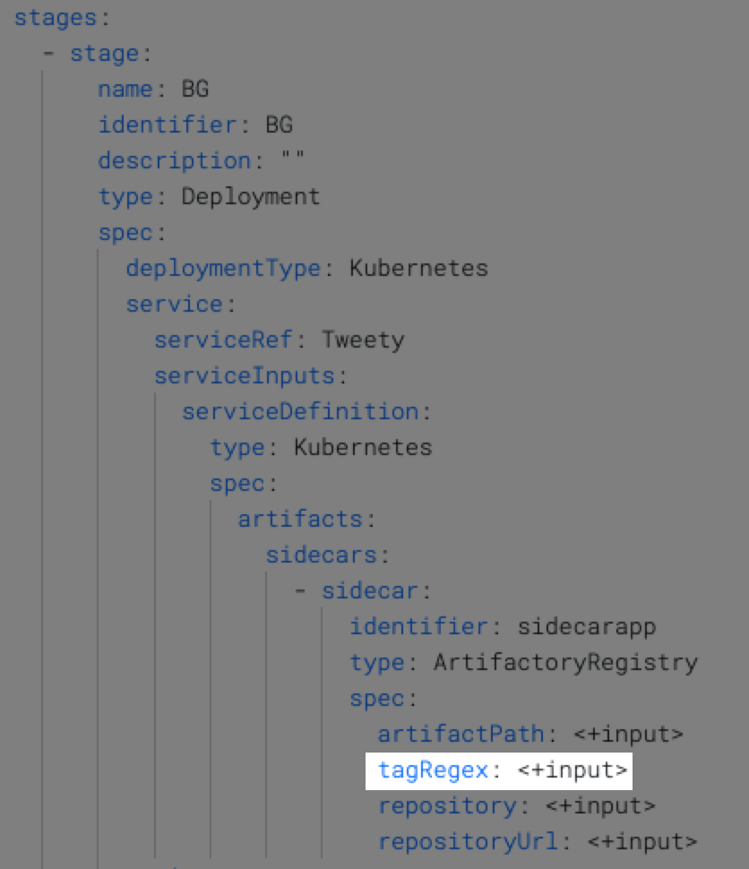
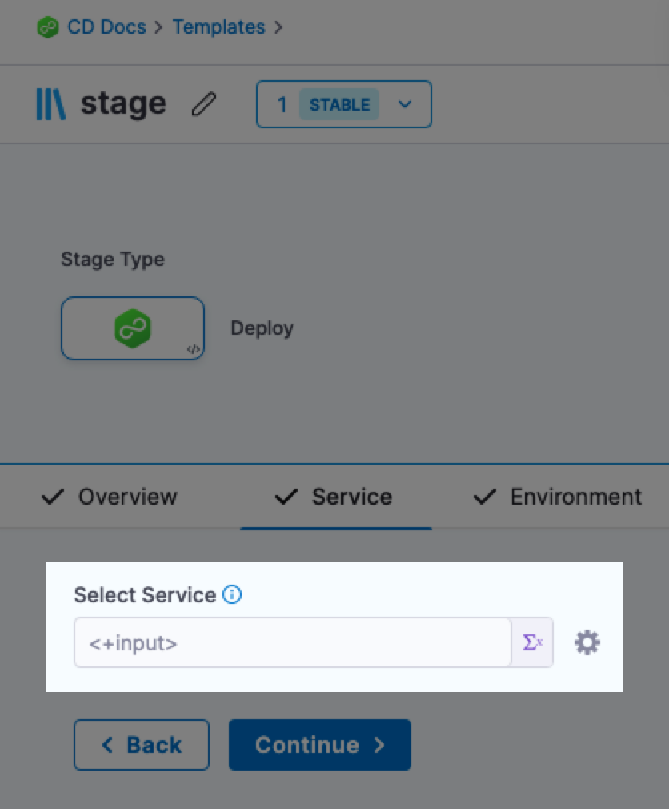

Harness Continuous Delivery & GitOps is updated regularly in Harness SaaS. Review the notes below for details about recent changes. 

:::note
Harness deploys updates progressively to different Harness SaaS clusters. You can identify the cluster hosting your account in your Account Overview page. The features and fixes in the release notes may not be available in your cluster immediately.

Additionally, the release notes below are only for NextGen SaaS. FirstGen SaaS release notes are available [here](/docs/first-gen/firstgen-release-notes/harness-saa-s-release-notes) and Self-Managed Enterprise Edition release notes are available [here](/release-notes/self-managed-enterprise-edition).
:::

## January 17, 2023, version 78214

### What's new

- YAML schema validation for environments. (CDS-48947)
  
  We have added YAML schema validation to environment entities. Similar validation already exists for our pipeline YAML, but environments are separate entities.
  If you try to save invalid YAML you will get an error like this:
  ```bash
  Invalid yaml: $.environment.overrides.manifests[0].manifest.spec: is missing but it is required.
  ```
- Improved error message when API calls fail while listing Helm **Chart Version** in **Run Pipeline**. (CDS-48436)
  
  If **Chart Version** is a runtime input, when you run the pipeline you are required to select a version from the **Chart Version** dropdown. If the Harness API is unable to fetch any versions, an improved error message is displayed.

    
  
  Hover over the error message to see the full message.

### Early access

- Convert imperative Kubernetes rollback to declarative rollback. (CDS-2993, ZD-26855, ZD-27690, ZD-36563, ZD-36670)

  This functionality is behind a feature flag: `CDP_USE_K8S_DECLARATIVE_ROLLBACK_NG`.
  
  Harness applies Kubernetes manifest  using `kubectl apply`, which is a declarative way of creating Kubernetes objects. But when rolling back, we perform `kubectl rollout undo workloadType/workloadName --to-revision=<REVISION_NUMBER>`, which is an imperative way of rolling back. Using imperative and declarative commands together is not recommended and can cause issues.

 In some instances, the workload spec was not updated properly when `rollout undo` was performed. Subsequent deployments then refered to an invalid spec of the workload and caused Kubernetes issues like [kubectl rollout undo should warn about undefined behaviour with kubectl apply](https://github.com/kubernetes/kubernetes/issues/94698).
  
  **What is the fix?**
  
  We had to redesign our release history to store all rendered manifests in secrets, just like Helm does. While rolling back, we are now reapplying the last successful release's manifests. This solves this issue.

  **What is the impact on customers?**
    - Enabling declarative rollback disables versioning (even if the **Skip Versioning** checkbox is left unchecked), since versioning was introduced with the imperative rollback design. However, versioning is not needed anymore with declarative rollback.
    - The delegate's service account needs the permission to create, update, and read secrets in the defined infrastructure namespace. Typically, customers' delegates already have these permissions, but if cluster roles are strictly scoped, this could cause failures. For information on cluster roles for the delegate, go to [Install Harness Delegate on Kubernetes](https://developer.harness.io/docs/platform/delegates/delegate-install-kubernetes/install-harness-delegate-on-kubernetes/).

### Fixed issues

- Multiline message support for Jira Create and Update step Description settings. (CDS-49666)
  Multiline text support was added to the Description setting in Jira Create and Jira Update Steps.
  
  | Before  | Now   |
  |-------------- | -------------- |
  |     |     |

- Fixing a service referencing a template causes a save error.	(CDS-49817)
  When making the service a runtime input within the template and providing this as a fixed value when using the template, it fails to save.

  The sources were being added as an empty string when no runtime inputs were present.
- RBAC for environment was not enforced. (CDS-49732, ZD-38326)
  
  When using stage templates in pipelines there was a case where the access check for the environment was skipped and users still need to have access to all the connectors/secrets used in the service and the infrastructure. 

  Now, Harness does not check nested permissions for templates. For example, if a template has a connector/service/environment inside it, Harness won’t check for their nested access permissions during pre-execution validation. Instead, we rely on individual steps to do the RBAC during actual execution.
- When using a Helm Chart from the Harness File Store and a values YAML file from a Git or custom provider, only 2 values are getting applied when more values files are passed. (CDS-49251)

  Resolved the problem where the user was unable to use specified values when defining a service of type:
    K8sManifest:
    spec:
    StoreType: Harness

    ValuesManifest:
    spec:
    StoreType: Git

    ValuesManifest:
    spec:
    StoreType: Custom
  All the value files were not being fetched. To prevent this, we have added a condition to address this use case.
- OpenShift Parameters setting does not support Harness File Store. (CDS-49249)

  Enabled the Harness File Store for **OpenShift Parameters**.
- When creating an OpenShift template with the Harness File Store, a default param file with an empty string is created. (CDS-49248)
  
  We have now set the default value of param paths as an empty array that will ensure an empty value is not set for param paths if no value is provided.
- In the **Kustomize Folder Path**, the **Add** button is not required as there can be only one folder. (CDS-49245)

  The **Kustomize Folder Path** now only accepts one folder path. The **Add** button was removed.
- Different artifacts with the same buildId are not considered in services listed in the Environments dashboard. (CDS-49189)
  
  Earlier, only buildId was used to group instances in the Environments dashboard. When a user deployed a service with the same buildId but different artifact paths, either of the artifact paths would be present in the hover over buildId.
  Now we perform grouping on displayName (artifact path + buildId) so that there are different entries for different artifacts even if they have the same buildId.
  
  | First artifact  | Second artifact   |
  |-------------- | -------------- |
  |   |    |

- Nexus3 artifact source using the Maven **Repository Format** cannot filter the builds by **Classifier** and **Extension**. (CDS-49020)
  
  In a Nexus Maven repository, users can now filter the builds by **Classifier** and **Extension**.

    
- The confirmation dialog for closing a pipeline has misleading **Discard** button. (CDS-49000, ZD-38518)
  
  The **Discard** button is removed and the text is now:
  - **Confirm** to leave the page.
  - **Cancel** to stay on the page.
- API calls fetching information about ACR repository if connectorRef is expression or runtime input. (CDS-48988)
  
  Harness was trying to fetch ACR repository information when the connector reference is an expression or runtime input. We have now removed the unnecessary API calls.
- Deleted org or project services not cleaned up. (CDS-48890)
  
  When an org or project was deleted, the references to services within that org or project were not cleaned up. As a result, dangling references prevented the deletion of other resources. The service references are now cleaned up.
- Deselecting a field sets **Tag** to **Regex** but **Value** is selected. (CDS-48576)
  
  Clearing the value of **Tag** changes the type from **Value** to **Regex** due to the form reinitializing when values changes. This is now fixed and the **Value** setting is maintained.
- Service Logs not showing fetch details for AWS Elastic Container Registry and Google Artifact Registry artifacts. (CDS-48483)
  
  Console logs were missing information about the image, artifactName, tag, artifactPath, and URL. This metadata is now shown on the console logs.
- Account-level templates can be saved with org or project user group. (CDS-44557)
  
  The Harness Approval step did not validate the user group scope against the parent scope used to create the step.
  
  For example, a template containing Harness Approval steps with user groups at a project scope can be saved at an account level.
  
  Now it's invalid to have higher scope entities (for example, user groups at project level) referenced in lower scope entities (for example, a template at the account level).
  
  Validation has been added in Harness Approval steps to validate the scopes of the user groups against the scope in which the Approval step is created. The step is invalid if the user groups in the step have a higher scope than the scope where the Approval step is created.
- Approval step Slack and email notifications using identifiers instead of names. (CDS-29134)
  
  Harness Approval notifications using Slack and email were sending identifiers instead of readable names.
  
  For example, for the org, project, or triggered by information, identifiers are sent instead of names.
  
  This issue has been resolved. The notification now contains names, emails, etc., instead of identifiers. The email of the user triggering the Approval step displays and the org and project names display.

  Email example:
  
    

  Slack example:

  

## January 10, 2023, version 78105

### What's new

- A [failure strategy](https://developer.harness.io/docs/platform/pipelines/w_pipeline-steps-reference/step-failure-strategy-settings/) is now mandatory for all Deploy stages. (CDS-48951)  
  
    

  A failure strategy is now a mandatory setting in the **Deploy** stage. Previously, a failure strategy was mandatory, but the check happened when the pipeline ran. 
  
  A failure strategy is also required for the **Deploy** stage in [stage templates](https://developer.harness.io/docs/platform/Templates/add-a-stage-template). With this release, all Deploy stages, including in stage templates, without failure strategies are considered invalid.

  No action required by users.
- UI enhancements for remote templates created in non-default or feature branches. (CDS-48308)
  
  If a remote template is created in a non-default or feature branch, Harness fetches the template details from the created branch and displays them on the template studio/listing page. You no longer need to manually select the correct branch.

  No action required by users.
- Absolute paths for Native Helm charts [Custom Remote Manifest](/docs/continuous-delivery/cd-advanced/cd-kubernetes-category/add-a-custom-remote-script-and-manifests) are now supported. (CDS-47647, RN-37501)
  
  Previously, Harness CD looked for a path relative to the Harness working directory, which is a temporary directory that Harness creates. Now, you can specify an absolute path in **Extracted Manifest File Location** by starting with a forward slash `/`. For example: `/tmp/myChart1/custom-remote-test-repo/helm/todolist/`.

  

  No action required by users.

### Fixed issues

- [RBAC](https://developer.harness.io/docs/platform/Role-Based-Access-Control/rbac-in-harness) for environment was not enforced. (CDS-49732, RN-38326)
  
  In stage templates in pipelines, access checks for the environment were skipped. Harness now performs an RBAC check.
- [Deployment freeze](/docs/continuous-delivery/cd-deployments-category/deployment-freeze) notification was not working for **Does not repeat** in **Recurrence**. (CDS-49667)

    

  
  The notification for deployment freeze was not working due to a null pointer exception in the case of **Does not repeat** in **Recurrence**. Added a null check to fix this issue.
- Incorrect validation error message on the **Step Parameters** tab of the **Manual Approval** dialog. (CDS-49404) 

  If the number entered in the **Number of approvers that are required at this step** field contained a decimal point, an incorrect validation error message, **Minimum count cannot be less than one** appeared.
  
    
  
  The error message has been corrected.
- The [OpenShift](/docs/continuous-delivery/cd-technical-reference/cd-k8s-ref/using-open-shift-with-harness-kubernetes) template path on the runtime screen is populated as a string instead of a list. (CDS-49256)
  
  The text was updated to list component so that the path is stored in the form of an array.
- Unable to change the branch for a remote template in the template studio. (CDS-49159)
  
  Harness was not allowing a branch change for read only mode in the template studio. You can now switch branches in the template studio.

    


- ECS and Serverless Git task logs are not shown properly. (CDS-49117)
  
  The log stream closes when the status is successful. To ensure that each method can determine whether to close or not, a boolean attribute was added to closeLogStream so that each class that implements and uses this function determines whether it wants to close or not.
- Error when adding a template to a pipeline. (CDS-48924)
  
  Harness Manager used to show an error when `*` was used as the default value in the **Configure Options** modal for any setting. The component has been updated to support `*` as a value to resolve the issue.
- Unclear error message on values YAML parse failure. (CDS-48881)
  
  Improved error message in case of parse failure. When the values YAML had secrets/certs that were not correctly encoded, we would see an error message that was not very clear. We have improved the error message to hint at the underlying cause.
- Unable to add tags to an environment .(CDS-48647)
  
  Empty strings of tags were being removed. This has been fixed now.
- Gaps in instance stats if there is any exception while fetching the last snapshot. (CDS-48637)
  
  Now Harness catches the exception while fetching the last snapshot and skips publishing in this iteration.
- When a user configures a manifest detail and adds a file, they cannot delete that file. They can only move things around. (CDS-48591)
  
  Removed the validation from values.yaml as it is an optional field.

    

- Triggers failing with the feature flag `NG_DEPLOYMENT_FREEZE_OVERRIDE` enabled while checking permission in RBAC. (CDS-48529) 

  Deployment freeze has RBAC permissions for Harness users. A check for these permissions were passed as null and threw an NPE when the permission was null. Added a null check to send false in case the permission is null.
- Poor error message if an ACR connector reference is a runtime input for the subscriptionId field. (CDS-48519)

  Added a better error message when the connectorRef is empty and not resolvable in Azure artifact sources APIs.
- The **Submit** button is disabled after creating a Github connector, but works fine when only selecting a connector. (CDS-48497)
  
  Under Service V2, when adding a manifest to a service and creating a new connector from the **Select Connector** screen, we were able to see the newly created connector selected in the manifest modal but the **Continue** button was disabled. The **Continue** button is now enabled in this use case.

    

- [Input sets](https://developer.harness.io/docs/platform/pipelines/run-pipelines-using-input-sets-and-overlays/) not working with a stage template. (CDS-48475)
  
  This was an issue with running pipelines using input sets specifically containing artifact sources with no runtime inputs. In this case, users were seeing the error message "Exception in resolving template refs". When run manually without input sets the executions went through fine. This was happening because an extra field was being set in the input set. Now we have added handling for that field and executions work as expected.
- Artifactory with `tagRegex: <+input>` fails to fetch imagePath. (CDS-48438)
  
  Updated the FQN path to pass tagRegex if the tagRegex field is runtime.

    

- Fields on the **Advanced **tab in the **Template input** section appear crowded. (CDS-48423)
  
  The width was set relative to the parent component. This caused the width to compress even further on smaller width sections like the template selection screen. This has been fixed by setting the width to a standard 400px.
- Template always shows an unsaved changes message even after repeated save attempts. (CDS-48422)
  
  Now you can save a [stage template](https://developer.harness.io/docs/platform/templates/add-a-stage-template/) with service and environments as runtime inputs and can eventually update them to [multi-services and multi-environments](/docs/continuous-delivery/cd-deployments-category/multiserv-multienv) as well.

    

- Improve error messaging in case of Terraform plugin error. (CDS-48414)

  Improved the error summary formatting.
- Azure Artifacts Connector URL validation is missing. (CDS-48407)
  
  The server URL is now validated.
- Terraform Apply **Delegate Selector** selection does not retain its value. (CDS-48375)
  
  Users can see existing [delegate selectors](https://developer.harness.io/docs/first-gen/firstgen-platform/account/manage-delegates/select-delegates-for-specific-tasks-with-selectors/) in the step's **Advanced** section in case of [Terraform Apply](/docs/continuous-delivery/cd-advanced/terraform-category/run-a-terraform-plan-with-the-terraform-apply-step) and [Terraform Rollback](/docs/continuous-delivery/cd-advanced/terraform-category/rollback-provisioned-infra-with-the-terraform-rollback-step).
- Service Logs don't show fetch details for a Docker Artifact. (CDS-48358)
  
  Console logs from the service step were missing information about the tag, imagePath, and other metadata fields. These fields are now shown in the console logs.
- Azure Artifact drop-downs in the project-level stage template fails. (CDS-48319)
  
  List drop-downs are now fixed in the Azure Artifact Source when you create the artifact source in the stage template.
- For Azure Artifacts, the **Project** drop-down field shows an error when trying to load in a project-level stage template. (CDS-48318)
  
  The **Projects** drop-down field has been fixed.
- Artifact source template: Tags does not have a **Configure** option. (CDS-48310)
  
  **Configure** option is not visible for the **Tags** setting. This issue has been fixed and you can see the **Configure** option.

    

- The **Jira Description** field doesn't scale for long text. (CDS-48228)
  
  The description field now uses a textarea component to provide a better user experience.
- Unable to select a Primary Artifact in the pipeline input form. (CDS-48065)
  
  Multiple Artifact Source is only available with [service V2](/docs/continuous-delivery/onboard-cd/cd-concepts/services-and-environments-overview). With this fix, the UI only allows the multiple artifact option with service V2. As this UI check was not present earlier, some users had multiple artifact sources with service V1. Users with existing configurations must fix this.
- [Custom Remote Manifest](/docs/continuous-delivery/cd-advanced/cd-kubernetes-category/add-a-custom-remote-script-and-manifests): error message needs to be improved when Chart.yaml is given instead of a directory. (CDS-48038)
  
  Error improvement is done around custom manifest Helm chart path using Helm deployment.
- [Deployment freeze](/docs/continuous-delivery/cd-deployments-category/deployment-freeze): When the freeze window schedule time frame is prior to the current time, the API returns success but the UI is still disabled. (CDS-47760)
  
  When users created freeze window schedule time frames that are in the past, the freeze window was marked as expired right after creation, which is correct, but the global freeze (`Freeze disabled on all deployments for this [Account/Organization/Project]`) was getting enabled. Now we throw an exception when the new freeze window created is already expired.
- The [Deployment Template](/docs/continuous-delivery/onboard-cd/cd-quickstarts/custom-deployment-tutorial) **Details** screen goes blank when changing the template version in **Version Label**. (CDS-47641) 

  A blank template **Details** screen is shown when the version of a linked template is changed from **stable** to **Always use stable version**. This happens only for pipeline templates. This issue has been fixed. Now you can change the **Version Label** and there is no issue.
- [multi-services and multi-environments](/docs/continuous-delivery/cd-deployments-category/multiserv-multienv): getting NPE when trying to run a pipeline with propagate services from previous stage (CDS-47626)
  
  We don't support [propagating a service](/docs/continuous-delivery/cd-services/cd-services-general/propagate-and-override-cd-services) from previous stage in case of multi-service deployments. Now, the **Propagate from** option only appears in a stage if there are preceding single service stages to propagate from.
- When adding a connector, the **Details** dialog is unclear. (CDS-47282)
  
  The UI was improved so that it now includes a delegate selector title and an icon with details for the Kubernetes connector.
- ACR connector: connector reference when passed as expression is not getting resolved (CDS-46816)

  Created new endpoints for fetching subscription Ids, registries, repositories for ACR artifacts. These new endpoints receive the pipeline Id and input YAML data, which allows for expression rendering for the ACR parameters using variables declared in the pipeline.
- ServiceNow import sets logging issues. (CDS-43958)
  
  Descriptive console logs have been added in the ServiceNow Import Set step for various scenarios. This will further help in debugging or monitoring the step from the console tab.
- Getting "Connector Not Found Error" when you save a pipeline using the Physical DataCenter connector even when the connector exists. (CDS-43812)
  
  Fixed the check for the Physical DataCenter connector. The Physical DataCenter connector is supported in [SSH](/docs/continuous-delivery/onboard-cd/cd-quickstarts/ssh-ng) and [WinRm](/docs/continuous-delivery/onboard-cd/cd-quickstarts/win-rm-tutorial) deployments.
- Approval Slack notification sending names instead of identifier in the approval notification. (CDS-29134)
  
  Harness approval notifications via Slack and email currently send identifiers instead of readable names. For example, for details regarding organization and project, and triggered by metadata, identifiers are sent instead of names. This issue has been resolved. The notification now contains names, emails, etc., instead of identifiers. For users triggering the approval step, email is displayed. For organization and projects, names are displayed.

## December 22, 2022, version 77908

### What's new

- The [Deployment Templates](/docs/continuous-delivery/onboard-cd/cd-quickstarts/custom-deployment-tutorial) **Execution** tab now supports all steps in the Command category. (CDS-48030)

Earlier, only the Utilities steps were supported. Now you can add any CD step.
 
- Support for absolute paths in a [Custom Remote Manifest](/docs/continuous-delivery/cd-advanced/cd-kubernetes-category/add-a-custom-remote-script-and-manifests/) for Helm Charts. (CDS-47647, ZD-37501) 
 
Previously, we were only looking for a path relative to the Harness working directory (a temporary directory created by Harness). Now, you can specify an absolute path in **Extracted Manifest File Location** by starting with a forward slash `/`.
 
Example: `/tmp/myChart1/custom-remote-test-repo/helm/todolist/`.

- The **Referenced By** tab was added to [Environments](/docs/continuous-delivery/onboard-cd/cd-concepts/services-and-environments-overview). (CDS-39989)

You can see which pipeline uses any Environment in the Environment's **Referenced By** tab.

### Fixed issues

- ECS Tests failing with Delegate not found error. (CDS-48522)

Fixed the field alignment issues for artifacts.
  
- File Store File browser concatenates filenames and doesn’t scale to the size of the window. (CDS-48162)

Fixed by adding hover text for files.
  
- Tempaltes Inline/Remote cropped in the UI. (CDS-48153)

The Template modal functions fine now.
  
- Custom Artifact Trigger not working. (CDS-48134)

We were not configuring the timeout field and timeout value was set as null from the UI, which was causing the issue. Added the check for the timeout value and set the default as 10 minutes.
  
- Google Artifact Registry Artifacts: Better error msg when the connector does not have access to a project. (CDS-48102)

Error message was improved when the project and connector are incorrectly provided. The execution fails with the appropriate error message.
  
- Creating a Shell Script next to another Shell Script overwrites the first script. (CDS-48044)

The default name and ID are longer provided. Therefore, duplicate IDs are not allowed for steps. This solves this issue.

- The **Infrastructure** field in **Input Sets** shows [object object]. (CDS-47992)

Marking an infrastructure runtime in an input set implies that the infrastructure is an execution-time input and that is not supported currently. This option was removed from the UI.
  
- Filtering infrastructures does not work with a **MatchAll** selection. (CDS-47981)

The filtering infra feature did not match all the infrastructures as expected. The matching logic had an issue. The issue has been resolved. The feature now matches entities when `all` tags are selected.
  
- GCR Artifact throws a null pointer on a tag when the image path is wrong. (CDS-47980)

An NPE was fixed when the imagePath is incorrect and the tags dropdown is called. 
  
- When a user defines 1 artifact source and fixes the values, we still prompt for an artifact source in the pipeline run form. (CDS-47908)

Now the primary artifact is preselected when a single artifact source is added.
  
- A subtask can't be created in JIRA. The parent key or ID is missing. (CDS-47905, ZD-37640)

The Harness Jira integration didn't support adding or updating the parent of Jira issues. Due to this, the creation of a subtask was not possible since we require a parent for creating a Jira subtask. This is because the parent's field type "issuelink" was not supported.
  
Resolution:

    * The **issuelin** field type is supported now.
    * The Jira Create step can now be used to create issues with existing issues as their parent.
    * The Jira Update step can be used to update the parent of a specific issue.
    * A subtask can be created using a Jira Create step.
    * A parent can be provided by simply typing the parent issue key, such as "TJI-47890", in the Parent field.
    
- Input sets do not respect environment variable overrides. (CDS-47879, ZD-37675, ZD-38078)

Service override input values were being cleared on the loading of the input set or when applied in a pipeline. This has been fixed now and the user can now run the pipeline with the input set directly from the **Input Set** page.

- **Ne* dropdown is hidden under the modal for the file store. (CDS-47817)

Now when the browser zooms to 100%, the **New** button in the file store displays the options list.
  
- Fix popup issues in execution strategy. (CDS-47792)

Fixed an issue with display popovers on the execution strategy for SSh/WinRM deployment types.
  
- Cluster details mismatch in service instances. (CDS-47776)

Cluster details are not uniquely returned for tbe active service instances popover. This fix adds a filter for infra/cluster ID, pipeline ID, service ID, build ID, and env ID.

- Incorrect field label and tooltip.	(CDS-47758)

When creating a reference secret using AzureKeyVault secret manager, the field label and the tooltip were incorrect. This label and tooltip have been corrected. 
  
- Unclear logs from the **Update GitOps Configuration files** step. (CDS-47640)

When multiple clusters are used, variables were being repeated without any separation.The logs were enhanced to increase readability.
  
- Error when using Template API. (CDS-47488)

A 500 internal server error occurred when git details details are passed as empty while creating a template at the project level with the new API. This is fixed.
  
- Kubernetes and Native Helm service Helm command flags: `-version` flag is missing from the dropdown. (CDS-47388)

Added the version command flag.
  
- Runtime inputs for Artifactory Artifact are not resolved. (CDS-47344)

When a repository is configured as runtime for Artifactory, the repository format is set as empty, which causes the issue. We have added the check that if the repository format is empty then we will read it from serviceRef.
  
- A default failure strategy is not added for the Deploy stage in a pipeline when an execution strategy is not selected. (CDS-47310)

The call to fetch the default failure strategies for a Deploy stage was happening after 20 seconds of clicking the **New Stage** button. This timeout has now been removed and the call is made immediately after clicking the **New Stage** button. This fills in the default failure strategies for the stage immediately as well.

- Expressions from Git stored files are not resolved. (CDS-46726)

A test was added to verify.
  
- The approval stage is adding to the deployment count of services when it is added after the deployment stage. (CDS-46707)

Deployments shown on the **Services** dashboard are fetched from service_infra_info table in timescaleDB. Since the dashboard shows the deployments for all services, we were not filtering based on service identifier, but that table contains approval and other data also. To allow only service deployments, we added a condition that service_id should not be null.
  
- Deployment freeze does not work for the condition combination: Add specific org with exclude project and specific environment. (CDS-46702)

Deployment freeze will consider parent scopes when evaluating whether to block deployment.

- Docker expressions: The following expressions were not working. (CDS-46656) 

Added expression support for the following:

  ```
  <+artifact.displayName>
  <+artifact.buildNo>
  <+artifact.metadata.image>
  <+artifact.metadata.tag>
  <+artifact.metadata.regisrtyUrl>
  <+artifact.metadata.repositoryName>
  ```

- Custom artifact trigger: secret support in script for curl command. (CDS-46113, ZD-37343)

Currently we don't support secrets in perpetual tasks, and triggers create a perpetual task. Because of the limitation, customers were unable to use secrets in a trigger. Added support to resolve the secrets for custom triggers.
  
- Error improvement for Helm upgrade when there are no releases in a Deployed state. (CDS-41706)

Going forward, when Helm upgrade or rollback fails with "No deployed releases", we offer a better hint and explanation on how to fix it.

- No error for an empty service name when the service is updated from inside a pipeline/stage template. (CDS-41510)

Now the "service required" message appears when the service name is empty, and the user is not allowed to submit the form unless service name is added.

Getting NPE when using `useFromStage` in YAML. (CDS-41036)

When there is `useFromStage` chaining in a pipeline (which is an unsupported use-case), an informative error message now appears instead of Null Pointer Exception.
  
- Remove **Skip Dry Run** from Kubernetes steps that are not using it. (CDS-17385)

Removed **Skip Dry Run** from unnecessary steps.

## December 13, 2022, version 77808

### What's new

- ServiceNow Connector YAML has changed to include authentication details (CDS-46672, CDS-45969)

  The update is minor and requires no changes by users.

- Harness Serverless Lambda and ECS support now supports AWS S3 (CDS-46204, CDS-45642)

  You can now use AWS S3 for your Serverless YAML and ECS configuration files (Task Definition, Service Definition, Scaling Policy, and Scalable Target JSON/YAML files).

- The `<+rollbackArtifact...>` expression is now available (CDS-46321)

  For example, if you used a publicly available Docker Hub NGINX image as the Artifact Source for a Service, then when the Service is rolled back, the <+rollbackArtifact.meta.image> expression output would be something like this: registry.hub.docker.com/library/nginx:stable-perl.

  The variables available in rollbackArtifact depends on the artifact and infrastructure type used in the deployment. They can be seen in Output tab of Infrastructure section of a CD stage.

### Fixed issues

- Run pipeline YAML retaining the values of previously selected service (CDS-47675)

  Now the YAML is updated after changing the service. If the selected service has some Runtime Inputs, the serviceInputs field is set properly, and if the selected service does not have any runtime inputs, the serviceInputs field in the YAML is removed.

- Azure Repos Connector cannot enable API access for Azure Repos Connector (CDS-47385)

  Customer had a custom domain URL and the Connector was failing when parsing this case. This is now fixed and custom domain URLs are parsed correctly.

- Unable to create new Secret Manager Connector in Terraform Plan step (CDS-47367)

  Now you can add a new Harness Secret Manager Connector when configuring your Terraform Plan step.

  For more information, go to Plan Terraform Provisioning with the Terraform Plan Step.

- Service logs didn't show fetch details for GCR artifacts (CDS-47319)

  The logs on the service step was did not show additional information such as image path and tag. The logs now capture the Type, Image Path and Tag information for GCR.

- Default Failure Strategy is not getting added for Deploy Stage in pipeline when execution strategy is not selected (CDS-47310)

  The call to fetch the default Failure Strategies for a Deploy Stage was only happening after 20s of clicking the new stage button. This timeout has now been removed and the call is made immediately after clicking new stage button. This fills in the default failure strategies for the stage immediately.

  For more information, see Define a Failure Strategy on Stages and Steps.

- Improved error message for when Azure ACR Connector Subscription dropdown is set to Runtime Input (CDS-46815)

  Azure Artifacts sources use the term "SubscriptionId". The string when a Subscription Id is not provided is now changed to "Subscription Id is required" from "Invalid Request: envId must be provided".

- Environment information is not available in MultiService MultiInfra (CDS-46794)

  The Executions view did not show the service and environment information in case of GitOps-enabled stages. This has now been resolved and we can now see service and environments (comma-separated) for GitOps enabled stages.

  For more information, see Use multiple Services and multiple Environments in a deployment and Harness GitOps ApplicationSet and PR Pipeline Tutorial.

- Custom Artifact Source with no value in Timeout field caused nullpointerexception (CDS-46658) Now Timeout default is 10m if Timeout is null.

  For more information, go to Add a Custom Artifact Source for CD.

## December 7, 2022, version 77716

### What's new

Helm steady state checks with Kubernetes version >= 1.16 (CDS-40269)

Harness will automatically perform steady state checks with Helm deployments using Kubernetes version >= 1.16.

This feature was previously behind the HELM_STEADY_STATE_CHECK_1_16 feature flag and is now GA.

### Early access

Nexus 3 is now supported for Azure Web App artifacts (CDS-46372)

For more information, see Azure Web Apps deployment tutorial.

This functionality is behind a feature flag: AZURE_WEB_APP_NG_NEXUS_PACKAGE.

### Fixed issues

- "YAML paths could not be parsed" error on running pipelines (CDS-47244)

  A single Service (Multi Service toggle not enabled) deploying to multiple Environments (Deploy to Multi Environment toggle not enabled) was giving an exception during pipeline execution. We have fixed the bug in the code and added automation test cases to prevent in the future.

- Rename "Active Service Instances" on Service Dashboard to "Running Service Instances (Current)" (CDS-47074)

  We have changed the title of these cards from "Active Service Instances" and "Active Deployments" to "Running Service Instances (Current)" and "Recent Deployments" respectively, as the previous ones were creating confusion.

- Github Package: package dropdown and version dropdown failing at project level stage template (CDS-46982)

  Pipeline Identifier was not null annotated before. So, at the time of template creation, the API call failed. This is now fixed.

- Need padding added between the Run Pipeline heading’s tooltip and the All Stages dropdown (CDS-46954)

  Added left margin to tooltip.

- Fetching Artifact path is failing in case of SSH deployments when repository is passed as expression (CDS-46930)

  We now evaluate the repository field and fetch artifact path when repository field is passed as a expression.

- Github Packages: YAML validations for empty connectorRef and PackageName (CDS-46898)

  Check for Empty Package and ConnnectorRef has been added for the YAML validations side.

- Save as Template in Pipeline Studio not working (CDS-46884)

  Fixed an issue with saving the step as a template in pipeline studio.

- Empty values for feed and package can be given in YAML (CDS-46878)

  Checks for Empty Feed and Package from YAML side have been added.

- Service dashboard is not displaying instances in the instances section (CDS-46083)

  Service instances are not shown because of missing cluster, agent Id mapping, and an incorrect collection. After mapping the identifiers and changing the collection name, we are showing the service instances.

## November 29, 2022, version 77608

### What's new

- Set Helm Chart Version as Runtime Input and fetch from source on Run Pipeline (CDS-40390)

  Now you can set Helm Chart Version using a Runtime Input when using HTTP Helm, AWS S3, and Google GCS stores. You can view the list of chart versions available at runtime in Run Pipeline, and select the required one.

- You can now copy the FQNs for Service and Environment V2 variables. The Service variables use the format <+serviceVariables.[variable name]> and Environment variables use the format `<env.variables.[variable name]>`.

  For more information, see Built-in and Custom Harness Variables Reference.

### Early access

Terraform Backend Configuration file path in the Terraform Apply and Plan steps now supports remote file repos (CDS-39012, ZD-37065)

Terraform Backend Configuration now can be specified in the remote file repository.

For more details, go to Provision with the Terraform Apply Step.

This functionality is behind a feature flag: TERRAFORM_REMOTE_BACKEND_CONFIG.

### Fixed issues

- Expression evaluation failed for ECR regions (CDS-46728)

  Corrected expression evaluation for Region setting field in ECR artifact details. Now we create a variable and pass it as the region field.

- Artifactory Trigger: repository and artifact/image path dropdown not present in Service and Environment V2 triggers (CDS-46713)

  Added support for repository and artifact/image path dropdown in Artifactory triggers.

- Service UUID displays in the multi-Service pipeline execution (CDS-46643)

  Fixed the matrix labels to show all axis data in a proper format inside the tooltip container.

- Select Services text is misaligned for a multi-Service use case (CDS-46630)

  The service select field was offset to the right. The select field is now properly aligned with the label.

- Multi Service Deployment is failing with manifest not found error (CDS-46585)

  Now manifests are found and we are be able to deploy with deployment freeze enabled.

- Services list does not get updated when a new Service is added unless we do a hard refresh (CDS-46529)

  User can now see the newly added Service in the Service dropdown list inside the pipeline studio without hard reloading the page.

- Allowed values with value true or false was not being rendered in the drop-downs (CDS-46473)

  Users can now utilize true/false boolean values as string variables while adding stage/pipeline variables.

- Usung cluster Id if name doesn't exist in GitOps Environments list (CDS-46460)

  Fixed Cluster setting in GitOps Environments list to use name instead of cluster Id.

- Scrollbar isn't working when Service variable list exceeds 10 (CDS-46451)

  User can now scroll the variable list menu to see all the newly added variables. You can also search the variable from the search box above the menu list.

- Cannot start pipeline when Service Primary Artifact is set to be selected during runtime as a Runtime Input (CDS-46440)

  Fixed the issue when running deployment pipelines with Primary Artifact source as Fixed Value and not containing any Runtime Inputs. Pipeline can now be started.

- Toggling between grid and list view in Manage Service section is zooming the screen making the buttons invisible (CDS-46388)

  The section was zoomed in while toggling to the grid view due to container width overflowing the screen, introducing a horizontal scroll and making buttons hide alongside the scroll. The issue has been resolved by limiting the container width and letting cards be wrapped around.

- Making Environment Group as Runtime Input makes Deploy environments in parallel setting a Runtime Input, leading to pipeline run failure (CDS-46353)

  The Deploy environments in parallel setting (deployToAll flag) was not being set when we selected all environments under an Environment Group. This has been fixed now and we pass in a boolean value for deployToAll.

- In a Service v2 pipeline, when clicking Rerun for a failed execution, we are not remembering the artifact selection of the previous run (CDS-46324)

  User can now see the artifact source setting values preselected in case of a rerun. The values are same as in the previous run.

- Custom Artifact is not listing the version when trying to run a pipeline (CDS-46322)

  We now list the versions to select from a dropdown for Services using a Custom Artifact Source in the pipeline deployment form.

- Jenkins Connector: incorrect connectorRef in service step logs (CDS-46281)

  Improved Jenkins artifact log message in service step.

- Inconsistent checkmark icon styling in the Pipeline studio (CDS-46190)

  Changed the icon of execution to simple tick if step is completed for custom stage and approval stage.

- Infrastructure section step no longer shows detailed output in console logs (CDS-46185, ZD-36476)

  Part of the logs of the infrastructure step were not visible on the UI for certain types of infrastructures including Kubernetes. The issue has been resolved now and logs are visible.

- Creating step template out of ECS Blue Green Create Service step crashes the page (CDS-46135)

  This issue is resolved and now you can create a step template out of the ECS Blue Green Create Service step. You will be asked to provide field values manually because, when creating the step template, stage data and infrastructure data is not present.

- No option is available to add namespace in Infrastructure Definition on Input Set (CDS-46047)

  The Environment and Infrastructure inputs only supported Fixed Value type in the form. There was no support for Expression or Runtime Input support. This functionality has now been added.

- Config Files tooltip does not work and Variables header does not have tooltip anchor (CDS-46039)

  Now tooltip data for Config Files and Variables headers in Service tab can be added.

- Secrets are not resolving for getBuilds API for Custom Artifact (CDS-45952)

  Custom Artifact Source script can use a secret expression. We have added support to resolve secrets referenced in the custom artifact source APIs.

- Shell Script step: Despite of read-only permissions on pipeline, user is able to modify the shell script type dropdown (CDS-45873)

  The option to select Shell Script type was earlier not following the permission access, as it allows users with read-only permission also to edit the type. This was caused by the read-only permission control not being added to this particular type of selection component. Now, we've added the read-only control on the type selection. Now users with read-only permissions will not be able to edit the script types for Shell script.

- Service and Environment V2 variables created inline can't be referenced without a page refresh (CDS-45827)

  Fixed by refetching variables API call on inline edit of Service, Infrastructure, and Environments in pipeline studio.

- Input Sets with Infrastructure Definitions in Service and Environment V2 not working (CDS-45805, ZD-35971, ZD-36091, ZD-36592)

  There was a bug where input sets with Infrastructure Definition could not be saved properly because the Infrastructure Definition was removed after save. This is fixed and users can create Input Sets with Environment and Infrastructure Definition.

- References for Account/Org templates are not deleting when the Org/Proj are deleted (CDS-45764)

  This happened when an Org level template was referring to an Account level template; for example, an Org level stage template using an Account level step template. The deletion of the org results in deletion of the template but did not properly cleanup references, so the account level template would still contain the org level template as a reference. This has been fixed now.

- Artifact triggers need to be updated if a change is made in the relevant repository (CDS-45009)

  Corrected the polling framework for trigger updates. Updating the trigger now updates the polling info.

- Reference by section while linking an account level template does not show up appropriately (CDS-44561)

  References were not getting displayed for Org and Account level templates when viewed inside pipeline studio. This issue has been resolved now.

- When a User Group in a Harness Approval step is given as an invalid expression it should fail but it keeps waiting (CDS-41700)

  A Harness Approval step now fails if no valid User Group is provided. Additionally, console logs are enhanced with a warning related to invalid User Groups given as input. Finally, valid User Groups found in the input are added to Harness Approval details.

- New Environment option should not be displayed for an Account/Org level template (CDS-41356)

  Users were able to follow the process for adding a new Environment but could not do it successfully as we currently don't support Environment creation at Account/Org level. The Environment creation button is now removed. Also, the field was Fixed Value instead of being a Runtime Input. The field is now defaulted to Runtime Input when we are in the scope of the account or org.

## November 11, 2022, version 77433

### What's new

- Helm steady state checks with Kubernetes version >= 1.16 (CDS-40269)

  Harness will automatically perform steady state checks with Helm deployments using Kubernetes version >= 1.16.

  This feature was previously behind the HELM_STEADY_STATE_CHECK_1_16 feature flag and is now GA.

- Support for the Command step is added Deployment Template deployment types (CDS-45189)

  Now you can use the Command step in a Deployment Template pipeline. Using this step you can download/copy the artifact, copy the config files, or run scripts on the instances output by the Fetch Instances step.

  The Command step will always run on the Delegate, hence you need to enable the Run On Delegate option.

  The Command step should always be run after the the Fetch Instances step.

  See Use the Command step to download, copy, or run scripts.

### Enhancements

Fetch Instance output now available as file (CDS-45662)

Fetch instance output for Deployment Templates in NG is now available as a file instead of the environment variable.

The script in your Deployment Template queries the server and receives a JSON array containing the target hosts.

Previously, it saved in the environment variable $INSTANCE_OUTPUT_PATH.

Now, it is saved as a file like this > $INSTANCE_OUTPUT_PATH:
/opt/harness-delegate/client-tools/kubectl/v1.19.2/kubectl get pods --namespace=harness-delegate-ng -o json > $INSTANCE_OUTPUT_PATH

For more information, go to Custom deployments using Deployment Templates tutorial.

### Fixed issues

- The Jenkins Step's Treat unstable Job status as success is not behaving as expected (CDS-45828, ZD-36339)

  We were not honoring Treat unstable Job status as success. We have corrected the behavior and the fix is available with the latest Delegate.

- GitOps Service is not publishing the Agent pods/instances to Harness Manager (CDS-45741)

  We were not passing the Agent Id while publishing the instances. After passing the Agent Id, the Harness Manager shows the Agent instances.

- Docker Registry Connector fails connection test on Harbor with Delegate version 77021 (CDS-44746)

  We have updated the Docker Registry Connector validation check APIs. For connectivity checks for Docker connectors hosted on Harbor, we use the ping ALI and for all other Docker registries we will continue to use /v2 endpoint as per Docker Registry API spec.

## November 6, 2022, version 77317

### Enhancements

Expression support for Environments V2 (CDS-44750).

Currently, there are two versions of Services and Environments, v1 and v2. Services and Environments v1 is being replaced by Services and Environments v2.

Environments v2 now support variable expressions you can use to reference the Environment and Infrastructure Definition used at runtime in the CD stage.

For details on Services and Environments v2, go to Services and Environments Overview.

For details on Environment and Infrastructure Definition expressions, go to Built-in and Custom Harness Variables Reference.

### Fixed issues

- Improve Azure Web App properties (CDS-44054)

  Previously, if Application Settings or Connection Strings were removed from Harness Service then they wouldn’t be removed from the deployed Azure Web App.

  Now Harness keeps track of Harness-added settings and will remove these settings from slot configuration when they are deleted from the Harness Service configuration.

- Increase polling interval in executions to 20s from 5s to avoid reaching database limit (CDS-45655)

- Secret referencing failing in Custom Artifact Source (CDS-45677, ZD-36222)

  Secrets were not resolving in case of Service V2 because ExpressionFunctorToken was not set in Delegate request.

- Service V2 with Service V1 Stage is causing Pipeline Studio to crash (CDS-45653)

- <+infra.name> not resolving in V2 Service and Environment (CDS-45492)

  <+infra.name> expression is now supported.

- Template Library not taking Service Variables as input in the expression (CDS-45471)

  With new service entity, if the manifest property was made a runtime input and its value was provided when running a pipeline in the form of an expression like <+serviceVariables.variableName>, the property would resolve to "null". However, if the manifest property was set to the same expression, directly in the service configuration, it would work as expected. This issue has been resolved now, with variable resolving in both cases.

- Azure Artifacts VersionRegex filtering not honored (CDS-45433)

  Initially we were fetching all the builds without filtering. We now support filtering via versionRegex.

- Jira Create issue call not working with user type fields for Jira server (CDS-45402)

  Creating an issue on Jira server with user type fields was creating an error.

- Intermittent failures in GitOps Merge PR step (CDS-45397)

  MergePR Github API was throwing an error: "Base branch was modified. Review and try the merge again". But our API was returning the error as a key not found in JSON object. This change is to fix that and return the appropriate error to the user.

- Primary Artifact reference setting wrong runtime value in Run Pipeline form (CDS-45262)

- GitOps Environment name doesn't resolve if all clusters are selected in pipeline (CDS-45156)

  With introduction of multi-service and multi-infrastructure feature the Gitops enabled use was missed due to lack of automation. The change corrects the feature and we'll be adding automation around this scenario to prevent this in the future.

- Azure Connector test always passing with incorrect credentials (CDS-45131)

  Fixed the test connection API call for the Azure artifacts Connector.

- Service V2: when a user adds duplicate variables by mistake and saves the object saves but the page crashes (CDS-44970)

  Null check is added to prevent page crash.

- Inappropriate error message displayed while selecting "Bucket Name" for various regions while adding the artifact source (CDS-44495)

  When you give incorrect region, the list bucket call fails. The message has been handled and appropriate message is thrown.

- Implement dropdown for Artifact Path in Amazon S3 Artifact Source (CDS-43675)

  We have made the changes to fetch S3 filePaths in the dropdown while creating the artifact source.

- Clear tags on AWS/Azure Infrastructure if dependent fields are changed (CDS-43179)

  Cleaned tags when dependency fields have been updated.

- Cleanup step is not getting executed for Kerberos (CDS-42609)

  Status logging is added to Cleanup step for WinRM deployments. Now the output in UI marks the step as completed properly.

- When number of Approvers in Harness Approval are given an expression it fails with Not able to detect Int (CDS-41699)

  Bug resolved by converting the values (in the format 1.0, 2.0, etc.) received from parameter framework in case of expressions to integer. If we get double values like 23.4, they are still rejected. Now, we can give expressions evaluating to integers as input to minCount field in Harness Approval.

- Approvals: JEXL expression doesn't support pipeline variables and expressions (CDS-25476)

  With this ticket, pipeline expressions (`<+pipeline...`) as well as other common expressions are now supported for Approvals in JEXL criteria. Previously users could give expressions related to the ticket only.

## October 21, 2022, version 77221

###What's new

This release does not include new features.

### Fixed issues

- The environment name doesn't resolve if all clusters are selected in a pipeline. (CDS-45156)

  This issue has been resolved.

- The items on the Template > Step Template page are overlapping. (CDS-45003)

  This issue has been resolved.

- The Nexus fields do not render when the Nexus artifact source is selected as the primary artifact. (CDS-44950)

  This issue has been resolved.

- A new artifact trigger cannot be created because an input set is required. (CDS-44883)

  To resolve this issue, the Git Sync condition was updated to the new URL-based parameter along with the backward-compatible condition.

- When using multiple GitOps clusters, variables are not being populated for all of the clusters. (CDS-44834)

  This issue has been resolved.

- When creating an S3 artifact, a Null Pointer Exception shows if both the bucket name and the file path are empty. (CDS-44660)

  An appropriate error now appears in this situation.

- When editing a secret, the Verify Connection screen closes prematurely. (CDS-43874)

  This issue has been fixed.

- The `<artifact.metadata.url>` is null for the Nexus3 artifact Docker repository format. (CDS-43863)

  The URL was added to the metadata so it can now be accessed using `<artifact.metadata.url>`.

- A drop-down selector for the image path in an ECR artifact source is not available. (CDS-43673)

  A drop-down selector is available now.

- Pipeline variables are not being translated in HTTP step assertions and output variables. (CDS-43200)

  Previously, only HTTP response expressions could be used in an HTTP step assertion. Now, users can use pipeline and other expressions in assertions and use them with HTTP response expressions.

- Instance sync does not work with Jenkins artifacts when a service is updated. (CDS-43144)

  Previously, from the delegate task, the last successful build was fetched, but the build was not verified. The build is now verified, which resolves this issue.

- The UI crashes when the artifact name is null. (CDS-44598)

  The validation of the artifact name was missing, which allowed the user to submit the artifact without a name. This caused the null checks to fail and the UI to crash.

  Validations for the artifact name and an extra null check were added to prevent this issue.

- The ECS Harness file store console view does not show fetch manifests. (CDS-44196)

  This issue has been fixed.

## October 18, 2022, version 77116

### What's new

You can now send Approval Step notifications to the Users in the User Group(s) listed in the step. (CDS-43667, ZD-32444)

Manual Approval email notifications configured for a User Group now send the approval emails to all Users of the User Group without having the need to specify a group email.

You still need to add a notification email address to the User Group, but all Users in that group will also receive the notification at their own email addresses.

### Early access

ECS Run Task support (CDS-43132)

In addition to deploying tasks as part of your standard ECS deployment, you can use the ECS Run Task step to run individual tasks separately as a step in your ECS stage. The ECS Run Task step is available in all ECS strategy types. An example of when you run a task separately is a one-time or periodic batch job that does not need to keep running or restart when it finishes.

Feature Flags: NG_SVC_ENV_REDESIGN and ECS_NG

For more information, go to the ECS tutorial ECS Run Task section.

### Fixed issues

- Clicking on Environment Group tab takes the user to the previous project (CDS-44518)

  The link updated the component only on permission change whereas it should have updated on account, org, project change as well. This happened because of the dependencies for the link not updating. This has been resolved now.

- ECS Blue Green TargetGroupArnKey Fix (CDS-44490)

- ECS Harness Store Service Definition fix (CDS-44427)

  Fetched task definition instead of service definition for the Harness File Store.

- Service V2 List Bucket for S3 is failing (CDS-44362)

  Added support for Service V2.

- Reverting changes related to recaster field (CDS-44346)

  Rolled back the changes related to recaster alias as it was creating hard dependency between services.

- Using variable `<+service.name>` in "image path" artifact name caused a failure when trying to obtain the tag list (CDS-44246)

  Earlier `<service.name>` and similar service expressions were not resolved when fetching tags for artifact. This is now fixed.

- Service and Environment V2 Flag enabled and disabled for a customer and they can no longer edit artifact triggers and save (CDS-44233).

  This issue was happening in edit flow as "EventConditions" were getting added to "Pipeline" artifact and manifest data. This issue has been resolved. The edit flow of "Artifact" and "Manifest" in triggers now works as expected.

- Service and Environment V2 impact OPA policies configured on the Infrastructure Definition properties (CDS-44213)

  Supporting "infrastructure" key in pipeline YAML expansion for OPA policies for new Service and Environments (referred by the Pipeline).

- File Store issue: When clicking out of the form of file creation it creates the object but does not show it in the dropdown (CDS-44146)

  Added additional criteria to return files with undefined file usage.

- S3 Artifact: NPE if bucketname is <+input> and empty value given at runtime (CDS-44072)

  Fixed the NPE. If bucketName or filePath/Regex is null or empty, the Pipeline will throw appropriate exception.

- S3 Artifact: YAML validation for bucketName and file path (CDS-44071)

  Now we don't allow the bucketName to be an empty string.

- S3 Artifact: Region as <+input>, Bucket name dropdown gives error (CDS-44067)

  After this change, we will stop making bucket list API call, if region or connectorRef are runtime inputs.

- Artifactory Connector: No drop down for Repository and Artifact path (CDS-43898)

  APIs added for repository and artifact path.

- Null Pointer exception when executing Pipeline with Custom Artifact (GitOps) (CDS-43841)

  To support backward compatibility, we were only validating that the script is null but UI is sending empty string because of that we were creating delegate task and getting NPE. We have added the validation for empty string as well.

- Total inputs count in the templates is not appropriate when the Service/Environment changes are enabled (CDS-43002)

  Updated the UI to not show template inputs count.

## October 7, 2022, version 77025

### What's new

The ability to provision resources in a CD stage's deployment infrastructure using the CloudFormation Create Stack step is now GA. Previously, it was behind the CLOUDFORMATION_NG feature flag.

### Fixed issues

- Template variables issue (CDS-44066, ZD-34808)

  Added a fix to add/update template variables from variables panels.

- Cannot Fetch files for Paths (CDS-44008)

  There was a default of an empty string that was being set. Now the default is the value passed through the service manifest.

- NPE when using Custom Remote Manifest Feature (CDS-43999)

- UI Breaking with old custom artifact YAML (CDS-43970)

  Check added for old YAML support.

- Not able to add Artifact for WinRM deployments (CDS-43963)

- Unable to clear Ticket Status field in Jira Update step (CDS-43935)

  Added clear button in status field.

- WinRM credentials layout inconsistent (CDS-43892)

- Hosts in PDC Connector details hard to read (CDS-43891)

- Changes related to recaster alias are not compatible in Connectors (CDS-43848)

- Null Pointer exception when executing Pipeline with custom artifact (GitOps) (CDS-43841)

  To support Backward compatibility, we were only validating that the script is null but UI is sending empty string because of that we were creating delegate task and getting NPE. We have added the validation for empty string as well.

- ServiceNow Change Window details not showing up on get approvals API (CDS-43787)

  API GET approvals/{approvalID} was not giving change Window Spec details.

  It was missing from wrapper classes returning the persistent entity.

  This issue has been resolved. API GET approvals/{approvalID} now returns change Window Spec details.

- Remove validation for artifact Path in Nexus3 (CDS-43778)

  To support backward compatibility for Nexus Docker YAML, we didn't remove the older field "artifactPath" but didn't marked the field as not mandatory which was root cause of the issue. Removing the annotation `NotNull` from field resolved the issue.

- No Variable to expose Connector Name. We only expose ref but the ref might not be the name (CDS-43757)

  Expression to get the connector name is available now. Please use "<+infra.connector.name>" in the pipeline.

- Infra Secrets are not getting resolved in Shell Script (CDS-43714)

  The secrets variable were not getting resolved in shell script. It was not added in the map of variables. It is now added in the map to generate autosuggestion.

- Artifactory Connector configured in a project scope isnt working with the service V2, only Account level artifactory connector with same creds is. (CDS-43430, ZD-34745)

  We have fixed the issue with the error message not clear when Delegates were down. The error going forward will clearly show this going forward.

- Active service count and versions contradict license view (CDS-43350, ZD-34558)

  The old Connector’s Delegate Selector has a Delegate that is no longer available. Hence it would never delete the old instances. Once the connector is deleted, we have written a migration to cleanup all instances of deleted connectors. This would cleanup instances for old connector and prevent it from looking for running instances (as it still points to same cluster/namespace).

- Stage Template not being listed when creating a new pipeline (CDS-43091, ZD-34422)

  The template list screen did not display the account level templates created inline when Git experience is enabled. There was a criteria in the query which was filtering out inline templates. This issue has been resolved. The template list screen now displays the account level templates created inline when Git experience is enabled.

- When wrong action passed to Harness Approval API error appear: '{"code":400,"message":"Unable to process JSON"}%' (CDS-42662)

  The API (https://apidocs.harness.io/tag/Approvals#operation/addHarnessApprovalActivity) did not provide details of JSON processing errors. Also, for incorrect values in the Harness Approval Action (https://apidocs.harness.io/tag/Approvals#operation/addHarnessApprovalActivity!ct=application/json&path=action&t=request), the appropriate details were not showing.

  This has been because of inappropriate error handling for enum and also error details not bubbling up correctly for JsonProcessingException. This issue has been resolved. The error details are shown up correctly.

- Getting NPE in tag field (CDS-42637)

  This is a fix for improving the error message when imagepath is a null value.

## September 29, 2022, version 76921

### What's new

- For Native Helm deployments, you can enable the new Ignore Release History Failed Status option to have Harness ignore when the Helm release is in a failed state. (CDS-43785)

  By default, if the latest Helm release failed, Harness does not proceed with the install/upgrade and throws an error. Enable the Ignore Release History Failed Status option to have Harness ignore these errors and proceed with install/upgrade.

## Fixed issues

- Shell Script Step Output Variables are not getting set if the characters are long (CDS-43606)

  We had a 10kB limit on the exported environment variable length. We have now increased the limit to 200kB.

- The Name in Infrastructure could be removed (CDS-43527)

  The validation for Name did not prevent a submit with an empty Name.

- Helm Deployment isn't happening when the latest release is in failed state (CDS-43493, ZD-34752)

  You can now ignoring failures in helm history command and continue with installing/upgrading by enabling the Ignore Release History Failed Status option.

- Added Infrastructure host Connection Type to Azure, replacing Use Public DNS with the following options: Hostname (default), Private IP, Public IP (CDS-43301)

- <+artifact> variables are not working in both SSH and WinRM pipelines (CDS-43293)

  We were not adding the metadata to artifact outcome. The expression now works. The URL can now be fetched using <+artifact.metadata.url>.

- Option to select file or text is present when username/SSH Key is selected as authentication while creating an SSH credential (CDS-43266)

  Only files type secrets should be available when username/SSH Key is selected.

- CD Pipelines that use Propagate from Service are broken when Service and Environments v2 is enabled (CDS-43254)

  Services in the older Pipeline were being identified as new Services if they were being propagated. This has been fixed by correctly by identifying the older Services.

- For Kerberos authentication, Delegate capability check is missing (CDS-42924)

  Added new capability check which includes credentials when making connection with WinRM machine.

- Connector test succeeds but Connector fails to load images (CDS-42410, ZD-33295)

  For the Capability check for Docker registry connector, we now use endpoint /v2 to validate. As per Docker documentation, /v2 is the only endpoint needed to validate the accessibility for Docker registry version 2. To handle the scenario we are appending /v2 to Connector the URL if it doesn't exist.

- The <+artifact.primary.identifier> expression not resolving to primary artifact identifier (CDS-42195)

- Service Dashboard: Primary artifact details is not showing up under Active Service Instances section, only tags details displayed (CDS-42172)

  Added artifact details, such as artifact path and tag/version on hover of the existing artifact versions.

- In Artifactory Connector, API call to list repositories is triggered every we click on drop-down (CDS-41492)

  Caching is now done for the API call.

- Terraform Apply Provisioner Identifier setting not accepting numeric values (CDS-36661)
  Updated Provisioner Id to be standard, matching other steps.

## September 22, 2022, version 76817

### What's New

N/A

### Early Access

N/A

### Enhancements

N/A

### Fixed Issues

- Delete Resource Step is getting failed even when the resource is present (CDS-43269).

  For the Rolling and Canary deployments, deletion of the resource step was failing when the resource was present. This issue has been fixed.

- S3 Artifact Source Bug - connectorRef is null in the execution logs (CDS-43195).

  The variables were not being published correctly in the execution logs for the Service step. This issue has been fixed. The data is now getting populated into the variables.

- Template inputs are inconsistently displayed in the right draw while switching versions (CDS-43180).

  The functionality for the version drop-down menu associated with the template selector was inconsistent. This issue has been fixed.

- Output variable in a shell script under custom stage is throwing exception (CDS-43107).

  The error message has been enhanced to provide guidance when the shell script executing not he remote host encounters FileNotFoundException.

- Cannot create a Step template from the pipeline or template studio in old git Exp enabled projects (CDS-43082, ZD-34448, ZD-34525).

  A template could not be created for Organization or Account due to incorrect validation function. This issue has been fixed.

- Regions should be used from API call for Google artifact registry (CDS-42886).

  Regions have been added for API calls associated with the Google artifact registry.

- An error message displayed to indicate that the Canary deployment step had failed even though the step was successful. (CDS-42427).

  This issue has been fixed.

- Throw error while saving pipeline if step group with command step has Matrix or parallelism looping strategy (CDS-42313).

  This issue has been fixed. If the steps are part of a step group with command type, Matrix and Parallelism looping strategies are now unavailable.

- Not able to copy path from service variable (CDS-42007).

  The copy button was disabled for ServiceV2 because support for Variable is not available. However, this issue has been fixed for ServiceV1.

- Jira Approval State not validating issue type (CDS-41532, ZD-33249).

  The issueType in Approval was optional in the UI. It was not stored in the YAML manifest or validated. Now, the issueType is stored in the YAML manifest and it is validated. The issueType continues to be an optional field and previous versions of the software with older Approvals that did not have this feature will continue to function.

- Specify infra definition field disappears when user removes previously selected infra (CDS-42448).

  This scenario applies to a pipeline with an infrastructure definition that includes a runtime input. If you selected the infrastructure definition with the runtime inputs, and then tried to deselect that infrastructure definition, the entire infra structure definition field disappeared. However, the runtime input fields for that infrastructure definition stayed on the panel.

  This issue has been fixed.

## September 14, 2022, version 76708

### What's New

Shell Script Output Variables now allow the Secret type (CDS-41263, ZD-33761)

You can select String or Secret for your output variable.

When you select Secret and reference the output variable later in the Pipeline, Harness will automatically sanitize the resolved secret value in the logs.

See Using Shell Scripts in CD Stages.

### Fixed issues

- Service Dashboard: On updating the Service dashboard we were not refreshing the complete page and Service last update time was not getting updated (CDS-40897) Added serviceHeader api refresh on save and update activity.

- Clicking on selected file in Harness store opens on account level (CDS-42038)

  Artifact path dropdown doesn't show list of artifacts in pipeline with template where artifact path is runtime param (CDS-42445) Yaml Path for templates was not handled

- Even if password is invalid you can create it in YAML (CDS-42522)

- Increasing error in Setup usages thread related to git-sync (CDS-42769) Seeing entitySetupUsages Redis topic being accumulated and consumers were not able to consume references as fast as it was being produced. On debugging we found that on each execution with a Service step, we were producing unnecessary setup usages which was causing Redis stream to accumulate. We have fixed this by not producing setup usages on service step execution.

- Map clusters API/UI does not show linked clusters (CDS-42790, ZD-34237) This bug was due to incorrect mapping of clusters to GitOps clusters. The issue was that scoping wasn't accounted for.

- While running stage added from template UI crashes (CDS-42852) Parallel stages were not handled.

## September 7, 2022, version 76619

### What's new

- Support for Gov Cloud for AWS Connectors in NG (CDS-42414).

  AWS Government Cloud is now supported.

- Support Jira 'user assignment' fields when using Jira integration (CDS-37792).

  Fields that manage users and issue links are now supported by Harness.

### Early access

N/A

### Enhancements

N/A

### Fixed issues

- GitSync pipelines are shown as inline in new pipelines listing view (CDS-42643).

  If old gitsync is enabled, the git details are now shown in the pipeline list.

- Creation Tomcat director doesn't work (CDS-42481).

  The mkdir command for tomcat is now working and the response from the Delegate has been improved.

- Connector test succeeds but connector fails to load images (CDS-42410) (Zendesk Ticket ID 33295).

  Although the connector's connectivity test is successful, the Docker connector was unable to pull images, causing pipelines to fail. This issue has been fixed. For the capability check associated with a Docker registry connector, we now use endpoint '/v2' for validation. This endpoint is now appended to the connector URL, if it doesn't already exist.

- Unable to fetch image tags - null connector even though connector was selected (CDS-42450).

  This issue has been fixed.

  With an AWS connector, when the user wanted to test the image path by toggling the tag to fixed input from runtime, a null connector message was presented. This issue has been fixed.

- Failed to retrieve [null] from Google Container Registry (CDS-42344).

  The Tags API call will now occur if imagePath is expression. When the value of the expression changes, new tags are fetched according to the value when pipelines are run.

- UI issues while creating account level pipeline template (CDS-42291).

  Expressions for environment and infrastructure are not supported at project level, therefore they have been removed from the project, org, and account level.

- Canary Delete says failed even though it executed in the cluster (CDS-42427).

  This issue has been fixed.

- Pipeline deploys to same instance twice (CDS-42272). This issue has been fixed.

- If execute on delegate is used in Command step it throws illegal group reference error during execution (CDS-42003).

  This issue has been fixed.

- Observing Null pointer when shell script executes on remote host and credentials are provided using Username Password (CDS-41963) (Zendesk Ticket Numbers 33642, 34370).

  Previously, a Null Pointer was received when executing shell script on a remote host by using Username/Password. This issue was specific to authentication type, and it has been resolved.

- Service details not displayed in UI where as YAML shows them when the service environment feature flag is enabled (CDS-41374).

  This issue has been fixed.

- CI Trigger configuration broken webpage (CDS-41322) (Zendesk Ticket ID 33057).

This issue has been fixed by preventing the deletion of referenced templates.

- K8s task fails to write manifest file to path (CDS-35685). For a GitHub or GitLab connector, manifest files fail with the Paths execution. This issue has been fixed. The manifests are processed correctly for K8s tasks.

## August 31, 2022, version 76515

### What's new

N/A

### Early access

N/A

### Enhancements

N/A

### Fixed issues

- Null pointer exception when running pipeline (CDS-42420) (Zendesk Ticket Ids, 33839, 33986).

  This issue has been fixed.

- Getting "Delegate not available" error even when there are delegates (CDS-42394).

  The error message received by validateHosts API was misleading. This issue has been fixed.

- Template option "Always use the stable version" displays as "-1" (CDS-42299).

  The Template option displayed with '-1' instead of 'Always use the stable version' in the Template selection drawer. This issue has been fixed.

- When clicking an execution for following pipeline, js throws error (CDS-42258).

  The nested stepGroup data now parses recursively to render the graph.

- Error 'org.springframework.data.mongodb.InvalidMongoDbApiUsageException' (CDS-42234).

  This problem occurs when spring-data-mongodb:2.2.7.RELEASE library is being used. When creating a query with multiple 'and' operators, it interprets the construct as being invalid. This issue has been fixed.

- Error 'io.harness.exception. runtime.NoInstancesException' (CDS-42233).

  This was not a genuine exception. The exception was being used to determine whether to delete an entity or not. This has been updated to a warning log.

- Terraform Var File config doesn't let you highlight the File Path text in the Var File modal (CDS-42226).
  The Terraform Var File Path inputs did not allow selecting the content of the input field. Instead, the input field was dragged if you tried to select the content. You could select the content only by double clicking on it. This issue has been resolved. Now, you can select the content in the input field without causing the dragging effect.

- step template fails at Stop Service step (CDS-42204).

  Incorrect Tomcat path was provided in the Execution Strategies view. This issue has been fixed.

- Command Step - Output variables are not available to other command units and or steps (CDS-42202).

  This issue has been fixed.

- On choosing runtime value for File/Folder Path, js throws an error (CDS-42189).

  A missing runtime check on the tooltip caused the error. This issue has been fixed.

- NPE when looping strategy input is invalid (CDS-42175).

  This issue has been fixed and an error with explanation displays.

- Cannot construct Google default token source: could not find default credentials (CDS-42134).

  This issue has been fixed.

- Handle parallel stages (CDS-42133) (Zendesk Ticket ID 33839).

  Handling parallel and series stage combination for EXPORT_TF_PLAN_JSON_NG has been fixed.

- Jenkins Integration Not working in Account templates (CDS-42128) (Zendesk Ticket ID 33782).

  OrgIdentifier and ProjectIdentifier were required fields in the API. In Account template, project and organization identifier were not provided in the API, thereby causing a validation error. The validation was removed and the issue has been fixed.

- Service override bugs (CDS-42112).

  This issue has been fixed.

- Shell script: on Edit of shell script step from 'execute on target host" to 'on delegate' option we should remove the execution Target data from yaml (CDS-41988).

  The yaml should be visible when On delegate is selected and executionTarget field should not be present. This issue has been fixed.

- Logs for script command units are not appearing if executed on delegate (CDS-41824).

  This issue has been fixed.

- Support IN and NOT IN options for approval and rejection criteria for SNOW and JIRA steps all the time (CDS-41742).

  This issue has been fixed.

- First letter in artifact name is truncated when shown in list (CDS-41491).

The artifact directory was not handled correctly when a period (.) was specified. The period (.) will not be processed correctly.

- Pipeline dashboard - When pipeline is aborted then we are showing it failed in the execution graph (CDS-41000).

The count for aborted and expired executions has been added to the pipeline execution. This issue has been fixed.

- Git sync disabled (CDS-40870).

  The tests were updated.

- Jenkins job parameters can't be runtime inputs (CDS-40643).

  The Jenkins job parameters are now being accepted during runtime.

- Service dashboard: Primary artifact details are not showing up under Active Service Instances section. Only tag details are displayed (CDS-39968).

  An artifact path was added in response to getActiveServiceDeployments and getActiveServiceInstances API.

- Active Service Instances needs some cleanup (CDS-38676) (Zendesk Ticket IDs 30391, 31418).

  Instances belong to the deleted environments were not being deleted. This issue has been fixed.

## August 25, 2022, version 76425

### What's new

N/A

### Early access

N/A

### Enhancements

- Serverless Expression Change for Sidecars (CDS-40812). For information on serverless, see Serverless Tutorial.

  You can select multiple artifacts for serverless. Previously, you could only select a single artifact for a sidecar.

- help panels according to module (CDS-41725).

  The CD module has new help panels that provide tailored information that is relevant for the tasks being performed in each screen or dialog.

### Fixed issues

- Add license check in template (CDS-42059).

  A license check is performed and a message is displayed to show the option to enroll in the enterprise plan when there is a choice to create a pipeline from a template, add a step template, or access a side menu with templates.

- Skipped step not clickable (CDS-41920).

  When a step is skipped, it was not clickable. This issue has been fixed.

- Long version label overflows (CDS-41907).

  When label text is lengthy, it is now designed to display properly when you hover over it.

  When an invalid Delegate Selector was provided and Test Connection was clicked, a NullPointerException error displayed. This issue has been fixed by addressing the cause for the error.

- Access control and windows service plan issues (CDS-41886).

  Access control and Windows service plan issues have been resolved.

- InfraDefinition not rendering (CDS-41870).

  The structure of the YAML file for the runtime flow was invalid. This issue has been fixed.

- Infrastructure Mapping and Instances entities are not unique per account, org and project but per entire database (CDS-41821).

  Infrastructure Mapping is now unique for each account, organization, and project.

- Step templates show up with a blank page (CDS-41790).

  When you chose to create a new Step template, the entire page was occupied by the Step template. This issue has been fixed.

- Handle traffic shift for basic deployment (CDS-41760).

  Basic deployments are not handled for traffic shift anymore. This issue has been fixed.

- Can't Pull Service Usage Data. Throwing a 500 Error (CDS-41738).

  When using the free version of Harness to create pipelines, the HTTP status code 500 displayed or an error message displayed indicating invalid request. This issue has been fixed.

- Terraform Apply after TF Plan should use inherit commitID but uses branch (CDS-41714).

  This issue has been fixed.

- Kustomize yaml folder path should be an optional field (CDS-41701).

  The folder path for the Kustomize yaml is now optional.

- Rolling & Canary strategy should use start and end depending on UI selection for percentage/count (CDS-41685).

  This issue has been resolved.

- The yaml snippets for Rolling and Canary strategies generated during pipeline creation were not using maxConcurrency=1 (CDS-41684).

  This issue has been resolved.

- Update the YAML path to support runtime view for all infrastructures with env V2 (CDS-41683).

  The YAML path has been updated to support runtime view for all infrastructures with env V2.

- Files and Patterns text-box alignment issue (CDS-41650).

  The textbox and delete icon will remain in one line (aligned to each other). Column title texts and field error texts were updated.

- Step template form has shrunk (CDS-41607).

  The template step now displays full width on the screen.

- Reducing zoom in pipeline doesn't expand services until you resize (CDS-41572).

  Nodes are now collapsed to scale properly when a zoom action is performed.

- Jira Approval state not validating issue type (CDS-41532).

  The issue type in Approval was always optional and required only to display the drop-down values in the UI. This was not stored in the YAML and not validated. This issue has been fixed by storing this information in the yaml file and validating the issue type provided by users.

- Mouse-up on left side of clone pipeline popup edit box closes window and puts you in edit (CDS-41392).

  This issue has been fixed.

- Project Dashboards not showing latest deployments (CDS-41367) (Zendesk Ticket ID: 31794).

  Deployment dates for UTC time were incorrect. This issue has been fixed.

- Failure rate is 100% but I see successful executions (CDS-38940).

  This issue has been fixed. Now, executions with the status IGNOREFAILED are displayed with SUCCESS status and a tooltip with information.

## August 18, 2022, version 76321

### What's new

The Kustomize manifest has been updated with details for the Harness File Store (CDS-41025)

Update the base path and the relative path for File Store in the Kustomize manifest. See Add Inline Manifests Using File Store

### Early access

N/A

### Enhancements

N/A

### Fixed issues

- ImagePath expressions not resolved for older service and environments (CDS-41612)

  When ImagePath is used as an expression, and manifests were absent for Service and Environment, the image tags did not load when a Pipeline was run. This issue has been fixed. Manifests are generated for Service and Environment.

- Execution history help panel (CDS-41346)

  The help panel for execution history will display on the right side.

- Multiple artifact sources not working when defining the source variable in stage.variables (CDS-41231)

  When there are parallel stages and imagePath was the expressions, tags could not be fetched. This issue has been fixed.

- Harness approval UI is constantly loading even in case of failed state/ (CDS-41196)

  The user interface for Harness approval was loading continuously despite a failed state. This issue has been fixed.

- Unable to choose a stage when creating account level template (CDS-41193)

  When you are creating an Account-level template, you can now select a stage.

- Allowing different types of stage templates with same identifier as different versions (CDS-40077)

  Stage templates with the same identifier could be assigned with different version numbers. This issue has been fixed.

## August 8th, 2022, version 76128

### What's new

N/A

### Early access

Support for large repos for Kustomize manifests (CDS-40651) NG_OPTIMIZE_FETCH_FILES_KUSTOMIZE

Fetching Kustomize manifests in now optimized for large repos. Enabling the NG_OPTIMIZE_FETCH_FILES_KUSTOMIZE feature flag renders a checkbox, Optimized Kustomize Manifest Collection, in the

Advanced section of Manifest details. Selecting this checkbox renders the input for entering Kustomize YAML Folder path.

### Enhancements

Serverless Lambda supports Amazon S3 artifact sources (CDS-39449)

When Serverless Lambda is chosen as the deployment type, you can add Amazon S3 as a primary or sidecar artifact, or both.

### Fixed issues

- Triggers breaking page (CDS-41133)

  Additional safety checks added to Triggers page.

- Port not passed in YAML for WinRm credential set to 0 (CDS-40955)

  You can now save WinRm Credentials without adding a port. Harness will save to the default NTLM and Kerberos port.

- Environments group and route not working (CDS-40858)

  Added wait on API response.

- Service Dashboard: when Pipeline is rejected, last 30 days service deployment graph data increases the active count number (CDS-40563)

  Counting approved/rejected pipeline execution as failed now.

- Service Dashboard: active service instance details: When autoscaling, pipeline name is showing as "AUTO_SCALED" and pointing to invalid link (CDS-40562)

  Setting pipeline executionId tp the same id of previous instances instead of setting it to "AUTO_SCALED".

- Execution strategy option is not displayed in pipeline template (CDS-40559)

- Artifact cannot be selected in Trigger creation (CDS-40499)

  Handled all the possible scenarios and modified the error message correctly for each scenario to help user to gain insight into the underlying cause.

- RBAC for Environment groups did not allow users to execute pipeline (CDS-40440)

  This was because of missing environment group access permission. The issue has been resolved. Users can be assigned add environment group access permission.

- NPE displayed for ServiceNow update with template (CDS-40433)

Regression caused NPE.

- UI is showing the clusterId instead of clusterName in the Select Cluster dialog box (CDS-40393)

  Fixed for long cluster names

- Runtime input is not working for workload field in Scale step (CDS-40198)

  Path error fixed.

- Environment bugs in templates (CDS-40188)

  Infra as runtime was not being honored when environment was runtime.

- The type for "Canary Deployment" is mentioned as "K8sRollingDeploy" (CDS-40177)

  The variable name was set wrong.

- Apply step values.yaml override crashes on configuration (CDS-40140)

  Deployment type for this step is corrected.

- Harness read-only RBAC does not extend to GitOps pages (CDS-40065)

  Added Gitops view permissions to default Account Viewer role.

- CloudFormation runtime screen form validation improved (CDS-40040)

  Added validation to runtime inputs when executing a pipeline.

- Infrastructure selection is flaky in run pipeline form (CDS-39946)

  Infra was not getting updated on change of Environment because the value of Environment was being memoized and the dependencies not being updated.

- Opening rollback step opens deployment step from UI (CDS-39753)

  Fixed step iteration logic for update/save step based on `Steps/RollbackSteps` state allowing same identifiers.

- Templates: Clicking on Reconcile getting Invalid request: Template with the Identifier pipstg and versionLabel 1 does not exist or has been deleted (CDS-38936)

  Added scope info to get yaml diff of an updated template.

- Approval step start time and end time are same even when the step ran for 2m (CDS-38899)

  Fixed the start and end time for Approval steps.

- Manifest modal width inconsistent (CDS-37913)

  Select Manifest modal now has the same width when moving from Select a Manifest Reference to Configure Manifest Runtime Inputs.

## August 1, 2022, version 76030

### What's new

N/A

### Early access

N/A

### Enhancements

N/A

### Fixed issues

- NPE in PlanCreatorUtils.supportsField for Variables framework (CDS-40473)

  Fixed the variable creation logic when Approval step inputs not present in the step.

- Harness File store bugs (CDS-40185)

  Fixed a label and params path issue.

- Default value is getting rendered at the UI (CDS-40136, ZD-32332)

  The default setting of Service variables was not handled correctly.

- UI bug when passing Service as runtime input (CDS-40120)

  The issue was happening with NG_SVC_ENV_REDESIGN FF on and v1 service. Removed feature flag check for v1 service step.

- Harness File Store crash on switching type (CDS-40116)

  No longer crashes.

- Custom variables added to the pipeline template don't appear in the corresponding pipeline variables section (CDS-40084)

  Fixed a bug where variables of pipeline templates were not getting displayed in pipeline studio's variables panel.

- NPE io.harness.pms.sdk.core.plan.creation.creators.PlanCreatorService (CDS-40076)

  Fixed the variable creation logic when Approval step inputs not present in the step.

- Dropdown Box Has Multiple Scrollbars (CDS-40066, ZD-32530)

  Removed double scrollbars from tag list.

- Service Dashboard: Primary artifact details is not showing up under total deployments section, only tags details is displayed (CDS-39967)

  The pipeline executions under total deployments was not having image details. Added image details to pipeline executions under total deployments.

- UI issues with Environment Filters (CDS-39948)

  Loading a previously saved filter and adding values when there is already a filter applied is not crashing the UI page now. On clicking filters icon, the saved filter field is repopulated. When a filter is saved with some fields empty (Eg. env name), UI no longer sends it as a list of null elements [null].

- Unable to switch to a different infra definition (CDS-39831)

  Now Pipeline retains to infra definition when switching to a new infra def in environment tab

- Unwanted scroll in variables panel (CDS-39817)

  Issue fixed by removing redundant class variableBorderBottom.

- Jira Update: On edit and saving without any change prompts for confirmation modal (CDS-39803)

  Under pipeline Stage, Jira update component, when the stage was opened for editing and without any edit if the user tried to close the right drawer, then a confirmation modal to apply changes appeared even when no change had been made. This issue has been resolved. The drawer will not prompt now for any message when the content has not been edited.

- Default values of step not updated in step template (CDS-39784)

  Fixed a bug where default values of step were not being used while creating a step template.

- Unable to store tfplan to vault when running multiple Parallel TerraForm Plan steps in a stage (CDS-39771)

  Supporting multiple Terraform Plan steps in one Stage by making tfPan name more unique when stored in Secret Manager

- Error Handling in Pipeline throwing NullPointerException (CDS-39718)

  When feature flag EXPORT_TF_PLAN_JSON_NG is enabled user will be able to execute parallel stages with terraform job in it.

- Creating/editing Jira step failing silently with no error/feedback (CDS-39695)

  Now shows the user if there are any unsupported fields while creating a Jira Create step. These changes are not related to showing the user field.

- Custom Approvals: When script is aborted then we show it as expired in the step details (CDS-39561)

  Changing status from Expired to Aborted.

- When no Approval criteria is provided then pipeline execution fails with right error message but console view keeps loading (CDS-39560)

  Added UI side validation for approval criteria and also added support to show error message in approval tabs.

- Failed Deployment Dashboard doesn't show recent deployments (CDS-37906, ZD-30968, ZD-31794, ZD-31848)

  There was conflict between number of failed deployments shown under Executions and recent failed deployments. It was because number of deployments under Executions were grouped under UTC and recent failed deployments are shown in user timezone. Added UTC time along with user timezone for recent failed deployments.

- ServiceNow CURD BE issues (CDS-37529)

  Fixed an issue where users could not Create/Update tickets of Change tasks using ServiceNow templates. We are now using sys Id to generate URLs.

- NPE on trying to save a empty pipeline template at account level (CDS-37329)

  We are introducing schema validation for templates. When users create a new template of any type, we will do a validation before saving the template to ensure that provided YAML schema is correct. If there are errors, they will be highlighted and the users can use the YAML editor to fix the issues. The schema validation for existing templates will happen only when the templates are being edited.

- In preview template YAML option, the horizontal scroll in not working with two finger scroll (CDS-36841)

  Support added for horizontal scroll in template yaml preview pop up.

- Message not clear when "auth" field is missing from body of Create Connector call (CDS-33795)
  While creating a Docker Connector, if auth field is missing then no proper message is displayed. Fixed by adding proper error message.

## July 18th, 2022, version 75921

### What's new

n/a

### Early access

n/a

### Enhancements

n/a

### Fixed issues

- Rollback was not getting triggered for all K8s steps if a deployment strategy was defined (CDS-39745)

- Not able to connect inline Azure connector (CDS-39701)

  Azure Connector was missing. It is now added.

- Mandatory error message displayed when trying to add stage template (CDS-39685)

  Sanitization added before saving templates to avoid sending null values that fail schema validation.

- Unable to approve a Harness Approval (CDS-39678)

  Approval button was not working. This has been fixed.

- NPE in plan creation for old environments in V2 setup (CDS-39639)

- Updating template to new version removed project identifier (CDS-39620, ZD-32283)

  We fixed a bug where Pipeline metadata was getting wiped out when a linked Pipeline template is changed or removed.

- Custom Approval: When Script timeout and retry interval fields are provided with invalid value an error message is logged and page keep loading (CDS-39562)

- Default Values not working for Pipeline template with CI stage (CDS-39423, ZD-32154, ZD-32233, ZD-32276, ZD-32332)

  Pipeline variables were not showing up in an Input Set and Run Pipeline settings when a Pipeline template was used in a Pipeline.

- Resource Groups value cleared when used in templates while switching from YAML to Visual editor (CDS-39382, ZD-32141)

- Azure Connector with AKS: HARNESS_KUBE_CONFIG_PATH not present (CDS-39357, ZD-31996)

  Introduced HARNESS_KUBE_CONFIG_PATH environment variable for Azure infra.

- CloudFormation (CDS-39288)

  If CloudFormation template contain expressions like ${AWS::StackName} we were trying to handle them as Harness expressions. After the fix we are ignoring them.

- Location content in the Artifact section of Deploy stage should be wrapped (CDS-39114)
  Wrapped the Location text so it will not overflow. On hover we can see the whole text.

- `<+service.name>` expression in the Artifact path was causing the fetch tags capability to error out and fail (CDS-39106)

  You can now add Service and Environment expressions in image path setting.

- Azure Infrastructure: Clusters API call gets cancelled and does not load the cluster list (CDS-39028, ZD-32141)

  Changed implementation and fixed the API calls getting cancelled.

- Deployment type error is not highlighted in UI (only displays on hover in error summary) (CDS-38869)

- Active Service Instances: Old instances were not being deleted as the delete query did not have proper filters (CDS-38676, ZD-30391, ZD-31418)

  This has been resolved now.

## July 11, 2022, version 75829

### What's new

- AWS Connector Assume IAM Role on Delegate and Use IRSA credentials support for Serverless Lambda (CDS-38924)

  You can now use the Assume IAM Role on Delegate and Use IRSA credentials options when setting up an AWS Connector for Serverless Lambda deployments.

  For more information, refer to AWS Connector Settings Reference.

- Allow AWS ECR artifact for Serverless Lambda (CDS-38857)

  You can now use artifacts from an AWS ECR registry for Serverless Lambda deployments.

  For more information, refer to Serverless Lambda Deployment Tutorial.

### Early access

The Feature Flag name changed for the Kubernetes pruning feature (CDS-39364)

Deleting Orphaned Resources During K8s Deployment feature is now behind the FF PRUNE_KUBERNETES_RESOURCES_NG.

For more information, refer to Prune Kubernetes Resources.

### Fixed issues

- Zoom buttons are not visible when Pipeline templates are out of sync (CDS-39371)

  When an executed Pipeline had out of sync templates, the Pipeline Visual Studio's Zoom buttons disappeared.

- New Connector button action not redirecting to create Connector page (CDS-39334)

  Adding a new Git Connector from the new Service screen lead to the Manifest Details page instead of create Connector page.

- When a ServiceNow step Ticket Type was changed, the Template section was disabled (CDS-39223)

- DuplicateKeyException: E11000 duplicate key error collection during CD scale test (CDS-39219)

  A DuplicateKeyException appeared due to a race condition.

- Cloning a Pipeline based on a Template caused the new Pipeline to not load (CDS-39174)

  Fixed a bug in fetching the resolved Template Pipeline.

- The Diff screen that appears when updating a Template reference is hard to use (CDS-39159)

  Increased the size of YAML diff dialog to use the entire screen.

- Variable not auto-completing on JEXL expression (CDS-39078)

  Variables now autocomplete in HTTP steps.

- Azure Infrastructure; when selecting account-level Connector Azure subscription, the Azure resource group and clusters were not fetched correctly (CDS-38994)

- SSH Connection Attribute value was not being retained in UI (CDS-38944)

- Templates Update All Synced Entities option not working (CDS-38935)

  When account/org-level nested Templates are linked to a Pipeline and the Template inputs provided in the Pipeline go out of sync with Templates, there is an option in the Pipeline to reconcile the conflicts. The option was not working. It has been fixed.

- Invalid Infrastructure Definition was allowed to saved (CDS-38903)

- Unable to change Input to Expression in Account Stage Template (CDS-38840, ZD-31653, ZD-32014)

  Added support for expressions in Service and Environment for account/org-level Stage and Pipeline templates.

- Added Template access in Pipeline Executor role by default (CDS-38486)

- Users were able to override RBAC permissions from Template error inspection window (CDS-38447, ZD-30717)

  Added RBAC checks on update and update all flows to prevent update if user doesn't have permissions to update Pipeline/Templates.

- No error displays for Templates when version label is not provided for a Git-enabled Project (CDS-38415)

- Expose ArtifactSummary implementation classes in Swagger (CDS-38299)

- Jira Approval summary when used as runtime input in a template not working (CDS-38221)

  When Issue type/Project is changed the dependent fields are now fetched based on the type selected. If marked as Expression or Runtime, dependent field is not be available.

- Retry Failed Pipeline modal does not show dropdown to select Stages (CDS-37130)

- Total Deployments and the breakdown between prod and non-prod Environments wasn't adding up (CDS-36450)

- Variables section for Jira and ServiceNow steps were showing Name and Timeout twice (CDS-36319)

- Service Definition wass not displayed in Variables section for a Pipeline (CDS-36165)

- Select All was not disabled in the Delete Template modal when there was an empty list (CDS-36121)

- The hover over card on the Deployments graph for a specific day wasn't clickable. It now routes the user to the Deployments listing page to see the list of Pipeline executions for that day (CDS-33717)

